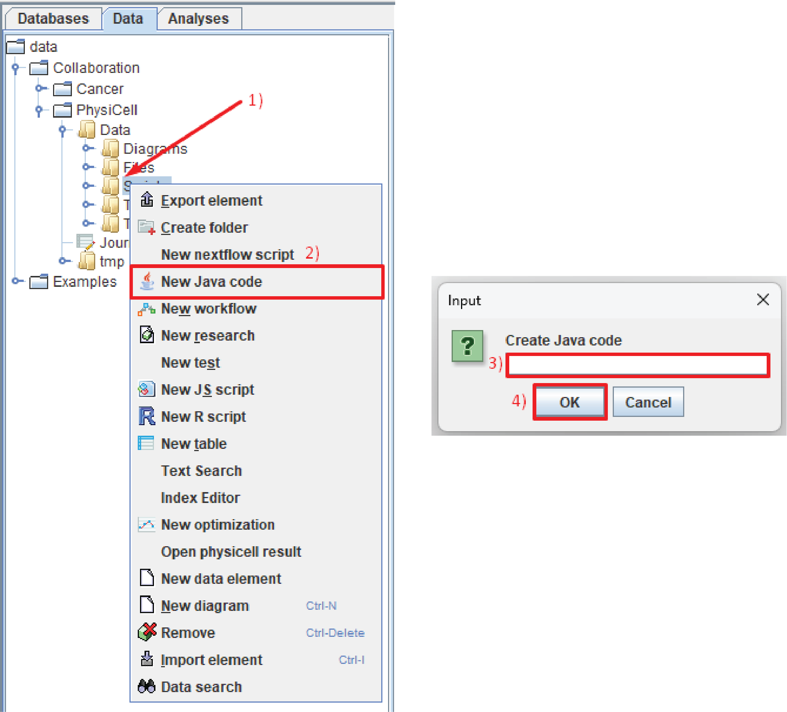

Методы Java-кода
================

.. role:: raw-html(raw)
   :format: html

.. raw:: html

    

.. |icon_new_Java_code| image:: /images/icons/Physicell/new_java_code.png
.. |icon_opened_folder| image:: /images/icons/Physicell/opened_folder.png

Поведение клеток, а также другие аспекты модели могут быть заданы Java-кодом, описывающим подходящий Java-класс.

Java-код в модуле хранится в виде дерева каталогов репозитория и может создаваться/редактироваться через графический интерфейс BioUML.

Для создания Java-файла (Java-класса) нужно:

- нажать ПКМ на папку в репозитории, в которой вы хотите создать Java-класс,
- в раскрывающемся списке нажать ЛКМ на |icon_new_Java_code| **New Java code**,
- в появившемся окошке вписать название файла с расширением *.java*,
- нажать ЛКМ кнопку **Ok** :ref:`(Рисунок 1) <Physicell_java_code_Pic.1>`.

.. _Physicell_java_code_Pic.1:

   Рисунок 1. Создание Java-класса.

После этого в указанной папке у вас появится Java-файл (обозначается значком |icon_new_Java_code|), который можно открыть, нажав на него 2 раза ЛКМ или нажав на него ПКМ и в раскрывающемся списке нажав ЛКМ на |icon_opened_folder| **Open**.

В открывшемся файле можно прописывать необходимый код :ref:`(Рисунок 2) <Physicell_java_code_Pic.2>`.

.. _Physicell_java_code_Pic.2:

   Рисунок 2. Поле для записи Java-кода.

Далее мы подробно рассмотрим все классы пакета ru.biosoft.Physicell, а также их поля и методы, которые используются для написания Java-кода. 

.. _Physicell_java_code_class_VectorUtil:

ru.biosoft.physicell.biofvm.VectorUtil
--------------------------------------

Класс VectorUtil подпакета biofvm используется для работы с векторами.

Все члены класса VectorUtil представлены в :ref:`таблице 1 <Physicell_java_code_Tbl.1>`.

.. _Physicell_java_code_Tbl.1:

.. list-table:: Таблица 1. Члены класса VectorUtil
   :header-rows: 1

   * - Член класса
     - Описание

   * - .newDiff(vector1, vector2)
     - | Статический метод - применяется к классу :ref:`VectorUtil <Physicell_java_code_class_VectorUtil>`.
       |
       | Принимает на вход:
       | 1) vector1 -трехмерный вектор (double[]),
       | 2) vector2 -трехмерный вектор (double[]).
       |
       | Возвращает трехмерный вектор (double[]), являющийся :ref:`покоординатной разницей векторов <Physicell_java_code_coordinate_wise_difference_of_vectors>` vector1 и vector2.
       |
       | Пример использования можно посмотреть `здесь <https://uni.sirius-web.org:58443/bioumlweb/#de=data/Examples/Physicell/Data/CancerImmune/AdhesionContact.java>`_.
   * - .norm(vector)
     - | Статический метод - применяется к классу :ref:`VectorUtil <Physicell_java_code_class_VectorUtil>`.
       |
       | Принимает на вход:
       | 1) vector - трехмерный вектор (double[]).
       |
       | Возвращает :ref:`L2-норму <Physicell_java_code_L2_norm>` вектора vector (double).
       |
       | Пример использования можно посмотреть `здесь <https://uni.sirius-web.org:58443/bioumlweb/#de=data/Examples/Physicell/Data/CellTypes3/Initial.java>`_.
   * - .norm_squared(vector)
     - | Статический метод - применяется к классу :ref:`VectorUtil <Physicell_java_code_class_VectorUtil>`.
       |
       | Принимает на вход:
       | 1) vector - трехмерный вектор (double[]).
       |
       | Возвращает квадрат :ref:`L2-нормы <Physicell_java_code_L2_norm>` вектора vector (double).
       |
       | Пример использования можно посмотреть `здесь <https://uni.sirius-web.org:58443/bioumlweb/#de=data/Examples/Physicell/Data/CancerImmune/AdhesionContact.java>`_.
   * - .axpy(vector1, const, vector2)
     - | Статический метод - применяется к классу :ref:`VectorUtil <Physicell_java_code_class_VectorUtil>`.
       |
       | Принимает на вход:
       | 1) vector1 - трехмерный вектор (double[]),
       | 2) const - число (double),
       | 3) vector2 - трехмерный вектор (double[]).
       |
       | Возвращает трехмерный вектор vector (double[]) следующего вида:
       | vector[i] = vector1[i] + const*vector2[i],
       | где i - каждая координата векторов vector1 и vector2.
       |
       | Пример использования можно посмотреть `здесь <https://uni.sirius-web.org:58443/bioumlweb/#de=data/Examples/Physicell/Data/CancerImmune/AdhesionContact.java>`_.
   * - .newNormalize(vector)
     - | Статический метод - применяется к классу :ref:`VectorUtil <Physicell_java_code_class_VectorUtil>`.
       |
       | Принимает на вход:
       | 1) vector - трехмерный вектор (double[]).
       |
       | Возвращает :ref:`нормализованный <Physicell_java_code_Normalization>` вектор vector (double[]).
       |
       | Пример использования можно посмотреть `здесь <https://uni.sirius-web.org:58443/bioumlweb/#de=data/Examples/Physicell/Data/CancerImmune/AdhesionContact.java>`_.
   * - .dist(cell1, cell2)
     - | Статический метод - применяется к классу :ref:`VectorUtil <Physicell_java_code_class_VectorUtil>`.
       |
       | Принимает на вход:
       | 1) cell1 - клетка (объект класса :ref:`Cell <Physicell_java_code_class_Cell>`),
       | 2) cell2 - клетка (объект класса :ref:`Cell <Physicell_java_code_class_Cell>`).
       |
       | Возвращает :ref:`расстояние <Physicell_java_code_Distance>` между клетками cell1 и cell2 (double).
       |
       | Пример использования можно посмотреть `здесь <https://uni.sirius-web.org:58443/bioumlweb/#de=data/Examples/Physicell/Data/CancerImmune/ImmuneCellRule.java>`_.
   * - .newProd(vector, const)
     - | Статический метод - применяется к классу :ref:`VectorUtil <Physicell_java_code_class_VectorUtil>`.
       |
       | Принимает на вход:
       | 1) vector - трехмерный вектор (double[]),
       | 2) const - число (double).
       |
       | Возвращает трехмерный вектор res_vector (double[]) следующего вида:
       | res_vector[i] = const*vector[i],
       | где i - каждая координата векторов res_vector и vector.
       |
       | Пример использования можно посмотреть `здесь <https://uni.sirius-web.org:58443/bioumlweb/#de=data/Examples/Physicell/Data/PredatorPreyFarmer/AvoidBoundariesRule.java>`_.
   * - .zero(vector)
     - | Статический метод - применяется к классу :ref:`VectorUtil <Physicell_java_code_class_VectorUtil>`.
       |
       | Принимает на вход:
       | 1) vector - трехмерный вектор (double[]).
       |
       | Метод ничего не вовращает.
       |
       | Зануляет все координаты вектора vector.
       |
       | Пример использования можно посмотреть `здесь <https://uni.sirius-web.org:58443/bioumlweb/#de=data/Examples/Physicell/Data/PredatorPreyFarmer/WeightedMotility.java>`_.
   * - .normalize(vector)
     - | Статический метод - применяется к классу :ref:`VectorUtil <Physicell_java_code_class_VectorUtil>`.
       |
       | Принимает на вход:
       | 1) vector - трехмерный вектор (double[]).
       |
       | Метод ничего не вовращает.
       |
       | :ref:`Нормализует <Physicell_java_code_Normalization>` вектор vector.
       |
       | Пример использования можно посмотреть `здесь <https://uni.sirius-web.org:58443/bioumlweb/#de=data/Examples/Physicell/Data/PredatorPreyFarmer/WeightedMotility.java>`_.

Справка по операциям с векторами
~~~~~~~~~~~~~~~~~~~~~~~~~~~~~~~~

.. _Physicell_java_code_coordinate_wise_difference_of_vectors:

Покоординатная разница векторов
"""""""""""""""""""""""""""""""

Покоординатная разница векторов — это операция вычитания векторов, при которой вычитаются соответствующие компоненты (координаты) векторов.

.. code-block:: text
   :caption: Пример

   // Дано
   Vector3D a = new Vector3D(5, 3, 7);
   Vector3D b = new Vector3D(1, 2, 4);

   // Покоординатная разница
   Vector3D difference = a.subtract(b); // Результат: (4, 1, 3)

.. _Physicell_java_code_L2_norm:

L2-норма вектора
""""""""""""""""

L2-норма вектора (евклидова норма) — это стандартный способ измерения длины вектора. Рассчитывается как квадратный корень из суммы квадратов всех компонент вектора:

:raw-html:`Для вектора v = (v1, v2, ..., vn)` в n-мерном пространстве:

.. math::

   \|v\|_2 = \sqrt{v_1^2 + v_2^2 + \cdots + v_n^2}

.. _Physicell_java_code_Normalization:

Нормализация вектора
""""""""""""""""""""

Нормализация вектора — это преобразование вектора в вектор единичной длины (с нормой = 1), сохраняющий его направление.

Нормализованная версия вектора :raw-html:`v = (v1, v2, ..., vn)` представляет собой вектор v`, каждая координата которого меньше
соответствующей координаты вектора v в :ref:`L2-норму <Physicell_java_code_L2_norm>` этого вектора:

.. math::

   {v'}_i = \frac{v_i}{\sqrt{v_1^2 + v_2^2 + \cdots + v_n^2}}, \quad \text{где } i = 1, 2, \ldots, n.

.. _Physicell_java_code_Distance:

Расстояние между точками
""""""""""""""""""""""""

В двумерной системе координат расстояние (d) между точками :raw-html:`A(x1, y1) и B(x2, y2)` вычисляется следующим образом:

.. math::

  d = \sqrt{(x_2 - x_1)^2 + (y_2 - y_1)^2}

В трехмерной системе координат расстояние (d) между точками :raw-html:`A(x1, y1, z1) и B(x2, y2, z2)` вычисляется следующим образом:

.. math::

  d = \sqrt{(x_2 - x_1)^2 + (y_2 - y_1)^2 + (z_2 - z_1)^2}

.. _Physicell_java_code_class_Cell:

ru.biosoft.physicell.core.Cell
------------------------------

Класс Cell подпакета core используется для работы с агентами, т.е. клетками.

В этом классе можно выделить 4 отдельных класса, каждый из которых используется для работы с определенной характеристикой клетки :ref:`(таблица 2) <Physicell_java_code_Tbl.2>`

.. _Physicell_java_code_Tbl.2:

.. list-table:: Таблица 2. Классы Cell
   :header-rows: 1

   * - Класс
     - Описание

   * - CellFunctions
     - | Используется для описания основных функций жизнедеятельности клетки.
       | Все члены данного класса представлены в :ref:`таблице 2.1 <Physicell_java_code_Tbl.2.1>`.
   * - CellParameters
     - | Используется для описания дополнительных встроенных параметров клетки.
       | Все члены данного класса представлены в :ref:`таблице 2.2 <Physicell_java_code_Tbl.2.2>`.
   * - CellState
     - | Используется для описания текущего состояния клетки.
       | Все члены данного класса представлены в :ref:`таблице 2.3 <Physicell_java_code_Tbl.2.3>`.
   * - CustomCellData
     - | Используется для описания пользовательских переменных и параметров клетки.
       | Все члены данного класса представлены в :ref:`таблице 2.4 <Physicell_java_code_Tbl.2.4>`.

Остальные члены класса Cell представлены в :ref:`таблице 2.5 <Physicell_java_code_Tbl.2.5>`.

.. _Physicell_java_code_Tbl.2.1:

.. list-table:: Таблица 2.1. Члены класса CellFunctions
   :header-rows: 1

   * - Член класса
     - Описание

   * - .functions.instantiator
     - | Обычное поле - применяется к объекту класса CellFunctions.
       |
       | Возвращает объект класса Instantiator, описывающий то, что происходит при создании новой клетки.
   * - .functions.updateVolume
     - | Обычное поле - применяется к объекту класса CellFunctions.
       |
       | Возвращает объект класса VolumeUpdate, описывающий, как изменяется объем клетки во время ее жизнедеятельности. Практически всегда используется StandardVolumeUpdate.
   * - .functions.updateMigration
     - | Обычное поле - применяется к объекту класса CellFunctions.
       |
       | Возвращает объект класса UpdateMigrationBias, описывающий целенаправленное движение клетки (например, на основе хемотаксиса). Примеры: Chemotaxis, Advanced Chemotaxis.
       |
       | Пример использования можно посмотреть `здесь <https://uni.sirius-web.org:58443/bioumlweb/#de=data/Examples/Physicell/Data/Worm/WormRule.java>`_.
   * - .functions.customCellRule
     - | Обычное поле - применяется к объекту класса CellFunctions.
       |
       | Возвращает объект класса CustomCellRule, описывающий дополнительное правило для жизнедеятельности клетки (например, избегать границ решетки). 
       |
       | Пример использования можно посмотреть `здесь <https://uni.sirius-web.org:58443/bioumlweb/#de=data/Examples/Physicell/Data/CancerImmune/ImmuneCellRule.java>`_.
   * - .functions.updatePhenotype
     - | Обычное поле - применяется к объекту класса CellFunctions.
       |
       | Возвращает объект класса UpdatePhenotype, описывающий, как изменяются основные внутренние параметры клетки. Например, "Default O2-based Phenotype" - на основе концентрации кислорода в среде.
       |
       | Пример использования можно посмотреть `здесь <https://uni.sirius-web.org:58443/bioumlweb/#de=data/Examples/Physicell/Data/CancerImmune/TumorPhenotype.java>`_.
   * - .functions.pre_update_intracellular
     - | Обычное поле - применяется к объекту класса CellFunctions.
       |
       | Возвращает объект класса pre_update_intracellular. Вызывается до шага вычислений внутриклеточной ОДУ/FBA модели.
   * - .functions.post_update_intracellular
     - | Обычное поле - применяется к объекту класса CellFunctions.
       |
       | Возвращает объект класса post_update_intracellular. Вызывается после шага вычислений внутриклеточной ОДУ/FBA модели.
   * - .functions.updateVelocity
     - | Обычное поле - применяется к объекту класса CellFunctions.
       |
       | Возвращает объект класса UpdateVelocity, описывающий движение клетки в целом, учитывая целенаправленное и случайное движение, а также притяжение и отталкивание другими клетками. Практически всегда используется StandardUpdateVelocity.
   * - .functions.membraneInteraction
     - | Обычное поле - применяется к объекту класса CellFunctions.
       |
       | Возвращает объект класса MembraneInteractions, описывающий взаимодействие клетки с базальной мембраной. Пример, DomainEdgeAvoidance - устанавливает избегание базальной мембраны клетками.
   * - .functions.membraneDistanceCalculator
     - | Обычное поле - применяется к объекту класса CellFunctions.
       |
       | Возвращает объект класса DistanceCalculator, описывающий расчет расстояния от клетки до базальной мембраны. Например, DomainEdgeDistance - рассчитывает расстояние до базальной мембраны как расстояние до ближайшей границы решетки.
   * - .functions.set_orientation
     - | Обычное поле - применяется к объекту класса CellFunctions.
       |
       | Возвращает объект класса set_orientation, описывающий, как устанавливается ориентация клетки в пространстве после деления. Например, UpOrientation - устанавливает ориентацию по оси Z.
   * - .functions.contact
     - | Обычное поле - применяется к объекту класса CellFunctions.
       |
       | Возвращает объект класса Contact, описывающий взаимодействие между сцепленными клетками. Например, StandardElasticContact  -эластичное взаимодействие.
   * - .functions.cellDivision
     - | Обычное поле - применяется к объекту класса CellFunctions.
       |
       | Возвращает объект класса CellDivision, описывающий, как происходит клеточное деление. Например, StandardAsymmetricDivision - асимметричное деление. Стандартное деление используется, если cellDivision не установлен (-).

.. _Physicell_java_code_Tbl.2.2:

.. list-table:: Таблица 2.2. Члены класса CellParameters
   :header-rows: 1

   * - Член класса
     - Описание

   * - .parameters.o2_proliferation_saturation
     - | Обычное поле - применяется к объекту класса CellParameters.
       |
       | Возвращает количество кислорода, при котором он перестает усиливать пролиферацию клетки (double).
       |
       | Используется для клеток с :ref:`фенотипом <Physicell_cell_properties_Functions>` «Default O2-based phenotype».
       |
       | Пример использования можно посмотреть `здесь <https://uni.sirius-web.org:58443/bioumlweb/#de=data/Examples/Physicell/Data/CancerImmune/CancerInstantiator.java>`_.
   * - .parameters.o2_reference
     - | Обычное поле - применяется к объекту класса CellParameters.
       |
       | Возвращает референсное значение кислорода (double).
       |
       | Пример использования можно посмотреть `здесь <https://uni.sirius-web.org:58443/bioumlweb/#de=data/Examples/Physicell/Data/CancerImmune/CancerInstantiator.java>`_.

.. _Physicell_java_code_Tbl.2.3:

.. list-table:: Таблица 2.3. Члены класса CellState
   :header-rows: 1

   * - Член класса
     - Описание

   * - .state.attachedCells
     - | Обычное поле - применяется к объекту класса CellState.
       |
       | Возвращает список клеток (объектов класса :ref:`Cell <Physicell_java_code_class_Cell>`), соединенных с данной клеткой (List<Cell>).
       |
       | Пример использования можно посмотреть `здесь <https://uni.sirius-web.org:58443/bioumlweb/#de=data/Examples/Physicell/Data/CancerImmune/ImmuneCellRule.java>`_.
   * - | .state.attachedCells.size()
       |
       | или
       |
       | .state.numberAttachedCells()
     - | Обычные методы - применяются к объектам класса CellState.
       |
       | Ничего не принимают на вход.
       |
       | Возвращают количество клеток, соединенных с данной клеткой (int).
       |
       | Примеры использования можно посмотреть `здесь <https://uni.sirius-web.org:58443/bioumlweb/#de=data/Examples/Physicell/Data/CancerImmune/CancerImmunityVisualizer.java>`_ и `здесь <https://uni.sirius-web.org:58443/bioumlweb/#de=data/Examples/Physicell/Data/CancerImmune/ImmuneCellRule.java>`_.
   * - .state.damage
     - | Обычное поле - применяется к объекту класса CellState.
       | 
       | Возвращает текущее количество повреждений, нанесенных клетке (double).
       |
       | Пример использования можно посмотреть `здесь <https://uni.sirius-web.org:58443/bioumlweb/#de=data/Examples/Physicell/Data/CancerBiorobots/TumorPhenotype.java>`_.
   * - .state.simplePressure
     - | Обычное поле - применяется к объекту класса CellState.
       |
       | Возвращает значение давления, оказываемого на клетку извне (double).
       |
       | Пример использования можно посмотреть `здесь <https://uni.sirius-web.org:58443/bioumlweb/#de=data/Examples/Physicell/Data/CellTypes3/PhenotypeA.java>`_.
   * - .state.neighbors
     - | Обычное поле - применяется к объекту класса CellState.
       |
       | Возвращает массив клеток (объектов класса :ref:`Cell <Physicell_java_code_class_Cell>`), являющихся соседями данной клетки (List<Cell>).
       |
       | Пример использования можно посмотреть `здесь <https://uni.sirius-web.org:58443/bioumlweb/#de=data/Examples/Physicell/Data/Interactions/MacrophagePhenotype.java>`_.

.. _Physicell_java_code_Tbl.2.4:

.. list-table:: Таблица 2.4. Члены класса CustomCellData
   :header-rows: 1

   * - Член класса
     - Описание

   * - .customData.findVariableIndex("variable")
     - | Обычный метод - применяется к объекту класса CustomCellData.
       |
       | Принимает на вход:
       | 1) "variable" - название переменной (String).
       |
       | Возвращает индекс переменной "variable" в списке всех переменных типа клетки (int).
       |
       | Пример использования можно посмотреть `здесь <https://uni.sirius-web.org:58443/bioumlweb/#de=data/Examples/Physicell/Data/CancerImmune/CancerImmunityVisualizer.java>`_.
   * - .customData.get(index)
     - | Обычный метод - применяется к объекту класса CustomCellData.
       |
       | Принимает на вход:
       | 1) index - индекс переменной (int).
       |
       | Возвращает значение переменной с индексом index для данной клетки (double).
       |
       | Пример использования можно посмотреть `здесь <https://uni.sirius-web.org:58443/bioumlweb/#de=data/Examples/Physicell/Data/CancerImmune/CancerImmunityVisualizer.java>`_.
   * - .customData.set("name", value)
     - | Обычный метод - применяется к объекту класса CustomCellData.
       |
       | Принимает на вход:
       | 1) "name" - название параметра (String),
       | 2) value - значение параметра "name" (double).
       |
       | Метод ничего не возвращает.
       |
       | Устанавливает значение value пользовательскому параметру "name".
       |
       | Пример использования можно посмотреть `здесь <https://uni.sirius-web.org:58443/bioumlweb/#de=data/Examples/Physicell/Data/CancerImmune/Initial.java>`_.

.. _Physicell_java_code_Tbl.2.5:

.. list-table:: Таблица 2.5. Остальные члены класса Cell
   :header-rows: 1

   * - Член класса
     - Описание

   * - .position
     - | Обычное поле - применяется к объекту класса :ref:`Cell <Physicell_java_code_class_Cell>`.
       | 
       | Возвращает трехмерный вектор - координаты клетки (double[]).
       |
       | Пример использования можно посмотреть `здесь <https://uni.sirius-web.org:58443/bioumlweb/#de=data/Examples/Physicell/Data/CancerImmune/AdhesionContact.java>`_.
   * - .velocity
     - | Обычное поле - применяется к объекту класса :ref:`Cell <Physicell_java_code_class_Cell>`.
       | 
       | Возвращает трехмерный вектор - скорость клетки (double[]).
       |
       | Пример использования можно посмотреть `здесь <https://uni.sirius-web.org:58443/bioumlweb/#de=data/Examples/Physicell/Data/CancerImmune/AdhesionContact.java>`_.
   * - .type
     - | Обычное поле - применяется к объекту класса :ref:`Cell <Physicell_java_code_class_Cell>`.
       | 
       | Возвращает числовой код типа данной клетки (int).
       |
       | Пример использования можно посмотреть `здесь <https://uni.sirius-web.org:58443/bioumlweb/#de=data/Examples/Physicell/Data/CancerImmune/CancerImmunityVisualizer.java>`_.
   * - .detachCells(cell1, cell2)
     - | Статический метод - применяется к классу :ref:`Cell <Physicell_java_code_class_Cell>`.
       |
       | Принимает на вход:
       | 1) cell1 - клетка (объект класса :ref:`Cell <Physicell_java_code_class_Cell>`),
       | 2) cell2 - клетка (объект класса :ref:`Cell <Physicell_java_code_class_Cell>`).
       |
       | Метод ничего не вовращает.
       |
       | Расцепляет клетки cell1 и cell2.
       |
       | Пример использования можно посмотреть `здесь <https://uni.sirius-web.org:58443/bioumlweb/#de=data/Examples/Physicell/Data/CancerImmune/AdhesionContact.java>`_.
   * - .attachcCells(cell1, cell2)
     - | Статический метод - применяется к классу :ref:`Cell <Physicell_java_code_class_Cell>`.
       |
       | Принимает на вход:
       | 1) cell1 - клетка (объект класса :ref:`Cell <Physicell_java_code_class_Cell>`),
       | 2) cell2 - клетка (объект класса :ref:`Cell <Physicell_java_code_class_Cell>`).
       |
       | Метод ничего не возвращает.
       |
       | Сцепляет клетки cell1 и cell2.
       |
       | Пример использования можно посмотреть `здесь <https://uni.sirius-web.org:58443/bioumlweb/#de=data/Examples/Physicell/Data/CancerImmune/ImmuneCellRule.java>`_.
   * - .createCell(cd, model, position)
     - | Статический метод - применяется к классу :ref:`Cell <Physicell_java_code_class_Cell>`.
       |
       | Принимает на вход:
       | 1) cd - тип клетки (объект класса :ref:`CellDefinition <Physicell_java_code_class_CellDefinition>`),
       | 2) model - модель (объект класса :ref:`Model <Physicell_java_code_class_Model>`),
       | 3) position - трехмерный вектор с координатами клетки (double[]).
       |
       | Метод ничего не вовращает.
       |
       | Создает клетку типа cd в модели model в точке position.
       |
       | Пример использования можно посмотреть `здесь <https://uni.sirius-web.org:58443/bioumlweb/#de=data/Examples/Physicell/Data/CancerImmune/ImmunityEvent.java>`_.
   * - .getMicroenvironment()
     - | Обычный метод - применяется к объекту класса :ref:`Cell <Physicell_java_code_class_Cell>`.
       |
       | Метод ничего не принимает на вход.
       |
       | Возвращает среду, в которой сущетсвует клетка (объект класса :ref:`Microenvironment <Physicell_java_code_class_Microenvironment>`).
       |
       | Пример использования можно посмотреть `здесь <https://uni.sirius-web.org:58443/bioumlweb/#de=data/Examples/Physicell/Data/CancerImmune/ImmuneCellMotility.java>`_.
   * - .nearest_gradient(index)
     - | Обычный метод - применяется к объекту класса :ref:`Cell <Physicell_java_code_class_Cell>`.
       |
       | Принимает на вход:
       | 1) index - индекс субстрата (int).
       |
       | Возвращает значение градиента плотности субстрата с индексом index в ближайшей к клетке ячейке решетки (double).
       |
       | Пример использования можно посмотреть `здесь <https://uni.sirius-web.org:58443/bioumlweb/#de=data/Examples/Physicell/Data/CancerImmune/ImmuneCellMotility.java>`_.
   * - .startDeath(index)
     - | Обычный метод - применяется к объекту класса :ref:`Cell <Physicell_java_code_class_Cell>`.
       |
       | Принимает на вход:
       | 1) index - индекс типа клеточной смерти (int).
       |
       | Метод ничего не вовращает.
       |
       | Запускает клеточную смерть с индексом index.
       |
       | Пример использования можно посмотреть `здесь <https://uni.sirius-web.org:58443/bioumlweb/#de=data/Examples/Physicell/Data/CancerImmune/ImmuneCellRule.java>`_.
   * - .cells_in_my_container()
     - | Обычный метод - применяется к объекту класса :ref:`Cell <Physicell_java_code_class_Cell>`.
       |
       | Метод ничего не принимает на вход.
       |
       | Возвращает список клеток (объектов класса :ref:`Cell <Physicell_java_code_class_Cell>`) в ячейке данной клетки (List<Cell>).
       |
       | Пример использования можно посмотреть `здесь <https://uni.sirius-web.org:58443/bioumlweb/#de=data/Examples/Physicell/Data/CancerImmune/ImmuneCellRule.java>`_.
   * - Cell cell = new Cell(cd, model)
     - | Конструктор - создает объект класса :ref:`Cell <Physicell_java_code_class_Cell>`.
       |
       | Принимает на вход:
       | 1) cd - тип клетки (объект класса :ref:`CellDefinition <Physicell_java_code_class_CellDefinition>`),
       | 2) model - модель (объект класса :ref:`Model <Physicell_java_code_class_Model>`).
       |
       | Создает новую клетку cell (объект класса :ref:`Cell <Physicell_java_code_class_Cell>`) типа cd в модели model.
       |
       | Пример использования можно посмотреть `здесь <https://uni.sirius-web.org:58443/bioumlweb/#de=data/Examples/Physicell/Data/CancerImmune/CancerInstantiator.java>`_.
   * - .removeAllAttachedCells()
     - | Обычный метод - применяется к объекту класса :ref:`Cell <Physicell_java_code_class_Cell>`.
       |
       | Метод ничего не принимает на вход.
       |
       | Метод ничего не возвращает.
       |
       | Отсоединяет все клетки, прикрепленные к данной клетке.
       |
       | Пример использования можно посмотреть `здесь <https://uni.sirius-web.org:58443/bioumlweb/#de=data/Examples/Physicell/Data/CancerBiorobots/CargoPhenotype.java>`_.
   * - .getModel()
     - | Обычный метод - применяется к объекту класса :ref:`Cell <Physicell_java_code_class_Cell>`.
       |
       | Метод ничего не принимает на вход.
       |
       | Возвращает модель (объект класса :ref:`Model <Physicell_java_code_class_Model>`), в которой находится данная клетка.
       |
       | Пример использования можно посмотреть `здесь <https://uni.sirius-web.org:58443/bioumlweb/#de=data/Examples/Physicell/Data/CancerImmune/ImmuneCellMotility.java>`_.
   * - .nearest_density_vector()
     - | Обычный метод - применяется к объекту класса :ref:`Cell <Physicell_java_code_class_Cell>`.
       |
       | Метод ничего не принимает на вход.
       |
       | Возвращает массив плотностей всех субстратов в ячейке решетки, где находится данная клетка (double[]).
       |
       | Пример использования можно посмотреть `здесь <https://uni.sirius-web.org:58443/bioumlweb/#de=data/Examples/Physicell/Data/CellTypes3/PhenotypeA.java>`_.
   * - .ID
     - | Обычное поле - применяется к объекту класса :ref:`Cell <Physicell_java_code_class_Cell>`.
       |
       | Возвращает автоматически сгенерированный идентификатор клетки (int).
       |
       | Пример использования можно посмотреть `здесь <https://uni.sirius-web.org:58443/bioumlweb/#de=data/Examples/Physicell/Data/Heterogeneity/Report.java>`_.
   * - .typeName
     - | Обычное поле - применяется к объекту класса :ref:`Cell <Physicell_java_code_class_Cell>`.
       |
       | Возвращает название типа клеток (объект класса :ref:`CellDefinition <Physicell_java_code_class_CellDefinition>`), к которому относится данная клетка (String).
       |
       | Пример использования можно посмотреть `здесь <https://uni.sirius-web.org:58443/bioumlweb/#de=data/Examples/Physicell/Data/Interactions/BacterialPhenotype.java>`_.
   * - .ingestCell(cell)
     - | Обычный метод - применяется к объекту класса :ref:`Cell <Physicell_java_code_class_Cell>`.
       |
       | Принимает на вход:
       | 1) cell - клетка (объект класса :ref:`Cell <Physicell_java_code_class_Cell>`).
       |
       | Метод ничего не возвращает.
       |
       | Клетка, к которой был применен данный метод, поглощает клетку cell.
       |
       | Пример использования можно посмотреть `здесь <https://uni.sirius-web.org:58443/bioumlweb/#de=data/Examples/Physicell/Data/PredatorPreyFarmer/PredatorPhenotype.java>`_.
   * - .nearestGradient("substrate")
     - | Обычный метод - применяется к объекту класса :ref:`Cell <Physicell_java_code_class_Cell>`.
       |
       | Принимает на вход:
       | 1) "substrate" - название субстрата (String).
       |
       | Возвращает градиент субстрата "substrate" в ячейке решетки, в которой находится данная клетка (double).
       |
       | Пример использования можно посмотреть `здесь <https://uni.sirius-web.org:58443/bioumlweb/#de=data/Examples/Physicell/Data/PredatorPreyFarmer/WeightedMotility.java>`_.
   * - .lyseCell()
     - | Обычный метод - применяется к объекту класса :ref:`Cell <Physicell_java_code_class_Cell>`.
       |
       | Метод ничего не принимает на вход.
       |
       | Метод ничего не возвращает.
       |
       | Активирует лизис данной клетки.
       |
       | Пример использования можно посмотреть `здесь <https://uni.sirius-web.org:58443/bioumlweb/#de=data/Examples/Physicell/Data/VirusMacrophage/Epithelial.java>`_.
   * - .get_current_mechanics_voxel_index()
     - | Обычный метод - применяется к объекту класса :ref:`Cell <Physicell_java_code_class_Cell>`.
       |
       | Метод ничего не принимает на вход.
       |
       | Возвращает номер ячейки, в которой находится данная клетка (int).
       |
       | Пример использования можно посмотреть `здесь <https://uni.sirius-web.org:58443/bioumlweb/#de=data/Examples/Physicell/Data/VirusMacrophage/Macrophage.java>`_.
   * - .get_container()
     - | Обычный метод - применяется к объекту класса :ref:`Cell <Physicell_java_code_class_Cell>`.
       |
       | Метод ничего не принимает на вход.
       |
       | Возвращает объект класса :ref:`CellContainer <Physicell_java_code_class_CellContainer>`, обрабатывающий положение данной клетки в решетке.
       |
       | Пример использования можно посмотреть `здесь <https://uni.sirius-web.org:58443/bioumlweb/#de=data/Examples/Physicell/Data/VirusMacrophage/Macrophage.java>`_.
   * - .isNeighborVoxel(cell, coordinates, center, index)
     - | Статический метод - применяется к классу :ref:`Cell <Physicell_java_code_class_Cell>`.
       |
       | Принимает на вход:
       | 1) cell - клетка (объект класса :ref:`Cell <Physicell_java_code_class_Cell>`),
       | 2) coordinates - трехмерный вектор (double[]),
       | 3) center - трехмерный вектор (double[]),
       | 4) index - индекс ячейки среды (int).
       |
       | Возвращает:
       | 1) true, если ячейка среды с индексом index с центром в точке center является соседней* с клеткой cell, находящейся в точке coordinates (boolean),
       | 2) false, иначе (boolean).
       |
       | \*Под соседством подразумевается, что клетка может взаимодействовать с клетками в этих ячейках.
       |
       | Пример использования можно посмотреть `здесь <https://uni.sirius-web.org:58443/bioumlweb/#de=data/Examples/Physicell/Data/VirusMacrophage/Macrophage.java>`_.
   * - .nearby_interacting_cells()
     - | Обычный метод - применяется к объекту класса :ref:`Cell <Physicell_java_code_class_Cell>`.
       |
       | Метод ничего не принимает на вход.
       |
       | Возвращает массив клеток (объектов класса :ref:`Cell <Physicell_java_code_class_Cell>`), являющихся соседями и находящимися достаточно близко для взаимодействия с данной клеткой (List<Cell>). 
       |
       | Пример использования можно посмотреть `здесь <https://uni.sirius-web.org:58443/bioumlweb/#de=data/Examples/Physicell/Data/Worm/WormRule.java>`_.

.. _Physicell_java_code_class_Phenotype:

ru.biosoft.physicell.core.Phenotype
-----------------------------------
   
.. note::
   Класс **Phenotype** является вложенным объектом внутри классов **Cell** и **CellDefinition**.

Класс Phenotype подпакета core используется для работы с различными свойствами клеток.

В этом классе можно выделить 12 отдельных классов, каждый из которых используется для работы с определенным набором свойств клетки :ref:`(таблица 3) <Physicell_java_code_Tbl.3>`

.. _Physicell_java_code_Tbl.3:

.. list-table:: Таблица 3. Классы Phenotype
   :header-rows: 1

   * - Класс
     - Описание

   * - Cycle
     - | Используется для описания жизненного цикла клетки.
       | Все члены данного класса представлены в :ref:`таблице 3.1 <Physicell_java_code_Tbl.3.1>`.
   * - Death
     - | Используется для описания модели смерти клетки.
       | Все члены данного класса представлены в :ref:`таблице 3.2 <Physicell_java_code_Tbl.3.2>`.
   * - Volume
     - | Используется для описания объемных свойств клетки.
       | Все члены данного класса представлены в :ref:`таблице 3.3 <Physicell_java_code_Tbl.3.3>`.
   * - Geometry
     - | Используется для описания размеров клетки.
       | Все члены данного класса представлены в :ref:`таблице 3.4 <Physicell_java_code_Tbl.3.4>`.
   * - Mechanics
     - | Используется для описания механических свойств клетки.
       | Все члены данного класса представлены в :ref:`таблице 3.5 <Physicell_java_code_Tbl.3.5>`.
   * - Motility
     - | Используется для описания подвижности клетки.
       | Все члены данного класса представлены в :ref:`таблице 3.6 <Physicell_java_code_Tbl.3.6>`.
   * - Secretion
     - | Используется для описания секреции и потребления веществ клеткой.
       | Все члены данного класса представлены в :ref:`таблице 3.7 <Physicell_java_code_Tbl.3.7>`.
   * - Molecular
     - | Используется для описания содержания веществ внутри клетки.
       | Все члены данного класса представлены в :ref:`таблице 3.8 <Physicell_java_code_Tbl.3.8>`.
   * - CellInteractions
     - | Используется для описания взаимодействия между клетками разных типов.
   * - CellTransformations
     - | Используется для описания трансформации клетки из одного типа в другой.
       | Все члены данного класса представлены в :ref:`таблице 3.10 <Physicell_java_code_Tbl.3.10>`.
   * - Intracellular
     - | Используется для описания внутриклеточных процессов клетки с помощью обыкновенных дифференциальных уравнений или потоковой модели.
       | Все члены данного класса представлены в :ref:`таблице 3.11 <Physicell_java_code_Tbl.3.11>`.
   * - CellIntegrity
     - | Используется для описания целостности клетки.

.. _Physicell_java_code_Tbl.3.1:

.. list-table:: Таблица 3.1. Члены класса Cycle
   :header-rows: 1

   * - Член класса
     - Описание

   * - .cycle.code
     - | Обычное поле - применяется к объекту класса Cycle.
       |
       | Возвращает численный код жизненного цикла клетки (int).
       |
       | Пример использования можно посмотреть `здесь <https://uni.sirius-web.org:58443/bioumlweb/#de=data/Examples/Physicell/Data/ODEEnergy/Report.java>`_.
   * - .cycle.currentPhase()
     - | Обычный метод - применяется к объекту класса Cycle.
       |
       | Возвращает текущую фазу жизненного цикла данной клетки.
       |
       | Пример использования можно посмотреть `здесь <https://uni.sirius-web.org:58443/bioumlweb/#de=data/Examples/Physicell/Data/CancerImmune/CancerImmunityVisualizer.java>`_.
   * - .cycle.currentPhase().code
     - | Обычное поле - применяется к объекту класса Cycle.
       |
       | Возвращает численный код текущей фазы жизненного цикла данной клетки (int).
       |
       | Пример использования можно посмотреть `здесь <https://uni.sirius-web.org:58443/bioumlweb/#de=data/Examples/Physicell/Data/CancerImmune/CancerImmunityVisualizer.java>`_.
   * - .cycle.currentPhase().name
     - | Обычное поле - применяется к объекту класса Cycle.
       |
       | Возвращает название текущей фазы жизненного цикла данной клетки (String).
       |
       | Пример использования можно посмотреть `здесь <https://uni.sirius-web.org:58443/bioumlweb/#de=data/Examples/Physicell/Data/PredatorPreyFarmer/PPFReport.java>`_.
   * - .cycle.data
     - | Обычное поле - применяется к объекту класса Cycle.
       |
       | Возвращает объект класса CycleData, хранящий численные данные для цикла данной конкретной клети.
       |
       | Пример использования можно посмотреть `здесь <https://uni.sirius-web.org:58443/bioumlweb/#de=data/Examples/Physicell/Data/PredatorPreyFarmer/PPFReport.java>`_.
   * - .cycle.data.elapsedTimePhase
     - | Обычное поле - применяется к объекту класса Cycle.
       |
       | Возвращает время, проведенное клеткой в текущей фазе жизненного цикла (double).
       |
       | Пример использования можно посмотреть `здесь <https://uni.sirius-web.org:58443/bioumlweb/#de=data/Examples/Physicell/Data/PredatorPreyFarmer/PPFReport.java>`_.
   * - .cycle.data.getTransitionRate(phase1, phase2)
     - | Обычный метод - применяется к объекту класса Cycle.
       |
       | Принимает на вход:
       | 1) phase1 - номер фазы жизненного цикла (int),
       | 2) phase2 - номер фазы жизненного цикла (int).
       |
       | Возвращает скорость перехода между фазами жизненного цикла с номерами phase1 и phase2 (double).
       |
       | Пример использования можно посмотреть `здесь <https://uni.sirius-web.org:58443/bioumlweb/#de=data/Examples/Physicell/Data/CancerImmune/TumorPhenotype.java>`_.
   * - .cycle.data.setTransitionRate(phase1, phase2, speed)
     - | Обычный метод - применяется к объекту класса Cycle.
       |
       | Принимает на вход:
       | 1) phase1 - номер фазы жизненного цикла (int),
       | 2) phase2 - номер фазы жизненного цикла (int),
       | 3) speed - скорость перехода между фазами жизненного цикла (double).
       |
       | Метод ничего не возвращает.
       |
       | Устанавливает скорость перехода между фазами жизненного цикла с номерами phase1 и phase2, равную speed.
       |
       | Пример использования можно посмотреть `здесь <https://uni.sirius-web.org:58443/bioumlweb/#de=data/Examples/Physicell/Data/CancerImmune/TumorPhenotype.java>`_.
   * - .cycle.data.getExitRate(phase)
     - | Обычный метод - применяется к объекту класса Cycle.
       |
       | Принимает на вход:
       | 1) phase - номер фазы жизненного цикла (int).
       |
       | Возвращает вероятность выхода из фазы под номером phase*.
       |
       | \*Используется, если клетка может перейти из фазы phase только в одну другую фазу.
       |
       | Пример использования можно посмотреть `здесь <https://uni.sirius-web.org:58443/bioumlweb/#de=data/Examples/Physicell/Data/Interactions/BacterialPhenotype.java>`_.
   * - .cycle.data.setExitRate(phase, probability)
     - | Обычный метод - применяется к объекту класса Cycle.
       |
       | Принимает на вход:
       | 1) phase - номер фазы жизненного цикла (int),
       | 2) probability - вероятность (double).
       |
       | Метод ничего не возвращает.
       |
       | Устанавлиает вероятность выхода из фазы с номером phase равной probability.
       |
       | Пример использования можно посмотреть `здесь <https://uni.sirius-web.org:58443/bioumlweb/#de=data/Examples/Physicell/Data/Interactions/BacterialPhenotype.java>`_.

.. _Physicell_java_code_Tbl.3.2:

.. list-table:: Таблица 3.2. Члены класса Death
   :header-rows: 1

   * - Член класса
     - Описание

   * - .death.dead
     - | Обычное поле - применяется к объекту класса Death.
       |
       | Возвращает:
       | 1) true, если клетка мертва (boolean),
       | 2) false, если клетка жива (boolean).
       |
       | Пример использования можно посмотреть `здесь <https://uni.sirius-web.org:58443/bioumlweb/#de=data/Examples/Physicell/Data/CancerImmune/ImmuneCellRule.java>`_.
   * - .death.findDeathModelIndex("name")
     - | Обычный метод - применяется к объекту класса Death.
       |
       | Принимает на вход:
       | 1) "name" - название типа клеточной смерти (String).
       |
       | Возвращает индекс типа клеточной смерти с названием "name" (int).
       |
       | Пример использования можно посмотреть `здесь <https://uni.sirius-web.org:58443/bioumlweb/#de=data/Examples/Physicell/Data/CancerImmune/ImmuneCellRule.java>`_.
   * - .death.rates
     - | Обычное поле - применяется к объекту класса Death.
       |
       | Возвращает массив вероятностей всех типов клеточных смертей (double[]).
       |
       | Пример использования можно посмотреть `здесь <https://uni.sirius-web.org:58443/bioumlweb/#de=data/Examples/Physicell/Data/CellTypes3/PhenotypeB.java>`_.
   * - .death.rates.size()
     - | Обычный метод - применяется к объекту класса Death.
       |
       | Метод ничего не принимает на вход.
       |
       | Возвращает количество вероятностей всех возможных клеточных смертей (int).
       |
       | Пример использования можно посмотреть `здесь <https://uni.sirius-web.org:58443/bioumlweb/#de=data/Examples/Physicell/Data/CellTypes3/Initial.java>`_.
   * - .death.rates.set(index, probability)
     - | Обычный метод - применяется к объекту класса Death.
       |
       | Принимает на вход:
       | 1) index - индекс типа клеточной смерти (int),
       | 2) probability - вероятность (double).
       |
       | Метод ничего не возвращает.
       |
       | Устанавливает вероятность типа клеточной смерти с индексом index равной probability.
       |
       | Пример использования можно посмотреть `здесь <https://uni.sirius-web.org:58443/bioumlweb/#de=data/Examples/Physicell/Data/CellTypes3/Initial.java>`_.
   * - .death.rates.get(index)
     - | Обычный метод - применяется к объекту класса Death.
       |
       | Принимает на вход:
       | 1) index - индекс типа клеточной смерти (int).
       |
       | Возвращает вероятность типа клеточной смерти с индексом index (double).
       |
       | Пример использования можно посмотреть `здесь <https://uni.sirius-web.org:58443/bioumlweb/#de=data/Examples/Physicell/Data/CellTypes3/PhenotypeA.java>`_.

.. _Physicell_java_code_Tbl.3.3:

.. list-table:: Таблица 3.3. Члены класса Volume
   :header-rows: 1

   * - Член класса
     - Описание

   * - .volume.total
     - | Обычное поле - применяется к объекту класса Volume.
       |
       | Возвращает значение общего объема клетки (double).
       |
       | Пример использования можно посмотреть `здесь <https://uni.sirius-web.org:58443/bioumlweb/#de=data/Examples/Physicell/Data/Interactions/BacterialPhenotype.java>`_.

.. _Physicell_java_code_Tbl.3.4:

.. list-table:: Таблица 3.4. Члены класса Geometry
   :header-rows: 1

   * - Член класса
     - Описание

   * - .geometry.radius
     - | Обычное поле - применяется к объекту класса Geometry.
       |
       | Возвращает радиус клетки (double).
       |
       | Пример использования можно посмотреть `здесь <https://uni.sirius-web.org:58443/bioumlweb/#de=data/Examples/Physicell/Data/CancerImmune/AdhesionContact.java>`_.

.. _Physicell_java_code_Tbl.3.5:

.. list-table:: Таблица 3.5. Члены класса Mechanics
   :header-rows: 1

   * - Член класса
     - Описание

   * - .mechanics.attachmentElasticConstant
     - | Обычное поле - применяется к объекту класса Mechanics.
       |
       | Возвращает коэффициент, с которым клетка притягивается к другим клеткам (double).
       |
       | Пример использования можно посмотреть `здесь <https://uni.sirius-web.org:58443/bioumlweb/#de=data/Examples/Physicell/Data/CancerImmune/CancerInstantiator.java>`_.
   * - .mechanics.cellCellAdhesionStrength
     - | Обычное поле - применяется к объекту класса Mechanics.
       |
       | Возвращает силу межклеточной адгезии (double).
       |
       | Пример использования можно посмотреть `здесь <https://uni.sirius-web.org:58443/bioumlweb/#de=data/Examples/Physicell/Data/CancerImmune/ImmuneInstantiator.java>`_.
   * - .mechanics.cellCellRepulsionStrength
     - | Обычное поле - применяется к объекту класса Mechanics.
       |
       | Возвращает силу межклеточного отталкивания (double).
       |
       | Пример использования можно посмотреть `здесь <https://uni.sirius-web.org:58443/bioumlweb/#de=data/Examples/Physicell/Data/CancerImmune/ImmuneInstantiator.java>`_.
   * - .mechanics.relDetachmentDistance
     - | Обычное поле - применяется к объекту класса Mechanics.
       |
       | Возвращает относительное расстояние (множитель радуиса), на котором клетка отделяется от прикрепленной клетки.
       |
       | Пример использования можно посмотреть `здесь <https://uni.sirius-web.org:58443/bioumlweb/#de=data/Examples/Physicell/Data/CancerImmune/AdhesionContact.java>`_.
   
.. _Physicell_java_code_Tbl.3.6:

.. list-table:: Таблица 3.6. Члены класса Motility
   :header-rows: 1

   * - Член класса
     - Описание

   * - .motility.isMotile
     - | Обычное поле - применяется к объекту класса Motility
       |
       | Возвращает:
       | 1) true, если клетка подвижна (boolean),
       | 2) false, если клетка неподвижна (boolean).
       |
       | Пример использования можно посмотреть `здесь <https://uni.sirius-web.org:58443/bioumlweb/#de=data/Examples/Physicell/Data/CancerImmune/ImmuneCellRule.java>`_.
   * - .motility.migrationBias
     - | Обычное поле - применяется к объекту класса Motility
       |
       | Возвращает число из интервала [0,1], где 0 обозначает, что клетка движется абсолютно случайно, а 1 - полностью целенаправленно (double[]).
       |
       | Пример использования можно посмотреть `здесь <https://uni.sirius-web.org:58443/bioumlweb/#de=data/Examples/Physicell/Data/Interactions/BacterialPhenotype.java>`_.
   * - .motility.migrationBiasDirection
     - | Обычное поле - применяется к объекту класса Motility
       |
       | Возвращает :ref:`нормализованный <Physicell_java_code_Normalization>` вектор, описывающий направление, в котором клетка движется целенаправленно в данный момент времени (double[]).
       |
       | Пример использования можно посмотреть `здесь <https://uni.sirius-web.org:58443/bioumlweb/#de=data/Examples/Physicell/Data/CancerImmune/ImmuneCellMotility.java>`_.
   * - .motility.migrationSpeed
     - | Обычное поле - применяется к объекту класса Motility
       |
       | Возвращает скорость движения клетки (double).
       |
       | Пример использования можно посмотреть `здесь <https://uni.sirius-web.org:58443/bioumlweb/#de=data/Examples/Physicell/Data/CellTypes3/PhenotypeA.java>`_.
   * - .motility.persistenceTime
     - | Обычное поле - применяется к объекту класса Motility
       |
       | Возвращает время, в течение которого клетка сохраняет одно направление движения (double).
       |
       | Пример использования можно посмотреть `здесь <https://uni.sirius-web.org:58443/bioumlweb/#de=data/Examples/Physicell/Data/Worm/WormRule.java>`_.
   * - .motility.chemotaxisDirection
     - | Обычное поле - применяется к объекту класса Motility
       |
       | Возвращает:
       | 1) "1", если клетка движется к субстрату во время хемотаксиса (int),
       | 2) "-1", если клетка движется от субстрата во время хемотаксиса (int).
       |
       | Пример использования можно посмотреть `здесь <https://uni.sirius-web.org:58443/bioumlweb/#de=data/Examples/Physicell/Data/Worm/WormRule.java>`_.
   
.. _Physicell_java_code_Tbl.3.7:

.. list-table:: Таблица 3.7. Члены класса Secretion
   :header-rows: 1

   * - Член класса
     - Описание
   
   * - .secretion.secretionRates
     - | Обычное поле - применяется к объекту класса Secretion.
       |
       | Возвращает массив скоростей секреции каждого из субстратов данной клеткой (double[]).
       |
       | Пример использования можно посмотреть `здесь <https://uni.sirius-web.org:58443/bioumlweb/#de=data/Examples/Physicell/Data/CancerImmune/TumorPhenotype.java>`_.
   * - .secretion.uptakeRates
     - | Обычное поле - применяется к объекту класса Secretion.
       |
       | Возвращает массив скоростей потребления каждого из субстратов данной клеткой (double[]).
       |
       | Пример использования можно посмотреть `здесь <https://uni.sirius-web.org:58443/bioumlweb/#de=data/Examples/Physicell/Data/CancerImmune/ImmuneInstantiator.java>`_.
   * - .secretion.netExportRates
     - | Обычное поле - применяется к объекту класса Secretion.
       |
       | Возвращает массив, содержащий скорости постоянной (не зависит от объема клетки) секреции/потребления всех возможных субстратов для данной клетки (double[]).
       |
       | Пример использования можно посмотреть `здесь <https://uni.sirius-web.org:58443/bioumlweb/#de=data/Examples/Physicell/Data/Interactions/BacterialPhenotype.java>`_.
   * - .secretion.setSecretionToZero()
     - | Обычный метод - применяется к объекту класса Secretion.
       |
       | Метод ничего не принимает на вход.
       |
       | Метод ничего не возвращает.
       |
       | Устанавливает скорость секреции, равной 0, для всех субстратов в модели для данной клетки.
       |
       | Пример использования можно посмотреть `здесь <https://uni.sirius-web.org:58443/bioumlweb/#de=data/Examples/Physicell/Data/CellTypes3/PhenotypeA.java>`_.
   * - .secretion.setUptakeToZero()
     - | Обычный метод - применяется к объекту класса Secretion.
       |
       | Метод ничего не принимает на вход.
       |
       | Метод ничего не возвращает.
       |
       | Устанавливает скорость потребления, равной 0, для всех субстратов в модели для данной клетки.
       |
       | Пример использования можно посмотреть `здесь <https://uni.sirius-web.org:58443/bioumlweb/#de=data/Examples/Physicell/Data/CellTypes3/PhenotypeA.java>`_.
   
.. _Physicell_java_code_Tbl.3.8:

.. list-table:: Таблица 3.8. Члены класса Molecular
   :header-rows: 1

   * - Член класса
     - Описание
   
   * - .molecular.internSubstrates
     - | Обычное поле - применяется к объекту класса Molecular.
       |
       | Возвращает массив, состоящий из количества всех возможных веществ внутри клетки (double[]).
       |
       | Пример использования можно посмотреть `здесь <https://uni.sirius-web.org:58443/bioumlweb/#de=data/Examples/Physicell/Data/ODEEnergy/Initial.java>`_.
   * - .molecular.fractionReleasedDeath
     - | Обычное поле - применяется к объекту класса Molecular.
       |
       | Возвращает долю внутренних веществ, которая выбрасывается из клетки в момент ее гибели (double).
       |
       | Пример использования можно посмотреть `здесь <https://uni.sirius-web.org:58443/bioumlweb/#de=data/Examples/Physicell/Data/VirusMacrophage/EpithelialInstantiator.java>`_.
   * - .molecular.fractionTransferredIngested
     - | Обычное поле - применяется к объекту класса Molecular.
       |
       | Возвращает долю внутренних веществ, которую получает клетка, поглощающая клетку данного типа (double).
       |
       | Пример использования можно посмотреть `здесь <https://uni.sirius-web.org:58443/bioumlweb/#de=data/Examples/Physicell/Data/VirusMacrophage/EpithelialInstantiator.java>`_. 
   
.. _Physicell_java_code_Tbl.3.10:

.. list-table:: Таблица 3.10. Члены класса CellTransformations
   :header-rows: 1

   * - Член класса
     - Описание
   
   * - .cellTransformations.transformationRates
     - | Обычное поле - применяется к объекту класса CellTransformations.
       |
       | Возвращает массив вероятностей трансформации данного типа клеток во все остальные (double[]).
       |
       | Пример использования можно посмотреть `здесь <https://uni.sirius-web.org:58443/bioumlweb/#de=data/Examples/Physicell/Data/Interactions/StemPhenotype.java>`_.

.. _Physicell_java_code_Tbl.3.11:

.. list-table:: Таблица 3.11. Члены класса Intracellular
   :header-rows: 1

   * - Член класса
     - Описание
   
   * - .intracellular.start()
     - | Обычный метод - применяется к объекту класса Intracellular.
       |
       | Метод ничего не принимает на вход.
       |
       | Метод ничего не возвращает.
       |
       | Запускает расчеты внитриклеточной модели.
       |
       | Пример использования можно посмотреть `здесь <https://uni.sirius-web.org:58443/bioumlweb/#de=data/Examples/Physicell/Data/ODEEnergy/Initial.java>`_.
   * - .intracellular.setParameterValue("name", value)
     - | Обычный метод - применяется к объекту класса Intracellular.
       |
       | Принимает на вход:
       | 1) "name" - название параметра внутриклеточной модели (String),
       | 2) value - значение (double).
       |
       | Метод ничего не возвращает.
       |
       | Устанавлиает численное значение value параметру "name" во внутриклеточной модели.
       |
       | Пример использования можно посмотреть `здесь <https://uni.sirius-web.org:58443/bioumlweb/#de=data/Examples/Physicell/Data/ODEEnergy/Initial.java>`_.
   * - .intracellular.getParameterValue("name")
     - | Обычный метод - применяется к объекту класса Intracellular.
       |
       | Принимает на вход:
       | 1) "name" - название параметра внутриклеточной модели (String).
       |
       | Возвращает значение параметра "name" во внутриклеточной модели.
       |
       | Пример использования можно посмотреть `здесь <https://uni.sirius-web.org:58443/bioumlweb/#de=data/Examples/Physicell/Data/ODEEnergy/ODEVisualizer.java>`_.

.. _Physicell_java_code_class_CellDefinition:

ru.biosoft.physicell.core.CellDefinition
----------------------------------------

Класс CellDefinition подпакета core используется для работы с типами клеток.

Все члены класса CellDefinition представлены в :ref:`таблице 4 <Physicell_java_code_Tbl.4>`.

.. _Physicell_java_code_Tbl.4:

.. list-table:: Таблица 4. Члены класса CellDefinition
   :header-rows: 1

   * - Член класса
     - Описание

   * - .custom_data
     - | Обычное поле - применяется к объекту класса :ref:`CellDefinition <Physicell_java_code_class_CellDefinition>`.
       |
       | Возвращает объект класса CustomCellData, содержщий пользовательскую информацию о клетках данного типа.
       |
       | Пример использования можно посмотреть `здесь <https://uni.sirius-web.org:58443/bioumlweb/#de=data/Examples/Physicell/Data/Interactions/BacterialPhenotype.java>`_.
   * - .custom_data.get("name")
     - | Обычный метод - применяется к объекту класса :ref:`CellDefinition <Physicell_java_code_class_CellDefinition>`.
       |
       | Принимает на вход:
       | 1) "name" - название переменной данного типа клетки (String).
       |
       | Возвращает значение по умолчанию (стартовое) переменной "name" (double).
       |
       | Пример использования можно посмотреть `здесь <https://uni.sirius-web.org:58443/bioumlweb/#de=data/Examples/Physicell/Data/CancerImmune/CancerInstantiator.java>`_.
   * - .parameters.o2_proliferation_saturation
     - | Обычное поле - применяется к объекту класса :ref:`CellDefinition <Physicell_java_code_class_CellDefinition>`.
       |
       | Возвращает количество кислорода, при котором он перестает усиливать пролиферацию данного типа клеток (double).
       |
       | Используется для типа клеток с :ref:`фенотипом <Physicell_cell_properties_Functions>` «Default O2-based phenotype».
       |
       | Пример использования можно посмотреть `здесь <https://uni.sirius-web.org:58443/bioumlweb/#de=data/Examples/Physicell/Data/Heterogeneity/Initial.java>`_.
   * - .parameters.o2_reference
     - | Обычное поле - применяется к объекту класса :ref:`CellDefinition <Physicell_java_code_class_CellDefinition>`.
       |
       | Возвращает референсное значение кислорода (double).
       |
       | Пример использования можно посмотреть `здесь <https://uni.sirius-web.org:58443/bioumlweb/#de=data/Examples/Physicell/Data/Heterogeneity/Initial.java>`_.
   * - .type
     - | Обычное поле - применяется к объекту класса :ref:`CellDefinition <Physicell_java_code_class_CellDefinition>`.
       |
       | Возвращает численный код (номер) данного типа клеток (int).
       |
       | Пример использования можно посмотреть `здесь <https://uni.sirius-web.org:58443/bioumlweb/#de=data/Examples/Physicell/Data/Biorobots/BiorobotsVisualizer.java>`_.

.. _Physicell_java_code_class_Model:

ru.biosoft.physicell.core.Model
-------------------------------

Класс Model подпакета core используется для работы с мультиклеточной моделью для численных расчетов.

Все члены класса Model представлены в :ref:`таблице 5 <Physicell_java_code_Tbl.5>`.

.. _Physicell_java_code_Tbl.5:

.. list-table:: Таблица 5. Члены класса Model
   :header-rows: 1

   * - Член класса
     - Описание

   * - .getRNG()
     - | Обычный метод - применяется к объекту класса :ref:`Model <Physicell_java_code_class_Model>`.
       |
       | Метод ничего не принимает на вход.
       |
       | Возвращает генератор случайных чисел данной модели (объект класса :ref:`RandomGenerator <Physicell_java_code_class_RandomGenerator>`).
       |
       | Пример использования можно посмотреть `здесь <https://uni.sirius-web.org:58443/bioumlweb/#de=data/Examples/Physicell/Data/CancerImmune/ImmuneCellRule.java>`_.
   * - .getCellDefinition("name")
     - | Обычный метод - применяется к объекту класса :ref:`Model <Physicell_java_code_class_Model>`.
       |
       | Принимает на вход:
       | 1) "name" - название типа клеток, т.е. объекта класса :ref:`CellDefinition <Physicell_java_code_class_CellDefinition>` (String).
       |
       | Возвращает объект класса :ref:`CellDefinition <Physicell_java_code_class_CellDefinition>` с названием "name".
       |
       | Пример использования можно посмотреть `здесь <https://uni.sirius-web.org:58443/bioumlweb/#de=data/Examples/Physicell/Data/CancerImmune/ImmuneInstantiator.java>`_.
   * - .getMicroenvironment()
     - | Обычный метод - применяется к объекту класса :ref:`Model <Physicell_java_code_class_Model>`.
       |
       | Метод ничего не принимает на вход.
       |
       | Возвращает объект класса :ref:`Microenvironment <Physicell_java_code_class_Microenvironment>`, т.е. среду модели.
       |
       | Пример использования можно посмотреть `здесь <https://uni.sirius-web.org:58443/bioumlweb/#de=data/Examples/Physicell/Data/CancerImmune/ImmunityEvent.java>`_.
   * - .getParameterDouble("name")
     - | Обычный метод - применяется к объекту класса :ref:`Model <Physicell_java_code_class_Model>`.
       |
       | Принимает на вход:
       | 1) "name" - название параметра модели (String).
       |
       | Возвращает значение параметра "name" (double).
       |
       | Пример использования можно посмотреть `здесь <https://uni.sirius-web.org:58443/bioumlweb/#de=data/Examples/Physicell/Data/CancerImmune/ImmuneInstantiator.java>`_.
   * - .getParameterInt("name")
     - | Обычный метод - применяется к объекту класса :ref:`Model <Physicell_java_code_class_Model>`.
       |
       | Принимает на вход:
       | 1) "name" - название параметра модели (String).
       |
       | Возвращает целочисленное значение параметра "name" (int).
       |
       | Пример использования можно посмотреть `здесь <https://uni.sirius-web.org:58443/bioumlweb/#de=data/Examples/Physicell/Data/CancerImmune/ImmunityEvent.java>`_.
   * - .getParameterString("name")
     - | Обычный метод - применяется к объекту класса :ref:`Model <Physicell_java_code_class_Model>`.
       |
       | Принимает на вход:
       | 1) "name" - название параметра модели (String).
       |
       | Возвращает строковое значение параметра "name" (String).
       |
       | Пример использования можно посмотреть `здесь <https://uni.sirius-web.org:58443/bioumlweb/#de=data/Examples/Physicell/Data/Biorobots/BiorobotsVisualizer.java>`_.
   * - .setSaveFullInterval(interval)
     - | Обычный метод - применяется к объекту класса :ref:`Model <Physicell_java_code_class_Model>`.
       |
       | Принимает на вход:
       | 1) interval - временной интервал (double).
       |
       | Метод ничего не возвращает.
       |
       | Устанавливает временной интервал interval для сохранения полных результатов расчетов модели.
       |
       | Пример использования можно посмотреть `здесь <https://uni.sirius-web.org:58443/bioumlweb/#de=data/Examples/Physicell/Data/CancerImmune/ImmunityEvent.java>`_.
   * - | .getSignals()
       |
       | или
       |
       | .signals
     - | Обычный метод (поле) - применяется к объекту класса :ref:`Model <Physicell_java_code_class_Model>`.
       |
       | Метод ничего не принимает на вход.
       |
       | Возврашает объект класса :ref:`SignalBehavior <Physicell_java_code_class_SignalBehavior>`, обрабатывающий прием сигналов от клеток и регулирование поведения клеток.
       |
       | Пример использования можно посмотреть `здесь <https://uni.sirius-web.org:58443/bioumlweb/#de=data/Examples/Physicell/Data/CancerBiorobots/CargoCellRule.java>`_ и `здесь <https://uni.sirius-web.org:58443/bioumlweb/#de=data/Examples/Physicell/Data/Heterogeneity/Report.java>`_.

.. _Physicell_java_code_class_Microenvironment:

ru.biosoft.physicell.biofvm.Microenvironment
--------------------------------------------

Класс Microenvironment подпакета biofvm используется для работы со средой модели, в которой находятся клетки и вещества.

Все члены класса Microenvironment представлены в :ref:`таблице 6 <Physicell_java_code_Tbl.6>`.

.. _Physicell_java_code_Tbl.6:

.. list-table:: Таблица 6. Члены класса Microenvironment
   :header-rows: 1

   * - Член класса
     - Описание

   * - .findDensityIndex("substrate")
     - | Обычный метод - применяется к объекту класса :ref:`Microenvironment <Physicell_java_code_class_Microenvironment>`.
       |
       | Принимает на вход:
       | 1) "substrate" - название субстрата (String).
       |
       | Вовзращает индекс (номер) плотности субстрата "substrate" (int).
       |
       | Пример использования можно посмотреть `здесь <https://uni.sirius-web.org:58443/bioumlweb/#de=data/Examples/Physicell/Data/CancerImmune/ImmuneCellMotility.java>`_.
   * - .getAgents([название класса].class)
     - | Обычный метод - применяется к объекту класса :ref:`Microenvironment <Physicell_java_code_class_Microenvironment>`.
       |
       | Принимает на вход:
       | 1) метаданные о другом классе (практически всегда используется класс :ref:`Cell <Physicell_java_code_class_Cell>`).
       |
       | Вовзращает список всех агентов (клеток) выбранного класса (List<Cell>).
       |
       | Пример использования можно посмотреть `здесь <https://uni.sirius-web.org:58443/bioumlweb/#de=data/Examples/Physicell/Data/CancerImmune/ImmunityEvent.java>`_.
   * - .mesh
     - | Обычное поле - применяется к объекту класса :ref:`Microenvironment <Physicell_java_code_class_Microenvironment>`.
       |
       | Вовзращает :ref:`решетку <Physicell_microenvironment_Domain>` внешней среды.
       |
       | Пример использования можно посмотреть `здесь <https://uni.sirius-web.org:58443/bioumlweb/#de=data/Examples/Physicell/Data/CancerImmune/ImmunityEvent.java>`_.
   * - .mesh.boundingBox
     - | Обычное поле - применяется к объекту класса :ref:`Microenvironment <Physicell_java_code_class_Microenvironment>`.
       |
       | Вовзращает массив из 6 значений - :ref:`границы <Physicell_microenvironment_Domain>` внешней среды [Xmin, Xmax, Ymin, Ymax, Zmin, Zmax].
       |
       | Пример использования можно посмотреть `здесь <https://uni.sirius-web.org:58443/bioumlweb/#de=data/Examples/Physicell/Data/CancerImmune/ImmunityEvent.java>`_.
   * - .options
     - | Обычное поле - применяется к объекту класса :ref:`Microenvironment <Physicell_java_code_class_Microenvironment>`.
       |
       | Возвращает настройки внейшей среды модели.
       |
       | Пример использования можно посмотреть `здесь <https://uni.sirius-web.org:58443/bioumlweb/#de=data/Examples/Physicell/Data/CancerImmune/Initial.java>`_.
   * - .options.simulate2D
     - | Обычное поле - применяется к объекту класса :ref:`Microenvironment <Physicell_java_code_class_Microenvironment>`.
       |
       | Возвращает:
       | 1) true, если модель двумерная (boolean),
       | 2) false, если модель трехмерная (boolean).
       |
       | Пример использования можно посмотреть `здесь <https://uni.sirius-web.org:58443/bioumlweb/#de=data/Examples/Physicell/Data/CancerImmune/Initial.java>`_.
   * - .options.X_range
     - | Обычное поле - применяется к объекту класса :ref:`Microenvironment <Physicell_java_code_class_Microenvironment>`.
       |
       | Возвращает массив [x_min, x_max], в котором первый элемент (x_min) - минимальное значение координаты x, а второй (x_max) - максимальное значение координаты x.
       |
       | Пример использования можно посмотреть `здесь <https://uni.sirius-web.org:58443/bioumlweb/#de=data/Examples/Physicell/Data/CancerBiorobots/TherapyEvent.java>`_.
   * - .options.Y_range
     - | Обычное поле - применяется к объекту класса :ref:`Microenvironment <Physicell_java_code_class_Microenvironment>`.
       |
       | Возвращает массив [y_min, y_max], в котором первый элемент (y_min) - минимальное значение координаты y, а второй (y_max) - максимальное значение координаты y.
       |
       | Пример использования можно посмотреть `здесь <https://uni.sirius-web.org:58443/bioumlweb/#de=data/Examples/Physicell/Data/CancerBiorobots/TherapyEvent.java>`_.
   * - .getRNG()
     - | Обычный метод - применяется к объекту класса :ref:`Microenvironment <Physicell_java_code_class_Microenvironment>`.
       |
       | Метод ничего не принимает на вход.
       |
       | Возвращает генератор случайных чисел данной среды (объект класса :ref:`RandomGenerator <Physicell_java_code_class_RandomGenerator>`).
       |
       | Пример использования можно посмотреть `здесь <https://uni.sirius-web.org:58443/bioumlweb/#de=data/Examples/Physicell/Data/CellTypes3/Initial.java>`_.

.. _Physicell_java_code_class_RandomGenerator:

ru.biosoft.physicell.core.RandomGenerator
-----------------------------------------

Класс RandomGenerator подпакета core используется для генерации случайных величин в модели.

Все члены класса RandomGenerator представлены в :ref:`таблице 7 <Physicell_java_code_Tbl.7>`.

.. _Physicell_java_code_Tbl.7:

.. list-table:: Таблица 7. Члены класса RandomGenerator
   :header-rows: 1

   * - Член класса
     - Описание

   * - .checkRandom(probability)
     - | Обычный метод - применяется к объекту класса :ref:`RandomGenerator <Physicell_java_code_class_RandomGenerator>`.
       |
       | Принимает на вход:
       | 1) probability - вероятность (диапазон [0, 1]) (double).
       |
       | Возвращает:
       | 1) true, если вероятность a > случайно сгенерированного числа из диапазона [0, 1] (boolean),
       | 2) false, если вероятность a < случайно сгенерированного числа из диапазона [0, 1] (boolean).
       |
       | Пример использования можно посмотреть `здесь <https://uni.sirius-web.org:58443/bioumlweb/#de=data/Examples/Physicell/Data/CancerImmune/ImmuneCellRule.java>`_.
   * - .UniformRandom()
     - | Обычный метод - применяется к объекту класса :ref:`RandomGenerator <Physicell_java_code_class_RandomGenerator>`.
       |
       | Метод ничего не принимает на вход.
       |
       | Возвращает случайное число с равномерным распределением от 0 до 1 (double).
       |
       | Пример использования можно посмотреть `здесь <https://uni.sirius-web.org:58443/bioumlweb/#de=data/Examples/Physicell/Data/CancerImmune/ImmunityEvent.java>`_.
   * - .UniformRandom(value1, value2)
     - | Обычный метод - применяется к объекту класса :ref:`RandomGenerator <Physicell_java_code_class_RandomGenerator>`.
       |
       | Принимает на вход:
       | 1) value1 - первое число (double),
       | 2) value2 - второе число (double).
       |
       | Возвращает случайное число с равномерным распределением от value1 до value2 (double).
       |
       | Пример использования можно посмотреть `здесь <https://uni.sirius-web.org:58443/bioumlweb/#de=data/Examples/Physicell/Data/CancerBiorobots/TherapyEvent.java>`_.
   * - .NormalRandom(mean, SD)
     - | Обычный метод - применяется к объекту класса :ref:`RandomGenerator <Physicell_java_code_class_RandomGenerator>`.
       |
       | Принимает на вход:
       | 1) mean - среднее значение (double),
       | 2) SD - стандартное отклонение (double).
       |
       | Возвращает случайное число с нормальным распределением со средним значением mean и стандартным отклонением SD (double).
       |
       | Пример использования можно посмотреть `здесь <https://uni.sirius-web.org:58443/bioumlweb/#de=data/Examples/Physicell/Data/CancerImmune/ImmunityEvent.java>`_.
   * - .NormalRestricted(mean, SD, min, max)
     - | Обычный метод - применяется к объекту класса :ref:`RandomGenerator <Physicell_java_code_class_RandomGenerator>`.
       |
       | Принимает на вход:
       | 1) mean - среднее значение (double),
       | 2) SD - стандартное отклонение (double),
       | 3) min - минимальное значение (double),
       | 4) max - максимальное значение (double).
       |
       | Возвращает случайное число с нормальным распределением со средним mean, стандартным отклонением SD, с минимальным значеним min и максимальным значением max (double).
       | Если значение выходит за заданные рамки, то возвращается ближайшее допустимое значение (double).
       |
       | Пример использования можно посмотреть `здесь <https://uni.sirius-web.org:58443/bioumlweb/#de=data/Examples/Physicell/Data/Heterogeneity/Initial.java>`_.

.. _Physicell_java_code_class_PhysiCellConstants:

ru.biosoft.physicell.core.PhysiCellConstants
--------------------------------------------

Класс PhysiCellConstants подпакета core используется для работы с константными численными значениями модели.

Все члены класса PhysiCellConstants представлены в :ref:`таблице 8 <Physicell_java_code_Tbl.8>`.

.. _Physicell_java_code_Tbl.8:

.. list-table:: Таблица 8. Члены класса PhysiCellConstants
   :header-rows: 1

   * - Член класса
     - Описание

   * - .apoptotic
     - | Статическое поле - применяется к классу :ref:`PhysiCellConstants <Physicell_java_code_class_PhysiCellConstants>`.
       |
       | Возвращает численный код фазы "Apoptotic" :ref:`цикла клеточной смерти <Physicell_cell_properties_Death_cycle>` "Apoptosis" (int).
       |
       | Пример использования можно посмотреть `здесь <https://uni.sirius-web.org:58443/bioumlweb/#de=data/Examples/Physicell/Data/CancerImmune/CancerImmunityVisualizer.java>`_.
   * - .necrotic_swelling
     - | Статическое поле - применяется к классу :ref:`PhysiCellConstants <Physicell_java_code_class_PhysiCellConstants>`.
       |
       | Возвращает численный код фазы "Necrotic (swelling)" :ref:`цикла клеточной смерти <Physicell_cell_properties_Death_cycle>` "Necrosis" (int).
       |
       | Пример использования можно посмотреть `здесь <https://uni.sirius-web.org:58443/bioumlweb/#de=data/Examples/Physicell/Data/CancerImmune/CancerImmunityVisualizer.java>`_.
   * - .necrotic_lysed
     - | Статическое поле - применяется к классу :ref:`PhysiCellConstants <Physicell_java_code_class_PhysiCellConstants>`.
       |
       | Возвращает численный код фазы "Necrotic (lysed)" :ref:`цикла клеточной смерти <Physicell_cell_properties_Death_cycle>` "Necrosis" (int).
       |
       | Пример использования можно посмотреть `здесь <https://uni.sirius-web.org:58443/bioumlweb/#de=data/Examples/Physicell/Data/CancerImmune/CancerImmunityVisualizer.java>`_.
   * - .live
     - | Статическое поле - применяется к классу :ref:`PhysiCellConstants <Physicell_java_code_class_PhysiCellConstants>`.
       |
       | Возвращает численный код фазы "Live" :ref:`жизненного цикла <Physicell_cell_properties_Live_cycle>` "Live" (int).
       |
       | Пример использования можно посмотреть `здесь <https://uni.sirius-web.org:58443/bioumlweb/#de=data/Examples/Physicell/Data/CancerImmune/TumorPhenotype.java>`_.
   * - .apoptosis_death_model
     - | Статическое поле - применяется к классу :ref:`PhysiCellConstants <Physicell_java_code_class_PhysiCellConstants>`.
       |
       | Возвращает индекс :ref:`типа клеточной смерти <Physicell_cell_properties_Death_type>` "Apoptosis" (int).
       |
       | Пример использования можно посмотреть `здесь <https://uni.sirius-web.org:58443/bioumlweb/#de=data/Examples/Physicell/Data/Interactions/BacterialPhenotype.java>`_.
   * - .necrosis_death_model
     - | Статическое поле - применяется к классу :ref:`PhysiCellConstants <Physicell_java_code_class_PhysiCellConstants>`.
       |
       | Возвращает индекс :ref:`типа клеточной смерти <Physicell_cell_properties_Death_type>` "Necrosis" (int).
       |
       | Пример использования можно посмотреть `здесь <https://uni.sirius-web.org:58443/bioumlweb/#de=data/Examples/Physicell/Data/Interactions/DifferentiatedPhenotype.java>`_.

.. _Physicell_java_code_class_StandardModels:

ru.biosoft.physicell.core.standard.StandardModels
-------------------------------------------------

Класс StandardModels подпакета standard используется для работы со стандартными моделями клеточного цикла и клеточной смерти.

Все члены класса StandardModels представлены в :ref:`таблице 9 <Physicell_java_code_Tbl.9>`.

.. _Physicell_java_code_Tbl.9:

.. list-table:: Таблица 9. Члены класса StandardModels
   :header-rows: 1

   * - Член класса
     - Описание

   * - .live
     - | Статическое поле - применяется к классу :ref:`StandardModels <Physicell_java_code_class_StandardModels>`.
       |
       | Возвращает :ref:`жизненный цикл <Physicell_cell_properties_Live_cycle>` клетки "Live".
       |
       | Пример использования можно посмотреть `здесь <https://uni.sirius-web.org:58443/bioumlweb/#de=data/Examples/Physicell/Data/CancerImmune/TumorPhenotype.java>`_.
   * - .live.findPhaseIndex(phase)
     - | Статический метод - применяется к классу :ref:`StandardModels <Physicell_java_code_class_StandardModels>`.
       |
       | Принимает на вход:
       | 1) phase - численный код одной из фаз :ref:`жизненного цикла <Physicell_cell_properties_Live_cycle>` "Live" (int) или его название (String).
       |
       | Возвращает индекс (номер) фазы :ref:`жизненного цикла <Physicell_cell_properties_Live_cycle>` "Live" с кодом (названием) phase (int).
       |
       | Пример использования можно посмотреть `здесь <https://uni.sirius-web.org:58443/bioumlweb/#de=data/Examples/Physicell/Data/CancerImmune/TumorPhenotype.java>`_.

.. _Physicell_java_code_class_SignalBehavior:

ru.biosoft.physicell.core.SignalBehavior
----------------------------------------

Класс SignalBehavior подпакета core используется для управления передачи сигналов и поведения клеток.

Все члены класса SignalBehavior представлены в :ref:`таблице 10 <Physicell_java_code_Tbl.10>`.

.. _Physicell_java_code_Tbl.10:

.. list-table:: Таблица 10. Члены класса SignalBehavior
   :header-rows: 1

   * - Член класса
     - Описание

   * - .getSingleSignal(cell, signal)
     - | Обычный метод - применяется к объекту класса :ref:`SignalBehavior <Physicell_java_code_class_SignalBehavior>`.
       |
       | Принимает на вход:
       | 1) cell - клетка (объект класса :ref:`Cell <Physicell_java_code_class_Cell>`),
       | 2) signal - название сигнала (String).
       |
       | Возвращает численное значение сигнала signal, описывающего тот или иной аспект жизни клетки cell.
       |
       | Пример использования можно посмотреть `здесь <https://uni.sirius-web.org:58443/bioumlweb/#de=data/Examples/Physicell/Data/CancerBiorobots/CargoCellRule.java>`_.
   * - .setSingleBehavior(cell, signal, value)
     - | Обычный метод - применяется к объекту класса :ref:`SignalBehavior <Physicell_java_code_class_SignalBehavior>`.
       |
       | Принимает на вход:
       | 1) cell - клетка (объект класса :ref:`Cell <Physicell_java_code_class_Cell>`),
       | 2) signal - название сигнала (String),
       | 3) value - значение (double).
       |
       | Метод ничего не возвращает.
       |
       | Устанавливает значение value сигналу signal, описывающему тот или иной аспект жизни клетки cell.
       |
       | Пример использования можно посмотреть `здесь <https://uni.sirius-web.org:58443/bioumlweb/#de=data/Examples/Physicell/Data/CancerBiorobots/CargoCellRule.java>`_.

.. _Physicell_java_code_class_CellContainer:

ru.biosoft.physicell.core.CellContainer
---------------------------------------

Класс CellContainer подпакета core используется для получения информации о расположении клеток в решетке модели.

Все члены класса CellContainer представлены в :ref:`таблице 11 <Physicell_java_code_Tbl.11>`.

.. _Physicell_java_code_Tbl.11:

.. list-table:: Таблица 11. Члены класса CellContainer
   :header-rows: 1

   * - Член класса
     - Описание

   * - .mesh
     - | Обычное поле - применяется к объекту класса :ref:`CellContainer <Physicell_java_code_class_CellContainer>`.
       |
       | Возвращает объект, описывающий :ref:`решетку <Physicell_microenvironment_Domain>` в модели. Обычно это объект класса :ref:`CartesianMesh <Physicell_java_code_class_CartesianMesh>`.
       |
       | Пример использования можно посмотреть `здесь <https://uni.sirius-web.org:58443/bioumlweb/#de=data/Examples/Physicell/Data/VirusMacrophage/Macrophage.java>`_.
   * - .agentGrid
     - | Обычное поле - применяется к объекту класса :ref:`CellContainer <Physicell_java_code_class_CellContainer>`.
       |
       | Возвращает объект, хранящий расположение всех клеток в ячейках внешней среды.
       |
       | Пример использования можно посмотреть `здесь <https://uni.sirius-web.org:58443/bioumlweb/#de=data/Examples/Physicell/Data/VirusMacrophage/Macrophage.java>`_.
   * - .agentGrid.get(number)
     - | Обычный метод - применяется к объекту класса :ref:`CellContainer <Physicell_java_code_class_CellContainer>`.
       |
       | Принимает на вход:
       | 1) number - номер ячейки :ref:`решетки <Physicell_microenvironment_Domain>` в модели (int).
       |
       | Возвращает массив из клеток в ячейке с номером number (List<Cell>).
       |
       | Пример использования можно посмотреть `здесь <https://uni.sirius-web.org:58443/bioumlweb/#de=data/Examples/Physicell/Data/VirusMacrophage/Macrophage.java>`_.

.. _Physicell_java_code_class_CartesianMesh:

ru.biosoft.physicell.biofvm.CartesianMesh
-----------------------------------------

Класс CartesianMesh подпакета biofvm используется для работы с :ref:`декартовой системой координат <Physicell_microenvironment_Domain>`, в которой располагаются клетки.

Все члены класса CartesianMesh представлены в :ref:`таблице 12 <Physicell_java_code_Tbl.12>`.

.. _Physicell_java_code_Tbl.12:

.. list-table:: Таблица 12. Члены класса CartesianMesh
   :header-rows: 1

   * - Член класса
     - Описание

   * - .moore_connected_voxel_indices
     - | Обычное поле - применяется к объекту класса :ref:`CartesianMesh <Physicell_java_code_class_CartesianMesh>`.
       |
       | Возвращает массив индексов всех ячеек решетки в :ref:`окрестности Мура <Physicell_java_code_Moore_neighborhood>` 1-ого порядка от данной ячейки (int[]).
       |
       | Пример использования можно посмотреть `здесь <https://uni.sirius-web.org:58443/bioumlweb/#de=data/Examples/Physicell/Data/VirusMacrophage/Macrophage.java>`_.
   * - .voxels
     - | Обычное поле - применяется к объекту класса :ref:`CartesianMesh <Physicell_java_code_class_CartesianMesh>`.
       |
       | Возвращает массив, состоящий из всех ячеек :ref:`решетки <Physicell_microenvironment_Domain>`.
       |
       | Пример использования можно посмотреть `здесь <https://uni.sirius-web.org:58443/bioumlweb/#de=data/Examples/Physicell/Data/VirusMacrophage/Macrophage.java>`_.
   * - .voxels[number].center
     - | Обычное поле - применяется к объекту класса :ref:`CartesianMesh <Physicell_java_code_class_CartesianMesh>`.
       |
       | Возвращает трехмерный вектор - координаты центра ячейки решетки с номером number (double[]).
       |
       | Пример использования можно посмотреть `здесь <https://uni.sirius-web.org:58443/bioumlweb/#de=data/Examples/Physicell/Data/VirusMacrophage/Macrophage.java>`_.

Окрестность Мура
~~~~~~~~~~~~~~~~

.. _Physicell_java_code_Moore_neighborhood:

Окрестность Мура порядка r — множество ячеек, расстояние Чебышёва до которых от данной ячейки не превышает r :ref:`(Рисунок 3) <Physicell_java_code_Pic.3>`.

.. _Physicell_java_code_Pic.3:

   Рисунок 3. Окрестность Мура.

.. _Physicell_java_code_class_ModelReader:

ru.biosoft.physicell.xml.ModelReader
------------------------------------

Класс ModelReader подпакета xml используется для чтения модели из текстового файла.

Все члены класса ModelReader представлены в :ref:`таблице 13 <Physicell_java_code_Tbl.13>`.

.. _Physicell_java_code_Tbl.13:

.. list-table:: Таблица 13. Члены класса ModelReader
   :header-rows: 1

   * - Член класса
     - Описание

   * - .readColor("color")
     - | Статический метод - применяется к классу :ref:`ModelReader <Physicell_java_code_class_ModelReader>`.
       |
       | Принимает на вход:
       | 1) "color" - цвет, например "green", "red" или "rgb(100,100, 255)" (String).
       |
       | Возвращает цвет, описываемый строкой "color".
       |
       | Пример использования можно посмотреть `здесь <https://uni.sirius-web.org:58443/bioumlweb/#de=data/Examples/Physicell/Data/Biorobots/BiorobotsVisualizer.java>`_.

.. _Physicell_java_code_class_UpDownSignal:

ru.biosoft.physicell.core.standard.UpDownSignal
-----------------------------------------------

Класс UpDownSignal подпакета standard используется для расчета эффекта выходного сигнала по :ref:`формуле Хилла <Physicell_java_code_hill_function>` на основе множественных входящих сигналов-эффектов.

Все члены класса UpDownSignal представлены в :ref:`таблице 14 <Physicell_java_code_Tbl.14>`.

.. _Physicell_java_code_Tbl.14:

.. list-table:: Таблица 14. Члены класса UpDownSignal
   :header-rows: 1

   * - Член класса
     - Описание

   * - UpDownSignal sig = new UpDownSignal(model)
     - | Конструктор - создает объект класса :ref:`UpDownSignal <Physicell_java_code_class_UpDownSignal>`.
       |
       | Принимает на вход:
       | 1) model - модель (объект класса :ref:`Model <Physicell_java_code_class_Model>`).
       |
       | Создает новый сигнал (объект класса :ref:`UpDownSignal <Physicell_java_code_class_UpDownSignal>`) в модели model.
       |
       | Пример использования можно посмотреть `здесь <https://uni.sirius-web.org:58443/bioumlweb/#de=data/Examples/Physicell/Data/CellTypes3/PhenotypeA.java>`_.
   * - .baseParameter
     - | Обычное поле - применяется к объекту класса :ref:`UpDownSignal <Physicell_java_code_class_UpDownSignal>`.
       |
       | Возвращает базовое значение сигнала (double).
       |
       | Пример использования можно посмотреть `здесь <https://uni.sirius-web.org:58443/bioumlweb/#de=data/Examples/Physicell/Data/CellTypes3/PhenotypeA.java>`_.
   * - .maxParameter
     - | Обычное поле - применяется к объекту класса :ref:`UpDownSignal <Physicell_java_code_class_UpDownSignal>`.
       |
       | Возвращает максимальное значение сигнала (double).
       |
       | Пример использования можно посмотреть `здесь <https://uni.sirius-web.org:58443/bioumlweb/#de=data/Examples/Physicell/Data/CellTypes3/PhenotypeA.java>`_.
   * - .addEffect(value, direction)
     - | Обычный метод - применяется к объекту класса :ref:`UpDownSignal <Physicell_java_code_class_UpDownSignal>`.
       |
       | Принимает на вход:
       | 1) value - значение (double),
       | 2) direction - направленность* (String).
       |
       | \*Возможные значения направленности:
       | 1) "n (N)" - нейтральный,
       | 2) "i (I)" - ингибитор,
       | 3) "p (P)" - промотор.
       |
       | Метод ничего не возвращает.
       |
       | Добавляет эффект со значением value и направленностью direction.
       |
       | Пример использования можно посмотреть `здесь <https://uni.sirius-web.org:58443/bioumlweb/#de=data/Examples/Physicell/Data/CellTypes3/PhenotypeA.java>`_.
   * - .computeEffect()
     - | Обычный метод - применяется к объекту класса :ref:`UpDownSignal <Physicell_java_code_class_UpDownSignal>`.
       |
       | Метод ничего не принимает на вход.
       |
       | Метод ничего не возвращает.
       |
       | Вычисляет значение сигнала.
       |
       | Пример использования можно посмотреть `здесь <https://uni.sirius-web.org:58443/bioumlweb/#de=data/Examples/Physicell/Data/CellTypes3/PhenotypeA.java>`_.
   * - .reset()
     - | Обычный метод - применяется к объекту класса :ref:`UpDownSignal <Physicell_java_code_class_UpDownSignal>`.
       |
       | Метод ничего не принимает на вход.
       |
       | Метод ничего не возвращает.
       |
       | Обнуляет все параметры сигнала.
       |
       | Пример использования можно посмотреть `здесь <https://uni.sirius-web.org:58443/bioumlweb/#de=data/Examples/Physicell/Data/CellTypes3/PhenotypeA.java>`_.

.. _Physicell_java_code_hill_function:

Формула Хилла
~~~~~~~~~~~~~

Формула Хилла имеет следующий вид:

.. math::

   Y = \frac{L^h}{L_{0,5}^h + L^h},

где:

- Y - значение выходящего сигнала,
- L - значение входящего сигнала,
- :math:`L_{0,5}` - значение входящего сигнала, при котором значение выходящего сигнала равно половине от максимального возможного,
- h - коэффициент Хилла.

График данной функции имеет S-образную форму :ref:`(Рисунок 4) <Physicell_java_code_Pic.4>`.

.. _Physicell_java_code_Pic.4:

   Рисунок 4. График функции Хилла.

.. _Physicell_java_code_class_BasicSignaling:

ru.biosoft.physicell.core.BasicSignaling
----------------------------------------

Класс BasicSignaling подпакета core используется для работы с методами, которые рассчитывают значение выходного сигнала на основе некого входящего сигнала.

Все члены класса BasicSignaling представлены в :ref:`таблице 15 <Physicell_java_code_Tbl.15>`.

.. _Physicell_java_code_Tbl.15:

.. list-table:: Таблица 15. Члены класса BasicSignaling
   :header-rows: 1

   * - Член класса
     - Описание

   * - .linear_response_function(signal, min, max)
     - | Статический метод - применяется к классу :ref:`BasicSignaling <Physicell_java_code_class_BasicSignaling>`.
       |
       | Принимает на вход:
       | 1) signal - сигнал (double),
       | 2) min - минимальное значение (double),
       | 3) max - максимальное значение (double).
       |
       | возвращает ответ на сигнал signal по следующей формуле:
       | :math:`\frac{signal-min}{max-min}`,
       | отображающей значение сигнала signal с отрезка [min, max] на отрезок [0, 1].
       |
       | Пример использования можно посмотреть `здесь <https://uni.sirius-web.org:58443/bioumlweb/#de=data/Examples/Physicell/Data/Interactions/BacterialPhenotype.java>`_.
   * - .decreasing_linear_response_function(signal, min, max)
     - | Статический метод - применяется к классу :ref:`BasicSignaling <Physicell_java_code_class_BasicSignaling>`.
       |
       | Принимает на вход:
       | 1) signal - сигнал (double),
       | 2) min - минимальное значение (double),
       | 3) max - максимальное значение (double).
       |
       | возвращает ответ на сигнал signal по следующей формуле:
       | :math:`(signal-max)*(max-min)`,
       | отображающей значение сигнала signal с отрезка [min, max] на отрезок [-1, 0].
       |
       | Пример использования можно посмотреть `здесь <https://uni.sirius-web.org:58443/bioumlweb/#de=data/Examples/Physicell/Data/Interactions/BacterialPhenotype.java>`_.
   * - .Hill_response_function(signal, half_max, hill_power)
     - | Статический метод - применяется к классу :ref:`BasicSignaling <Physicell_java_code_class_BasicSignaling>`.
       |
       | Принимает на вход:
       | 1) signal - сигнал (double),
       | 2) half_max - значение сигнала, при котором ответ достигает половины от своей максимально возможной величины (double),
       | 3) hill_power - коэффициент Хилла (double).
       |
       | Возвращает ответ на сигнал signal по :ref:`формуле Хилла <Physicell_java_code_hill_function>`.
       |
       | Пример использования можно посмотреть `здесь <https://uni.sirius-web.org:58443/bioumlweb/#de=data/Examples/Physicell/Data/Interactions/BacterialPhenotype.java>`_.

.. _Physicell_java_code_class_PhysiCellUtilities:

ru.biosoft.physicell.core.PhysiCellUtilities
--------------------------------------------

Класс PhysiCellUtilities подпакета core используется для работы с дополнительными методами работы с моделью.

Все члены класса PhysiCellUtilities представлены в :ref:`таблице 16 <Physicell_java_code_Tbl.16>`.

.. _Physicell_java_code_Tbl.16:

.. list-table:: Таблица 16. Члены класса PhysiCellUtilities
   :header-rows: 1

   * - Член класса
     - Описание

   * - .place(model, "type", number)
     - | Статический метод - применяется к классу :ref:`PhysiCellUtilities <Physicell_java_code_class_PhysiCellUtilities>`.
       |
       | Принимает на вход:
       | 1) model - модель (объект класса :ref:`Model <Physicell_java_code_class_Model>`),
       | 2) "type" - название типа клеток, т.е. объекта класса :ref:`CellDefinition <Physicell_java_code_class_CellDefinition>` (String),
       | 3) number - целое положительное число (int).
       |
       | Метод ничего не возвращает.
       |
       | Добавляет в модель model клетки типа "type", случайно распредленные по всей среде, в количестве number.
       |
       | Пример использования можно посмотреть `здесь <https://uni.sirius-web.org:58443/bioumlweb/#de=data/Examples/Physicell/Data/Interactions/Initial.java>`_.
   * - .place2D(model, "type", number)
     - | Статический метод - применяется к классу :ref:`PhysiCellUtilities <Physicell_java_code_class_PhysiCellUtilities>`.
       |
       | Принимает на вход:
       | 1) model - модель (объект класса :ref:`Model <Physicell_java_code_class_Model>`),
       | 2) "type" - название типа клеток, т.е. объекта класса :ref:`CellDefinition <Physicell_java_code_class_CellDefinition>` (String),
       | 3) number - целое положительное число (int).
       |
       | Метод ничего не возвращает.
       |
       | Добавляет в модель model клетки типа "type", случайно распредленные по всей среде в плоскости z = 0, в количестве number.
       |
       | Пример использования можно посмотреть `здесь <https://uni.sirius-web.org:58443/bioumlweb/#de=data/Examples/Physicell/Data/VirusMacrophage/Initial.java>`_.
   * - .getNeighbors(cell)
     - | Статический метод - применяется к классу :ref:`PhysiCellUtilities <Physicell_java_code_class_PhysiCellUtilities>`.
       |
       | Принимает на вход:
       | 1) cell - клетка (объект класса :ref:`Cell <Physicell_java_code_class_Cell>`).
       |
       | Возвращает массив, состоящий из соседей данной клетки - клетки в той же ячейке решетки и соседних ячейках (List<Cell>).
       |
       | Пример использования можно посмотреть `здесь <https://uni.sirius-web.org:58443/bioumlweb/#de=data/Examples/Physicell/Data/PredatorPreyFarmer/PredatorPhenotype.java>`_.