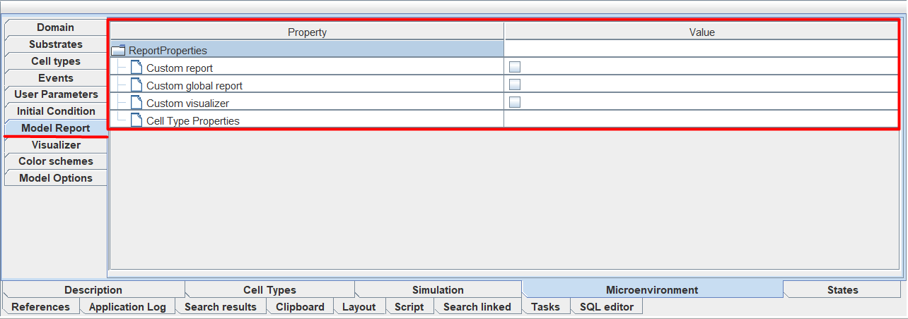
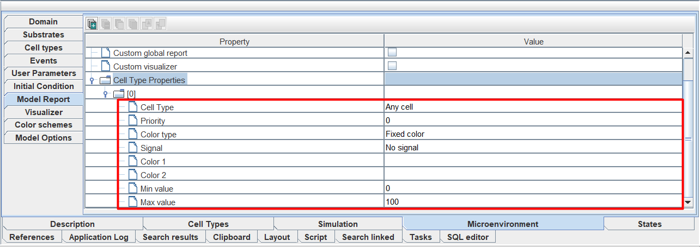

Свойства всей модели
====================

.. |icon_increase_sorting| image:: /images/icons/Physicell/increase_sorting.png
.. |icon_decrease_sorting| image:: /images/icons/Physicell/decrease_sorting.png
.. |icon_option| image:: /images/icons/option.png
.. |icon_Java_code| image:: /images/icons/Physicell/Java_code.png
.. |icon_table| image:: /images/icons/Physicell/table.png
.. |icon_add_new| image:: /images/icons/Physicell/add_new.png
.. |icon_plus| image:: /images/icons/Physicell/plus.png

.. role:: raw-html(raw)
   :format: html

Для редактирования общих свойств всей модели используется вкладка **Microenvironment** :ref:`(Рисунок 1) <Physicell_microenvironment_Pic.1>`.

.. _Physicell_microenvironment_Pic.1:

   Рисунок 1. Вкладка Microenvironment для редактирования свойств всей модели.

Чтобы ее открыть, нужно нажать на нее ЛКМ.

Данная вкладка содержит в себе набор вложенных вкладок, каждая из которых описывает различные аспекты модели :ref:`(Рисунок 2) <Physicell_microenvironment_Pic.2>`:

- **Domain**: свойства сетки,
- **Substrates**: вещества,
- **Cell types**: типы клеток,
- **Events**: события,
- **User Parameters**: пользовательские параметры модели,
- **Initial Condition**: начальное расположение клеток,
- **Model Report**: отчет по модели,
- **Visualizer**: визуализация клеток,
- **Color schemes**: цветовые схемы,
- **Model Options**: другие параметры модели.

.. _Physicell_microenvironment_Pic.2:

   Рисунок 2. Вложенные вкладки в Microenvironment.

Чтобы открыть любую вкладку, нужно нажать на нее ЛКМ.

Далее отдельно разберем работу с каждой из вкладок.

.. _Physicell_microenvironment_Domain:

Свойства сетки (Domain)
-----------------------

Во вкладке **Domain** описывается пространство внешней среды, которое задается прямоугольной сеткой.

В этой вкладке можно редактировать следующие параметры :ref:`(Рисунок 3) <Physicell_microenvironment_Pic.3>`:

- **Xmin**: минимальное значение координаты по оси X,
- **Ymin**: минимальное значение координаты по оси Y,
- **Zmin**: минимальное значение координаты по оси Z,
- **Xmax**: максимальное значение координаты по оси X,
- **Ymax**: максимальное значение координаты по оси Y,
- **Zmax**: максимальное значение координаты по оси Z,
- **dx**: шаг сетки по оси X,
- **dy**: шаг сетки по оси Y,
- **dz**: шаг сетки по оси Z,
- **Use 2D**: отметьте ☑, если хотите, чтобы пространство внешней среды ограничивалось двумя измерениями (оси X и Y).

.. note::
   Параметры Zmin, Zmax и dz доступны для редактирования, только если не выбрано Use 2D.

.. _Physicell_microenvironment_Pic.3:

.. figure:: images/Physicell/Physicell_microenvironment/Domain_menu.png
   :width: 100%
   :alt: Domain_menu
   :align: center

   Рисунок 3. Меню редактирования пространства внешней среды модели.

Чтобы задать значение любого параметра, нужно нажать ЛКМ справа от соответствующей иконки и вписать собственное значение.

.. _Physicell_microenvironment_Substrates:

Вещества (Substrates)
---------------------

Во вкладке **Substrates** в табличной форме приведен список всех веществ в модели вместе с их свойствами :ref:`(Рисунок 4) <Physicell_microenvironment_Pic.4>`. 

.. _Physicell_microenvironment_Pic.4:

   Рисунок 4. Список всех веществ в модели с их свойствами.

На данной вкладке можно редактировать все свойства веществ:

- **Name**: название субстрата,
- **Initial condition**: начальная концентрация вещества,
- **Decay rate**: скорость разложения вещества в среде,
- **Diffusion coefficient**: скорость диффузии вещества в среде,
- **X min**: :raw-html:`граничное условие для концентрации вещества на границе среды X = Xmin`,
- **X max**: :raw-html:`граничное условие для концентрации вещества на границе среды X = Xmax`,
- **Y min**: :raw-html:`граничное условие для концентрации вещества на границе среды Y = Ymin`,
- **Y max**: :raw-html:`граничное условие для концентрации вещества на границе среды Y = Ymax`,
- **Z min**: :raw-html:`граничное условие для концентрации вещества на границе среды Z = Zmin`,
- **Z max**: :raw-html:`граничное условие для концентрации вещества на границе среды Z = Zmax`.

Чтобы задать значение любого параметра, нужно нажать ЛКМ в ячейку строки под соответствующим заголовком и вписать собственное значение.

Также свойства веществ можно настраивать напрямую на диаграмме: либо при их :ref:`создании <Physicell_model_development_Substrate_creation>`, либо :ref:`редактируя <Physicell_model_development_Additional_properties>` уже созданные.

.. note::
   Удалять и добавлять новые вещества на данной вкладке нельзя.

На данной вкладке можно сортировать вещества по значениям любой из их характеристик. Для этого нужно нажать ЛКМ на название того стобца, по значениям которого вы хотите их отсортировать :ref:`(Рисунок 5) <Physicell_microenvironment_Pic.5>`.

.. _Physicell_microenvironment_Pic.5:

.. figure:: images/Physicell/Physicell_microenvironment/Substrates_sorting.png
   :width: 100%
   :alt: Substrates_sorting
   :align: center

   Рисунок 5. Сортировка веществ по значениям одной из их характеристик (показано на примере Decay rate).

После этого рядом с названием выбранной характеристики появится значок |icon_increase_sorting|, обозначающий сортировку от наименьшего к наибольшему. Чтобы отсортировать от наибольшего к наименьшему, нужно нажать ЛКМ на название этой же характеристики еще раз, после чего рядом с ней появится значок |icon_decrease_sorting|.

Также можно настраивать размер каждой колонки. Для этого нужно:

- навести курсор на границу любых двух столбцов,
- зажать ЛКМ,
- передвинуть курсор в новое место таблицы,
- отпустить ЛКМ :ref:`(Рисунок 6) <Physicell_microenvironment_Pic.6>`.

.. _Physicell_microenvironment_Pic.6:

   Рисунок 6. Изменение ширины столбцов.

Типы клеток (Cell types)
------------------------

Во вкладке **Cell types** в табличной форме приведен список всех типов клеток в модели вместе с их свойствами :ref:`(Рисунок 7) <Physicell_microenvironment_Pic.7>`.

.. _Physicell_microenvironment_Pic.7:

   Рисунок 7. Список всех типов клеток в модели с их свойствами.

На данной вкладке можно редактировать все свойства клеток:

- **Name**: название типа клеток,
- **Initial number**: исходное количество клеток данного типа,
- **Color**: цвет, с помощью которого клетки данного типа будут отображаться при симуляции модели,
- **Comment**: можете оставить любые комментарии для клеток данного типа.

Чтобы задать значение любого параметра, нужно нажать ЛКМ в ячейку строки под соответствующим заголовком и вписать собственное значение.

Чтобы выбрать значение параметра **Color**, нужно нажать ЛКМ в ячейку строки под этим заголовком и из раскрывающегося списка выбрать нужный цвет :ref:`(Рисунок 8) <Physicell_microenvironment_Pic.8>`.

.. _Physicell_microenvironment_Pic.8:

.. figure:: images/Physicell/Physicell_microenvironment/Cell_types_color.png
   :width: 100%
   :alt: Cell_types_color
   :align: center

   Рисунок 8. Изменение значения параметра Color.

Чтобы более детально настроить цвет клеток, нужно в конце раскрывающегося списка под полем **Color** выбрать **more colors...** :ref:`(Рисунок 9A) <Physicell_microenvironment_Pic.9>` и в появившемся окне задать нужный цвет :ref:`(Рисунок 9Б) <Physicell_microenvironment_Pic.9>`.

.. _Physicell_microenvironment_Pic.9:

.. figure:: images/Physicell/Physicell_microenvironment/Cell_types_more_colors.png
   :width: 100%
   :alt: Cell_types_more_colors
   :align: center

   Рисунок 9. Выберите more colors (А) для более детальной настройки цвета клеток (Б).

Также свойства клеток можно настраивать напрямую на диаграмме: либо при их :ref:`создании <Physicell_model_development_Cell_creation>`, либо :ref:`редактируя <Physicell_model_development_Additional_properties>` уже созданные.

.. note::
   Удалять и добавлять новые типы клеток на данной вкладке нельзя.

Сортировка типов клеток по значениям какого-либо из их признаков, а также изменение размеров любой колонки таблицы со всеми клетками выполняется также, как и с :ref:`веществами <Physicell_microenvironment_Substrates>`.

События (Events)
----------------

Во вкладке **Events** в табличной форме приведен список всех событий модели вместе с их настройками :ref:`(Рисунок 10) <Physicell_microenvironment_Pic.10>`.

.. _Physicell_microenvironment_Pic.10:

.. figure:: images/Physicell/Physicell_microenvironment/Events_menu.png
   :width: 100%
   :alt: Events_menu
   :align: center

   Рисунок 10. Список всех событий модели с их настройками.

На данной вкладке можно редактировать все настройки событий:

- **Name**: название события,
- **Execution time**: модельное время, при достижении которого срабатывает событие,
- **Custom Execution code**: выберите ☑, чтобы задать путь до Java-кода, который выполнится при срабатывании события,
- **Execution code**: путь до Java-кода, который выполняется при срабатывании события,
- **Comment**: комментарий,
- **Show code**: выберите ☑, если хотите полностью показывать код на диаграмме модели,
- **Format code**: выберите ☑, если хотите форматировать показываемый на диаграмме модели код.

Чтобы задать значение любого параметра, нужно нажать ЛКМ в ячейку строки под соответствующим заголовком и вписать собственное значение, указать путь до нужного файла или отметить ☑.

Также настройки событий можно редактировать напрямую на диаграмме: либо при их :ref:`создании <Physicell_model_development_Event_creation>`, либо :ref:`редактируя <Physicell_model_development_Additional_properties>` уже созданные.

.. note::
   Удалять и добавлять новые события на данной вкладке нельзя.

Сортировка событий по значениям какой-либо из их настроек, а также изменение размеров любой колонки таблицы со всеми событиями выполняется также, как и с :ref:`веществами <Physicell_microenvironment_Substrates>`.

Пользовательские параметры модели (User Parameters)
---------------------------------------------------

Пользовательские параметры модели могут быть добавлены для использования в пользовательском Java-коде, например, при генерации начального расположения клеток, срабатывания событий или в коде, описывающем поведение отдельных клеток.

Начальное расположение клеток (Initial Condition)
-------------------------------------------------

После нажатия на вкладку **Initial Condition** на панели свойств справа у вас появится меню, в котором нужно поставить ☑ напротив |icon_option| **Custom condition**, если вы хотите задать определенное начальное расположение клеток :ref:`(Рисунок 11) <Physicell_microenvironment_Pic.11>`.

.. _Physicell_microenvironment_Pic.11:

   Рисунок 11. Настройка для указания начального расположения клеток.

Если вы не хотите настраивать определенное начальное расположение клеток (хотите оставить случайное расположение), то оставьте вкладку **Initial Condition** без изменений.

При выборе ☑ напротив |icon_option| **Custom condition** у вас появится меню, в котором можно настроить 2 параметра :ref:`(Рисунок 12) <Physicell_microenvironment_Pic.12>`:

- |icon_option| **Custom Java code**: путь до Java-кода в репозитории, описывающего начальное расположение клеток в модели,
- |icon_option| **Custom table**: путь до таблицы в репозитории, описывающей начальное расположение клеток в модели.

.. _Physicell_microenvironment_Pic.12:

   Рисунок 12. Параметры Custom Java code и Custom table для указания определенного начального расположения клеток.

Чтобы указать путь до Java-кода или таблицы, нужно нажать ЛКМ на |icon_Java_code| **(select element)** или |icon_table| **(select element)**, соответственно, и в появившемся окне выбрать нужный файл в репозитории.

.. warning::
   Нельзя одновременно указать и Java-код и таблицу, нужно указать только что-то одно.

Цветовые схемы (Color schemes)
------------------------------

.. warning::
   Пока мы пропустим вкладки **Model Report** и **Visualizer**, потому что перед их редактированием необходимо настроить параметры вкладки **Color schemes**.

Что такое цветовые схемы?
~~~~~~~~~~~~~~~~~~~~~~~~~

Настройка цветовых схем в модели
~~~~~~~~~~~~~~~~~~~~~~~~~~~~~~~~

После нажатия на вкладку **Color schemes** на панели свойств справа у вас появится меню, в котором, нажав ЛКМ на иконку |icon_plus|, можно добавить новую цветовую схему :ref:`(Рисунок 13) <Physicell_microenvironment_Pic.13>`.

.. _Physicell_microenvironment_Pic.13:

   Рисунок 13. Добавление новой цветовой схемы.

Отчет по модели (Model Report)
------------------------------

.. warning::
   Перед редактированием вкладки **Model Report** сначала необходимо настроить параметры вкладки **Color schemes**.

После нажатия на вкладку **Model Report** на панели свойств справа у вас появится меню, в котором можно редактировать следующие параметры :ref:`(Рисунок 14) <Physicell_microenvironment_Pic.14>`:

- |icon_option| **Custom report**: поставьте ☑, если хотите задать Java-код, по которому будет создаваться отчет по модели,
- |icon_option| **Custom global report**: поставьте ☑, если хотите задать Java-код, по которому будет создаваться глобальный отчет по модели,
- |icon_option| **Custom visualizer**: поставьте ☑, если хотите задать Java-код, по которому будет изменяться расцветка клеток при симуляции модели,
- |icon_option| **Cell Type Properties**: настройка расцветки клеток в зависимости от различных сигналов (рассмотрено далее).

.. _Physicell_microenvironment_Pic.14:

   Рисунок 14. Меню вкладки Model Report.

При указании ☑ напротив |icon_option| **Custom report**, |icon_option| **Custom global report** или |icon_option| **Custom visualizer** ниже выбранного поля появится новое поле |icon_option| **Report**, |icon_option| **Global report** или |icon_option| **Visualizer**, соответственно. Напротив этих полей можно нажать ЛКМ на |icon_Java_code| **(select element)**, а затем в появившемся окне указать путь до нужного Java-кода в репозитории :ref:`(Рисунок 15) <Physicell_microenvironment_Pic.15>`.

.. _Physicell_microenvironment_Pic.15:

   Рисунок 15. Выбор нужного Java-кода (показано на примере Custom report).

Чтобы добавить настройку расцветки одного типа клеток, нужно:

- нажать ЛКМ yf cnhjre c |icon_option| **Cell Type Properties**,
- нажать ЛКМ на иконку |icon_add_new| :ref:`(Рисунок 16) <Physicell_microenvironment_Pic.16>`.

.. _Physicell_microenvironment_Pic.16:

.. figure:: images/Physicell/Physicell_microenvironment/Add_cell_type_property.png
   :width: 100%
   :alt: Add_cell_type_property
   :align: center

   Рисунок 16. Добавление настройки расцветки клеток.

После добавления настройки расцветки у вас появится вкладка с ее порядковым номером (начиная с [0]). Таким же образом можно добавить сколько угодно настроек расцветки. 

Раскрыв эту вкладку, можно увидеть доступные для редактирования параметры :ref:`(Рисунок 17) <Physicell_microenvironment_Pic.17>`:

- **Cell Type**: тип клеток,
- **Priority**: приоритет,
- **Color type**: тип цвета,
- **Signal**: сиганл,
- **Color 1**: цвет 1,
- **Color 2**: цвет 2,
- **Min value**: минимальное значение,
- **Max value**: максимальное значение.

.. _Physicell_microenvironment_Pic.17:

   Рисунок 17. Параметры настройки расцветки, доступные для редактирования.

В поле справа от |icon_option| **Cell Type** из расурывающегося списка нужно выбрать тип клеток, расцветку которой мы хотим настроить.

Визуализация клеток (Visualizer)
--------------------------------

.. warning::
   Перед редактированием вкладки **Visualizer** сначала необходимо настроить параметры вкладки **Color schemes**.

Другие параметры модели (Model Options)
---------------------------------------

Вкладка **Model Options** содержит все оставшиеся параметры модели, которые нельзя отнести ни к одной из рассмотренных выше вкладок.

После нажатия на эту вкладку на панели свойств справа у вас появится меню, в котором можно редактировать следующие параметры модели :ref:`(Рисунок 18) <Physicell_microenvironment_Pic.18>`:

- **Disable automated spring adhesion**: поставьте ☑, если хотите включить автоматическую адгезию клеток.

.. _Physicell_microenvironment_Pic.18:

   Рисунок 18. Меню редактирования оставшихся параметров модели.