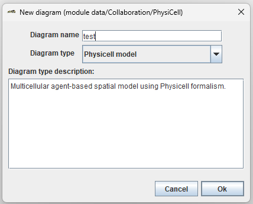

Создание Physicell модели
=========================

.. role:: raw-html(raw)
   :format: html

.. |icon_delete| image:: /images/icons/Physicell/delete.png
.. |icon_folder| image:: /images/icons/Physicell/folder.png
.. |icon_option| image:: /images/icons/option.png
.. |icon_Type_Diagram| image:: /images/icons/Type-Diagram-icon.png

Создание проекта
----------------

Прежде чем приступить к созданию модели, необходимо создать проект на стартовой странице.
Для этого на верхней панели во вкладке **Data** выберите **New project** :ref:`(Рисунок 1) <Physicell_model_creation_Pic.1>`.

.. _Physicell_model_creation_Pic.1:

   Рисунок 1. Создание проекта в BioUML.

После этого в появившемся окне вы можете настроить свой проект :ref:`(Рисунок 2) <Physicell_model_creation_Pic.2>`:

- **Project name**: название проекта,
- **Table implementation**: реализация таблиц (File или SQL),
- **SQL connection**: SQL-соединение,
- Какие директории создавать в проекте (проставьте ☑ в нужных местах).

.. _Physicell_model_creation_Pic.2:

   Рисунок 2. Настройка проекта.

После настройки проекта нажмите кнопку **Ok**.

.. warning::
   После создания проекта изменить его настройки уже не удастся.

Теперь в левой верхней части экрана во вкладке **Data** в папке **data/Collaboration** вы можете видеть созданный вами проект, в котором в папке **Data** находятся все выбранные на предыдущем этапе директории :ref:`(Рисунок 3) <Physicell_model_creation_Pic.3>`.

.. _Physicell_model_creation_Pic.3:

   Рисунок 3. Готовый проект.

Создание модели
---------------

После создания проекта можно переходить непосредственно к созданию модели.
Для этого в созданном проекте перейдите в |icon_folder| **Data**, нажмите ПКМ на |icon_folder| **Diagrams** и в выпадающем списке нажмите ЛКМ на |icon_option| **New Diagram** :ref:`(Рисунок 4) <Physicell_model_creation_Pic.4>`.

.. _Physicell_model_creation_Pic.4:

   Рисунок 4. Создание новой диаграммы.

После этого в появившемся окне вы можете настроить свою модель :ref:`(Рисунок 5) <Physicell_model_creation_Pic.5>`:

- **Diagram name**: название модели,
- **Diagram type**: тип модели (:raw-html:`нужно выбрать PhysicellDiagramType`),
- **Diagram type description**: описание выбранного типа диаграммы.

.. _Physicell_model_creation_Pic.5:

   Рисунок 5. Создание диаграммы типа Physicell.

После настройки диаграммы нажмите кнопку **Ok**.

.. warning::
   После создания модели изменить ее название или тип уже не удастся.

В результате в |icon_folder| **Diagrams** появится созданная вами модель со значком |icon_Type_Diagram| :ref:`(Рисунок 6) <Physicell_model_creation_Pic.6>`.

.. _Physicell_model_creation_Pic.6:

   Рисунок 6. Файл созданной модели.

Удаление проекта или модели
---------------------------

Чтобы удалить проект или модель, нужно ПКМ нажать на соответствующий элемент в дереве и в выпадающем списке ЛКМ нажать |icon_delete| **Remove database** в случае проекта :ref:`(Рисунок 7А) <Physicell_model_creation_Pic.7>` или |icon_delete| **Remove** в случае модели :ref:`(Рисунок 7Б) <Physicell_model_creation_Pic.7>`.

.. _Physicell_model_creation_Pic.7:

   Рисунок 7. Удаление проекта (А) или модели (Б).

После этого в появивщемся окне нужно нажать **Yes**.

.. warning::
   Удаленные данные не подлежат восстановлению.