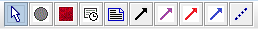
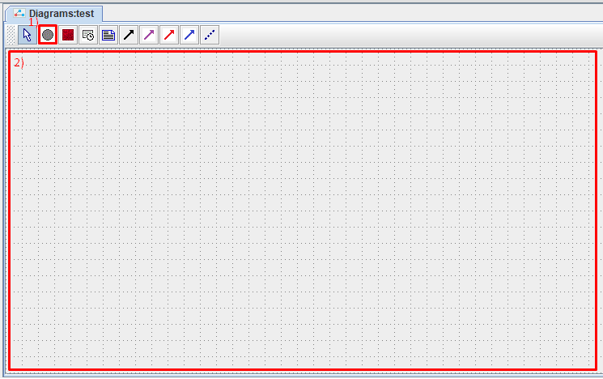
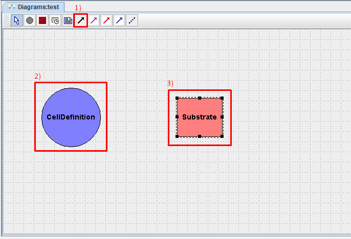
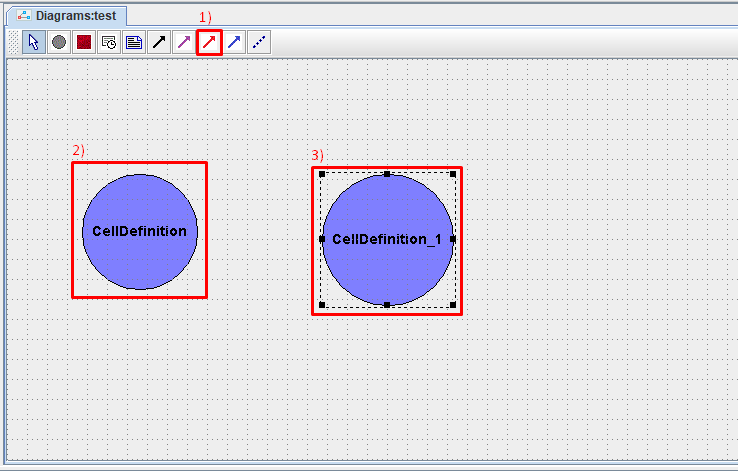
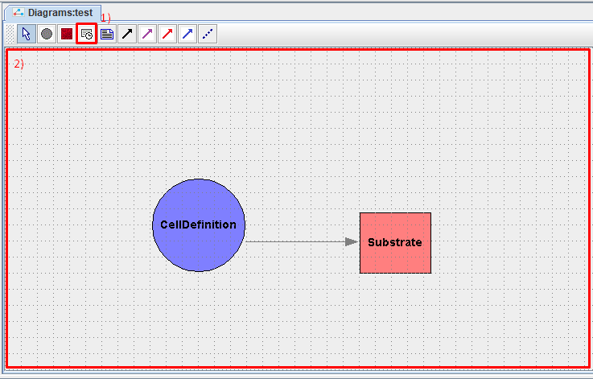

Построение Physicell модели
===========================

Инструменты Physicell модели
----------------------------

.. role:: raw-html(raw)
   :format: html

.. |icon_Type_Diagram| image:: /images/icons/Type-Diagram-icon.png
.. |icon_opened_folder| image:: /images/icons/Physicell/opened_folder.png
.. |icon_cell_definition| image:: /images/icons/Physicell/cell_definition.png
.. |icon_substrate| image:: /images/icons/Physicell/substrate.png
.. |icon_secretion| image:: /images/icons/Physicell/secretion.png
.. |icon_chemotaxis| image:: /images/icons/Physicell/chemotaxis.png
.. |icon_interaction| image:: /images/icons/Physicell/interaction.png
.. |icon_transformation| image:: /images/icons/Physicell/transformation.png
.. |icon_event| image:: /images/icons/Physicell/event.png

Чтобы начать работать с моделью, сначала нужно ее открыть. Для этого два раза ЛКМ нажмите на |icon_Type_Diagram| или нажмите ПКМ на |icon_Type_Diagram| и в выпадающем списке нажмите ЛКМ на |icon_opened_folder| **Open** :ref:`(Рисунок 1) <Physicell_model_development_Pic.1>`.

.. _Physicell_model_development_Pic.1:

   Рисунок 1. Открытие модели.

После этого в левой верхней части экрана появится окно, в котором можно создавать модель :ref:`(Рисунок 2) <Physicell_model_development_Pic.2>`.

.. _Physicell_model_development_Pic.2:

   Рисунок 2. Окно, в котором создается модель.

В верхней части этого окна можно видеть панель инструментов, которые используются для построения Physicell-модели :ref:`(Рисунок 3) <Physicell_model_development_Pic.3>`.

.. _Physicell_model_development_Pic.3:

   Рисунок 3. Набор инструментов для построения модели типа Physicell.

Выбрать тот или иной инструмент можно нажатием на соответствующую иконку ЛКМ. Описание каждого инструмента представлено в :raw-html:`<a href="#Physicell_model_development_Tbl.1">таблице 1</a>`.

.. raw:: html

    
    
   
   <table style="table-layout: fixed; width: 100%; word-wrap: break-word;">
   <caption>Таблица 1. Элементы панели управления, используемой при работе с Physicell моделями</caption>
   <tr>
        <th>Обозначение</th>
        <th>Описание</th>
    </tr>
    <tr>
        <td></td>
        <td>Выбор элемента на диаграмме</td>
    </tr>
    <tr>
        <td></td>
        <td>Клетки</td>
    </tr>
    <tr>
        <td></td>
        <td>Субстрат</td>
    </tr>
    <tr>
        <td></td>
        <td>Событие</td>
    </tr>
    <tr>
        <td></td>
        <td>Примечание</td>
    </tr>
    <tr>
        <td></td>
        <td>Секреция</td>
    </tr>
    <tr>
        <td></td>
        <td>Хемотаксис</td>
    </tr>
    <tr>
        <td></td>
        <td>Взаимодействие</td>
    </tr>
    <tr>
        <td></td>
        <td>Трансформация</td>
    </tr>
    </table>

:raw-html:` `
Основными участниками Physicell модели являются клетки (|icon_cell_definition|) и субстраты (|icon_substrate|).

Между ними возможно 4 типа взаимодействий:

- Взаимодействия типа "клетка-субстрат":
    - Секреция (|icon_secretion|): выделение или поглощение клеткой того или иного субстрата,
    - Хемотаксис (|icon_chemotaxis|): движение клетки к или от определенного субстрата.
- Взаимодействия типа "клетка-клетка":
    - Взаимодействие (|icon_interaction|): воздействие клеток одного типа на клетки другого типа,
    - Трансформация (|icon_transformation|): превращение клеток одного типа в клетки другого типа.

.. _Physicell_model_development_Cell_creation:

Создание клеток
---------------

Чтобы добавить в модель клетки нужно на верхней панели нажать ЛКМ на |icon_cell_definition|, а затем нажать ЛКМ в любое место под панелью инструментов :ref:`(Рисунок 4) <Physicell_model_development_Pic.4>`.

.. _Physicell_model_development_Pic.4:

   Рисунок 4. Создание клеток.

После этого в появившемся окне необходимо задать параметры создаваемого типа клеток :ref:`(Рисунок 5) <Physicell_model_development_Pic.5>`:

- **Name**: название типа клеток,
- **Initial number**: исходное количество клеток данного типа,
- **Color**: цвет, с помощью которого клетки данного типа будут отображаться при симуляции модели,
- **Gradient**: отметьте ☑, если необходимо применить градиент к выбранному цвету,
- **Comment**: можете оставить любые комментарии для клеток данного типа.

.. _Physicell_model_development_Pic.5:

   Рисунок 5. Параметры создаваемого типа клеток.

После того, как заданы все параметры нажмите на **Ok**.

На экране у вас появится обозначение созданного вами типа клеток :ref:`(Рисунок 6) <Physicell_model_development_Pic.6>`.

.. _Physicell_model_development_Pic.6:

   Рисунок 6. Клетки обозначаются синим кружком.

Таким образом можно задать любое количество типов клеток в модели.

Чтобы переместить клетки на диаграмме, необходимо зажать ЛКМ клетки, переместить курсор на новое место и отпустить ЛКМ.

Чтобы удалить клетки из модели, необходимо нажать на них ЛКМ и нажать клавишу **Delete** на клавиатуре.

.. note::
   Все клетки в модели отображаются в виде кругов синего цвета.

.. _Physicell_model_development_Substrate_creation:

Создание субстрата
------------------

Чтобы создать субстрат, нужно на верхней панели нажать ЛКМ на |icon_substrate|, а затем нажать ЛКМ в любое место под панелью инструментов (аналогично созданию клеток).

После этого в появившемся окне необходимо задать параметры создаваемого субстрата :ref:`(Рисунок 7) <Physicell_model_development_Pic.7>`:

- **Name**: название субстрата,
- **Initial condition**: начальная концентрация вещества,
- **Decay rate**: скорость разложения вещества в среде,
- **Diffusion coefficient**: скорость диффузии вещества в среде,
- **X min**: :raw-html:`граничное условие для концентрации вещества на границе среды X = Xmin`,
- **X max**: :raw-html:`граничное условие для концентрации вещества на границе среды X = Xmax`,
- **Y min**: :raw-html:`граничное условие для концентрации вещества на границе среды Y = Ymin`,
- **Y max**: :raw-html:`граничное условие для концентрации вещества на границе среды Y = Ymax`,
- **Z min**: :raw-html:`граничное условие для концентрации вещества на границе среды Z = Zmin`,
- **Z max**: :raw-html:`граничное условие для концентрации вещества на границе среды Z = Zmax`.

.. note::
   - Граничное значение означает что на соответствующей границе среды поддерживается заданное значение концентрации постоянно.
   - Для отключения соответствующего граничного условия нужно задать значение -1.

.. _Physicell_model_development_Pic.7:

   Рисунок 7. Параметры создаваемого субстрата.

После того, как заданы все параметры нажмите на **Ok**.

На экране у вас появится обозначение созданного вами типа субстрата :ref:`(Рисунок 8) <Physicell_model_development_Pic.8>`.

.. _Physicell_model_development_Pic.8:

   Рисунок 8. Субстраты обозначаются красными прямоугольниками.

Таким образом можно задать любое количество типов субстратов в модели.

Чтобы переместить субстрат на диаграмме, необходимо зажать ЛКМ субстрат, переместить курсор на новое место и отпустить ЛКМ.

Чтобы удалить субстрат из модели, необходимо нажать на него ЛКМ и нажать клавишу **Delete** на клавиатуре.

.. note::
   Все субстраты в модели отображаются в виде прямоугольников красного цвета.

.. _Physicell_model_development_Secretion:

Создание реакции секреции
-------------------------

Реакция секреции (|icon_secretion|) относится к типу взаимодействий "клетка-субстрат".

Чтобы создать в модели реакцию секреции необходимо:

1. нажать ЛКМ на значок |icon_secretion| на верхней панели инструментов,
2. нажать ЛКМ на клетки, которые будут выделять/поглощать определенный субстрат,
3. нажать ЛКМ на субстрат, который выбранные клетки будут выделять/поглощать :ref:`(Рисунок 9) <Physicell_model_development_Pic.9>`.

.. _Physicell_model_development_Pic.9:

   Рисунок 9. Создание реакции секреции.

После этого на диаграмме появится стрелочка серого цвета, направленная от клетки к субстрату :ref:`(Рисунок 10) <Physicell_model_development_Pic.10>`.

.. _Physicell_model_development_Pic.10:

   Рисунок 10. Обозначение реакции секреции на диаграмме модели.

Чтобы настроить параметры созданной реакции секреции, нужно нажать ПКМ на серую стрелку на диаграмме, обозначающую данную реакцию, и в раскрывающемся списке нажать ЛКМ на кнопку **Edit** :ref:`(Рисунок 11) <Physicell_model_development_Pic.11>`.

.. _Physicell_model_development_Pic.11:

   Рисунок 11. Редактирование реакции.

После этого в появившемся окне необходимо задать параметры изменяемой реакции :ref:`(Рисунок 12) <Physicell_model_development_Pic.12>`:

- **Title**: название реакции,
- **Comment**: комментарий,
- **Substrate**: название выделяемого/потребляемого субстрата (:raw-html:`не изменяется!`),
- **Secretiom Rate**: скорость секреции вещества,
- **Secretiom Target**: значение «насыщения» при котором прекращается секреция,
- **Uptake Rate**: скорость потребления вещества,
- **Net export rate**: скорость экспорта.

.. _Physicell_model_development_Pic.12:

   Рисунок 12. Параметры реакции секреции.

После того, как заданы все параметры нажмите на **Ok**.

.. _Physicell_model_development_Chemotaxis:

Создание реакции хемотаксиса
----------------------------

Реакция хемотаксиса (|icon_chemotaxis|) относится к типу взаимодействий "клетка-субстрат".

Чтобы создать в модели реакцию хемотаксиса необходимо:

1. нажать ЛКМ на значок |icon_chemotaxis| на верхней панели инструментов,
2. нажать ЛКМ на клетки, которые будут двигаться к/от определенного субстрата,
3. нажать ЛКМ на субстрат, к/от которого выбранные клетки будут двигаться :ref:`(Рисунок 13) <Physicell_model_development_Pic.13>`.

.. _Physicell_model_development_Pic.13:

   Рисунок 13. Создание реакции хемотаксиса.

После этого на диаграмме появится стрелочка фиолетового цвета, направленная от субстрата к клетке :ref:`(Рисунок 14) <Physicell_model_development_Pic.14>`.

.. _Physicell_model_development_Pic.14:

   Рисунок 14. Обозначение реакции хемотаксиса на диаграмме модели.

Чтобы настроить параметры созданной реакции хемотаксиса, нужно нажать ПКМ на фиолетовую стрелку на диаграмме, обозначающую данную реакцию, и в раскрывающемся списке нажать ЛКМ на кнопку **Edit**.

После этого в появившемся окне необходимо задать параметры изменяемой реакции :ref:`(Рисунок 15) <Physicell_model_development_Pic.15>`:

- **Title**: название реакции,
- **Comment**: комментарий,
- **Substrate**: название субстрата (:raw-html:`не изменяется!`),
- **Sensitivity**: чувствительность к выбранному веществу.

.. note::
   - Положительные значения Sensitivity указывают на то, что клетка будет двигаться к субстрату, а отрицательные - от субстрата.

   - Абсолютное значение Sensitivity указывает на "силу" движения клетки к/от определенного субстрата.

.. _Physicell_model_development_Pic.15:

   Рисунок 15. Параметры реакции хемотаксиса.

После того, как заданы все параметры нажмите на **Ok**.

.. _Physicell_model_development_Interaction:

Создание реакции взаимодействия
-------------------------------

Реакция взаимодействия (|icon_interaction|) относится к типу взаимодействий "клетка-клетка".

Чтобы создать в модели реакцию взаимодействия необходимо:

1. нажать ЛКМ на значок |icon_interaction| на верхней панели инструментов,
2. нажать ЛКМ на клетки, которые будут тем или иным образом воздействовать на другие клетки,
3. нажать ЛКМ на клетки, над которыми будет совершаться то или иное действие :ref:`(Рисунок 16) <Physicell_model_development_Pic.16>`.

.. _Physicell_model_development_Pic.16:

   Рисунок 16. Создание реакции взаимодействия.

После этого на диаграмме появится стрелочка красного цвета, направленная от одного типа клеток, оказывающих воздействие, к другому, над которыми совершается действие :ref:`(Рисунок 17) <Physicell_model_development_Pic.17>`.

.. _Physicell_model_development_Pic.17:

   Рисунок 17. Обозначение реакции взаимодействия на диаграмме модели.

Чтобы настроить параметры созданной реакции взаимодействия, нужно нажать ПКМ на красную стрелку на диаграмме, обозначающую данную реакцию, и в раскрывающемся списке нажать ЛКМ на кнопку **Edit**.

После этого в появившемся окне необходимо задать параметры изменяемой реакции :ref:`(Рисунок 18) <Physicell_model_development_Pic.18>`:

- **Title**: название реакции,
- **Comment**: комментарий,
- **Cell type**: название типа клеток, над которыми совершается действие (:raw-html:`не изменяется!`),
- **Attack rate**: интенсивность атаки,
- **Fuse rate**: интенсивность поглощения,
- **Phagocytosis rate**: интенсивность фагоцитоза.

.. _Physicell_model_development_Pic.18:

   Рисунок 18. Параметры реакции взаимодействия.

После того, как заданы все параметры нажмите на **Ok**.

.. _Physicell_model_development_Transformation:

Создание реакции трансформации
------------------------------

Реакция трансформации (|icon_transformation|) относится к типу взаимодействий "клетка-клетка".

Чтобы создать в модели реакцию трансформации необходимо:

1. нажать ЛКМ на значок |icon_transformation| на верхней панели инструментов,
2. нажать ЛКМ на клетки, которые будут трансформированы в другой тип клеток,
3. нажать ЛКМ на клетки, в которые будет происходить трансформация :ref:`(Рисунок 19) <Physicell_model_development_Pic.19>`.

.. _Physicell_model_development_Pic.19:

   Рисунок 19. Создание реакции трансформации.

После этого на диаграмме появится стрелочка синего цвета, направленная от одного типа клеток, которые будут трансформироваться, к другому, в которые превратятся первые в результате трансформации :ref:`(Рисунок 20) <Physicell_model_development_Pic.20>`.

.. _Physicell_model_development_Pic.20:

   Рисунок 20. Обозначение реакции трансформации на диаграмме модели.

Чтобы настроить параметры созданной реакции трансформации, нужно нажать ПКМ на синию стрелку на диаграмме, обозначающую данную реакцию, и в раскрывающемся списке нажать ЛКМ на кнопку **Edit**.

После этого в появившемся окне необходимо задать параметры изменяемой реакции :ref:`(Рисунок 21) <Physicell_model_development_Pic.21>`:

- **Title**: название реакции,
- **Comment**: комментарий,
- **Cell type**: название типа клеток, которые будут возникать в результате трансформации (:raw-html:`не изменяется!`),
- **Transformation rate**: скорость трансформации.

.. _Physicell_model_development_Pic.21:

   Рисунок 21. Параметры реакции трансормации.

После того, как заданы все параметры нажмите на **Ok**.

.. _Physicell_model_development_Event_creation:

Создание события
----------------

Событие - это мгновенное изменение в модели в результате срабатывания некоего условия (например, достижение заданного значения модельного времени).

Чтобы создать в модели событие необходимо:

1. нажать ЛКМ на значок |icon_event| на верхней панели инструментов,
2. нажать ЛКМ на любое пространство рабочей области :ref:`(Рисунок 22) <Physicell_model_development_Pic.22>`.

.. _Physicell_model_development_Pic.22:

   Рисунок 22. Создание события.

После этого в появившемся окне необходимо задать параметры создаваемого события :ref:`(Рисунок 23) <Physicell_model_development_Pic.23>`:

- **Name**: название события,
- **Execution time**: модельное время, при достижении которого срабатывает событие,
- **Custom Execution code**: выберите ☑, чтобы задать путь до Java-кода, который выполнится при срабатывании события,
- **Execution code**: путь до Java-кода, который выполняется при срабатывании события,
- **Comment**: комментарий,
- **Show code**: выберите ☑, если хотите полностью показывать код на диаграмме модели,
- **Format code**: выберите ☑, если хотите форматировать показываемый на диаграмме модели код.

.. _Physicell_model_development_Pic.23:

   Рисунок 23. Параметры события.

После того, как заданы все параметры нажмите на **Ok**.

На экране появится событие в виде полупрозрачного прямоугольника :ref:`(Рисунок 24) <Physicell_model_development_Pic.24>`.

.. _Physicell_model_development_Pic.24:

   Рисунок 24. Обозначение события на диаграмме модели.

Таким образом можно задать любое количество событий в модели.

Чтобы переместить обозначение события на диаграмме, необходимо зажать ЛКМ это обозначение, переместить курсор на новое место и отпустить ЛКМ.

Чтобы удалить событие из модели, необходимо нажать на его обозначение ЛКМ и нажать клавишу **Delete** на клавиатуре.

Дополнительные свойства реакций
-------------------------------

Чтобы удалить любую реакцию (секреция, хемотаксис, взаимодействие или трансформация) из модели, нужно нажать ЛКМ на стрелку на диаграмме, обозначающую реакцию, и нажать кнопку **Delete** на клавиатуре.

При большом количестве типов клеток и/или субстратов на диаграмме для более наглядного представления всех реакций можно добавлять узлы на стрелки, обозначающие любые реакции. Для этого нажмите ПКМ на стрелку в том месте, где вы хотите
добавить узел, после чего в выпадающем списке ЛКМ нажмите на **Add vertex** :ref:`(Рисунок 25) <Physicell_model_development_Pic.25>`.

.. _Physicell_model_development_Pic.25:

   Рисунок 25. Добавление узла на стрелку, обозначающую реакцию.

Теперь при нажатии ПКМ на стрелку будет отображаться дополнительный красный квадратик, обозначающий добавленный узел :ref:`(Рисунок 26) <Physicell_model_development_Pic.26>`.

.. _Physicell_model_development_Pic.26:

   Рисунок 26. Новый узел.

При изменении положении одного из участников реакции (клетки или субстрата) стрелка будет иметь изгиб в созданном узле :ref:`(Рисунок 27) <Physicell_model_development_Pic.27>`.

.. _Physicell_model_development_Pic.27:

.. figure:: images/Physicell/Physicell_model_development/Turned_arrow.png
   :width: 60%
   :alt: Turned_arrow
   :align: center

   Рисунок 27. Изгиб стрелки реакции.

Таким образом можно добавлять несколько узлов на одну и ту же реакцию.

Для удаления всех узлов реакции нужно нажать на соответствующую стрелку ПКМ и в раскрывающемся списке нажать ЛКМ на **Straighten edge** :ref:`(Рисунок 28) <Physicell_model_development_Pic.28>`.

.. _Physicell_model_development_Pic.28:

   Рисунок 28. Удаление всех изгибов реакции.

.. _Physicell_model_development_Additional_properties:

Дополнительные свойства клеток, субстратов и событий
----------------------------------------------------

Чтобы редактировать уже созданный тип клеток, субстрат или событие, нужно:

1. нажать ПКМ на соответствующий элемент на диаграмме,
2. в раскрывающемся списке нажать ЛКМ на кнопку **Edit** (аналогично реакциям).

Здесь для того или иного участника модели можно изменить не только основные параметры, указываемые при его создании, но и некоторые другие :ref:`(Рисунок 29) <Physicell_model_development_Pic.29>`:

- **Show title**: уберите ☑, если хотите, чтобы название выбранного участника модели не отображалось на диаграмме,
- **Width**: ширина изображения (синего круга для клеток, красного прямоугольника для субстрата и полупрозрачного прямоугольника для события) выбранного участника на диаграмме,
- **Height**: высота изображения выбранного участника на диаграмме.

.. _Physicell_model_development_Pic.29:

   Рисунок 29. Настройка дополнительных параметров клеток, субстратов или событий (показано на примере субстрата).

.. warning::
   При изменении имени любого участника модели (клетки, субстраты, события или реакции) поменяется только его имя, но не ID.