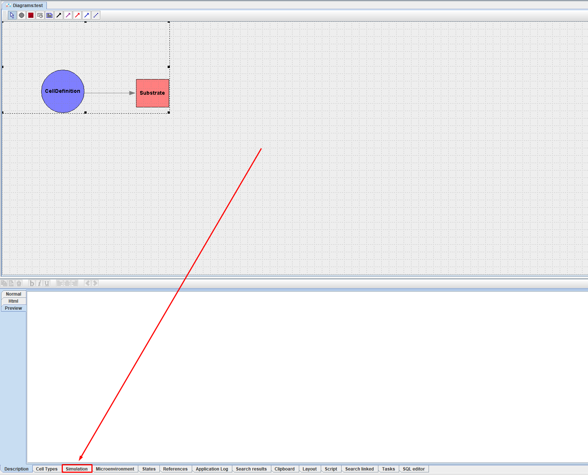
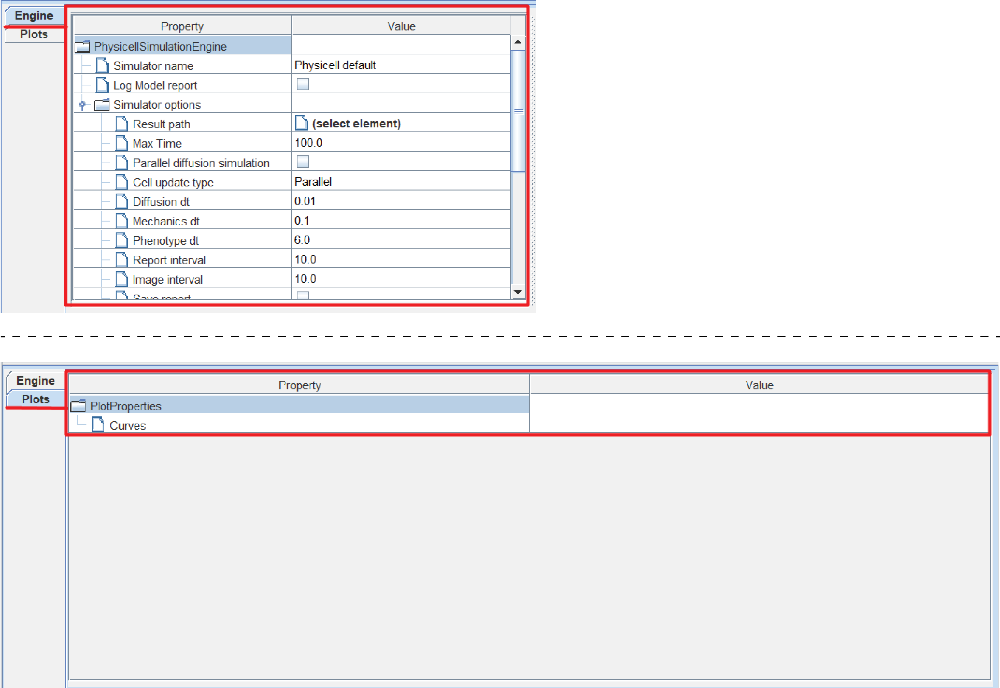
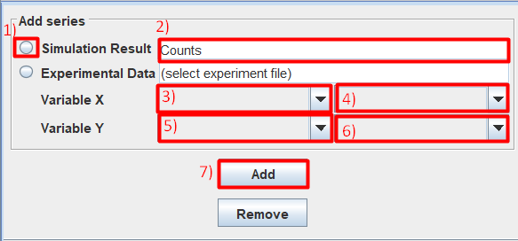
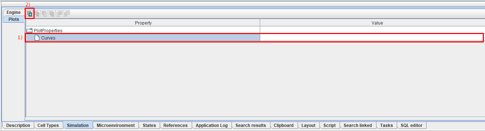

.. _Physicell_simulation:

Симуляция модели
================

.. role:: raw-html(raw)
   :format: html

.. |icon_generates_code_for_the_model_simulation_button| image:: /images/icons/Physicell/Generates_code_for_the_model_simulation_button.png
.. |icon_start_simulation_process| image:: /images/icons/Physicell/start_simulation_process.png
.. |icon_stop_simulation_process| image:: /images/icons/Physicell/stop_simulation_process.png
.. |icon_save_simulation_result| image:: /images/icons/Physicell/saves_simulation_result.png
.. |icon_open_plot_dialog| image:: /images/icons/Physicell/open_plot_dialog.png
.. |icon_clear_log| image:: /images/icons/Physicell/clear_log.png
.. |icon_option| image:: /images/icons/option.png
.. |icon_add_new| image:: /images/icons/Physicell/add_new.png
.. |icon_new_plot_document| image:: /images/icons/Physicell/new_plot_document.png
.. |icon_not_selected_point| image:: /images/icons/Physicell/not_selected_point.png
.. |icon_selected_point| image:: /images/icons/Physicell/selected_point.png
.. |icon_import| image:: /images/icons/Physicell/import.png
.. |icon_3_points_button| image:: /images/icons/Physicell/3_points_button.png
.. |icon_table| image:: /images/icons/Physicell/table.png
.. |icon_opened_folder| image:: /images/icons/Physicell/opened_folder.png
.. |icon_edit_specification_button| image:: /images/icons/Physicell/edit_specification_button.png
.. |icon_Java_code| image:: /images/icons/Physicell/Java_code.png

Чтобы настроить и запустить симуляцию модели нужно нажать ЛКМ на вкладку **Simulation** :ref:`(Рисунок 1) <Physicell_simulation_Pic.1>`.

.. _Physicell_simulation_Pic.1:

   Рисунок 1. Открытие вкладки симуляции модели.

После этого в правом нижнем углу экрана у вас появится панель для настройки симуляции модели :ref:`(Рисунок 2) <Physicell_simulation_Pic.2>`.

.. _Physicell_simulation_Pic.2:

   Рисунок 2. Вкладка симуляции модели.

На этой вкладке можно выделить несколько областей :ref:`(Рисунок 3) <Physicell_simulation_Pic.3>`:

- кнопки для управления процессом симуляции,
- вкладки для настройки параметров симуляции (Engine) и добавления переменных для вывода на график (Plots),
- область редактирования параметров симуляции (Engine) и добавления переменных для вывода на график (Plots),
- область вывода логов.

.. _Physicell_simulation_Pic.3:

.. figure:: images/Physicell/Physicell_simulation/Simulation_panel_composition.png
   :width: 100%
   :alt: Simulation_panel_composition
   :align: center

   Рисунок 3. Области вкладки симуляции модели. А) кнопки для управления процессом симуляции, Б) вкладки для настройки параметров симуляции (Engine) и добавления переменных для вывода на график (Plots), В) область редактирования параметров симуляции и добавления переменных для вывода на график, Г) область вывода логов.

Далее мы подробно разберем каждую из этих областей.

Кнопки для управления процессом симуляции
-----------------------------------------

Кнопки для управления процессом симуляции располагаются в самом верху панели настройки симуляции :ref:`(Рисунок 4) <Physicell_simulation_Pic.4>`.

.. _Physicell_simulation_Pic.4:

   Рисунок 4. Кнопки для управления процессом симуляции.

Всего имеется 6 кнопок для управления процессом симуляции:

- |icon_generates_code_for_the_model_simulation_button| :raw-html:`«<strong><u>Generates code for the model simulation</u></strong>»`: генерирует код для симуляции модели,
- |icon_start_simulation_process| :raw-html:`«<strong><u>Start_simulation_process</u></strong>»`: запустить симуляцию,
- |icon_stop_simulation_process| :raw-html:`«<strong><u>Stop_simulation_process</u></strong>»`: остановить симуляцию,
- |icon_save_simulation_result| :raw-html:`«<strong><u>Saves simulation results into the database</u></strong>»`: сохранить результаты симуляции в базу данных,
- |icon_open_plot_dialog| :raw-html:`«<strong><u>Opens plot dialog to visualise simulation results</u></strong>»`: открыть диалоговое окно для визуализации результатов симуляции,
- |icon_clear_log| :raw-html:`«<strong><u>Clear log</u></strong>»`: очистить логи.

Наведя курсор на любую из этих кнопок, можно получить подсказку о ее назначении.

.. note::
   Сразу после открытия вкладки Simulation кнопки |icon_stop_simulation_process|, |icon_save_simulation_result| и |icon_open_plot_dialog| будут неактивны.

Вкладки для настройки параметров симуляции (Engine) и добавления переменных для вывода на график (Plots)
--------------------------------------------------------------------------------------------------------

Вкладки для настройки параметров симуляции (Engine) и добавления переменных для вывода на график (Plots) находятся в левой части панели настройки симуляции :ref:`(Рисунок 5) <Physicell_simulation_Pic.5>`.

.. _Physicell_simulation_Pic.5:

   Рисунок 5. Вкладки для настройки параметров симуляции (Engine) и добавления переменных для вывода на график (Plots).

Чтобы выбрать ту или иную вкладку нужно нажать на нее ЛКМ.

При переключении между вкладками изменяется набор параметров в области редактирования :ref:`(Рисунок 6) <Physicell_simulation_Pic.6>`.

.. _Physicell_simulation_Pic.6:

   Рисунок 6. Параметры для редактирования во вкладке Engine (А) и Plots (Б).

.. note::
   При переключении на вкладку Plots исчезает область вывода логов справа.

Область редактирования параметров симуляции и добавления переменных для вывода на график
----------------------------------------------------------------------------------------

Далее мы подробно разберем, какие параметры симуляции можно редактировать во вкладке :ref:`Engine <Physicell_simulation_Engine_parameters>` и как добавлять переменные для вывода на график во вкладке :ref:`Plots <Physicell_simulation_Plots_creation>`.

.. _Physicell_simulation_Engine_parameters:

Параметры вкладки Engine
------------------------

При переключении на вкладку Engine в области редактирования можно будет настроить следующие параметры :ref:`(Рисунок 7) <Physicell_simulation_Pic.7>`:

- **Simulator name**: :ref:`численный решатель <Physicell_simulation_Simulator_name>`,
- **Log Model report**: отметьте ☑, если хотите выводить :ref:`данные о модели в консоль перед началом расчетов <Physicell_simulation_Log_Model_report>`,
- **Result path**: путь в репозитории модуля для :ref:`сохранения результатов <Physicell_simulation_Result_path>`,
- **Max Time**: модельное время, до которого будет продолжаться симуляция,
- **Parallel diffusion simulation**: отметьте ☑, если хотите использовать распараллеливание расчетов при моделировании процессов диффузии веществ,
- **Cell update type**: :ref:`способ расчетов поведения отдельных клеток <Physicell_simulation_Cell_update_type>`,
- **Diffusion dt**: шаг модельного времени для расчета диффузии веществ,
- **Mechanics dt**: шаг модельного времени, с которым происходит взаимодействие клеток друг с другом и веществами в среде,
- **Phenotype dt**: шаг модельного времени, с которым происходит обновление внутреннего состояния клеток,
- **Report interval**: шаг модельного времени, с которым выводится табличный отчет о состоянии модели при симуляции,
- **Image interval**: шаг модельного времени, с которым сохраняется визуальное отображение модели при симуляции,
- **Save report**: отметьте ☑, если хотите :ref:`сохранять таблицы <Physicell_simulation_Save_report>`,
- **Save cells data**: отметьте ☑, если хотите сохранять :ref:`данные о клетках в текстовых файлах <Physicell_simulation_Save_cells_data>`,
- **Save cells data as table**: отметьте ☑, если хотите сохранять :ref:`данные о клетках в таблицах <Physicell_simulation_Save_cells_data_as_table>`,
- **Save density**: отметьте ☑, если хотите сохранять :ref:`данные о веществах <Physicell_simulation_Save_density>`,
- **Save images**: отметьте ☑, если хотите сохранять :ref:`изображения модели в процессе симуляции <Physicell_simulation_Save_images>`,
- **Save GIF**: отметьте ☑, если хотите сохранять :ref:`GIF-изображение модели в процессе симуляции <Physicell_simulation_Save_GIF>`,
- **Save Video**: отметьте ☑, если хотите сохранять :ref:`видео модели в процессе симуляции <Physicell_simulation_Save_video>`,
- **Save plots**: отметьте ☑, если хотите :ref:`сохранять графики <Physicell_simulation_Save_plots>`,
- **Use manual seed**: отметьте ☑, если хотите использовать пользовательский seed для случайных процессов модели,
- **Manual seed**: пользовательский seed для случайных процессов модели,
- **Recalculate gradients**: отметьте ☑, если хотите пересчитывать градиенты веществ во время симуляции модели,
- **Track inner substrates in cells**: отметьте ☑, если хотите отслеживать содержание веществ внутри клеток во время симуляции модели,
- **Model type**: :ref:`тип модели <Physicell_simulation_Model_type>`.

.. _Physicell_simulation_Pic.7:

   Рисунок 7. Параметры для редактирования во вкладке Engine.

.. warning::
   Для симуляции диаграмм типа Physicell всегда используется движок PhysicellSimulationEngine (не редактируется).

Ниже мы рассмотрим некоторые из параметров вкладки Engine более детально.

.. _Physicell_simulation_Simulator_name:

Численный решатель (Simulator name)
~~~~~~~~~~~~~~~~~~~~~~~~~~~~~~~~~~~

Выбирается из раскрывающегося списка напротив поля |icon_option| **Simulator name**.

Доступен только один вариант: Physicell default.

.. _Physicell_simulation_Log_Model_report:

Вывод данных о модели в консоль (Log Model report)
~~~~~~~~~~~~~~~~~~~~~~~~~~~~~~~~~~~~~~~~~~~~~~~~~~

Если опция |icon_option| **Log Model report** НЕ включена, то при проведении симуляции в области вывода логов будет отображаться информация следующего вида:

.. code-block:: console
   :caption: Log Model report ☐

   INFO :  Analysis 'Simulation analysis' added to queue
   INFO :  Analysis 'Simulation analysis' started
   INFO :  [ 17:19:04 ] 	Elapsed	0.093	Time:	0	Cells	50
   INFO :  [ 17:19:04 ] 	Elapsed	0.248	Time:	10	Cells	50
   INFO :  [ 17:19:04 ] 	Elapsed	0.574	Time:	20	Cells	50
   INFO :  [ 17:19:05 ] 	Elapsed	0.843	Time:	30	Cells	50
   INFO :  [ 17:19:05 ] 	Elapsed	1.161	Time:	40	Cells	50
   INFO :  [ 17:19:05 ] 	Elapsed	1.426	Time:	50	Cells	50
   INFO :  [ 17:19:05 ] 	Elapsed	1.701	Time:	60	Cells	50
   INFO :  [ 17:19:06 ] 	Elapsed	1.966	Time:	70	Cells	50
   INFO :  [ 17:19:06 ] 	Elapsed	2.24	Time:	80	Cells	50
   INFO :  [ 17:19:06 ] 	Elapsed	2.523	Time:	90	Cells	50
   INFO :  [ 17:19:07 ] 	Elapsed	2.798	Time:	100	Cells	50
   INFO :  Analysis 'Simulation analysis' finished (3.01 s)

То есть будет указано, что задача (в данном случае, Simulation analysis) добавлена в очередь на выполнение:

.. code-block:: console

   INFO :  Analysis 'Simulation analysis' added to queue

То, что задача началась:

.. code-block:: console

   INFO :  Analysis 'Simulation analysis' started

Информация о каждом шаге симуляции модели:

.. code-block:: console

   INFO :  [ 17:19:04 ] 	Elapsed	0.093	Time:	0	Cells	50

А именно:

- время, когда данный шаг завершился ([ 17:19:04 ]),
- сколько всего прошло времени с момента начала выполнения задачи (Elapsed	0.093),
- модельное время на данном шаге симуляции (Time:	0),
- общее количество клеток в модели на данном шаге симуляции (Cells	50).

И то, что задача завершилась, а также ее общее время выпонения:

.. code-block:: console

   INFO :  Analysis 'Simulation analysis' finished (3.01 s)

Если опция |icon_option| **Log Model report** включена, то при проведении симуляции в области вывода логов будет отображаться информация следующего вида:

.. code-block:: console
   :caption: Log Model report ☑

   INFO :  Analysis 'Simulation analysis' added to queue
   INFO :  Analysis 'Simulation analysis' started
   INFO :  [ 18:06:06 ] ================================
   Simulation Options
   ================================
	   Maximum Time: 100.0	Save interval 0.0	Seed -45786084958200968	Cell update: Parallel	Diffusion: Implicit 3-D LOD with Thomas Algorithm

   ================================
   Microenvironment summary: unnamed:
   ================================

   Uniform Cartesian Mesh
   --------------------------------
	   [-500.0,500.0]x[-500.0,500.0]x[-10.0,10.0] micron
	   Resolution: dx = 20.0,	voxels: 2500,	voxel faces: 0,	volume: 2.0E7

   Densities: (1 total)
   --------------------------------
	   0. Substrate:	initial: 10.0	diffusion: 10.0	decay: 0.5

   Cell Types: ( 1 total)
   --------------------------------
	   0. CellDefinition # 50

   ================================
	   CellDefinition (0)
   ================================

   Cycle Model: Live (5)
   --------------------------------
	   Live* -> Live*, duration: 1389.0 min

   Death models: 
   --------------------------------
	   0 : Apoptosis (100), rate 5.316666666666667E-5 1/min
		   Apoptotic -> Debris, duration 516.0 min
	   1 : Necrosis (101), rate 0.0 1/min
		   Necrotic (swelling) -> Necrotic (lysed), duration 0.0 min
		   Necrotic (lysed) -> Debris, duration 86400.0 min

   Motility
   --------------------------------
	   In 3D, speed: 5.0 micron/min, bias: 0.5, persistence: 1.0 min

   Secretion:
   --------------------------------
	   Secretes Substrate, rate 5.0

   Interactions Disabled.
   --------------------------------

   Transformations Disabled.
   --------------------------------

   Mechanics:
   --------------------------------
	   cell_cell_adhesion_strength: 0.4
	   cell_cell_repulsion_strength: 10.0
	   rel max adhesion dist: 1.25
	   cell_BM_adhesion_strength: 4.0
	   cell_BM_repulsion_strength: 100.0
	   attachment_elastic_constant: 0.01
	   attachment_rate: 0.0
	   detachment_rate: 0.0

   Volume:
   --------------------------------
	   total volume: 2494.0
	   nuclear: 540.0
	   fluid fraction: 0.75
	   fluid change rate: 0.05
	   cytoplasmic biomass change_rate: 0.0045000000000000005
	   nuclear biomass_change rate: 0.0055000000000000005
	   calcification rate: 0.0
	   relative rupture volume: 4988.0

   Key functions: 
   --------------------------------
	   Custom rule: Avoid microenvironment boundaries
	   Phenotype rule: Default O2-based phenotype: cell division and necrosis are based on oxygen density
	   Volume update function: Standard volume update.
	   Mechanics function: Standard velocity: cell-cell adhesion + biased motility

   Custom data: 
   --------------------------------
	   A: 1.0 

   ================================
   Global parameters
   ================================
   INFO :  [ 18:06:06 ] 	Elapsed	0.068	Time:	0	Cells	50
   INFO :  [ 18:06:06 ] 	Elapsed	0.369	Time:	10	Cells	50
   INFO :  [ 18:06:07 ] 	Elapsed	0.746	Time:	20	Cells	50
   INFO :  [ 18:06:07 ] 	Elapsed	1.085	Time:	30	Cells	50
   INFO :  [ 18:06:07 ] 	Elapsed	1.396	Time:	40	Cells	50
   INFO :  [ 18:06:08 ] 	Elapsed	1.698	Time:	50	Cells	50
   INFO :  [ 18:06:08 ] 	Elapsed	2.012	Time:	60	Cells	50
   INFO :  [ 18:06:08 ] 	Elapsed	2.286	Time:	70	Cells	50
   INFO :  [ 18:06:09 ] 	Elapsed	2.572	Time:	80	Cells	50
   INFO :  [ 18:06:09 ] 	Elapsed	2.909	Time:	90	Cells	50
   INFO :  [ 18:06:09 ] 	Elapsed	3.202	Time:	100	Cells	50
   INFO :  Analysis 'Simulation analysis' finished (3.522 s)

То есть помимо основной информации о симуляции (**Global parameters**, которая отображается при выключенной опции Log Model report), будут также выводиться дополнительные данные, а именно:

- параметры симуляции (**Simulation Options**),
- отчет об общих свойствах модели (**Microenvironment summary**),
- характеристика каждого типа клеток в модели (в данном случае, в модели присутствуют только клетки с названием **CellDefinition**).

.. _Physicell_simulation_Result_path:

Путь для сохранения результатов (Result path)
~~~~~~~~~~~~~~~~~~~~~~~~~~~~~~~~~~~~~~~~~~~~~

Чтобы выбрать в репозитории путь для сохранения результатов симуляции, нужно напротив поля |icon_option| **Result path** нажать ЛКМ на |icon_option| **(select element)**.

После этого в появившемся окне, нужно:

- напротив поля **Collection:** выбрать папку, в которой должен сохраниться результат,
- напротив поля **Name:** ввести название папки с результатами симуляции,
- нажать **Ok** :ref:`(Рисунок 8) <Physicell_simulation_Pic.8>`.

.. _Physicell_simulation_Pic.8:

   Рисунок 8. Выбор директории для сохранения результатов симуляции.

После этого напротив поля |icon_option| **Result path** будет отображаться выбранный вами путь в репозитории, куда сохранятся результаты симуляции.

.. _Physicell_simulation_Cell_update_type:

Способ расчетов поведения отдельных клеток (Cell update type)
~~~~~~~~~~~~~~~~~~~~~~~~~~~~~~~~~~~~~~~~~~~~~~~~~~~~~~~~~~~~~

Выбирается из раскрывающегося списка напротив поля |icon_option| **Cell update type**.

Доступно 3 варианта:

- **Default**: расчеты для отдельных клеток проходят последовательно,
- **Parallel**: расчеты для отдельных клеток проходят параллельно друг от друга (*рекомендуется*),
- **Experimental**: экспериментальный режим в котором порядок проведения расчетов поведения клеток изменен для максимальной производительности (в данный момент проходит тестирование).

.. _Physicell_simulation_Save_report:

Сохранение таблиц (Save report)
~~~~~~~~~~~~~~~~~~~~~~~~~~~~~~~

Если опция |icon_option| **Save report** включена, то после завершения симуляции в директории с результатами у вас будет находиться папка с названием **Reports**.

В этой папке находятся таблицы с названием **Report_[модельное время]**. Значение модельного времени, указанное в названии, говорит о том, через сколько временных единиц после начала симуляции была сгенерирована данная таблица.

Количество таблиц будет зависеть от значений параметров **Max Time** и **Report interval** (см. пример ниже).

.. code-block:: text
   :caption: Пример

   Report interval = 10 (таблицы сохраняются через каждые 10 модельных временных единиц).
   Max Time = 100 (симуляция длится 100 модельных временных единиц).

   Таблицы в папке Reports:
   - Report_0000,
   - Report_0010,
   - Report_0020,
   - Report_0030,
   - Report_0040,
   - Report_0050,
   - Report_0060,
   - Report_0070,
   - Report_0080,
   - Report_0090,
   - Report_0100.

В этих таблицах для каждой клетки в модели представлены следующие данные:

- **ID**: уникальный идентификатор каждой клетки,
- **X**: координата клетки по оси X,
- **Y**: координата клетки по оси Y,
- **Z**: координата клетки по оси Z,
- **Cicle**: тип жизненного цикла клетки,
- **Elapsed**: время, проведенное клеткой в текущей фазе жизненного цикла.

Пример такой таблицы представлен ниже:

+----+-----+----------------------+----------------------+-----+--------+----------+
|    | ID  | X                    | Y                    | Z   | Cycle  | Elapsed  |
+====+=====+======================+======================+=====+========+==========+
| 1  | 0   | 12.096251085940921   | 54.53590904181374    | 0.0 | Live   | 0.0      |
+----+-----+----------------------+----------------------+-----+--------+----------+
| 2  | 1   | -16.7529715238615    | 487.780772942137     | 0.0 | Live   | 0.0      |
+----+-----+----------------------+----------------------+-----+--------+----------+
| 3  | 2   | 434.88945411017      | -235.8628174833683   | 0.0 | Live   | 0.0      |
+----+-----+----------------------+----------------------+-----+--------+----------+
| 4  | 3   | -317.708977450963    | 70.60607004897084    | 0.0 | Live   | 0.0      |
+----+-----+----------------------+----------------------+-----+--------+----------+
| 5  | 4   | 297.12023289402      | -104.06874944129022  | 0.0 | Live   | 0.0      |
+----+-----+----------------------+----------------------+-----+--------+----------+
| 6  | 5   | 498.91499172254876   | -157.9085845799884   | 0.0 | Live   | 0.0      |
+----+-----+----------------------+----------------------+-----+--------+----------+
| 7  | 6   | -82.9177958205822    | 92.277904605043      | 0.0 | Live   | 0.0      |
+----+-----+----------------------+----------------------+-----+--------+----------+
| 8  | 7   | 398.6983928720833    | -41.58404501726561   | 0.0 | Live   | 0.0      |
+----+-----+----------------------+----------------------+-----+--------+----------+
| 9  | 8   | 164.77007610049      | 318.61148406086864   | 0.0 | Live   | 0.0      |
+----+-----+----------------------+----------------------+-----+--------+----------+
| 10 | 9   | 986.6954360545525    | 292.7179524650729    | 0.0 | Live   | 0.0      |
+----+-----+----------------------+----------------------+-----+--------+----------+

.. _Physicell_simulation_Save_cells_data:

Сохранение данных о клетках в текстовых файлах (Save cells data)
~~~~~~~~~~~~~~~~~~~~~~~~~~~~~~~~~~~~~~~~~~~~~~~~~~~~~~~~~~~~~~~~

Если опция |icon_option| **Save cells data** включена, то после завершения симуляции в директории с результатами у вас будет находиться папка с названием **Cells**.

В этой папке находятся текстовые файлы с названием **Cells_[модельное время]**. Значение модельного времени, указанное в названии, говорит о том, через сколько временных единиц после начала симуляции был сгенерирован данный текстовый файл.

Количество текстовых файлов будет зависеть от значений параметров **Max Time** и **Image interval** (см. пример ниже).

.. code-block:: text
   :caption: Пример

   Image interval = 20 (текстовые файлы сохраняются через каждые 20 модельных временных единиц).
   Max Time = 100 (симуляция длится 100 модельных временных единиц).

   Текстовые файлы в папке Cells:
   - Cells_0000,
   - Cells_0020,
   - Cells_0040,
   - Cells_0060,
   - Cells_0080,
   - Cells_0100.

В этих текстовых файлах для каждой клетки в модели представлены следующие данные:

- **X**: координата клетки по оси X,
- **Y**: координата клетки по оси Y,
- **Z**: координата клетки по оси Z,
- **Radius**: радиус клетки,
- **r**: радиус ядра клетки,
- **Color1**: цвет, с помощью которого отрисовывается внутреннее содержимое клетки (Формат RGB),
- **Color2**: цвет, с помощью которого отрисовывается контур клетки (Формат RGB),
- **Color3**: цвет, с помощью которого отрисовывается внутреннее содержимое ядра клетки (Формат RGB),
- **Color4**: цвет, с помощью которого отрисовывается контур ядра клетки (Формат RGB).

.. note::
   Если в текстовом файле приведено значение **только Color1**, то считается, что:

   - ядро у клетки не отрисовывается,
   - контур клетки отрисовывается черным цветом [0,0,0],
   - все внутреннее содержимое клетки отрисовывается цветом Color1.

   Если в текстовом файле приведены значения **только Color1 и Color2**, то считается, что:

   - ядро у клетки не отрисовывается,
   - контур клетки отрисовывается цветом Color2,
   - все внутреннее содержимое клетки отрисовывается цветом Color1.

Пример такого текстового файла представлен ниже:

.. code-block:: text
   :caption: Пример текстового файла

   X       Y        Z     Radius r     Color1        Color2        Color3        Color4      
   410.4   -26.7    0.0   8.4    5.0   [128,128,128]                                        
   -298.1  95.8     0.0   8.4    5.0   [128,128,128]                                        
   280.3   -119.7   0.0   8.4    5.0   [128,128,128]                                        
   179.5   248.1    0.0   8.4    5.0   [128,128,128]                                        
   500.1   -160.7   0.0   8.4    5.0   [128,128,128]                                        
   320.6   256.4    0.0   8.4    5.0   [128,128,128]                                        
   9.2     481.9    0.0   8.4    5.0   [128,128,128]                                        
   426.3   -212.8   0.0   8.4    5.0   [128,128,128]                                        
   41.0    65.2     0.0   8.4    5.0   [128,128,128]                                        
   -104.0  82.0     0.0   8.4    5.0   [128,128,128]                                        

.. _Physicell_simulation_Save_cells_data_as_table:

Сохранение данных о клетках в таблицах (Save cells data as table)
~~~~~~~~~~~~~~~~~~~~~~~~~~~~~~~~~~~~~~~~~~~~~~~~~~~~~~~~~~~~~~~~~

Если опция |icon_option| **Save cells data as table** включена, то после завершения симуляции в директории с результатами у вас будет находиться папка с названием **Cells tables**.

В этой папке находятся таблицы с названием **Cells_[модельное время]**. Значение модельного времени, указанное в названии, говорит о том, через сколько временных единиц после начала симуляции была сгенерирована данная таблица.

Количество таблиц будет зависеть от значений параметров **Max Time** и **Image interval** (см. пример ниже).

.. code-block:: text
   :caption: Пример

   Image interval = 20 (таблицы сохраняются через каждые 20 модельных временных единиц).
   Max Time = 100 (симуляция длится 100 модельных временных единиц).

   Таблицы в папке Cells tables:
   - Cells_0000,
   - Cells_0020,
   - Cells_0040,
   - Cells_0060,
   - Cells_0080,
   - Cells_0100.

В этих таблицах для каждой клетки в модели представлены те же данные, что и в текстовых файлах при :ref:`включенной опции Save cells data <Physicell_simulation_Save_cells_data>` (дополнительно указан ID для каждой клетки).

.. _Physicell_simulation_Save_density:

Сохранение данных о веществах (Save density)
~~~~~~~~~~~~~~~~~~~~~~~~~~~~~~~~~~~~~~~~~~~~

Если опция |icon_option| **Save density** включена, то после завершения симуляции в директории с результатами у вас будет находиться папка с названием **Density**.

В этой папке находятся таблицы с названием **Density_[модельное время]**. Значение модельного времени, указанное в названии, говорит о том, через сколько временных единиц после начала симуляции была сгенерирована данная таблица.

Количество таблиц будет зависеть от значений параметров **Max Time** и **Report interval** (см. пример ниже).

.. code-block:: text
   :caption: Пример

   Report interval = 10 (таблицы сохраняются через каждые 10 модельных временных единиц).
   Max Time = 50 (симуляция длится 50 модельных временных единиц).

   Таблицы в папке Density:
   - Density_0000,
   - Density_0010,
   - Density_0020,
   - Density_0030,
   - Density_0040,
   - Density_0050.

В этих таблицах для каждой :ref:`ячейки внешней среды <Physicell_microenvironment_Domain>` представлены следующие данные:

- **ID**: уникальный идентификатор каждой ячейки,
- **X**: координата ячейки по оси X,
- **Y**: координата ячейки по оси Y,
- **Z**: координата ячейки по оси Z,
- **[Субстрат 1]**: количество субстрата 1 в данной ячейке,
- **[Субстрат 2]**: количество субстрата 2 в данной ячейке,
- ...
- ...
- ...
- **[Субстрат n]**: количество субстрата n в данной ячейке.

.. note::
   В таблице для каждого субстрата модели будет своя колонка, где будет указано количество именно этого субстрата в данной ячейке.

Пример такой таблицы представлен ниже:

+-----+--------+--------+-----+------------+-------------+
| ID  | X      | Y      | Z   | Substrate  | Substrate_1 |
+=====+========+========+=====+============+=============+
| 1   | -490,0 | -490,0 | 0,0 | 0,005      | 100,0       |
+-----+--------+--------+-----+------------+-------------+
| 2   | -470,0 | -490,0 | 0,0 | 0,005      | 100,0       |
+-----+--------+--------+-----+------------+-------------+
| 3   | -450,0 | -490,0 | 0,0 | 0,005      | 100,0       |
+-----+--------+--------+-----+------------+-------------+
| 4   | -430,0 | -490,0 | 0,0 | 0,005      | 100,0       |
+-----+--------+--------+-----+------------+-------------+
| 5   | -410,0 | -490,0 | 0,0 | 0,005      | 100,0       |
+-----+--------+--------+-----+------------+-------------+
| ... | ...    | ...    | ... | ...        | ...         |
+-----+--------+--------+-----+------------+-------------+

▼ таблица продолжается ▼

.. _Physicell_simulation_Save_images:

Сохранение изображений модели в процессе симуляции (Save images)
~~~~~~~~~~~~~~~~~~~~~~~~~~~~~~~~~~~~~~~~~~~~~~~~~~~~~~~~~~~~~~~~

Если опция |icon_option| **Save images** включена, то после завершения симуляции в директории с результатами у вас будет находиться папка с названием **Image**.

В этой папке для каждого субстрата модели будет находиться отдельная папка с названием, соответствующим названию субстрата.

В каждой такой папке находятся изображения с названием **Figure_[модельное время]**. Значение модельного времени, указанное в названии, говорит о том, через сколько временных единиц после начала симуляции было сгенерировано данное изображение.

.. note::
   - В изображениях в одной папке отображается только субстрат с таким же названием, как и название этой папки (например, если в модели есть два субстрата ("A" и "B"), то после окончания симуляции в папке Image/A будут находиться изображения, на которых показан только субстрат "A", а в папке Image/B - только субстрат "B".
   - На изображениях клетки отрисовываются тем цветом, который вы им задали, а субстраты всегда изображаются красными квадратами.
   - Чем больше субстрата в определенной ячейке среды, тем более ярким оттенком красного она будет закрашена (отрисовывается относительно ячейки с максимальным содержанием субстрата в данный момент).

Количество изображений в каждой папке будет зависеть от значений параметров **Max Time** и **Image interval** (см. пример ниже).

.. code-block:: text
   :caption: Пример

   Image interval = 20 (изображения сохраняются через каждые 20 модельных временных единиц).
   Max Time = 100 (симуляция длится 100 модельных временных единиц).

   Изображения в папке Image:
   - Figure_0000,
   - Figure_0020,
   - Figure_0040,
   - Figure_0060,
   - Figure_0080,
   - Figure_0100.

Пример таких изображений представлен на :ref:`рисунке 9 <Physicell_simulation_Pic.9>`.

.. _Physicell_simulation_Pic.9:

   Рисунок 9. Изображения модели в процессе симуляции.

.. note::
   В верхней правой части каждого рисунка обозначено через сколько временных единиц после начала симуляции было сгенерировано данное изображение (**Time**), сколько клеток находится в модели (**Cells**) и по какому срезу внешнего пространства по оси Z сделано данное изображение (**Z**).

.. _Physicell_simulation_Save_GIF:

Сохранение GIF-изображения модели в процессе симуляции (Save GIF)
~~~~~~~~~~~~~~~~~~~~~~~~~~~~~~~~~~~~~~~~~~~~~~~~~~~~~~~~~~~~~~~~~

Если опция |icon_option| **Save GIF** включена, то после завершения симуляции в директории с результатами у вас будет находиться папка с названием **Video**.

В этой папке для каждого субстрата модели будет находиться свое GIF-изображение, на котором будут отображаться клетки и только субстрат с названием, аналогичным названию изображения.

.. note::
   - На изображениях клетки отрисовываются тем цветом, который вы им задали, а субстраты всегда изображаются красными квадратами.
   - Чем больше субстрата в определенной ячейке среды, тем более ярким оттенком красного она будет закрашена (отрисовывается относительно ячейки с максимальным содержанием субстрата в данный момент).

Количество кадров в каждом GIF-изображении будет зависеть от значений параметров **Max Time** и **Image interval** (см. пример ниже).

.. code-block:: text
   :caption: Пример

   Image interval = 20 (кадры сохраняются через каждые 20 модельных временных единиц).
   Max Time = 1000 (симуляция длится 1000 модельных временных единиц).

   Кадры в GIF-изображении будут генерироваться для следущих временных точек при симуляции модели:
   - 0,
   - 20,
   - 40,
   - 60,
   - ...,
   - ...,
   - ...,
   - 1000.

Пример такого GIF-изображения представлен на :ref:`рисунке 10 <Physicell_simulation_Pic.10>`.

.. _Physicell_simulation_Pic.10:

.. figure:: images/Physicell/Physicell_simulation/Save_GIF.gif
   :width: 100%
   :alt: Save_GIF
   :align: center

   Рисунок 10. GIF-изображение модели в процессе симуляции.

.. note::
   В верхней правой части GIF-изображения обозначено через сколько временных единиц после начала симуляции был сгенерирован данный кадр (**Time**), сколько клеток находится в модели (**Cells**) и по какому срезу внешнего пространства по оси Z сделано данное изображение (**Z**).

.. warning::
   При использовании Standalone-версии BioUML, при **экспорте GIF-изображения** необходимо указать расширение (**.gif**) в названии файла, иначе файл экспортируется без расширения.

.. _Physicell_simulation_Save_video:

Сохранение видео модели в процессе симуляции (Save Video)
~~~~~~~~~~~~~~~~~~~~~~~~~~~~~~~~~~~~~~~~~~~~~~~~~~~~~~~~~

Если опция |icon_option| **Save Video** включена, то после завершения симуляции в директории с результатами у вас будет находиться папка с названием **Video**.

В этой папке для каждого субстрата модели будет находиться свое видео, на котором будут отображаться клетки и только субстрат с названием, аналогичным названию видео.

.. note::
   - На видео клетки отрисовываются тем цветом, который вы им задали, а субстраты всегда изображаются красными квадратами.
   - Чем больше субстрата в определенной ячейке среды, тем более ярким оттенком красного она будет закрашена (отрисовывается относительно ячейки с максимальным содержанием субстрата в данный момент).

Количество кадров в каждом видео будет зависеть от значений параметров **Max Time** и **Image interval** (см. пример ниже).

.. code-block:: text
   :caption: Пример

   Image interval = 20 (кадры сохраняются через каждые 20 модельных временных единиц).
   Max Time = 1000 (симуляция длится 1000 модельных временных единиц).

   Кадры в видео будут генерироваться для следущих временных точек при симуляции модели:
   - 0,
   - 20,
   - 40,
   - 60,
   - ...,
   - ...,
   - ...,
   - 1000.

Пример такого видео представлен ниже.

:raw-html:` `

.. note::
   В верхней правой части видео обозначено через сколько временных единиц после начала симуляции был сгенерирован определенный кадр (**Time**), сколько клеток находится в модели (**Cells**) и по какому срезу внешнего пространства по оси Z сделан данный кадр (**Z**).

.. warning::
   При использовании Standalone-версии BioUML при **экспорте видео** необходимо указать расширение (**.mp4**) в названии файла, иначе файл экспортируется без расширения.

.. _Physicell_simulation_Save_plots:

Сохранение графиков (Save plots)
~~~~~~~~~~~~~~~~~~~~~~~~~~~~~~~~

.. warning::
   Перед изучением данного раздела рекомендуется ознакомиться с принципами добавления переменных для вывода на график во вкладке :ref:`Plots <Physicell_simulation_Plots_creation>`.

Если опция |icon_option| **Save plots** включена, то после завершения симуляции в директории с результатами у вас будет находиться файл |icon_option| **Counts**.

Этот файл содержит данные о симуляции модели.

Чтобы на основе этого файла построить график нужно:

- нажать ПКМ на |icon_option| **Counts**,
- в раскрывшемся списке нажать ЛКМ на |icon_new_plot_document| **New plot document** :ref:`(Рисунок 11) <Physicell_simulation_Pic.11>`.

.. _Physicell_simulation_Pic.11:

   Рисунок 11. Создание графика на основе файла Counts.

После этого в правой верхней части экрана у вас появится пустой график :ref:`(Рисунок 12) <Physicell_simulation_Pic.12>`.

.. _Physicell_simulation_Pic.12:

   Рисунок 12. Пустой график.

Чтобы добавить на него какие-либо переменные (предварительно созданные во вкладке :ref:`Plots <Physicell_simulation_Plots_creation>`) или экспериментальные данные, нужно перейти во вкладку **Plot editor**, расположенную снизу :ref:`(Рисунок 13) <Physicell_simulation_Pic.13>`.

.. _Physicell_simulation_Pic.13:

   Рисунок 13. Вкладка Plot editor для редактирования графика.

После этого в правом нижнем углу появится меню для редактирования графика :ref:`(Рисунок 14) <Physicell_simulation_Pic.14>`.

.. _Physicell_simulation_Pic.14:

   Рисунок 14. Меню для редактирования графика.

В этом меню можно выделить 3 основные части:

- часть для добавления переменных и экспериментальных данных,
- часть для редактирования общего вида графика,
- часть для редактирования добавленных переменных и экспериментальных данных :ref:`(Рисунок 15) <Physicell_simulation_Pic.15>`.

.. _Physicell_simulation_Pic.15:

   Рисунок 15. Части меню для редактирования графика: А) часть для добавления переменных и экспериментальных данных, Б) часть для редактирования общего вида графика, В) часть для редактирования добавленных переменных и экспериментальных данных.

Часть для добавления переменных и экспериментальных данных
""""""""""""""""""""""""""""""""""""""""""""""""""""""""""

В части для добавления переменных и эксперименальных данных можно делать следующее:

:raw-html:`<u>1. Добавлять переменные</u>`.

Для этого нужно:

- нажать ЛКМ на значок |icon_not_selected_point| слева от **Simulation Result** (значок изменится на |icon_selected_point|),
- нажать ЛКМ на поле справа от **Simulation Result** и в появившемся окне выбрать файл с данными о симуляции модели (сразу будет выбран файл **Counts**, на основе которого был создан график),
- нажать ЛКМ на *первое* поле справа от **Variable X** и из раскрывающегося списка выбрать модуль модели, в котором находится переменная оси X (:raw-html:`если переменная находится на самом верхнем уровне многомодульной модели или если модель не содержит модулей, то данное поле следует оставить пустым`),
- нажать ЛКМ на *второе* поле справа от **Variable X** и из раскрывающегося списка выбрать параметр модели, значения которого будут отображаться по оси X (по умолчанию - time),
- нажать ЛКМ на *первое* поле справа от **Variable Y** и из раскрывающегося списка выбрать модуль модели, в котором находится переменная оси Y (:raw-html:`если переменная находится на самом верхнем уровне многомодульной модели или если модель не содержит модулей, то данное поле следует оставить пустым`),
- нажать ЛКМ на *второе* поле справа от **Variable Y** и из раскрывающегося списка выбрать параметр модели, значения которого будут отображаться по оси Y (переменные, созданные во вкладке :ref:`Plots <Physicell_simulation_Plots_creation>`),
- нажать ЛКМ на кнопку **Add** :ref:`(Рисунок 16) <Physicell_simulation_Pic.16>`.

.. _Physicell_simulation_Pic.16:

   Рисунок 16. Добавление переменной на график.

После этого на графике появится кривая зависимости переменной на оси Y от параметра на оси X, а также обозначение этой кривой в легенде (названа также, как и переменная оси Y) :ref:`(Рисунок 17) <Physicell_simulation_Pic.17>`.

.. _Physicell_simulation_Pic.17:

   Рисунок 17. Кривая на графике.

Таким образом на график можно добавлять сколько угодно переменных.

:raw-html:`<u>2. Добавлять экспериментальные данные</u>`.

Прежде чем добавлть экспериментальные данные на график, нужно их импортировать в BioUML.

Для этого нужно сделать следующее:

- создать таблицу на своем компьютере (\*.txt, \*.xls, \*.xlsx, \*.tab и т.п.). Пример такой таблицы приведен ниже.

+-------+---------------+
| time  | Fed_cells_exp |
+=======+===============+
| 0     | 0             |
+-------+---------------+
| 10    | 10            |
+-------+---------------+
| 20    | -10           |
+-------+---------------+
| 30    | -15           |
+-------+---------------+
| 40    | 0             |
+-------+---------------+
| 50    | 20            |
+-------+---------------+
| 60    | 25            |
+-------+---------------+
| 70    | 30            |
+-------+---------------+
| 80    | 25            |
+-------+---------------+
| 90    | 0             |
+-------+---------------+
| 100   | -15           |
+-------+---------------+

- в репозитории в BioUML нажать ПКМ на директорию, в которую вы хотите импортировать таблицу с экспериментальными данными,
- в раскрывшемся списке нажать ЛКМ на |icon_import| **Import element** :ref:`(Рисунок 18) <Physicell_simulation_Pic.18>`.

.. _Physicell_simulation_Pic.18:

   Рисунок 18. Импорт данных в BioUML.

После этого у вас появится окно, в котором нужно:

- нажать ЛКМ на кнопку |icon_3_points_button| справа от **File:**,
- в появившемся окне выбрать на своем компьютере таблицу с экспериментальными данными и нажать ЛКМ кнопку **Open**,
- из раскрывающегося списка справа от **Format:** выбрать **Tabular (\*.txt, \*.xls, \*.tab, etc.)**,
- нажать ЛКМ на кнопку **Import** :ref:`(Рисунок 19) <Physicell_simulation_Pic.19>`.

.. _Physicell_simulation_Pic.19:

   Рисунок 19. Выбор импортируемого файла.

После этого появится новое окно, в котором нужно настроить следующие параметры импортируемого файла :ref:`(Рисунок 20) <Physicell_simulation_Pic.20>`:

- **Name for table**: название таблицы (нужно придумать название, под которым таблица будет сохранена в репозитории BioUML),
- **Sheet name**: название листа Excel-таблицы, на котором располагается таблица с экспериментальными данными (:raw-html:`данный параметр имеется, только если импортируются файлы *.xls, *.xlsx`),
- **Use new XLS(X) converter**: отметьте ☑, если хотите использовать новый XLS(X) конвертер, который дает лучший результат при обработке пыстых ячеек (:raw-html:`данный параметр имеется, только если импортируются файлы *.xls, *.xlsx`),
- **Column delimiter**: разделитель столбцов (:raw-html:`данный параметр имеется, если импортируются НЕ *.xls, *.xlsx файлы`),
- **Process quotes**: отметьте ☑, если хотите удалять кавычки и игнорировать разделители внутри них в импортируемой таблице,
- **Header row index**: укажите номер строки таблицы, в которой располагаются названия колонок (строки нумеруются, начиная с 1),
- **First data row index**: укажите номер строки таблицы, с которой начинаются числовые данные (строки нумеруются, начиная с 1),
- **Comment prefix**: укажите какую-либо последовательность символов, и все строки импортируемой таблицы, которые начинаются с этой последовательности, не будут импортированы в BioUML (опционально),
- **Column for ID**: укажите колонку таблицы, значения которой будут использоваться как уникальные идентификаторы строк остальной таблицы,
- **Add suffixes to repeated ID**: отметьте ☑, если хотите добавлять суффиксы (_COPY_1, _COPY_2, и т.д.) к повторяющемся идентификаторам строк таблицы,
- **Type of the table**: тип таблицы,
- **Species**: виды, ассоциированные с данными в импортируемой таблице.

.. _Physicell_simulation_Pic.20:

   Рисунок 20. Настройка импорта файла в BioUML.
   
Чтобы выбрать значение определенного параметра, нужно отметить ☑, вписать собственное значение или выбрать одно из доступных в раскрывающемся списке значений.

После завершения настройки, нажмите ЛКМ кнопку **Ok**.

После этого в указанной директории у вас появится таблица (обозначается значком |icon_table|), которую можно открыть, нажав на нее 2 раза ЛКМ или нажав на нее ПКМ и в раскрывающемся списке нажав ЛКМ на |icon_opened_folder| **Open**.

Теперь можно добавить импортированные эксперименальные данные на график. Для этого нужно:

- нажать ЛКМ на значок |icon_not_selected_point| слева от **Experimental Data** (значок изменится на |icon_selected_point|),
- нажать ЛКМ на поле **(select experimental file)** справа от **Experimental Data** и выбрать импортированную таблицу с экспериментальными данными,
- нажать ЛКМ на *второе* поле справа от **Variable X** и из раскрывающегося списка выбрать колонку таблицы, значения которой будут отображаться по оси X,
- нажать ЛКМ на *второе* поле справа от **Variable Y** и из раскрывающегося списка выбрать колонку таблицы, значения которой будут отображаться по оси Y,
- нажать ЛКМ на кнопку **Add** :ref:`(Рисунок 21) <Physicell_simulation_Pic.21>`.

.. note::
   При добавлении экспериментальных данных *первые* поля справа от **Variable X** и **Variable Y** следует оставить пустыми.

.. _Physicell_simulation_Pic.21:

   Рисунок 21. Добавление экспериментальных данных на график.

После этого на графике появятся точки, обозначающие экспериментальные данные, и соответствующий им элемент в легенде :ref:`(Рисунок 22) <Physicell_simulation_Pic.22>`.

.. _Physicell_simulation_Pic.22:

   Рисунок 22. Экспериментальные данные в виде точек на графике.

Таким образом на график можно добавлять сколько угодно экспериментальных данных.

Часть для редактирования добавленных переменных и экспериментальных данных
""""""""""""""""""""""""""""""""""""""""""""""""""""""""""""""""""""""""""

В части для редактирования добавленных переменных и экспериментальных данных можно настраивать то, как переменные и экспериментальные данные будут отображаться на графике, а также удалять их.

Каждой добавленной переменной или эксперименту соответствует одна строка в таблице.

В данной части можно делать следующее:

:raw-html:`<u>1. Удалять переменные или экспериментальные данные</u>`.

Для удаления нужно сделать следующее:

- нажать ЛКМ на строку, соответствующую переменной или экспериментальным данным, которые нужно удалить,
- надать ЛКМ кнопку **Remove** в части для добавления переменных и экспериментальных данных :ref:`(Рисунок 23) <Physicell_simulation_Pic.23>`.

.. _Physicell_simulation_Pic.23:

   Рисунок 23. Удаление переменной или эксперимента с графика.

:raw-html:`<u>2. Изменять подпись переменных или экспериментальных данных в легенде графика</u>`.

Для изменения легенды нужно:

- найти строку, соответствующую нужной переменной или эксперименту,
- в этой строке в колонке **Legend** вписать новое обозначение в легенде,
- нажать **Enter**.

:raw-html:`<u>3. Изменять цвет, ширину и тип линии на графике</u>`.

Для изменения цвета, ширины и типа линии на графике нужно:

- найти строку, соответствующую нужной переменной или эксперименту,
- в этой строке в колонке **Specification+** нажать ЛКМ на кнопку |icon_edit_specification_button|,
- в появившемся окне выбрать цвет (|icon_option| **Color**), толщину (|icon_option| **Width**) и тип (|icon_option| **Stroke**) линии,
- нажать ЛКМ на кнопку **Ok**.

.. warning::
   У экспериментальных данных на графике можно изменить только цвет точек.

Часть для редактирования общего вида графика
""""""""""""""""""""""""""""""""""""""""""""

В части для редактирования общего вида графика можно настраивать следующие параметры :ref:`(Рисунок 24) <Physicell_simulation_Pic.24>`:

- **Title**: название графика,
- **Description**: описнаие графика,
- **X axis title**: подпись оси X,
- **X axis title font**: вид, стиль, размер и цвет шрифта подписи оси X,
- **X axis tick font**: вид, стиль, размер и цвет шрифта подписей делений на оси X,
- **X axis type**: тип оси X,
- **X axis auto range**: отметьте ☑, если хотите, чтобы диапазон значений оси X определялся автоматически,
- **X: from**: минимальное значение оси X (:raw-html:`выбирается, если НЕ отмечено поле X axis auto range`),
- **X: to**: максимальное значение оси X (:raw-html:`выбирается, если НЕ отмечено поле X axis auto range`),
- **Y axis title**: подпись оси Y,
- **Y axis title font**: вид, стиль, размер и цвет шрифта подписи оси Y,
- **Y axis tick font**: вид, стиль, размер и цвет шрифта подписей делений на оси Y,
- **Y axis type**: тип оси Y,
- **Y axis auto range**: отметьте ☑, если хотите, чтобы диапазон значений оси Y определялся автоматически,
- **Y: from**: минимальное значение оси Y (:raw-html:`выбирается, если НЕ отмечено поле Y axis auto range`),
- **Y: to**: максимальное значение оси Y (:raw-html:`выбирается, если НЕ отмечено поле Y axis auto range`).

.. _Physicell_simulation_Pic.24:

   Рисунок 24. Параметры в части для редактирования общего вида графика.

Чтобы настроить значение определенного параметра, нужно нажать ЛКМ справа от соответствующего поля и отметить ☑, вписать собственное значение или выбрать одно из доступных в появившемся окне значений.

.. _Physicell_simulation_Model_type:

Тип модели (Model type)
~~~~~~~~~~~~~~~~~~~~~~~

Выбирается из раскрывающегося списка напротив поля |icon_option| **Model type**.

Доступно два варианта: **Default** и **Covid**.

Вариант **Covid** используется только для проведения симуляции модели короновируса. Для проведения симуляции других моделей используется вариант **Default**. 

.. _Physicell_simulation_Plots_creation:

Добавление переменных для вывода на график (Plots)
--------------------------------------------------

При переключении на вкладку Plots в области редактирования можно добавить те переменные, которые вы хотите отображать на графике. Для этого нужно:

- нажать ЛКМ на строку с |icon_option| **Curves**,
- нажать ЛКМ на значок |icon_add_new| :ref:`(Рисунок 25) <Physicell_simulation_Pic.25>`.

.. _Physicell_simulation_Pic.25:

   Рисунок 25. Добавление переменных для отображения на графике.

Таким образом можно добавить сколько угодно переменных.

После этого появится вкладка со своим порядковм номером (начиная с [0]). В этой вкладке нужно описать переменную, которую вы хотите выводить на график. Для описания переменной используется 5 полей в этой вкладке :ref:`(Рисунок 26) <Physicell_simulation_Pic.26>`:

- **Name**: название переменной,
- **Cell type**: тип клеток,
- **Signal**: сигнал,
- **Relation**: отношение клеток к сигналу,
- **Value**: пороговое значение сигнала.

.. _Physicell_simulation_Pic.26:

   Рисунок 26. Поля для описания переменной.

.. note::
   - Чтобы задать значение полей Cell type, Signal и Relation нужно нажать ЛКМ справа от соответствующей иконки и из раскрывающегося списка выбрать нужный вариант.
   - Сначала нужно указать значение поля Cell type, а потом - Signal (в раскрывающемся списке напротив поля Signal не будет ни одного значения, если поле Cell type еще не заполнено).
   - Чтобы задать значение полей Name и Value, нужно нажать ЛКМ справа от соответствующей иконки и вписать свое значение.

Рассмотрим, как работает описание переменной с помощью этих 5 полей, на представленном ниже примере:

.. code-block:: text
   :caption: Пример описания переменной

   Name = Fed_cells,
   Cell type = Amoeba,
   Signal = Food,
   Relation = ">",
   Value = 10.

   Это означает, что на графике будет показано значение переменной Fed_cells (Name),
   которая соответствует количеству клеток типа Amoeba (Cell type), потребивших субстрат
   с названием Food (Signal) в количестве большем (Relation), чем 10 (Value).

   Аналогичным образом можно задавать любые переменные.

В раскрывающемся списке напротив поля **Cell type** доступны все типы клеток модели.

В раскрывающемся списке напротив поля **Signal** доступны различные вещества, реакции, взаимодействия между клетками и т.п.

В раскрывающемся списке напротив поля **Relation** доступны следующие математические знаки: "<" (меньше), "<=" (меньше или равно), ">=" (больше или равно) и ">" (больше).

Для работы с уже существующими переменными используйте тот же :ref:`функционал <Physicell_cell_properties_Tbl.1>`, что и при редактировании фаз и переходов между ними в жизненном цикле клетки.

Общие файлы после симуляции модели
----------------------------------

После симуляции модели в директории с результатами всегда имеется 3 файла:

- |icon_Java_code| info.txt,
- |icon_Java_code| log.txt,
- |icon_Java_code| model.txt.

info.txt
~~~~~~~~

В **info.txt** содержится информация о пространстве внешней среды и веществах модели.

.. code-block:: text
   :caption: Пример файла info.txt

   X:	-500.0	500.0	20.0
   Y:	-500.0	500.0	20.0
   Z:	-10.0    10.0	20.0
   2D:	true
   Substrates:	Substrate

Файл **info.txt** из примера говорит о том, что:

- ось X внешней среды имеет значения от -500 до 500 с шагом 20 (:raw-html:`<u>X:	-500.0	500.0	20.0</u>`),
- ось Y внешней среды имеет значения от -500 до 500 с шагом 20 (:raw-html:`<u>Y:	-500.0	500.0	20.0</u>`),
- ось Z внешней среды имеет значения от -10 до 10 с шагом 20 (:raw-html:`<u>Z:	-10.0	10.0	20.0</u>`),
- внешняя среда плоская (:raw-html:`<u>2D:	true</u>`),
- В модели есть всего одно вещество с названием **Substrate** (:raw-html:`<u>Substrates:	Substrate</u>`).

.. note::
   Значения оси Z не ограничиваются 0, если среда плоская, т.к. сами клетки не плоские, а объемные, а значит имеют высоту (координата Z).

log.txt
~~~~~~~

В **log.txt** содержится информация о каждом шаге симуляции модели.

.. code-block:: text
   :caption: Пример файла log.txt

   [ 16:45:46 ] 	Elapsed	0.118	Time:	0     Cells	100
   [ 16:45:47 ] 	Elapsed	0.249	Time:	10    Cells	100
   [ 16:45:47 ] 	Elapsed	0.488	Time:	20    Cells	100
   [ 16:45:47 ] 	Elapsed	0.895	Time:	30    Cells	100
   [ 16:45:48 ] 	Elapsed	1.139	Time:	40    Cells	100
   [ 16:45:48 ] 	Elapsed	1.498	Time:	50    Cells	100
   [ 16:45:48 ] 	Elapsed	1.809	Time:	60    Cells	100
   [ 16:45:49 ] 	Elapsed	2.172	Time:	70    Cells	100
   [ 16:45:49 ] 	Elapsed	2.385	Time:	80    Cells	100
   [ 16:45:49 ] 	Elapsed	2.703	Time:	90    Cells	100
   [ 16:45:50 ] 	Elapsed	2.909	Time:	100   Cells	100

Каждая строка файла **log.txt** соответствует отдельному шагу симуляции и содержит информацию о:

- времени, когда данный шаг симуляции завершился ([ 16:45:46 ]),
- времени, прошедшего с момента начала симуляции (Elapsed	0.118),
- модельном времени на данном шаге симуляции (Time:	0),
- общем количестве клеток в модели на данном шаге симуляции (Cells	100).

model.txt
~~~~~~~~~

В **model.txt** содержится вся информация о модели:

- параметры симуляции (**Simulation Options**),
- отчет об общих свойствах модели (**Microenvironment summary**),
- характеристика каждого типа клеток в модели (тип жизненного цикла, тип клеточной смерти, подвижность, различные реакции и т.д.).

.. code-block:: text
   :caption: Пример файла model.txt

   ================================
   Simulation Options
   ================================
	   Maximum Time: 100.0	Save interval 0.0	Seed -45786084958200968	Cell update: Parallel	Diffusion: Implicit 3-D LOD with Thomas Algorithm

   ================================
   Microenvironment summary: unnamed:
   ================================

   Uniform Cartesian Mesh
   --------------------------------
	   [-500.0,500.0]x[-500.0,500.0]x[-10.0,10.0] micron
	   Resolution: dx = 20.0,	voxels: 2500,	voxel faces: 0,	volume: 2.0E7

   Densities: (1 total)
   --------------------------------
	   0. Substrate:	initial: 100.0	diffusion: 1.0E-4	decay: 0.0

   Cell Types: ( 1 total)
   --------------------------------
	   0. CellDefinition # 100

   ================================
	   CellDefinition (0)
   ================================

   Cycle Model: Live (5)
   --------------------------------
	   Live* -> Live*, duration: 1389.0 min

   Death models: 
   --------------------------------
	   0 : Apoptosis (100), rate 5.316666666666667E-5 1/min
		   Apoptotic -> Debris, duration 516.0 min
	   1 : Necrosis (101), rate 0.0 1/min
		   Necrotic (swelling) -> Necrotic (lysed), duration 0.0 min
		   Necrotic (lysed) -> Debris, duration 86400.0 min

   Motility
   --------------------------------
	   In 3D, speed: 5.0 micron/min, bias: 0.0, persistence: 2.0 min
	   Chemotaxis along 1 * ( Substrate )
	   Chemotaxis along  1.0 * ( Substrate )

   Secretion:
   --------------------------------
	   Uptakes Substrate, rate 1.0

   Interactions Disabled.
   --------------------------------

   Transformations Disabled.
   --------------------------------

   Mechanics:
   --------------------------------
	   cell_cell_adhesion_strength: 0.4
	   cell_cell_repulsion_strength: 10.0
	   rel max adhesion dist: 1.25
	   cell_BM_adhesion_strength: 4.0
	   cell_BM_repulsion_strength: 100.0
	   attachment_elastic_constant: 0.01
	   attachment_rate: 0.0
	   detachment_rate: 0.0

   Volume:
   --------------------------------
	   total volume: 2494.0
	   nuclear: 540.0
	   fluid fraction: 0.75
	   fluid change rate: 0.05
	   cytoplasmic biomass change_rate: 0.0045000000000000005
	   nuclear biomass_change rate: 0.0055000000000000005
	   calcification rate: 0.0
	   relative rupture volume: 4988.0

   Key functions: 
   --------------------------------
	   Migration bias rule: Chemotaxis
	   Custom rule: Wrap microenvironment boundaries
	   Phenotype rule: Default O2-based phenotype: cell division and necrosis are based on oxygen density
	   Volume update function: Standard volume update.
	   Mechanics function: Standard velocity: cell-cell adhesion + biased motility

   Custom data: 
   --------------------------------

   ================================
   Global parameters
   ================================