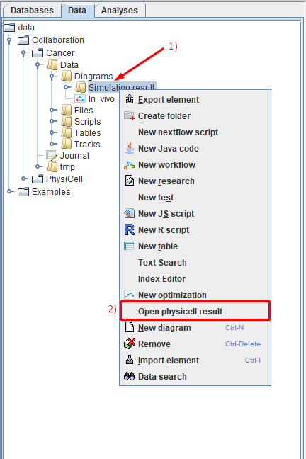
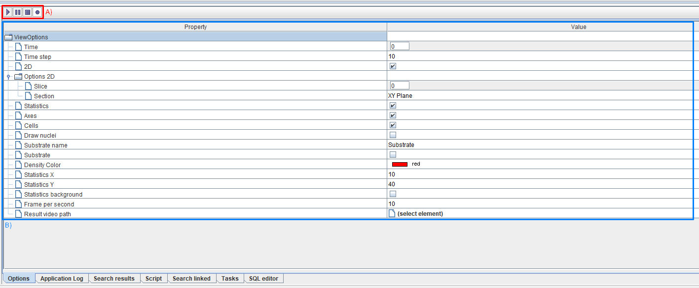
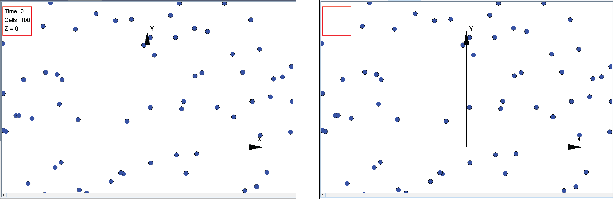

Работа с результатами симуляции модели
======================================

.. role:: raw-html(raw)
   :format: html

.. |icon_option| image:: /images/icons/option.png
.. |icon_add_new| image:: /images/icons/Physicell/add_new.png
.. |icon_new_plot_document| image:: /images/icons/Physicell/new_plot_document.png
.. |icon_not_selected_point| image:: /images/icons/Physicell/not_selected_point.png
.. |icon_selected_point| image:: /images/icons/Physicell/selected_point.png
.. |icon_import| image:: /images/icons/Physicell/import.png
.. |icon_3_points_button| image:: /images/icons/Physicell/3_points_button.png
.. |icon_table| image:: /images/icons/Physicell/table.png
.. |icon_opened_folder| image:: /images/icons/Physicell/opened_folder.png
.. |icon_edit_specification_button| image:: /images/icons/Physicell/edit_specification_button.png
.. |icon_play_button| image:: /images/icons/Physicell/play_button.png
.. |icon_pause_button| image:: /images/icons/Physicell/pause_button.png
.. |icon_stop_button| image:: /images/icons/Physicell/stop_button.png
.. |icon_record_button| image:: /images/icons/Physicell/record_button.png
.. |icon_recorded_button| image:: /images/icons/Physicell/recorded_button.png
.. |icon_video| image:: /images/icons/Physicell/video.png

Чтобы более детально изучить результат симуляции модели нужно:

- нажать ПКМ на папку с результатом симуляции (та, в которой находятся файлы info.txt, log.txt и model.txt),
- в раскрывающемся списке нажать ЛКМ на **Open physicell result** :ref:`(Рисунок 1) <Physicell_simulation_result_Pic.1>`.

.. warning::
   Проверьте, что при запуске симуляции опция **Save cells data** включена, иначе не получится открыть результат симуляции через **Open physicell result**.

.. _Physicell_simulation_result_Pic.1:

   Рисунок 1. Открытие результата симуляции модели.

После этого в правой верхней части экрана появится изображение вашей модели :ref:`(Рисунок 2) <Physicell_simulation_result_Pic.2>`.

.. _Physicell_simulation_result_Pic.2:

   Рисунок 2. Изображение модели.

На ней обозначены клетки, оси, а также модельное время, количество клеток и срез по оси Z :ref:`(Рисунок 3) <Physicell_simulation_result_Pic.3>`.

.. _Physicell_simulation_result_Pic.3:

   Рисунок 3. На изображении модели обозначены клетки, оси, модельное время, количество клеток и срез по оси Z.

Чтобы просмотреть, как модель изменялась в процессе симуляции, нужно нажать ЛКМ на вкладку **Options**, которая расположена снизу :ref:`(Рисунок 4) <Physicell_simulation_result_Pic.4>`.

.. _Physicell_simulation_result_Pic.4:

   Рисунок 4. Вкладка Options.

После этого в правой нижней части экрана появится меню, в котором можно настраивать просмотр симуляции модели :ref:`(Рисунок 5) <Physicell_simulation_result_Pic.5>`.

.. _Physicell_simulation_result_Pic.5:

   Рисунок 5. меню вкладки Options.

В этом меню можно выделить 2 части:

- :ref:`кнопки <Physicell_simulation_result_Buttons>` для просмотра симуляции,
- :ref:`параметры <Physicell_simulation_result_Parameters>` настройки просмотра симуляции :ref:`(Рисунок 6) <Physicell_simulation_result_Pic.6>`.

.. _Physicell_simulation_result_Pic.6:

   Рисунок 6. Части вкладки Options: А) кнопки для просмотра симуляции и Б) параметры настройки просмотра симуляции.

Ниже разберем каждую из этих частей подробнее.

.. _Physicell_simulation_result_Buttons:

Кнопки для просмотра симуляции
------------------------------

Кнопки для просмотра симуляции располагаются в верхнем левом углу меню **Options** :ref:`(Рисунок 7) <Physicell_simulation_result_Pic.7>`.

.. _Physicell_simulation_result_Pic.7:

   Рисунок 7. Кнопки для просмотра симуляции.

Всего имеется 4 кнопки для просмотра симуляции:

- |icon_play_button| :raw-html:`«<strong><u>Play</u></strong>»`:начать просмотр симуляции,
- |icon_pause_button| :raw-html:`«<strong><u>Pause</u></strong>»`:поставить на паузу просмотр симуляции,
- |icon_stop_button| :raw-html:`«<strong><u>Stop</u></strong>»`:остановить просмотр симуляции,
- |icon_record_button| :raw-html:`«<strong><u>Record</u></strong>»`:записать просмотр симуляции на видео.

Наведя курсор на любую из этих кнопок, можно получить подсказку о ее назначении.

.. _Physicell_simulation_result_Parameters:

Параметры настройки просмотра симуляции
---------------------------------------

Редактировать можно следующие параметры просмотра симуляции:

.. raw:: html

   <ul>
      <li><b>Time</b>: <a class="reference internal" href="#physicell-simulation-result-time">модельное время симуляции</a>,</li>
      <li><b>Time step</b>: <a class="reference internal" href="#physicell-simulation-result-time-step">шаг модельного времени симуляции</a>,</li>
      <li><b>2D</b>: отметьте ☑, если хотите, чтобы изображение модели выводилось в <a class="reference internal" href="#physicell-simulation-result-2d">двух измерениях</a>,</li>
      <li><b>Options 2D</b>: опции просмотра модели в двух измерениях (доступно, только если выбрана опция 2D):
      <ul>
         <li><u>Slice</u> - сечение внешней среды для просмотра симуляции,</li>
         <li><u>Section</u> - плоскость для просмотра симуляции,</li>
         <li><u>Grid</u> - отметьте ☑, если хотите отображать сетку при просмотре симуляции.</li>
      </ul>
      </li>
      <li><b>Options 3D</b>: опции просмотра модели в трех измерениях (доступно, только если НЕ выбрана опция 2D):
      <ul>
         <li><u>Heading</u> - угол поворота вокруг оси Y,</li>
         <li><u>Pitch</u> - угол поворота вокруг оси X,</li>
         <li><u>YZ slice, X =</u> - на каком расстоянии от точки X = 0 делать сечение по плоскости YZ,</li>
         <li><u>XZ slice, Y =</u> - на каком расстоянии от точки Y = 0 делать сечение по плоскости XZ,</li>
         <li><u>XY slice, Z =</u> - на каком расстоянии от точки Z = 0 делать сечение по плоскости XY,</li>
         <li><u>Density XY plane</u> - отметьте ☑, если хотите отображать субстраты в плоскости XY,</li>
         <li><u>Density XZ plane</u> - отметьте ☑, если хотите отображать субстраты в плоскости XZ,</li>
         <li><u>Density YZ plane</u> - отметьте ☑, если хотите отображать субстраты в плоскости YZ,</li>
         <li><u>Spheres quality</u> - .</li>
      </ul>
      </li>
      <li><b>Statistics</b>: отметьте ☑, если хотите, чтобы в левом верхнем углу изображения модели указывалось <a class="reference internal" href="#physicell-simulation-result-statistics">модельное время, количество клеток и срез по оси Z</a>,</li>
      <li><b>Axes</b>: отметьте ☑, если хотите, чтобы на изображении модели отрисовывались <a class="reference internal" href="#physicell-simulation-result-axes">оси</a>,</li>
      <li><b>Cells</b>: отметьте ☑, если хотите, чтобы на изображении модели отрисовывались <a class="reference internal" href="#physicell-simulation-result-cells">клетки</a>,</li>
      <li><b>Draw nuclei</b>: отметьте ☑, если хотите, чтобы на изображении модели в клетках отрисовывались ядра,</li>
      <li><b>Substrate name</b>: название <a class="reference internal" href="#physicell-simulation-result-substrate">субстрата</a>,</li>
      <li><b>Substrate</b>: отметьте ☑, если хотите отображать <a class="reference internal" href="#physicell-simulation-result-substrate">субстрат</a>, выбранный в поле Substrate name, на изображении модели (проверьте, что при запуске симуляции было отмечено поле Save density, иначе субстраты не будут отображаться),</li>
      <li><b>Density Color</b>: цвет, с помощью которого <a class="reference internal" href="#physicell-simulation-result-substrate">субстрат</a>, выбранный в поле Substrate name, быдет вырисовываться на изображении модели,</li>
      <li><b>Statistics X</b>: <a class="reference internal" href="#physicell-simulation-result-statistics-x-y">координата по оси X</a> окна, в котором указывается модельное время, количество клеток и срез по оси Z,</li>
      <li><b>Statistics Y</b>: <a class="reference internal" href="#physicell-simulation-result-statistics-x-y">координата по оси Y</a> окна, в котором указывается модельное время, количество клеток и срез по оси Z,</li>
      <li><b>Frame per second</b>: количество кадров в секунду в <a class="reference internal" href="#physicell-simulation-result-video">видео</a>,</li>
      <li><b>Result video path</b>: путь в репозитории BioUML, куда сохранить <a class="reference internal" href="#physicell-simulation-result-video">видео</a>.</li>
   </ul>

Разберем некоторые из этих параметров более подробно.

.. _Physicell_simulation_result_Time:

Модельное время симуляции (Time)
~~~~~~~~~~~~~~~~~~~~~~~~~~~~~~~~

Чтобы вывести изображение модели в любой момент времени симуляции, нужно:

- справа от |icon_option| **Time** ввести любое значение модельного времени,
- нажать **Enter**.

Также можно воспроизвести симуляцию модели с любого момента. Для этого нужно:

- справа от |icon_option| **Time** ввести значение модельного времени, начиная с которого вы хотите воспроизвести симуляцию,
- нажать ЛКМ кнопку |icon_play_button|.

В любой момент воспроизведения симуляции вы можете его остановить, нажав ЛКМ кнопку |icon_pause_button|. Для продолжения воспроизведения нужно снова нажать ЛКМ кнопку |icon_play_button|.

Чтобы остановить воспроизведение симуляции, нужно нажать ЛКМ кнопку |icon_stop_button| (Значение |icon_option| **Time** станет равным 0).

.. _Physicell_simulation_result_Time_step:

Шаг модельного времени симуляции (Time step)
~~~~~~~~~~~~~~~~~~~~~~~~~~~~~~~~~~~~~~~~~~~~

По умолчанию значение поля |icon_option| **Time step** будет равным параметру **Image interval**, указываемому при настройке :ref:`симуляции модели <Physicell_simulation>`.

Следует учесть, что если **Time step** будет меньше, чем **Image interval**, то воспроизведение симуляции будет идти с шагом, указанным в **Image interval**.

.. _Physicell_simulation_result_2D:

Изображение модели в двух измерениях (2D)
~~~~~~~~~~~~~~~~~~~~~~~~~~~~~~~~~~~~~~~~~

Если поле |icon_option| **2D** отмечено, то изображение модели выводится в 2-ух измерениях :ref:`(Рисунок 8А) <Physicell_simulation_result_Pic.8>`, если нет - в 3-ех :ref:`(Рисунок 8Б) <Physicell_simulation_result_Pic.8>`.

.. _Physicell_simulation_result_Pic.8:

.. figure:: images/Physicell/Physicell_simulation_result/2D_3D_model.png
   :width: 100%
   :alt: 2D_3D_model
   :align: center

   Рисунок 8. Изображение модели в 2-ух (А) и 3-ех (Б) измерениях.

При выводе изображения в 3-ех измерениях мы смотрим на модель в пространстве, а не на срезе, поэтому значение среза по оси Z в правом верхнем углу отсутствует :ref:`(Рисунок 8Б) <Physicell_simulation_result_Pic.8>`.

Вы также можете вручную "вращать" модель. Для этого нужно:

- навести курсор в любое место изображения модели,
- зажать ЛКМ,
- передвинуть курсор в новое место,
- отпустить ЛКМ.

.. _Physicell_simulation_result_Statistics:

Указание модельного времени, количества клеток и среза по оси Z (Statistics)
~~~~~~~~~~~~~~~~~~~~~~~~~~~~~~~~~~~~~~~~~~~~~~~~~~~~~~~~~~~~~~~~~~~~~~~~~~~~

Если поле |icon_option| **Statistics** отмечено, то на изображении модели выводятся значения модельного времени, количества клеток и среза по оси Z (срез по оси Z указывается, только если модель :ref:`двумерная <Physicell_simulation_result_2D>`) :ref:`(Рисунок xА) <Physicell_simulation_result_Pic.x>`.

Если поле |icon_option| **Statistics** не отмечено, то такая статистика указываться не будет :ref:`(Рисунок xБ) <Physicell_simulation_result_Pic.x>`.

.. _Physicell_simulation_result_Pic.x:

   Рисунок 8. Модельное время, количество клеток и срез по оси Z отображаются, если опция Statistics включена (А), в противном случае такая статистика отсутствует (Б).

.. _Physicell_simulation_result_Axes:

Изображение осей (Axes)
~~~~~~~~~~~~~~~~~~~~~~~

Если поле |icon_option| **Axes** отмечено, то на изображении модели отрисовываются оси :ref:`(Рисунок x1А) <Physicell_simulation_result_Pic.x1>`.

Если поле |icon_option| **Axes** не отмечено, то оси отображаться не будут :ref:`(Рисунок x1Б) <Physicell_simulation_result_Pic.x1>`.

.. _Physicell_simulation_result_Pic.x1:

   Рисунок 8. Изображение осей, если опция Axes включена (А), в противном случае оси отсутствуют (Б).

.. _Physicell_simulation_result_Cells:

Изображение клеток (Cells)
~~~~~~~~~~~~~~~~~~~~~~~~~~

Если поле |icon_option| **Cells** отмечено, то на изображении модели отрисовываются клетки :ref:`(Рисунок x2А) <Physicell_simulation_result_Pic.x2>`.

Если поле |icon_option| **Cells** не отмечено, то клетки отображаться не будут :ref:`(Рисунок x2Б) <Physicell_simulation_result_Pic.x2>`.

.. _Physicell_simulation_result_Pic.x2:

   Рисунок 8. Изображение клеток, если опция Cells включена (А), в противном случае клетки отсутствуют (Б).

.. _Physicell_simulation_result_Substrate:

Изображение субстратов (Substrate, Substrate name, Density Color)
~~~~~~~~~~~~~~~~~~~~~~~~~~~~~~~~~~~~~~~~~~~~~~~~~~~~~~~~~~~~~~~~~

.. warning::
   Одновременно при просмотре симуляции можно отображать только один субстрат.

Чтобы отображать субстрат при просмотре симуляции модели, нужно поставить ☑ справа от поля |icon_option| **Substrate**.

Чтобы выбрать, какой субстрат будет отрисовываться при симуляции модели, нужно:

- нажать ЛКМ справа от поля |icon_option| **Substrate name**,
- выбрать из раскрывающегося списка нужный субстрат.

Чтобы выбрать, каким цветом выбранный субстрат будет отрисовываться при просмотре симуляции модели, нужно:

- нажать ЛКМ справа от поля |icon_option| **Density Color**,
- выбрать из раскрывающегося списка нужный цвет.

.. _Physicell_simulation_result_Statistics_X_Y:

Координаты окна, в котором указывается модельное время, количество клеток и срез по оси Z (Statistics X, Statistics Y)
~~~~~~~~~~~~~~~~~~~~~~~~~~~~~~~~~~~~~~~~~~~~~~~~~~~~~~~~~~~~~~~~~~~~~~~~~~~~~~~~~~~~~~~~~~~~~~~~~~~~~~~~~~~~~~~~~~~~~~

Все окно, в котором отображается модель, имеет свою систему координат, состоящую из двух осей - X и Y :ref:`(Рисунок x3) <Physicell_simulation_result_Pic.x3>`.

.. _Physicell_simulation_result_Pic.x3:

   Рисунок 8. Система координат окна, в котором отображается модель.

.. warning::
   Не путать с системой координат, в которой располагаются клетки!

Изменяя значения полей |icon_option| **Statistics X** и |icon_option| **Statistics Y**, можно регулировать расположение легенды на изображении модели :ref:`(Рисунок x4) <Physicell_simulation_result_Pic.x4>`.

.. _Physicell_simulation_result_Pic.x4:

   Рисунок 8. Изменение положения легенды с помощью параметров Statistics X и Statistics Y.

.. _Physicell_simulation_result_Video:

Запись видео (Frame per second, Result video path)
~~~~~~~~~~~~~~~~~~~~~~~~~~~~~~~~~~~~~~~~~~~~~~~~~~

Перед тем как начать записывать видео, нужно выбрать директорию, куда оно будет сохранено. Для этого нужно:

- нажать ЛКМ на |icon_option| **(select element)** справа от |icon_option| **Result video path**,
- в появившемся окне нажать ЛКМ справа от поля **Collection:** и выбрать директорию для сохранения видео,
- справа от поля **Name:** указать название видео,
- нажать ЛКМ на кнопку **Ok** :ref:`(Рисунок x5) <Physicell_simulation_result_Pic.x5>`.

.. _Physicell_simulation_result_Pic.x5:

.. figure:: images/Physicell/Physicell_simulation_result/Select_video_path.png
   :width: 100%
   :alt: Select_video_path
   :align: center

   Рисунок 8. Выбор директории для сохранения видео.

Также нужно выбрать количество кадров, показываемых за 1 секунду (FPS, frame per second), в видео. Для этого укажите нужное вам значение справа от поля |icon_option| **Frame per second**.

Теперь можно приступать к записи видео.

Чтобы начать записывать видео, нужно нажать ЛКМ на кнопку |icon_record_button| на :ref:`панели кнопок <Physicell_simulation_result_Buttons>`. После этого кнопка |icon_record_button| станет |icon_recorded_button|, что означает, что запись видео началась.

После этого можно проводить любые манипуляции с симуляцией модели (переводить из 2-ух измерений в 3, визуализировать субстраты, передвигать легенду и т.д.) - все они будут записаны на видео.

Для остановки записи видео нужно нажать ЛКМ на кнопку |icon_recorded_button|. Кнопка станет |icon_record_button|, что означает, что запись видео завершена.

Теперь в выбранной директории появится файл |icon_video| **[ваше_название].mp4**, в котором записано ваше видео.