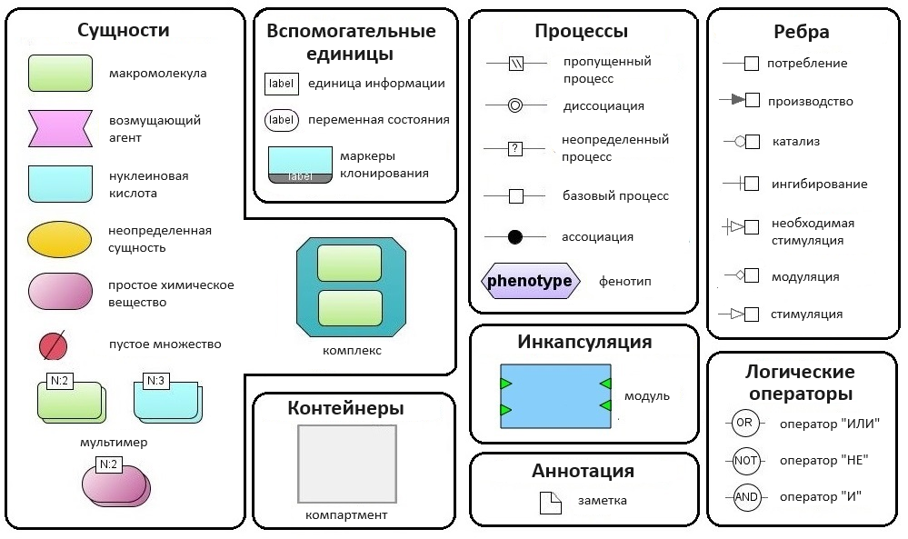

Основы визуального моделирования
================================

Задача моделирования сложных систем может быть существенно упрощена с точки зрения исследователя путем представления моделей систем в виде диаграмм и
использования компьютерных программ, поддерживающих визуальное моделирование. 

**Визуальное моделирование** – это формальное представление, создание моделей и работа с ними в виде графических диаграмм. Численные расчеты проводятся на основе данного представления.

**Диаграммы** - это двумерные геометрические представления информации в соответствии с соглашениями о графических обозначенияx.
Диаграмма состоит из узлов, ребер и компартентов, которые называются **элементами диаграммы**:

- **узел** обычно представляет собой некоторую геометрическую фигуру, например прямоугольник или эллипс;
- **ребро** – это линия, соединяющая два узла;
- **компартмент** — это особый тип узла, внутри которого могут находиться другие узлы.

BioUML упрощает создание сложных биологических моделей путем визуального моделирования: 

-   пользователь создаёт и редактирует модель биологической системы в виде диаграммы;
-   на основе созданной диаграммы ПК BioUML генерирует Java код;
-   сгенерированный Java код компилируется и используется соответствующими решателями для численного моделирования динамики исходной системы.
 
Графическая нотация
-------------------

Необходимой составной частью визуального моделирования является **графическая нотация** (визуальный синтаксис, графический язык) которая позволяет формально и полно описать модель. 
Графическая нотация может быть представлена несколькими типами диаграмм, позволяющими описать разные аспекты структуры и функционирования сложных систем с разным уровнем формальности и детализации. 
Далее на основе такого формального графического представления системы (диаграммы) компьютерная программа автоматически генерирует код для численного моделирования динамики этой системы.

Основными компонентами формального определения графической нотации являются:

-   **типы вершин и ребер** – какие типы биологических (и математических) объектов и их взаимодействий могут быть показаны на диаграмме;
-   **правила отрисовки объектов** – как биологические объекты должны быть представлены на диаграмме, учитывая их свойства. Например, РНК может быть представлена в виде волнистой линии, белок может быть представлен в виде круга, а маленькие круги на нем могут представлять различные модификации аминокислотных остатков (фосфорилирование, убиквитинирование и т.п.);
-   **семантические правила и ограничения** – используются для обеспечения семантической целостности диаграммы в процессе ее создания и редактирования. Например, если пользователь удаляет вещество с диаграммы, то все реакции, в которых оно участвует должны быть тоже удалены.

Поддержка SBML и SBGN в BioUML
------------------------------

BioUML полностью поддерживает и активно использует **SBML** (Systems Biology Markup Language) - язык разметки системной биологии в качестве стандарта для
описания математических моделей с обыкновенными дифференциальными уравнениями (ОДУ) и дискретными событиями (https://sbml.org/). Модели, создаваемые в BioUML 
в основном подчиняются математическому формализму, описываемому SBML. 

Наиболее известной графической нотацией в системной биологии является **SBGN** (Systems Biology Graphic Notation), которая поддерживается в BioUML :ref:`(Рисунок 1) <Pic.1_1>`.
Подробное описание графической нотации SBGN можно найти по ссылке (https://sbgn.github.io/).

.. _SBGN notation:

.. _Pic.1_1:

   
   Рисунок 1. Адаптированная SBGN нотация в BioUML

 

   
   