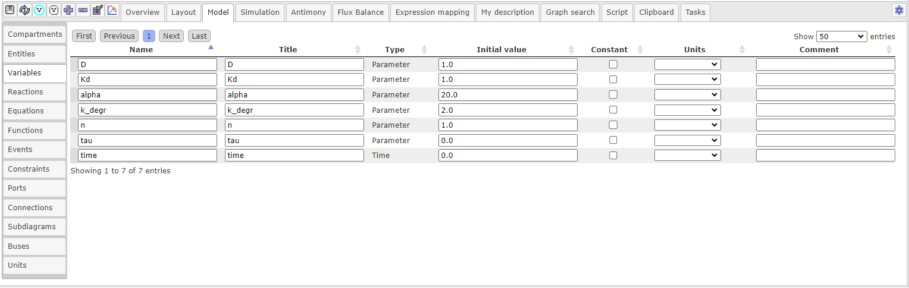
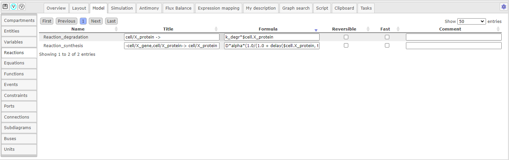
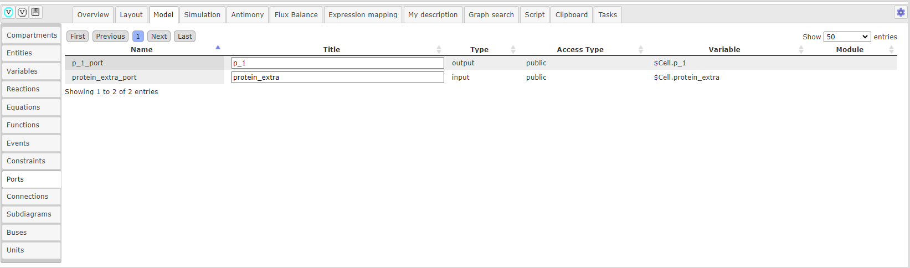
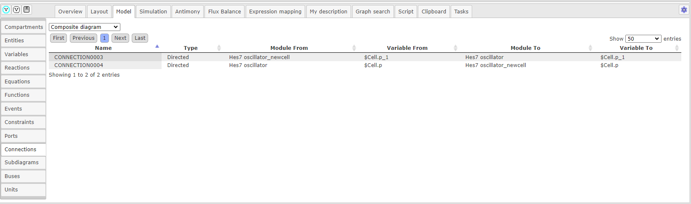
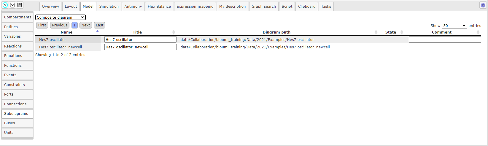

Интерфейс BioUML при работе с диаграммами
=========================================

.. |diagram| image:: /images/icons/Type-Diagram-icon.png
.. |zoom in| image:: /images/icons/zoom_in.png
.. |zoom out| image:: /images/icons/zoom_out.png
.. |fit to screen| image:: /images/icons/fit_to_screen.png
.. |save| image:: /images/icons/save.gif
.. |saveas| image:: /images/icons/saveas.gif
.. |revert| image:: /images/icons/revert_save.gif
.. |export| image:: /images/icons/export.png
.. |import| image:: /images/icons/import.gif
.. |highlight_off| image:: /images/icons/highlight_off.png
.. |highlight_on| image:: /images/icons/highlight_on.png
.. |plot| image:: /images/icons/plot.gif
.. |icon_minus| image:: /images/icons/icon_minus.gif
.. |icon_plus| image:: /images/icons/icon_plus.gif
.. |set_values| image:: /images/icons/set_values.gif
.. |edit| image:: /images/icons/edit.gif
.. |remove| image:: /images/icons/remove.png
.. |detect_types| image:: /images/icons/detect_types.gif

*Открытие диаграммы* осуществляется путем двойного щелчка мыши на диаграмму, который отображается как |diagram| во вкладке :guilabel:`Data` области :doc:`репозитория </user_interface>`.
В :doc:`рабочем пространстве </user_interface>` отображается полноразмерная *часть диаграммы*, в то время как   
*общий вид диаграммы* — в :doc:`поле операций </user_interface>` во вкладке :guilabel:`Overview`. Область диаграммы, отображенная в рабочем пространстве выделяется пунктиром на общем виде диаграммы, расположенной
в области поля операций. Для облегчения ориентации на больших диаграммах отдельные ребры и узлы диаграммы подсвечиваются голубым цветом :ref:`(Рисунок 1) <Pic.1_3>`.

.. _Pic.1_3:

.. figure:: images/diagrams/opened_diagram.png
   :width: 100%
   :alt: Открытая диаграмма в веб-версии BioUML
   :align: center

   Рисунок 1. Открытая диаграмма в веб-версии BioUML
   
Текущую отображаемую область диаграммы можно сместить:

-     в рабочем пространстве, щелкнув и перетащив «холст» диаграммы, либо используя полосы прокрутки; 
-     сдвинув (щелкнув и перетащив) пунктирный прямоугольник (представляющий область, которая сейчас просматривается в рабочем пространстве) на вкладке :guilabel:`Overview` в области поля операций .

Для *создания новой диаграммы*, во вкладке :guilabel:`Data` области :doc:`репозитория </user_interface>` выберите проект и нажмите правой кнопкой мыши на нужную папку, в которой планируется
создание диаграммы. В выпадающем списке нажмите на поле |diagram| New diagram. Далее в открывшемся окне выберите нужный *тип диаграммы*. 

Диаграммы можно *экспортировать* в различных форматах, нажав инонку |export|, расположенной на общей панели управления, либо нажав
правой кнопкой мыши на диаграмму в репозитории и в выпадающем списке выбрать |export|.
*Импорт диаграммы* осуществляется нажатием на иконку |import|.

Панель инструментов
-------------------

В верхней части рабочего пространства находится *панель инструментов* :ref:`(Рисунок 2) <Pic.2_3>`, которая содержит элементы, которые могут быть добавлены на диаграмму. 
При этом, каждому отдельному типу диаграммы будет соответсвовать определенный набор элементов. 

.. _Pic.2_3:

.. figure:: /images/interface/modelling_icons.png
   :width: 80%
   :alt: Панель инструментов
   :align: center

   Рисунок 2. Панель инструментов

.. note::
   Детальное описание соответствующих элементов будет приведено в следующих главах. 
   
Общая панель управления
-----------------------

На *общей панели управления* :ref:`(Рисунок 3) <Pic.3_3>`, которая располагается сверху от рабочего пространства, представлены различные опции, используемые при работе с диаграммами:

.. _Pic.3_3:

.. figure:: /images/interface/general_panel.png
   :width: 100%
   :alt: Общая панель управления
   :align: center

   Рисунок 3. Общая панель управления при работе с диаграммами 

.. raw:: html

    
   
   <table style="table-layout: fixed; width: 100%; word-wrap: break-word;">
   <caption>Таблица 1. Элементы общей панели управления, используемой при работе с диаграммами</caption>
   <tr>
        <th>Описание</th>
        <th>Обозначение</th>
    </tr>
    <tr>
	    <th colspan="2">Управление версиями и экспортом/импортом диаграммы</th>
    </tr>
    <tr>
        <td>Сохранение текущей версии диаграммы</td>
        <td></td>
    </tr>
    <tr>
        <td>Сохранение копии диаграммы</td>
        <td></td>
    </tr>
    <tr>
        <td>Восстановление сохраненной версии диаграммы</td>
        <td></td>
    </tr>
    <tr>
        <td>Экспорт диаграммы</td>
        <td></td>
    </tr>
    <tr>
        <td>Импорт диаграммы</td>
        <td></td>
    </tr>
    <tr>
        <td>Изменить тип диаграммы</td>
        <td></td>
    </tr>    
    <tr>
	    <th colspan="2">Операции отмены и повтора действий</th>
    </tr>
    <tr>
        <td>Отмена действия</td>
        <td></td>
    </tr>
    <tr>
        <td>Повтор действия</td>
        <td></td>
    </tr>
    <tr>
        <th colspan="2">Операции масштабирования диаграммы</th>
    </tr>
    <tr>
        <td>Уменьшить масштаб диаграммы</td>
        <td></td>
    </tr>
    <tr>
        <td>Увеличить масштаб диаграммы</td>
        <td></td>
    </tr>
    <tr>
        <td>Отобразить полноразмерный вид диаграммы</td>
        <td></td>
	</tr>
	<tr>
        <th colspan="2">Опции отображения диаграмм</th>
    </tr>
	<tr>
        <td>Автоматическая расстановка ребер при перемещении узлов диаграммы</td>
        <td></td>
    </tr>
	<tr>
        <td>Настройки визуального отображения диаграммы</td>
        <td></td>
    </tr>
	<tr>
	 <th colspan="2">Удаление и копирование элементов диаграммы</th>
    </tr>
    <tr>
        <td colspan="2">Для удаления либо копирования элементов диаграммы зажмите кнопку Control с правой кнопкой мыши и выделите нужные элементы диаграммы</td>
    </tr>
	<tr>
        <td>Удаление элемента/элементов диаграммы</td>
        <td></td>
    </tr>
	<tr>
        <td>Копирование элемента/элементов диаграммы в новую диаграмму</td>
        <td></td>
    </tr>
	<tr>
	 <th colspan="2">Опции выравнивания диаграммы</th>
    </tr>
	<tr>
        <td colspan="2">Для выравнивания зажмите кнопку Control с правой кнопкой мыши и выделите нужные элементы диаграммы</td>
    </tr>
	<tr>
       <td>Выравнивание по верхнему краю</td>
       <td></td>
    </tr>	
    <tr>
       <td>Выравнивание по середине</td>
       <td></td>
    </tr>
    <tr>
       <td>Выравнивание по нижнему краю</td>
       <td></td>
    </tr>
    <tr>
       <td>Выравнивание по левому краю</td>
       <td></td>
    </tr>
    <tr>
       <td>Выравнивание по центру</td>
       <td></td>
    </tr>
    <tr>
       <td>Выравнивание по правому краю</td>
       <td></td>
    </tr>
	<tr>
       <td>Горизонтальное выравнивание</td>
       <td></td>
    </tr>
	<tr>
       <td>Вертикальное выравнивание</td>
       <td></td>
    </tr>
	<tr>
	 <th colspan="2">Add upstream/downstream</th>
    </tr>
	<tr>
       <td>Add upstream</td>
       <td></td>
    </tr>
	<tr>
       <td>Add downstream</td>
       <td></td>
    </tr>
	<tr>
	 <th colspan="2">Опции модульного моделирования</th>
    </tr>
	<tr>
       <td>Смена порта</td>
       <td></td>
    </tr>
	<tr>
       <td>Смена подмодуля</td>
       <td></td>
    </tr>	
	<tr>
       <td>Разделение диаграммы на подмодули</td>
       <td></td>
    </tr>	
    <tr>
       <td>Отобразить изменения в подмоделях на модульной диаграмме</td>
       <td></td>
    </tr>
    <tr>
	 <th colspan="2">Опции клонирования сущностей</th>
    </tr>
	<tr>
       <td>Создание клона сущности</td>
       <td></td>
    </tr>
	<tr>
       <td>Объединение клонов сущностей</td>
       <td></td>
    </tr>
   </table>

   

Поле операций 
-------------

:doc:`Поле операций </user_interface>` располагается в правой нижней части и содержит ряд вкладок, предоставляющих
различные опции при работе с диаграммами :ref:`(Рисунок 4) <Pic.4_3>`.

.. _Pic.4_3:

.. figure:: /images/interface/operations_field.png
   :width: 100%
   :alt: Поле операций при работе с диаграммами
   :align: center

   Рисунок 4. Поле операций при работе с диаграммами

Overview
~~~~~~~~

Во вкладке :guilabel:`Overview` отображается *общий вид диаграммы*. Синим пунктиром выделена область диаграммы, которая отображается
в рабочем пространстве :ref:`(Рисунок 5) <Pic.5_3>`. 

.. _Pic.5_3:

.. figure:: /images/interface/overview.png
   :width: 100%
   :alt: Вкладка Overview в поле операций
   :align: center

   Рисунок 5. Вкладка Overview в поле операций

Layout
~~~~~~

.. |save_layout| image:: /images/icons/save_layout.gif
.. |simulate| image:: /images/icons/simulate.gif

Вкладка :guilabel:`Layout` содержит пять вариантов *макетов расстановки элементов на диаграмме* и соответствующие опции для выбранного макета :ref:`(Рисунок 6) <Pic.6_3>`: 

.. _Pic.6_3:

.. figure:: /images/interface/layout.png
   :width: 100%
   :alt: Вкладка Layout в поле операций
   :align: center

   Рисунок 6. Вкладка Layout в поле операций

-   Hierarchical layout;
-   Orthogonal layout;
-   Force directed layout;
-   Cross cost grid layout (with compartments);
-   Grid layout. 

При изменении опций нажмите иконку |save_layout| и затем для запуска расстановщика иконку |simulate|.

Model
~~~~~

Вкладка :guilabel:`Model` содержит горизонтальные вкладки, соответвующие добавленным типам элементов на диаграмму :ref:`(Рисунок 7) <Pic.7_3>`.

.. _Pic.7_3:

.. figure:: /images/interface/model.png
   :width: 100%
   :alt: Вкладка Model в поле операций
   :align: center

   Рисунок 7. Вкладка Model в поле операций 

Для каждой вкладки применимы отдельные операции, все существующие операции описаны ниже:

|save| - сохранение текущих внесенных изменений;  

|detect_types| - определение типа математической переменной в модели: константа - Parameter; вычисляется ОДУ уравнением - Differential;
алгебраическим уравнением или присваиванием - Calculated; 

|highlight_on| - подсвечивание соответствующего узла диаграммы: нажмите на строку, cоответствующую выбранному объекту, либо
на несколько строк, зажимая Ctrl, чтобы они подсветились синим, и затем нажмите на иконку операции;

|highlight_off| - убрать подсвечивание узла на диаграмме;

|plot| - добавление результатов численного расчета на график: доступно для компартментов (Compartments), 
сущностей (Entites), параметров (Variables) и шин (Buses); нажмите на строку, cоответствующую выбранному объекту, либо
на несколько строк, зажимая Ctrl, чтобы они подсветились синим, и затем нажмите на иконку операции;

|icon_minus| - добавление нового параметра или единицы измерения: доступно во вкладках Variables и Units;

|icon_plus| - удаление параметра: ажмите на строку, cоответствующую выбранному параметру, либо
на несколько строк, зажимая Ctrl, чтобы они подсветились синим, и затем нажмите на иконку операции;

|set_values| - добавление значений параметров: нажмите на иконку операции и затем выберите табличный файл, содержаший идентификатор параметра (Name) идентификатор
и численное значение (Initial Value);

|edit| - изменение единицы изменения: доступно во вкладке Units, сначала нажмите на строку, соответствующую выбранной
единице измерения, а затем на иконку операции;

|remove| - удаление единицы измерения. 

-   В столбце Name указывается *идентификатор* элемента модели;
-   В столбце Title - *заголовок* элемента, который может быть изменен; 
-   *Тип математической переменной* указывается в Type;
-   *Комментарий* может быть добавлен в столбце Comment.

**Compartments (компартменты)**

:ref:`Компартмент <compartment>` являются отдельным элементом диаграммы, в составе которого могут находиться сущности. 

-   В столбце Initial value указывается *численное значение* - объем компартмента;
-   Флаг *константы* ставится в столбце Constant и определяет является ли  численное значение переменной константы постоянной и может ли быть изменено. 
-   В столбце *Units* из выпадающего списка выбирается единица измерения. 

.. figure:: /images/interface/model.png
   :width: 100%
   :alt: Вкладка Compartments в поле операций
   :align: center

   Рисунок 8. Вкладка Сompartments в поле операций 

**Entities (cущности)**

При добавлении :ref:`материальной сущности <entities>` на диаграмму создается 
:ref:`переменная <math_model>`, описывающая концентрацию или количество вещества соответствующей сущности. 

.. note::
   У сущности **идентификатор переменной** образуется путем добавления "$" перед заданным ранее идентификатором сущности. 
   Если сущность принадлежит компартменту, то идентификатор переменной будет содержать и идентификатор компартмента, 
   например, $compartment.entity. Компартмент, которому принадлежит сущность указывается в столбце Compartment.
   Присвоенный идентификатор переменной будет указан во вкладке :guilabel:`Info` (инспектор свойств) в области :doc:`информационного окна </user_interface>`
   в поле Role - VariableRole.  
   
-   *Численное значение* переменной задается в столбце Initial Value;
-   В столбце Initial units type указывается единица измерения начального численного значения переменной: amount - количество вещества; concentration - концентрация.
-   Units type указывает единицу измерения для идентификатора переменной в реакции, уравнении и т.д. \
-   Output units type соответствует единице измерения при выводе численных результатов на график. 

.. note::
   При численных расчетах используется amount - количество вещества. Если в столбце Units type указан тип единицы измерения concentration - концентрация,
   то концентрация умножается на объем компартмента. 

-   Флаг *граничного условия* может быть поставлен в столбце Boundary condition. В случае, если оно установлено – значение переменной не может меняться в ходе реакций (но может подчиняться закону, заданному дифференциальным или алгебраическим уравнением).  
-   Флаг *константы* ставится в столбце Constant и определяет является ли численное значение переменной постоянной и може ли быть изменено.

.. figure:: images/interface/entities.png
   :width: 100%
   :alt: Изменение атрибутов переменной 
   :align: center	 
   
   Рисунок 9. Вкладка Entities в поле операций 

**Variables (параметры)** 

:ref:`Параметры <math_model>` - это математические переменные модели, для которых нет выделенного элемента на диаграмме. 
Могут быть добавлены в модель путем явного упоминания в каком-либо математическом выражении (уравнении, 
реакции, функции и т.д.) либо в соответствующей вкладке Variables. 

   
   Рисунок 10. Вкладка Variables в поле операций 
   
-   *Значение параметра* выставляется в столбце Initial value;
-   Если требуется *удалить неиспользуемый параметр* или *добавить новый параметр*, нажмите на иконку |icon_minus| и |icon_plus|, cоответственно.

**Reactions (реакции)**

Во вкладке Reactions представлены :ref:`добавленные процессы <process_creation>`. 

-   В столбце Formula записывается :ref:`формула <formula>`;
-   Флаг *обратимость реакции* указывается в столбцу Reversible;
-   Флаг Fast указывает является реакция медленной или быстрой.

   
   Рисунок 11. Вкладка  Reactions в поле операций 
   
**Equations (уравнения)**

В BioUML доступны следующие типы :ref:`уравнений <equations>`: 
обыкновенное дифференциальное уравнение (rate), алгебраическое уравнение (algebraic), 
правило присваивания (initial assignment) и скалярное (scalar). 

-   *Переменная уравнения* указывается в столбце Variable;
-   *Формула* вводится в столбце Equation;
-   В столбце Type указан *тип уравнения*. 

.. figure:: images/interface/equations.png
   :width: 100%
   :alt: Уравнения
   :align: center	 
   
   Рисунок 12. Вкладка Equations в поле операций
   
**Functions (функции)**

:ref:`Функция <function>` может использоваться в уравнениях или реакциях модели. 

-   В столбце Right Hand Side можно изменить *правую часть уравнения*;
-   В столбце Formula выводится *функция*, соответствующая следующему образцу: ``function function_name(a1, ..., an) = Right Hand Side``, где function_name - заданный *идентификатор функции* в поле столбце Name; a1, ... , an - *аргументы функции*. 

**Events (события)**

:ref:`Событие <event>` заключается в скачкообразном изменении значений переменных модели при выполнении
определенного условия.

.. figure:: /images/interface/events.png
   :width: 100%
   :alt: Событие
   :align: center	 
   
   Рисунок 13. Вкладка Events в поле операций

-   В столбце Trigger устанавливается *триггер* - условие для запуска события;
-   *Приоритет* указывает на порядок, в котором должны быть выполнены события в том случае, если их времена выполнения совпадают, и указывается в Priority;
-   В столбец Delay задается *время*, через которое происходит выполнение события; 

.. warning::
   дополнить про индикаторы (Use trigger time values и др). примеры использования событий

**Constraints (ограничения)**

Ограничение - это условие, которое проверяется во время моделирования.
Если условие нарушается, то либо выдается сообщение об ошибке, либо моделирование останавливается в зависимости 
от опций симулятора.

.. figure:: /images/interface/constraints.png
   :width: 100%
   :alt: Ограничения
   :align: center	 
   
   Рисунок 13. Вкладка Сonstraints в поле операций
   
.. warning::
   дополнить про ограничения

**Ports (порты)**

:ref:`Порты <ports>` используются при модульном моделировании и осуществляют передачу сигналов между модулями.

-   В столбце Port type указан :ref:`тип порта <port_types>`;
-   :ref:`Тип доступности порта <port_access_types>` указывается в столбце Access Type;
-   Variable соответствует созданному элементу диаграммы, для которой создан порт. 

   
   Рисунок 14. Вкладка Ports в поле операций
   
**Connections (связи)**

:ref:`Связи <ports>` используются при модульном моделировании и служат для соединения портов.

-   Столбец Type указываетcя :ref:`тип связи <connections_types>`;
-   В столбце Module From обозначается входной модуль;
-   В столбце Variable From обозначается входная переменная;
-   В столбце Module To обозначается выходной модуль;
-   В столбце Variable From обозначается выходная переменная.

   
   Рисунок 15. Вкладка Connections в поле операций

**Subdiagrams (подмодели)**

:ref:`Подмодели <modules>` используются при модульном моделировании и соответствуют диаграмме модели. 

-   В столбце Diagram path указывается путь к диаграмме подмодели. 

   
   Рисунок 16. Вкладка Subdiagrams в поле операций 

	 

