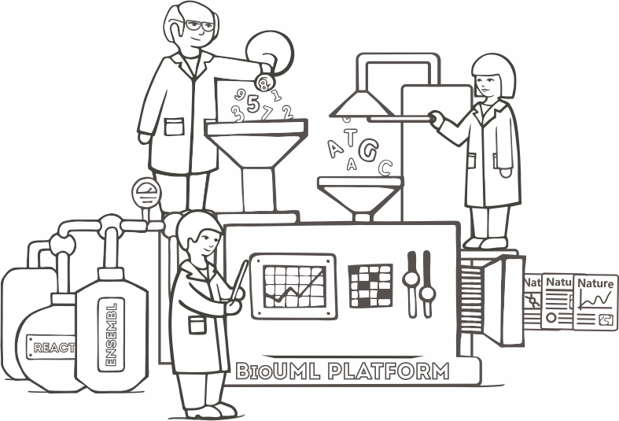

BioUML platform
===============

.. |br| raw:: html

   

.. centered:: 
   BioUML is an integrated platform for systems biology
   |br| and collaborative analysis of biomedical data

.. toctree::
   :maxdepth: 2
   :caption: Начало работы в BioUML

   intro.rst
   user_interface.rst

.. toctree::
   :maxdepth: 2
   :caption: Оcновы моделирования в BioUML

   basics of visual modeling.rst
   types of diagrams.rst  
   
.. toctree::
   :maxdepth: 2
   :caption: Этапы создания моделей

   sbgn model.rst
   modular sbgn model.rst

.. toctree:: 
   :maxdepth: 2
   :caption: Принципы работы с диаграммами
   
   first steps in working with a diagram.rst
   working with diagram elements.rst
   
.. toctree:: 
   :maxdepth: 2
   :caption: SBGN модели
   
   sbgn elements.rst
   new sbgn elements.rst
   process creation.rst
   
.. toctree:: 
   :maxdepth: 2
   :caption: Математическая модель
   
   mathematical model.rst
   
.. toctree:: 
   :maxdepth: 2
   :caption: Иерархические модели
   
   modular models.rst
   
.. toctree:: 
   :maxdepth: 2
   :caption: Численный анализ модели
   
   model calculations.rst

.. toctree:: 
   :maxdepth: 2
   :caption: Physicell модели
   
   Physicell_model_creation.rst
   Physicell_model_development.rst
   Physicell_cell_properties.rst
   Physicell_microenvironment.rst
   Physicell_simulation.rst
   Physicell_simulation_result.rst
  