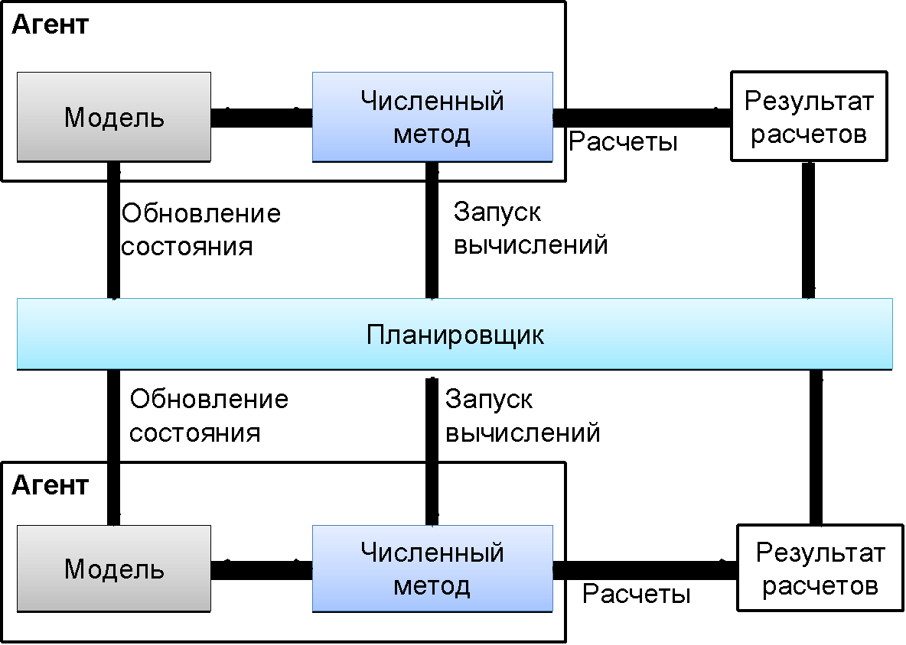
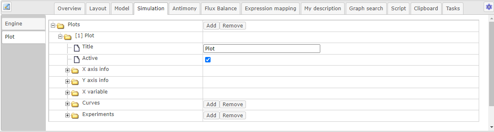
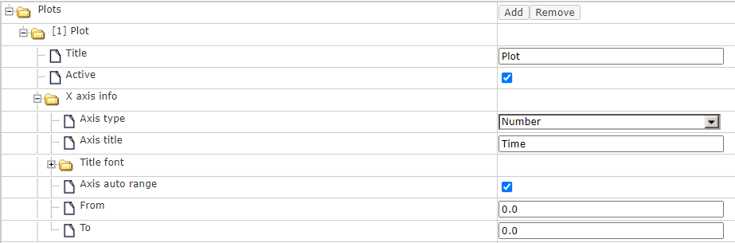
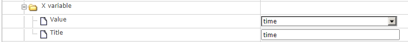
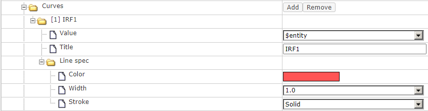
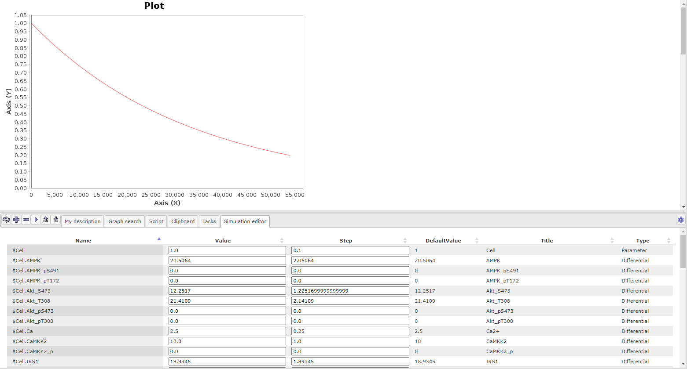

Численный расчет модели
=======================
.. _simulation:

.. |simulate| image:: /images/icons/simulate.gif
.. |save| image:: /images/icons/save.gif
.. |folder| image:: /images/icons/folder.png
.. |plot| image:: /images/icons/plot.gif
.. |option| image:: /images/icons/option.png
.. |detect_types| image:: /images/icons/detect_types.gif
.. |icon_minus| image:: /images/icons/icon_minus.gif
.. |icon_plus| image:: /images/icons/icon_plus.gif
.. |export| image:: /images/icons/export.png
.. |import| image:: /images/icons/import.gif
.. |diagram| image:: /images/icons/Type-Diagram-icon.png

Проведением численных расчетов в BioUML управляет **инструмент
численного решения** (SimulationEngine). На основе содержания диаграммы,
инструмент численного решения автоматически генерирует численную модель
соответствующего типа, пригодную для расчетов. Кроме того, он
определяет список **численных решателей** (Simulator), пригодных для
сгенерированной модели, запускает численные расчеты, обеспечивает вывод
результатов на график и сохранение результатов в файл или базу данных. Для разных типов диаграмм используются разные инструменты
численного решения. 

ПК BioUML поддерживает 6 основных типов **инструментов численного решения** динамики биологических систем:

-     алгебро-дифференциальные уравнения (ОДУ) с дискретными событиями и задержкой по времени;
-     стохастические дифференциальные уравнения; 
-     стохастические модели;
-     анализ стационарных потоков (Flux Balance Analysis, или FBA);
-     моделирования кровотока в основных артериях и артериолах (гемодинамика);
-     агентное моделирование.

Для **численного решения систем ОДУ** реализованы следующие решатели:

-     Euler – классический метод Эйлера;
-     Dormand-Prince – классический численный решатель, использующий вложенные схемы Рунге-Кутты 4 и 5 порядка для контроля точности решения и автоматического управления длиной шага (Dormand, Prince, 1980);
-     Imex – метод, одновременно использующий явную и неявную схемы семейства Рунге-Кутты (Patterson, 2002); 
-     JVode – портированный на язык Java (Киселев, 2016) программный пакет CVODE (Cohen, Hindmarsh, 1996; Hindmarsh et al., 2005).  Он реализует метод Адамса-Мултон или метод обратной производной (BDF – Backward Differential Formula);
-     Radau5 – неявный метод Рунге-Кутта 5-го порядка для решения жестких задач (Hairer and Wanner, 1996).

Для **решения алгебраических уравнений** используются методы Ньютона (Канторович, 1949), 
Левенберга-Марквардта (Levenberg, 1944; Marquardt, 1963), Нелдера-Мида (Nelder and Mead, 1965), 
а также метод сопряженных градиентов (Hestenes and Stiefel, 1952).

Для учета задержки по времени автоматически определяется список необходимых переменных и для них хранится 
история на глубину максимальной задержки. 
Значения в требуемой временной точке получаются методом линейной интерполяции и экстраполяции.

Для решения **стохастических дифференциальных уравнений** реализован метод Эйлера-Маруяма (Maruyama, 1955).

**Стохастическое моделирование** – для того чтобы учесть случайные процессы, оказывающие влияние на динамику системы, 
применяются стохастические методы. Это особенно важно, когда в реакции участвует малое количество реагентов. В BioUML 
реализованы следующие методы: 

-     Gillespie – классический алгоритм расчетов для стохастических моделей (Gillespie, 1977);
-     Gibson-Bruck – алгоритм, который позволяет ускорить вычисления по сравнению с алгоритмом Gillespie (Gibson and Bruck, 2000);
-     Tau-leaping – приближенный алгоритм, вычисляющий сколько реакций произойдет за определенный интервал времени и выполняющий сразу несколько реакций. Алгоритм позволяет добиться существенного выигрыша в скорости расчетов, но страдает от потери точности (Puchalka and Kierzek, 2004);
-     Maximal TimeStep – гибридный алгоритм, разделяющий реакции на медленные (задействующие малое количество молекул) и быстрые (задействующие большое количество молекул) (Puchalka and Kierzek, 2004). Медленные реакции симулируются точными методами (Gillespie или Gibson-Bruck), быстрые – алгоритмом Tau-leaping.
	
**Анализ стационарных потоков** (Orth et al., 2010) использует методы линейного программирования для оценки потока, проходящего через метаболическую сеть. Для этого вводится целевая линейная функция, которую необходимо максимизировать/минимизировать, при этом не выйдя за рамки допустимого решения. При этом подходе используется минимальные данные о кинетических параметрах реакций (стехиометрические коэффициенты и границы, определяющие скорость реакции).
	
Для **моделирования кровотока** в основных артериях и артериолах реализован специальный численный решатель, подробно описанный Бибердорф и др., 2015.

**Агентное моделирование** используются для численных расчетов модульных моделей, когда алгоритм генерации плоской модели не может быть применен. 
Численные расчеты для каждого агента проводятся отдельно с использованием подходящего численного метода 
(например, метода Рунге-Кутты для системы ОДУ или алгоритма типа Gillespie для стохастической модели). 
Координация агентов и обмен сообщений между ними обеспечивается специальным планировщиком :ref:`(Рисунок 1) <Pic.1_9>`. 
Обмен сообщений производится в соответствии с установленными в модели связями между агентами и заключается 
в однонаправленной или двунаправленной передаче изменения значения интерфейсных переменных агентов 
со времени предыдущего обмена сообщениями. Такой подход позволяет объединять математические модели 
произвольного типа в одну агентную модель.

.. _Pic.1_9:

   
   Рисунок 1. Реализация агентного моделирования в BioUML (Киселев, 2016)

Симуляция модели
----------------

Для *выбора опций симуляции модели* перейдите в область :doc:`поля операций </user_interface>` и на горизонтальной
панели выберите вкладку :guilabel:`Simulation`. Далее в вертикальной панели перейдите в раздел :guilabel:`Engine`.
В поле |option| Selected engine выберите один из подходящих *инструментов для
численных расчетов модели* и *численный решатель*, предоставляемых данным инструментом в поле
|option| Simulator name. Затем настройте *параметры выбранного решателя* |folder| Simulator options.

В настройках инструмента выберите *начальное время расчетов* в поле |option| Initial time,
*шаг*, с которым будут сохраняться или выводиться на
график результаты в поле |option| Time increment, а также *конечное время* в поле 
|option| Completion time. 

Для того, чтобы *запустить симуляцию модели*, сначала *сохраните* выбранные опции для симуляции, путем нажатия на иконку |save|, расположенную в верхней части поля операций,
и затем нажмите на иконку |simulate|. После окончания численного расчета модели в открывшемся окне будет отображен график результатов. 

.. _plot:

Создание графика
================

Результаты численного расчета модели отображаются на **графике**. Опциям *изменения графика* соответствуют
вертикальная вкладка :guilabel:`Plot`, которая отображается при открытии вкладки :guilabel:`Simulation`
в в :doc:`поле операций </user_interface>`. Для *создания нового графика* нажмите кнопку :guilabel:`Add` в 
|folder| Plots. Для каждого графика будет создана папка, где задаются *опции графика* (Рисунок 2).
Для *удаления графика*, нажмите кнопку :guilabel:`Remove`. 

.. warning:: 
   При нажатии кнопки :guilabel:`Remove` в |folder| Plots удаляется последний из списка график. 

   
   Рисунок 2. Опции для создания графика в BioUML

-     |option| **Tittle** - название графика;
-     |option| **Флаг Active** - при добавлении флага график будет выводиться при симуляции модели;
-     |folder| **X axis info** - настройка свойств оси X;
-     |folder| **Y axis info** - настройка свойств оси Y;
-     |folder| **X variable** - выбор данных для оси X;
-     |folder| **Сurves** - выбор данных для оси Y;
-     |folder| **Experiments** - ...

**Настройка свойств оси X и Y** содержит одинаковые опции (Рисунок 3):  

-     |option| *Формат оси* (Axis type) - логарифмический (Logarithmic, Log 10) или числовой (Number) формат;
-     |option| *Название оси* (Axis title);
-     |option| *Флаг автоматического задания диапазона оси* (Axis auto rangе);

   
   Рисунок 3. Настройка свойств оси X и Y

**Выбор данных для оси X и Y** содержит следующие одинаковые опции (Рисунок 4):

-   |option| *Значение* (Value) - выбор переменной для оси X(Y) из выпадающего списка;
-   |option| *Название* (Title);

   
   Рисунок 4. Выбор данных для оси X 

Выбор данных для оси Y имеет дополнительную опциии - |folder| опции линии (Line spec) (Рисунок 5):

-   |option| *Цвет линии* (Color);
-   |option| *Ширина линии* (Width);
-   |option| *Стиль линии* (Stroke) - Solid - сплошная линия ; Dashed - пунктирная линия; Dot - точечная линия; Dash-dot - штрихпунктирная линия.

   
   Рисунок 5. Выбор данных для оси Y 
   
Чтобы добавить или удалить переменную, выводимую на график, нажмите на кнопку :guilabel:`Add` и :guilabel:`Remove`, соответственно.

.. warning:: 
   При нажатии кнопки :guilabel:`Remove` в |folder| Curves удаляется последняя из списка переменная.  
   
Существуют еще один способ для того, чтобы *добавить результаты расчета* на график,
перейдите во вкладку :guilabel:`Model` в :doc:`поле операций </user_interface>`.  и далее на вертикальной панели
выберите нужную вкладку: :guilabel:`Entities`, :guilabel:`Variables`, :guilabel:`Buses`. 
Затем нажмите на строку, соответствующую выбранной переменной, и затем на иконку |plot|.

.. note:
   Добавление результатов численных расчетов нескольких переменных на график добавляется путем зажатия Shift
   и выбора нескольких строк. 
   
Документ симуляции модели
--------------------------

**Документ симуляции модели** позволяет изменять численные значения параметров и переменных и выводить результаты численных расчетов на графики.

Для создания этого документа, нажмите правой кнопкой мыши на |diagram| диаграмму во вкладке :guilabel:`Data` области 
:doc:`репозитория </user_interface>` и выберите |plot| New simulation document. При открытии документа перейдите 
во вкладку :guilabel:`Simulation Editor`

   
   Рисунок 6. Документ симуляции модели
  
-   Столбец Name содержит *идентификатор* переменной либо параметра;
-   В столбце Value устанавливается *численное значение*; 
-   В столбце Step устанавливается *шаг*, с которым меняется численное значение;
-   Столбец DefaultValue содержит *численное значение, указанное в диаграмме*;
-   Столбец Title содержит *заголовок* переменной либо параметра;
-   В столбец Type указан *тип математической переменной*. 

   
При симуляции модели доступны **следуюшие опции**, расположенные в левой верхней части области поля операций: 

|detect_types| - сброс численного значения параметра/переменной до 0: нажмите на строку, cоответствующую выбранному параметру/переменной, либо
на несколько строк, зажимая Ctrl, чтобы они подсветились синим, и затем нажмите на иконку операции;

|icon_plus| - увеличение численного значения параметра/переменной: нажмите на строку, cоответствующую выбранному параметру/переменной и затем нажмите на иконку операции;

|icon_minus| - уменьшение численного значения параметра/переменной: нажмите на строку, cоответствующую выбранному параметру/переменной и затем нажмите на иконку операции;

|simulate| - симуляция модели;

|export| - сохранение измененных численных значений параметров/переменных в документе симуляции модели в текушую версию диаграммы;

|import| - загрузка численных значений параметров/переменных из текушей версию диаграммы;

.. warning::
   При нажатии на иконку |export| изменения, сделанные в документе симуляции сохранятся в диаграмме, вернуть предыдущую версию будет невозможно.
   Сохраняйте текущие версии диаграммы, создавая ее копии. 

   

   

   
   