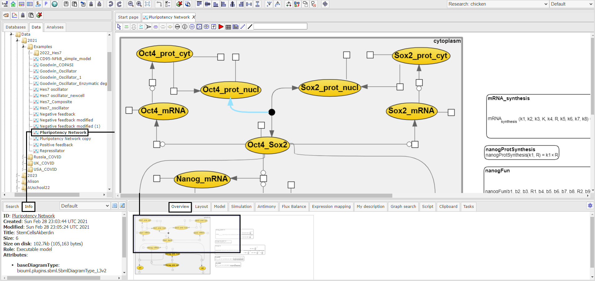

Diagram
=======

**Diagrams** (graphs) as two-dimensional geometric representations of information according to
graphic notation conventions are provided by a number of databases and tools in BioUML. Diagram consists of nodes,
edges and compartments (all of them are called as **diagram elements**):

-    A **node** is usually represented as some geometrical shape like a box or an ellipse;
-    An **edge** is a line which connects two nodes;
-    A **compartment** is a special type of node which can contain other nodes within.

.. |diagram| image:: /images/icons/Type-Diagram-icon.png

When you double-click on the button |diagram| in the :guilabel:`Data` tab of the :doc:`Repository Tree </user_interface>`, a diagram document is
opened allowing you to view or edit the diagram. The general scheme of their use is that an overview of a graph
is shown in the :doc:`Operations Field </user_interface>`, while its full-sized view is shown
in the :doc:`Work Space </user_interface>` above, where usually only a part of the whole diagram is visible.

   A diagram opened in BioUML web edition

.. seealso::

   ...diagram types...

Getting started with diagram
----------------------------

.. |zoom in| image:: /images/icons/WebAction-toolbar-zoom_in-icon.png
.. |zoom out| image:: /images/icons/WebAction-toolbar-zoom_out-icon.png
.. |fit to screen| image:: /images/icons/fit_to_screen.png

The currently displayed section can be shifted:

-     either in the document pane by clicking and dragging the "canvas" of the diagram or using the scrollbars,
-     or by shifting (clicking and dragging) the dotted rectangle (representing the area now viewed in
      the :doc:`Work Space </user_interface>`) in the :guilabel:`Overview` tab of the :doc:`Operations Field </user_interface>`.

To display a full-sized view of the diagram in the :doc:`Work Space </user_interface>`), click the button |fit to screen|
in the :doc:`General Control Panel </user_interface>`. Diagrams can be **zoomed in** and **zoomed out** by clicking on the buttons
|zoom in| or |zoom out|, correspondingly, in the :doc:`General Control Panel </user_interface>`.
To facilitate orientation in large diagrams, individual edges are highlighted (turning from a thin,
usually black arrow into a thick light-blue one).

Clicking on an individual **node** can show information about this component in the :guilabel:`Info` tab
(property inspector) of the :doc:`Information Box </user_interface>` (this works for BioModels).
Double-clicking on a **node** will activate the link to reference information on an external website, if any.

Diagram export and import
~~~~~~~~~~~~~~~~~~~~~~~~~
.. |export| image:: /images/icons/WebAction-toolbar-export-icon.png

Diagrams can be **exported** in a number of formats by clicking on the button |export| in the
:doc:`General Control Panel </user_interface>`.

Diagram handling
~~~~~~~~~~~~~~~~

.. |align_down| image:: /images/icons/align_down.png
.. |align_up| image:: /images/icons/align_up.png
.. |align_middle| image:: /images/icons/align_middle.png
.. |align_left| image:: /images/icons/align_left.png
.. |align_right| image:: /images/icons/align_right.png
.. |align_center| image:: /images/icons/align_center.png

Five alignment methods are available in the :doc:`General Control Panel </user_interface>` after opening
a diagram in the :doc:`Work Space </user_interface>`).

.. list-table:: Alignment methods
   :widths: 25 50
   :header-rows: 1

   * - Icon
     - Description
   * - |align_up|
     - Align up
   * - |align_middle|
     - Align middle
   * - |align_down|
     - Align down
   * - |align_left|
     - Align left
   * - |align_center|
     - Align center
   * - |align_right|
     - Align right

Creating a diagram
------------------

