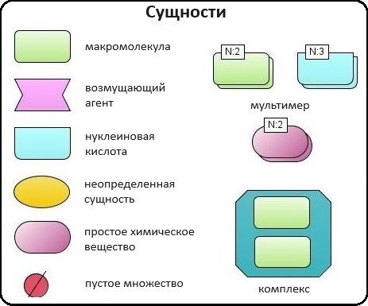
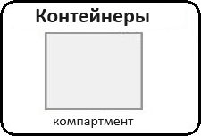
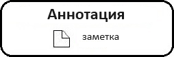
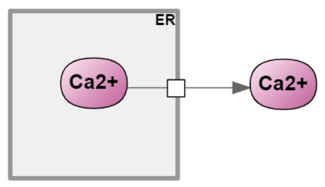
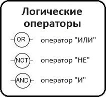
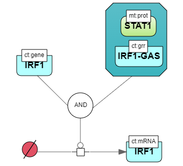
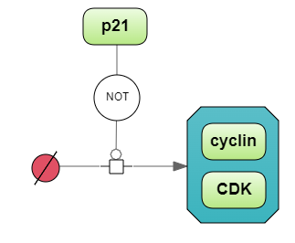

Диаграмма
=========

**Диаграммы** (графики) - это двумерные геометрические представления информации в соответствии с соглашениями о графических обозначенияx.
Диаграмма состоит из узлов, ребер и компартентов, которые называются **элементами диаграммы**:

- **узел** обычно представляет собой некоторую геометрическую фигуру, например прямоугольник или эллипс;
- **ребро** – это линия, соединяющая два узла;
- **компартмент** — это особый тип узла, внутри которого могут находиться другие узлы.

SBGN в BioUML
-------------

.. |equations| image:: /images/sbgn/equations.png
.. |relations| image:: /images/sbgn/relations.png
.. |constraint| image:: /images/sbgn/constraint.png
.. |event| image:: /images/sbgn/event.png
.. |function| image:: /images/sbgn/function.png
.. |tabular| image:: /images/sbgn/tabular.png

.. _SBGN notation:

BioUML полностью поддерживает и активно использует SBML (Systems Biology Markup Language) - язык разметки системной биологии в качестве стандарта для
описания математических моделей с однородными дифференциальными уравнениями (ОДУ) и дискретными событиями (https://sbml.org/). 

BioUML также использует :ref:`(визуальное моделирование) <visual modelling>` как одну из основных функций. Таким образом, каждая модель SBML визуально представлена в интерфейсе BioUML.
Основным компонентом визуального моделирования является формальная графическая запись, определяющая, как отдельные элементы модели
должны быть представлены визуально.

Наиболее известной графической нотацией в системной биологии является SBGN (Systems Biology Graphic Notation), которая поддерживается в BioUML.
Подробное описание графической нотации SBGN можно найти по ссылке (https://sbgn.github.io/).

.. figure:: images/sbgn/nodes_rus.png
   :width: 100%
   :alt: SBGN нотация в BioUML
   :align: center
   
   SBGN нотация в BioUML
   
Новые элементы SBGN в BioUML
~~~~~~~~~~~~~~~~~~~~~~~~~~~~

Однако, SBGN нотация, используемая в BioUML, была расширена *дополнительными эдементами* для полного представления моделей SBML. Графическая нотация SBGN совместима с SBML, хотя она больше полагается на пути, 
состоящие из сущностей и процессами между ними. Таким образом, она не охватывает каждый отдельный объект в моделях SBML. В частности, нет визуального представления «математических» объектов: уравнений, функций, событий и т.п.

Дополнительным мотивом для добавления новых элементов является тот факт, что существует множество математических объектов биологических систем (в частности - физиологических моделей), 
которые не представлены сетью биохимических реакций, а содержат набор уравнений ОДУ.

+-------------------+--------------+-------------------------------------------------------------------------------------------------------------------------------------------------------------------------------------------------------------------------------------------------------------------------------------------------------------------------------------------------------------+
| Название          | Обозначение  | Описание                                                                                                                                                                                                                                                                                                                                                    |
+===================+==============+=============================================================================================================================================================================================================================================================================================================================================================+
| Уравнения         | |equations|  | Математические уравнения в модели: присваивание, алгебраические уравнения, дифференциальные уравнения                                                                                                                                                                                                                                                       |
+-------------------+--------------+-------------------------------------------------------------------------------------------------------------------------------------------------------------------------------------------------------------------------------------------------------------------------------------------------------------------------------------------------------------+
| Зависимости       | |relations|  | Зависимость между уравнениями генерируются автоматически и описывают, как переменная, рассчитанная в одном уравнении, влияет на переменную, рассчитанную в других уравнениях. Было выделено три типа: черная стрелка - эффект не определен; синяя стрелка – значение уменьшается (торможение); красная стрелка - значение увеличивается (активация)         |
+-------------------+--------------+-------------------------------------------------------------------------------------------------------------------------------------------------------------------------------------------------------------------------------------------------------------------------------------------------------------------------------------------------------------+
| Событие           | |event|      | Дискретное событие, которое описывает мгновенные изменения переменных модели при выполнении определенного условия. Напримеример, изменение приема лекарств после определенного момента времени                                                                                                                                                              |
+-------------------+--------------+-------------------------------------------------------------------------------------------------------------------------------------------------------------------------------------------------------------------------------------------------------------------------------------------------------------------------------------------------------------+
| Функция           | |function|   | Функция принимает значения аргументов и вычисляет выходные данные                                                                                                                                                                                                                                                                                           |
+-------------------+--------------+-------------------------------------------------------------------------------------------------------------------------------------------------------------------------------------------------------------------------------------------------------------------------------------------------------------------------------------------------------------+
| Ограничение       | |constraint| | Ограничение - это условие, которое проверяется во время моделирования. Если условие нарушается, то либо выдается сообщение об ошибке, либо моделирование останавливается в зависимости от опций симулятора                                                                                                                                                  |
+-------------------+--------------+-------------------------------------------------------------------------------------------------------------------------------------------------------------------------------------------------------------------------------------------------------------------------------------------------------------------------------------------------------------+
| Табличный элемент | |tabular|    | Табличный элемент используется для расчета переменных модели на основе данных в в указанной таблице. Например, в этом случае столбец таблицы t соответствует времени, а столбец x_values содержит числовые данные для переменной модели x. Существует два способа обработки табличных данных: сплайн-аппроксимация и кусочно-заданная функция               |
+-------------------+--------------+-------------------------------------------------------------------------------------------------------------------------------------------------------------------------------------------------------------------------------------------------------------------------------------------------------------------------------------------------------------+

.. _diagram_types:

Типы диаграмм
-------------

*Концепция типа диаграммы* была введена для учета различных типов диаграмм и специфики предметной области. Тип диаграммы определяет:

-    виды биологических компонентов и их взаимодействия, которые можно отобразить на схеме;
-    конструктор диаграмм – формирует представление (изображение) для каждого элемента графа с учетом особенностей предметной области. Например, построитель диаграммы биологических путей отображает белки в виде кружков, гены в виде прямоугольников, а вещества в виде квадратов;
-    семантический контроллер – обеспечивает смысловую целостность диаграммы при ее редактировании. Он учитывает ограничения предметной области, например, если какое-то вещество удаляется на диаграмме биологического пути, все связанные реакции также должны быть удалены.

BioUML предоставляет ряд типов диаграмм, которые позволяют исследователю описывать биологические пути, такие как метаболические пути, пути передачи сигналов и генные сети:

-   **Математическая модель** - модель, состоящая из обыкновенных дифференциальных уравнений (ОДУ), алгебраических уравнений и событий. Никакие сущности или реакции между ними не используются;
-   **Композиционная модель** - иерархическая модель, которая может содержать ОДУ с событиями как взаимосвязанные части. Моделирование проводится путем «сглаживания» модели до ОДУ;
-   **Модель SBML в нотации SBGN** - модель с языком разметки системной биологии (Systems Biology Markup Language, SBML), использующая графическую нотацию системной биологии (Systems Biology Graphic Notation, SBGN);
-   **Композиционная модель SBML в нотации SBGN** - Иерархическая модель языка разметки системной биологии (SBML) с графической нотацией системной биологии (SBGN);
-   **Популяционная модель** - модель содержит структурную модель, распределение ее параметров и внешние события (например, дозирование лекарственного средства);
-   **Агентная модель** - иерархическая модель, которая может содержать модули различного формализма и типа (модели ODE, модели PDE, скрипты, специальные модули);
-   **Артериальное дерево** - модель кровотока в артериальном дереве. Описывает строение и свойства (площадь и эластичность) сосудистого русла. Численное моделирование предоставляет информацию о кровотоке (давлении, скорости потока) в русле данного сосуда;
-   **Модель мозга** - модель мозга на региональном или клеточном уровне;
-   **Модель BioNetGen** - Модель BioNetGen Language (BNGL) со специальным графическим обозначением;
-   **Модель EndoNet** - XML диаграмма (диаграмма EndoNet);
-   **Метаболический путь** - XML-диаграмма (Метаболический путь (KEGG-модифицированный)).

Первые шаги при работе с диаграммой
-----------------------------------

Создание диаграммы
~~~~~~~~~~~~~~~~~~

Для *создания новой диаграммы*, во вкладке :guilabel:`Data` области :doc:`репозитория </user_interface>` выберите проект и нажмите правой кнопкой мыши на нужную папку, в которой планируется
создание диаграммы. В выпадающем списке нажмите на поле |diagram| New diagram. 

.. |diagram| image:: /images/icons/Type-Diagram-icon.png
.. |zoom in| image:: /images/icons/WebAction-toolbar-zoom_in-icon.png
.. |zoom out| image:: /images/icons/WebAction-toolbar-zoom_out-icon.png
.. |fit to screen| image:: /images/icons/fit_to_screen.png

Чтобы *открыть ранее созданную диаграмму*, двойным щелчком мыши нажмите на файл диаграммы, который будет отображаться как |diagram| во вкладке :guilabel:`Data` области :doc:`репозитория </user_interface>`.
В :doc:`рабочем пространстве </user_interface>` отображается полноразмерная *часть диаграммы*, в то время как   
*общий вид диаграммы* — в :doc:`поле операций </user_interface>`. Область диаграммы, отображенная в рабочем пространстве выделяется пунктиром на общем виде диаграммы, расположенной
в области поля операций. Для облегчения ориентации на больших диаграммах отдельные края подсвечиваются, превращаясь из тонкой, обычно черной стрелки, в толстую голубую.

.. figure:: images/diagrams/opened_diagram.png
   :width: 100%
   :alt: Открытая диаграмма в веб-версии BioUML
   :align: center

   Открытая диаграмма в веб-версии BioUML

Текущую отображаемую область диаграммы можно сместить:

-     в рабочем пространстве, щелкнув и перетащив «холст» диаграммы, либо используя полосы прокрутки; 
-     сдвинув (щелкнув и перетащив) пунктирный прямоугольник (представляющий область, которая сейчас просматривается в рабочем пространстве) на вкладке :guilabel:`Overview` в области поля операций .

Чтобы отобразить *полноразмерный общий вид диаграммы* в рабочем пространстве, нажмите кнопку |fit to screen|, расположенную на :doc:`общей панели управления </user_interface>`. 
Диаграммы можно *увеличивать* и *уменьшать*, нажимая на кнопки |zoom in| или |zoom out|, соответственно, также расположенные в общей панели управления. 

Экспорт и импорт диаграммы
~~~~~~~~~~~~~~~~~~~~~~~~~~

.. |export| image:: /images/icons/WebAction-toolbar-export-icon.png

Диаграммы можно *экспортировать* в различных форматах, нажав кнопку |export|, расположенной на общей панели управления.

Выравнивание диаграммы
~~~~~~~~~~~~~~~~~~~~~~

.. |align_down| image:: /images/icons/align_down.png
.. |align_up| image:: /images/icons/align_up.png
.. |align_middle| image:: /images/icons/align_middle.png
.. |align_left| image:: /images/icons/align_left.png
.. |align_right| image:: /images/icons/align_right.png
.. |align_center| image:: /images/icons/align_center.png

Пять *методов выравнивания диаграммы* доступны на общей панели управления после открытия диаграммы в рабочем пространстве.

.. list-table:: Выравнивание диаграммы
   :widths: 25 50
   :header-rows: 1

   * - Обозначение
     - Описание
   * - |align_up|
     - Выравнивание по верхнему краю
   * - |align_middle|
     - Выравнивание по середине
   * - |align_down|
     - Выравнивание по нижнему краю
   * - |align_left|
     - Выравнивание по левому краю
   * - |align_center|
     - Выравнивание по центру
   * - |align_right|
     - Выравнивание по правому краю
	 
.. _visual modelling:

Визуальное моделирование
========================

Задача моделирования сложных систем может быть существенно упрощена с точки зрения исследователя путем представления моделей систем в виде диаграмм и
использования компьютерных программ, поддерживающих визуальное моделирование. 

*Визуальное моделирование* – это формальное графическое представление систем и
процессов в виде диаграмм и последующее моделирование их динамики на основе такого графического представления.

Общие принципы работы с элементами диаграммы
--------------------------------------------

Для того, чтобы *создать новый элемент* на диаграмме, необходимо нажать на его иконку, расположенную на панели инструментов в верхней части рабочего пространства. 
После этого выберите место на рабочем пространстве, где планируете разместить новый элемент. При создании нового элемента в открывшемся окне можно редактировать свойства элемента. 
Также необходимо дать название и присвоить титул элементу в полях :guilabel:`name` и :guilabel:`title`, соответственно. Титул будет отображаться на диаграмме и может не соответсвовать названию элемента.
После того, как сущность создана, титул подлежит изменению, а название нет. 

.. _panel:

.. figure:: /images/interface/modelling_icons.png
   :width: 70%
   :alt: Панель инструментов
   :align: center

   Панель инструментов
   
Нажатие на отдельный узел диаграммы позволяет отобразить *информацию об этом компоненте*, отображаемой на вкладке :guilabel:`Info` (инспектор свойств) в области :doc:`информационного окна </user_interface>`. 
Двойной щелчок по узлу активирует ссылку на справочную информацию на внешнем веб-сайте, если таковая имеется. 
   
Нажав правой кнопкой мыши на созданный элемент на диаграмме, в открывшемся меню поле :guilabel:`Edit` позволяет изменять *дополнительные свойства элемента*, с помощью :guilabel:`Fix node` и :guilabel:`Unfix node` можно *зафиксировать элемент 
на диаграмме* и сделать свободным в перемещении, соответственно. Чтобы удалить элемент, нужно нажать на кнопку :guilabel:`Remove`. Для того, чтобы скопировать элемент, нажмите кнопку :guilabel:`Copy`. Скопированный элемент диаграммы будет иметь тот же титул
и название с добавлением суффикса "_1".

.. note:
   На диаграмме не может сущестсвовать двух элементов с одинаковыми названиями, однако могут быть одинаковые титулы для различных элементов. 
   Также можно создать элемент без титула, оставив поле пустым, либо сняв галочку в поле :guilabel:`Show tittle` в *дополнительных свойствах элемента*

.. figure:: /images/interface/settings.png
   :width: 30%
   :alt: Опции элемента диаграммы
   :align: center

   Опции элемента диаграммы
   
*Месторасположение элементов* на диаграмме можно изменять посредством зажимания элемента правой кнопкой мыши и перемещением в другое место на полотне. 
У созданного элемента на диаграмме, представленного в виде геометрической фигуры, можно *изменить размер* засчет его выделения и растяжения/сужения, нажав на его углы или стороны. Размер фигуры также можно изменить в 
дополнительных свойствах элемента, задав его размеры в полях :guilabel:`Width` и :guilabel:`Height`.

Типы элементов диаграммы 
------------------------
  
Сущности
~~~~~~~~

.. |complex| image:: /images/icons/complex.png
.. |entity| image:: /images/icons/entity.png
    
Сущности являются элементами диаграммы, которые также являются ее узлами. Согласно нотации SBGN, в BioUML доступны все типы *сущностей*, которые разделяются на два класса:

-     материальные: макромолекула, простое химическое вещество, нуклеиновая кислота, неопределенная сущность, мультимер и комплекс;
-     концептуальные: пустое множество и возмущающий агент.

   
   Сущности
  
+-----------------------------+-----------------------------------------------------------------------------------------------------------------------------------------------------------------------------------------------------------+
| Название                    | Описание нотации SBGN                                                                                                                                                                                     |
+=============================+===========================================================================================================================================================================================================+
| Неопределенная сущность     | сущность, тип которой неизвестен либо не имеет прямого биологического значения.                                                                                                                           |
+-----------------------------+-----------------------------------------------------------------------------------------------------------------------------------------------------------------------------------------------------------+
| Простое химическое вещество | определяется как противоположность макромолекулы: химическое соединение,                                                                                                                                  |
|                             | которое не образуется путем ковалентного связывания псевдоидентичных остатков.                                                                                                                            |
|                             | Примерами этого типа могут служить атом, ион, радикал и др.биохимические вещества                                                                                                                         |                             
+-----------------------------+-----------------------------------------------------------------------------------------------------------------------------------------------------------------------------------------------------------+
| Макромолекулы               | биохимические вещества, образующиеся от ковалентного связывания псевдоидентичных единиц - белки, нуклеиновые кислоты, полисахариды.                                                                       |                                           
+-----------------------------+-----------------------------------------------------------------------------------------------------------------------------------------------------------------------------------------------------------+
| Нуклеиновая кислота         | представляет собой фрагмент макромолекулы, несущий генетическую информацию.                                                                                                                               |
|                             | Обычно этот тип сущности используют для представления гена или транскрипта.                                                                                                                               |
+-----------------------------+-----------------------------------------------------------------------------------------------------------------------------------------------------------------------------------------------------------+
| Мультимер                   | мультимер представляет собой совокупность множества одинаковых или псевдоидентичных                                                                                                                       |
|                             | соединений, удерживаемых вместе нековалентными связями. Примером мультимера может                                                                                                                         |
|                             | служить димерный рецептор. Существуют четыре типа мультимера: мультимер простого                                                                                                                          |
|                             | химического вещества, мультимер макромолекулы, мультимер с признаками нуклеиновой кислоты и мультимер комплекса.                                                                                          |
+-----------------------------+-----------------------------------------------------------------------------------------------------------------------------------------------------------------------------------------------------------+
| Комплекс                    | комплекс представляет собой пул биохимических объектов, каждый из которых состоит из других биохимических объектов, будь то макромолекулы, простые химические вещества, мультимеры или другие комплексы.  |
+-----------------------------+-----------------------------------------------------------------------------------------------------------------------------------------------------------------------------------------------------------+
| Пустое множество            | представляет собой отсутствие компонента в модели. Допустим, при создании реакции деградации, у которой отсутствует фактический продукт, на диаграмме будет отображаться пустое множество.                |
+-----------------------------+-----------------------------------------------------------------------------------------------------------------------------------------------------------------------------------------------------------+
| Возмущающий агент           | отображает внешнее воздействие на компоненты модели. Например, это может быть изменение температуры, излучение, мутация и др.                                                                             |
+-----------------------------+-----------------------------------------------------------------------------------------------------------------------------------------------------------------------------------------------------------+

.. note::
   Некоторые типы сущностей могут опционально содержать :ref:`вспомогательные единицы <units>`. При этом одной сущности может соответсвовать несколько вспомогательных единиц. 
 
**Макромолекула**, **простое химическое вещество**, **нуклеиновая кислота**, **неопределенная сущность**, **возмущающий агент** и **комплекс** добавляется на диаграмму засчет выбора иконки |entity| на панели инструментов и выборе 
нужного типа сущности в открывшемся окне в поле :guilabel:`sbgb:enityType`. 

.. figure:: images/interface/creating_entity.png
   :width: 70%
   :alt: Создание сущности в веб-версии BioUML
   :align: center

   Создание сущности в веб-версии BioUML

**Комплекс** может быть создан также путем выбора иконки |complex| на панели инструментров. Для того, чтобы поместить в комплекс другие объекты, необходимо зажать их правой кнопки мыши и поместить внутрь него. 
   
**Мультимер** создается засчет указания в поле :guilabel:`sbgn:multimer` количества субъединиц, входяших в его состав. Мультимер можеть быть создан для всех типов упомянутых выше сущностей, за исключением возмущающего агента и 
неопределенной сущности. Cозданные мультимер будет содержать :ref:`единицу информации <units>` вида N:n, где n - количество субъединиц в составе мультимера.

Компартмент
~~~~~~~~~~~

.. |compartment| image:: /images/icons/compartment.png

**Компартмент** является отдельным элементом диаграммы, в составе которого могут находиться сущности. Компартмент создается с помощью нажаться на иконку |compartment|, расположенную на панели инструментов. 

   
   Компартмент

.. note::
   Отдельная сущность может принадлежать только одному компартменту. Таким образом, «одни и те же» биохимические виды, находящиеся в двух разных компартментах, на самом деле представляют собой две разных сущности. 
   После того, как сущность будет перемещена в компартмент, название этой переменной будет изменено путем добавления названия компартмента перед названием сущности. Например, $compartment.entity.
   
.. figure:: images/diagrams/IGF_signaling.jpg
   :width: 90%
   :alt: SBGN диаграмма сигналинга IGF-1
   :align: center

   SBGN диаграмма сигналинга IGF-1, содержащая два компартмента - внеклеточное пространство (extracellular) и цитозоль (cytosol)   
   
.. _units:

Вспомогательные единицы
~~~~~~~~~~~~~~~~~~~~~~~

.. |unit_of_information| image:: /images/icons/unit_of_information.png
.. |variable| image:: /images/icons/variable.png
.. |clone_node| image:: /images/icons/clone_node.png
.. |merge_node| image:: /images/icons/merge_node.png

Согласно нотации SBGN, в BioUML доступны все типы *вспомогательных единиц*: единицы информации, переменные состояния и маркеры клонирования.
Каждой сущности может соответсвовать несколько вспомогательных единиц как одного типа, так и нескольких. 

.. figure:: images/sbgn/auxilary_units_rus.png
   :width: 50%
   :alt: Вспомогательные единицы
   :align: center
   
   Вспомогательные единицы

**Единица информации** используется для добавления дополнительной информации к сущности. Для определенных типов информации, нотация SBGN определяет конкретные префиксы. 
С более подробной информацией о префиксах можно ознакомиться по ссылке (https://sbgn.github.io/).

-   pt - физические характеристики, такие как температура (pc:T), pH (pc:pH) и др. Предполагается, что они будут использоваться для описания характера возмущающего воздействия агента 
    или фенотипа.
-   mt - биологический тип сущности, такие как ДНК (mt:dna), РНК (mt:rna), ион (mt:ion) и др.
-   ct - концептуальные типы сущности, такие как ген (ct:gene), сайт транскрипции (ct:tss) и др. 

.. figure:: images/diagrams/gene_regulation.jpg
   :width: 70%
   :alt: Регуляция экспрессии гена
   :align: center
   
   Пример использования единиц информации при создании диаграммы, описывающей процесс регуляции экспрессии гена  
   
Для того, чтобы добавить вспомогательную единицу к сущности, нажмите на иконку |unit_of_information|, расположенную на :ref:`панели инструментов <panel>` и затем на выбранную сущность. 
   
**Переменные состояния** используются для описания изменения физического состояния биологического объекта. Обычно, переменная состояния строится из двух подстрок, разделенных символом "@", 
первая из которых идентифицирует значение переменной состояния, а вторая — ее имя. Например, при описании процесса фосфорилирования белка, для нефосфорилированной формы может использоваться 
переменная состояния "@S122" либо пустое состояние, обозначающая позицию фосфорилирования, и для фосфорилированной формы - "P@S122", где P - остаток фосфорной кислоты. Символ "@" опускается, если
переменная состояния не имеет имени, как например, при обозначении активной и неактивной формы белка. 

Для некоторых переменных состояния отображающих ковалетнтные модификации макромолекул существуют определенные идентификаторы. Например, фосфорилирование (P), ацетилирование (Ac), метиилирование (Me) и др.

Для того, чтобы добавить переменную состоянию к сущности, нажмите на иконку |variable|, расположенную на :ref:`панели инструментов <panel>` и затем на выбранную сущность. 

.. figure:: images/diagrams/phosphorylation.jpg
   :width: 60%
   :alt: Регуляция экспрессии гена
   :align: center
   
   Пример использования переменных состояния при создании диаграммы, описывающей процесс фосфорилирования белка 

**Маркеры клонирования** используются при дублировании сущности на диаграмме.

Для создания клона нажмите на сущность, которую хотите клонировать и затем на иконку |clone_node|, расположенную на общей панели управления. Чтобы объединить клоны, нажмите на клон и затем на иконку 
|merge_node|. 

.. figure:: images/diagrams/glycolysis.jpg
   :width: 100%
   :alt: Гликолиз
   :align: center
   
   Пример использования маркеров клонирования при создании диаграммы, описывающей процесс гликолиза. АТФ и АДФ встречаются в этом пути трижды, поэтому оба идентифицируются с помощью клон-маркера.
   
Заметка
~~~~~~~

.. |note| image:: /images/icons/note.png
.. |note_link| image:: /images/icons/note_link.png

**Заметка** используется для добавления дополнительной информации, например, детального описания молекулярных механизмов, отображенных на диаграмме. Аннотация может быть представлена как отдельный элемент на диаграмме,
так и быть связанной с сущностью при помоши **ребра заметки**.

   
   Заметка

Для того, чтобы создать заметку, нажмите на иконку |note|, расположенную на :ref:`панели инструментов <panel>`. Затем, вы можете связать ее с сущностью, создав ребро заметки, нажав на иконку |note_link|, 
и соединив этим ребром сущность и аннотацию.

.. figure:: images/diagrams/annotation.png
   :width: 50%
   :alt: Заметка
   :align: center
   
   Пример использования заметки, связанной с сущностью. 

.. _process:

Процессы 
~~~~~~~~

*Процессы* представляют собой реакции, в которых исходные вещества (одна или несколько сущностей) превращаются в продукты (один или несколько пулов сущностей). На диаграмме процессы отображаются в виде геометрических фигур 
(круг или квадрат), связанные с двумя портами, которые представляют собой небольшие дуги (ребра), прикрепленные к центрам противоположных сторон фигуры процесса.

.. note:: 
   Создание реакций с использованием описанных элементов диаграммы будет обсуждаться в разделе :ref:`"Создание реакций" <reactions>`. 

Согласно нотации SBGN был выделен один общий тип - базовый процесс, а также пять типов специфических процессов: пропущенный процесс, неопределенный процесс, ассоциация, диссоциация и
фенотип.  

.. figure:: images/sbgn/processes_rus.png
   :width: 50%
   :alt: Процессы
   :align: center
   
   Процессы 

**Базовый процесс** является общим процессом, который описывает преобразование данного набора биохимических объектов - макромолекул, 
простых химических веществ или неопределенных сущностей в другой набор сущностей. Примером процесса могут служить
ковалентные модификации белков (фосфорилирование, метилирование и др.) и транслокация - перемещение сущности из одного 
компартмента в другой. 

**Пропущенный процесс** - это процесс, который опускается при создании диаграммы. При этом один пропушенный процесс
может соответсвовать нескольким фактическим процессам.

**Ассоциация** соответствует нековалентному связыванию биологических объектов и образованию комплекса. Например, ассоциация 
соответствует образованию мультимера и комплекса. 

**Диссоциация** представляет собой разрыв нековалентного связывания между биологическими объектами. Примером диссоциации
может служить распад комплекса либо мультимера. 

**Фенотип** - это процесс, который приводит к проявлению фенотипа. Пример использования фенотипа представлен на рисунке "SBGN диаграмма сигналинга IGF-1", где белок c-Fos связан с фенотипом - процессом транскрипции генов. 

.. _edges:

Ребра
~~~~~

По нотации SBGN выделяется четыре типа ребер - *ребра потоков*, *ребра модуляции*, :ref:`логическое ребро <logical arc>` и *ребро аннотации*.

*Ребра потоков* позволяют представить, какие пулы сущностей потребляются и производятся процессом. 
Ребра **потребления** связывают процессы с реагентами, а ребра **производства** связывают процессы с продуктами. При создании реакции в BioUML эти ребра создаются автоматически. 

   
   Диаграмма, описывающая транспорт иона Ca2+. В реакции траслокации тип использованного процесса - базовый процесс, с ребрами потребления и продукции.

.. _modulation:   
   
*Ребра модуляции* представляют собой влияние пулов сущностей на процессы. Выделяется пять видов ребер: модуляция, стимуляция, катализ, ингибирование и необходимая стимуляция. 

.. figure:: images/sbgn/edges_rus.png
   :width: 50%
   :alt: Ребра
   :align: center
   
   Ребра 
   
**Модуляция** используется, когда неизвестно точное направление процесса - положительное или отрицательное воздействие, которое может зависеть, например,
от концентрации реактантов. Примером модуляции может служить влияние никотина на конформацию никотинового рецептора ацетилхолина. Высокие концентрации никотина 
открывают рецептор, тогда как низкие концентрации могут снизить его чувствительность, не открывая его.

.. figure:: images/diagrams/modulation.png
   :width: 50%
   :alt: Модуляция
   :align: center

   Модуляция открытия никотиновых рецепторов никотином
   
**Стимуляция** положительно влияет на поток процесса, представленного целевым процессом. Эта стимуляция может представлять собой, например, катализ или положительную аллостерическую регуляцию. Однако, катализ существует независимо в SBGN нотации.

.. figure:: images/diagrams/stimulation.png
   :width: 60%
   :alt: Стимуляция
   :align: center
   
   Противоположное влияние агонистов и обратных агонистов на рецептор GPCR. При создании реакций были использованы ребра стимуляции.
   
**Катализ** — это частный случай стимуляции, при котором эффектор положительно влияет на поток процесса, представленного целевым процессом. Положительное влияние на процесс обусловлено снижением энергии активации реакции.

.. figure:: images/diagrams/catalysis.png
   :width: 60%
   :alt: Катализ
   :align: center
   
   Киназа МАPKK катализирует фосфорилирование МАРК

**Ингибирование** отрицательно влияет на поток процесса, представленного целевым процессом. Ингибирование может быть, например, конкурентным ингибированием или аллостерическим ингибированием.

.. figure:: images/diagrams/inhibition.png
   :width: 60%
   :alt: Ингибирование
   :align: center
   
   Белок Gαi, ингибирует превращение АТФ в цАМФ
   
**Необходимая стимуляция** – это стимуляция, необходимая для того, чтобы процесс состоялся. 

.. figure:: images/diagrams/translation.png
   :width: 70%
   :alt: Трансляция
   :align: center
   
   Tранскрипция гена и последующая трансляция

Логические операторы
~~~~~~~~~~~~~~~~~~~~

*Логические операторы* выполняют операцию над одним или несколькими входными данными для получения уникального результата. Входные данные обычно представляют собой другой логический оператор или могут быть узлами пула сущностей.
Выделяются три типа логических операторов: "И", "ИЛИ", "НЕ".

   
   Логические операторы 
   
.. note::
   Добавление логических операторов в реакцию обсуждается в разделе :ref:`Визуальное моделирование реакций <logical_operator>` 

.. _logical arc:

**Логическое ребро** создается автоматические при использовании логического оператора и соединяет пул сущностей и логический оператор.

**Логический оператор "И"** используется для обозначения того, что все узлы, связанные как входные, необходимы для получения выходных данных. 
Примером использования этого логическоского оператора заключается в синтезе мРНК IRF1, для которого необходимы как ген IRF1, так и комплекс, образованный белком STAT1 и регуляторной областью гена IRF1-GAS. 
Таким образом, логический оператор "И" связывает оба компонента, стимулируя процесс, который приводит к синтезу мРНК IRF1.

   
   Пример использования логического оператора "И"

**Логический оператор "ИЛИ"** используется для обозначения того, что любой узел, связанный как входной, достаточен для получения выходных данных.
В следующем примере показана транскрипция мРНК SDH2-3, активируемая пулом комплексов транскрипционных факторов, каждый из которых способен в одиночку активировать транскрипцию.  

.. figure:: images/diagrams/or.png
   :width: 70%
   :alt: ИЛИ
   :align: center
   
   Пример использования логического оператора "ИЛИ"

**Логический оператор "НЕ"** используется для обозначения того, что выходные данные получаются только при отсутствии определенных входных данных. Следующий пример показывает, что продукция комплекса циклин-CDK не стимулируется белком p21.

   
   Пример использования логического оператора "НЕ"

.. _reactions:

Визуальное моделирование реакции
--------------------------------

.. |reaction| image:: /images/icons/reaction.png
.. |logical_operator| image:: /images/icons/logical_operator.png

Для *создания реакции* нажмите на иконку |reaction|, расположенную на :ref:`панели инструментов <panel>`.
В открывшемся окне в поле :guilabel:`Reaction name` введите *название реакции*, либо оставьте
автоматически сгенерированное название типа "Reaction_n", где n - порядковый номер реакции. 

*Компоненты реакции* добавляются путем нажатия на ранее 
созданную сущность на диаграмме, название которой будет отображено в поле :guilabel:`Component`, и
выбора ее роли в поле :guilabel:`Role`. Существует три *роли сущности реакции* - modifier (модификатор),
реактант (reactant) и продукт (product). 

.. note::
   Одна и та же сущность может играть несколько ролей в одной реакции 

При добавлении компонентов в реакцию, *титул реакции* будет автоматически сгенерирован в поле guilabel:`Reaction title`, который так же можно изменить по желанию.

   
   Создание новой реакции в BioUML  
   
После того, как реакция будет создана, можно редактировать *дополнительные свойства реакции*, путем нажатия правой кнопки мыши на геометрическую фигуру, отображающую :ref:`процесс <process>`, и последующего выбора поля :guilabel:`Edit`. В открывшемся окне в опциях :guilabel:`Species references` перечислены компоненты реакции, 
для которых можно добавить *стехиометрию* в поле :guilabel:`Stoichiometry` и для модификатора указать его *тип влияния на процесс*, т.е обозначить вид :ref:`ребра модуляции <modulation>`. 
В опциях :guilabel:`Attributes` в поле :guilabel:`sbgn:reactionType` указывается тип :ref:`процесса <process>`.  

Нажатие правой кнопкой мыши на :ref:`ребра реакции <edges>` открывает опции, позволяющие изменять *дополнительные свойства ребер*, также доступные в дополнительных свойствах реакции, и 
редактировать *геометрическую форму ребер* - добавлять новую вершину (Add vertex), выпрямлять ребро (Straighten edge) и др.

.. _logical_operator:

.. figure:: images/interface/logical_operator.png
   :width: 80%
   :alt: Логический оператор
   :align: center
   
   Добавление логического оператора в реакцию в BioUML 

Для того, чтобы добавить *логический оператор* в реакцию, создайте реакцию без добавления модификатора в компоненты реакции. Далее нажмите на иконку
|logical_operator|, расположенную на :ref:`панели инструментов <panel>`. В открывшемся окне в поле :guilabel:`sbgn:logicalOperator` выберите нужный тип оператора, в поле :guilabel:`Reaction` 
- ранее созданную реакцию, и затем укажите также ранее созданную сущность, которая будет в реакции выполнять роль модификатора в поле :guilabel:`Modifiers` и укажите его тип влияния на процесс в 
поле :guilabel:`Modifier type`. 

.. note::
   Если в реакции предполагается несколько модификаторов, зажимая Shift, укажите несколько сущностей. 

Модульное моделирование 
=======================

.. |bus| image:: /images/module/bus.png
.. |constant| image:: /images/module/constant.png
.. |directed_link| image:: /images/module/directed_link.png
.. |undirected_link| image:: /images/module/undirected_link.png
.. |input| image:: /images/module/input.png
.. |output| image:: /images/module/output.png
.. |contact| image:: /images/module/contact.png
.. |submodel| image:: /images/module/submodel.png
.. |switcher| image:: /images/module/switcher.png

*Модульный подход* к моделированию биологических систем в последние годы активно развивается. 
Он подразумевает декомпозицию системы на подсистемы, 
каждая из которых может быть смоделирована и проверена независимо. 
Модель всей системы задается как совокупность моделей подсистем (модулей). 
Этот подход делает структуру сложных иерархических моделей более явной за счет выделения 
функциональных единиц и их взаимосвязей. Он также позволяет включать в сложные модели модели, 
разработанные разными авторами, фокусируясь на разных частях системы и используя разные масштабы и 
даже формализмы.

В платформе BioUML диаграмма, описывающая модульную модель, содержит
соединенные между собой элементы – **модули**, каждый из которых ссылается на
другую диаграмму (возможно, тоже модульную) в платформе. Модули взаимодействуют между собой засчет
передачи сигналов между ними, которая осуществляется засчет **портов**.

В зависимости от *направления передачи сигнала* выделяется три типа портов: вход, выход и контакт.

-     **Вход** - значение переменной подается на вход модуля и не может быть изменено модулем;
-     **Выход** - значение переменной полностью определяется (вычисляется) внутри модуля и подается на вход в неизмененное виде другим модулям;
-     **Контакт** - разделяемая переменная, соединенные модули могут вносить изменения (приращение или убывание) в значение соответствующей переменной.

.. _module_concept:

   
   Концепция модуля
   
Существует три типа *доступности портов*, они могут быть приватными, публичными и вынесенными:

-     **Приватный порт** используется для изменения поведения модулей. 
-     **Публичный порт** используется для представления модульной модели в виде модцля и включения ее в другую модельную модель.
-     **Вынесенный порт** ...

.. note::
   добавить что такое вынесенный порт и возможно дать объяснение попроще для приватного и публичного 
   
Между выходом и входом устанавливается **направленная связь**, означающая передачу сигнала из одного модуля в другой. 
Между контактами – **ненаправленная связь**, обозначающая обмен сигналами.

.. table:: Графическая нотация элементов, используемых при модульном моделировании

   +----------------------+-------------------+-------------------------------------------------------------------------------------------------+
   | Название             | Обозначение       | Описание                                                                                        |
   +======================+===================+=================================================================================================+
   | **Типы модулей**                                                                                                                           |
   +----------------------+-------------------+-------------------------------------------------------------------------------------------------+
   | Подмодель            | |submodel|        | Модуль, содержащий математическую модель: модульная модель; SBML (SBML-SBGN) модель.            |
   +----------------------+-------------------+-------------------------------------------------------------------------------------------------+
   | Переключатель        | |switcher|        | Модуль, в зависимости от условия, подающий на выход один из двух сигналов, поступающих на вход. |
   +----------------------+-------------------+-------------------------------------------------------------------------------------------------+
   | Константа            | |constant|        | Модуль, подающий на выход константное значение.                                                 |
   +----------------------+-------------------+-------------------------------------------------------------------------------------------------+
   | **Порты**                                                                                                                                  |
   +----------------------+-------------------+-------------------------------------------------------------------------------------------------+
   | Входной порт         | |input|           | Порт, определяющий входную переменную подмодели.                                                |
   +----------------------+-------------------+-------------------------------------------------------------------------------------------------+
   | Выходной порт        | |output|          | Порт, определяющий выходную переменную подмодели.                                               |
   +----------------------+-------------------+-------------------------------------------------------------------------------------------------+
   | Контактный порт      | |contact|         | Порт, определяющий разделяемую переменную подмодели.                                            |
   +----------------------+-------------------+-------------------------------------------------------------------------------------------------+
   | Шина                 | |bus|             | Переменная модульной модели. Несколько шин могут соответствовать одной переменной.              |
   +----------------------+-------------------+-------------------------------------------------------------------------------------------------+
   | **Связи**                                                                                                                                  |
   +----------------------+-------------------+-------------------------------------------------------------------------------------------------+
   | Направленная связь   | |directed_link|   | Связь, означающая передачу сигнала из одного модуля в другой.                                   |
   +----------------------+-------------------+-------------------------------------------------------------------------------------------------+
   | Ненаправленная связь | |undirected_link| | Связь, означающая обмен сигналами между модулями.                                               |
   +----------------------+-------------------+-------------------------------------------------------------------------------------------------+

Вспомогательным элементом на модульных диаграммах являются **шины**, позволяющие
устанавливать связи сразу между несколькими модулями дистанционно. Несколько шин могут сооветствовать одной и той же переменной.

Создание модульной модели
-------------------------

.. |subdiagram| image:: /images/icons/Type-Diagram-icon.png
.. |switcher_icon| image:: /images/icons/switcher.png
.. |constant_icon| image:: /images/icons/constant.png
.. |port| image:: /images/icons/port.png
.. |update submodel| image:: /images/icons/update_submodel.png
.. |directed link| image:: /images/icons/directed_link.png
.. |undirected link| image:: /images/icons/undirected_link.png

Для *создания модульной модели* создайте диаграмму следующего :ref:`типа <diagram_types>`: композиционную или композиционная модель SBML в нотации SBGN.
Однако, в модели второго типа будут отсутствовать дополнительные элементы, добавленные в BioUML.

В открывшейся диаграмме **подмодель** добавляется путем нажатия на иконку |subdiagram|, расположенной на :ref:`панели инструментов <panel>`.
Документ диаграммы подмодели выбирается нажатием на поле :guilabel:`Diagram` и последующего выбора файла в открывающемся окне, 
либо зажатием файла диаграммы в области :doc:`репозитория </user_interface>` и переносом его в поле :guilabel:`Diagram`.

.. note::
   При работе с модульной моделью, включающей подмодели, при нажатии на подмодель, в отдельном окне нижней части рабочего пространства, будет отображаться ее диаграмма. 

.. figure:: images/interface/add_subdiagram.png
   :width: 70%
   :alt: Добавление подмодели
   :align: center
   
   Добавление подмодели 

Модулю **переключателя** соответствует иконка |switcher_icon|, а **константе** - |constant_icon|, для которой в поле :guilabel:`Value` задается значение. Переключатель и константа 
добавляются на диаграмму таким же образом на диаграмму, как и подмодель. 

.. note::
   нужно добавить что-то еще и про переключатель, потому что совсем непонятно как он используется, и какой сигнал он подает на вход из двух.
   
*Чтобы создать порт* перейдите в документ подмодели и нажмите на иконку |port|. В открывшемся окне в поле :guilabel:`Access type` выберите 
*тип доступности порта*, в поле :guilabel:`Port type` - *тип порта* и в поле :guilabel:`Tittle` - титул порта, который будет отображаться на диаграмме. 
Из выпадаюшего списка в поле  :guilabel:`Variable name` укажите для какого ранее созданного элемента 
диаграммы будет создан порт. 

Порт, созданный для сущности :doc:`(переменной) <math_model>`, будет автоматически соединен ребром, в случае создания
порта для :doc:`параметра <math_model>`, порт не будет связан с какими-либо элементами диаграммы.
Созданный порт в диаграмме, соответствующей подмодели, будет отображен на модульной диаграмме - внутри подмодели
будут добавлены обозначения портов, что изображено на :doc:`рисунке, описывающем концепцию модуля <module_concept>`. Графическое отображение портов можно перемещать в подмодели, зажимая иконку и перемещая в другое место.

.. note::
   При изменении диаграмм, соответствующих подмоделям, сохраните диаграмму и затем в документе модульной модели нажмите на иконку |update submodel|, расположенную на :doc:`общей панели управления </user_interface>` для ее обновления. 

Для *установления связи между входным и выходным портом* в модульной модели, при ранее созданных портах в диаграммах подмодулей, нажмите на иконку |directed link|, означающей *направленную 
связь*. После этого последовательно нажмите на входной и затем на выхоходной порт, расположенные внутри модулей. *Связь между контактными портами* создается путем нажатия на иконку 
|undirected link|, обозначающей *ненаправленную связь*, и соединения контактных портов. 

.. _math_model:

Математическая модель
=====================

 

   
   