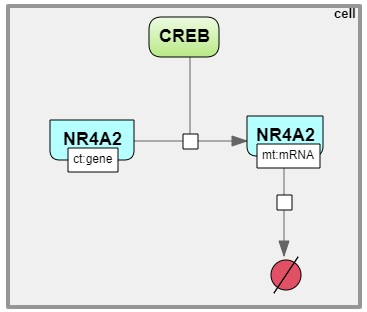
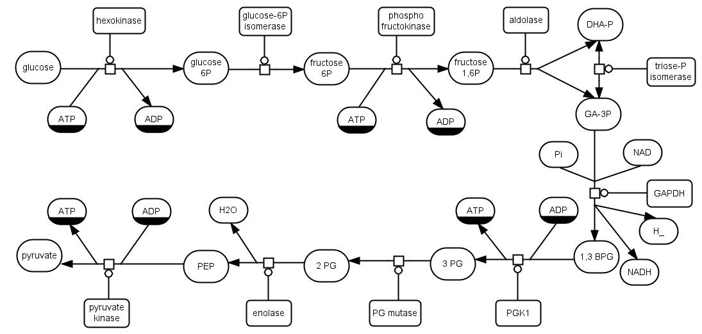

Диаграмма
=========

**Диаграммы** (графики) - это двумерные геометрические представления информации в соответствии с соглашениями о графических обозначенияx.
Диаграмма состоит из узлов, ребер и компартентов, которые называются **элементами диаграммы**:

- **узел** обычно представляет собой некоторую геометрическую фигуру, например прямоугольник или эллипс;
- **ребро** – это линия, соединяющая два узла;
- **компартмент** — это особый тип узла, внутри которого могут находиться другие узлы.

SBGN в BioUML
-------------

.. |equations| image:: /images/sbgn/equations.png
.. |relations| image:: /images/sbgn/relations.png
.. |constraint| image:: /images/sbgn/constraint.png
.. |event| image:: /images/sbgn/event.png
.. |function| image:: /images/sbgn/function.png
.. |tabular| image:: /images/sbgn/tabular.png

.. _SBGN notation:

BioUML полностью поддерживает и активно использует SBML (Systems Biology Markup Language) - язык разметки системной биологии в качестве стандарта для
описания математических моделей с однородными дифференциальными уравнениями (ОДУ) и дискретными событиями (https://sbml.org/). 

BioUML также использует :ref:`(визуальное моделирование) <visual modelling>` как одну из основных функций. Таким образом, каждая модель SBML визуально представлена в интерфейсе BioUML.
Основным компонентом визуального моделирования является формальная графическая запись, определяющая, как отдельные элементы модели
должны быть представлены визуально.

Наиболее известной графической нотацией в системной биологии является SBGN (Systems Biology Graphic Notation), которая поддерживается в BioUML.
Подробное описание графической нотации SBGN можно найти по ссылке (https://sbgn.github.io/).

.. figure:: images/nodes.jpg
   :width: 100%
   :alt: SBGN нотация в BioUML
   :align: center
   
   SBGN нотация в BioUML
   
Новые элементы SBGN в BioUML
~~~~~~~~~~~~~~~~~~~~~~~~~~~~

Однако, SBGN нотация, используемая в BioUML, была расширена *дополнительными эдементами* для полного представления моделей SBML. Графическая нотация SBGN совместима с SBML, хотя она больше полагается на пути, 
состоящие из сущностей и процессами между ними. Таким образом, она не охватывает каждый отдельный объект в моделях SBML. В частности, нет визуального представления «математических» объектов: уравнений, функций, событий и т.п.

Дополнительным мотивом для добавления новых элементов является тот факт, что существует множество математических объектов биологических систем (в частности - физиологических моделей), 
которые не представлены сетью биохимических реакций, а содержат набор уравнений ОДУ.

+-------------------+--------------+-------------------------------------------------------------------------------------------------------------------------------------------------------------------------------------------------------------------------------------------------------------------------------------------------------------------------------------------------------------+
| Название          | Обозначение  | Описание                                                                                                                                                                                                                                                                                                                                                    |
+===================+==============+=============================================================================================================================================================================================================================================================================================================================================================+
| Уравнения         | |equations|  | Математические уравнения в модели: присваивание, алгебраические уравнения, дифференциальные уравнения                                                                                                                                                                                                                                                       |
+-------------------+--------------+-------------------------------------------------------------------------------------------------------------------------------------------------------------------------------------------------------------------------------------------------------------------------------------------------------------------------------------------------------------+
| Зависимости       | |relations|  | Зависимость между уравнениями генерируются автоматически и описывают, как переменная, рассчитанная в одном уравнении, влияет на переменную, рассчитанную в других уравнениях. Было выделено три типа: черная стрелка - эффект не определен; синяя стрелка – значение уменьшается (торможение); красная стрелка - значение увеличивается (активация)         |
+-------------------+--------------+-------------------------------------------------------------------------------------------------------------------------------------------------------------------------------------------------------------------------------------------------------------------------------------------------------------------------------------------------------------+
| Событие           | |event|      | Дискретное событие, которое описывает мгновенные изменения переменных модели при выполнении определенного условия. Напримеример, изменение приема лекарств после определенного момента времени                                                                                                                                                              |
+-------------------+--------------+-------------------------------------------------------------------------------------------------------------------------------------------------------------------------------------------------------------------------------------------------------------------------------------------------------------------------------------------------------------+
| Функция           | |function|   | Функция принимает значения аргументов и вычисляет выходные данные                                                                                                                                                                                                                                                                                           |
+-------------------+--------------+-------------------------------------------------------------------------------------------------------------------------------------------------------------------------------------------------------------------------------------------------------------------------------------------------------------------------------------------------------------+
| Ограничение       | |constraint| | Ограничение - это условие, которое проверяется во время моделирования. Если условие нарушается, то либо выдается сообщение об ошибке, либо моделирование останавливается в зависимости от опций симулятора                                                                                                                                                  |
+-------------------+--------------+-------------------------------------------------------------------------------------------------------------------------------------------------------------------------------------------------------------------------------------------------------------------------------------------------------------------------------------------------------------+
| Табличный элемент | |tabular|    | Табличный элемент используется для расчета переменных модели на основе данных в в указанной таблице. Например, в этом случае столбец таблицы t соответствует времени, а столбец x_values содержит числовые данные для переменной модели x. Существует два способа обработки табличных данных: сплайн-аппроксимация и кусочно-заданная функция               |
+-------------------+--------------+-------------------------------------------------------------------------------------------------------------------------------------------------------------------------------------------------------------------------------------------------------------------------------------------------------------------------------------------------------------+

Типы диаграмм
-------------

*Концепция типа диаграммы* была введена для учета различных типов диаграмм и специфики предметной области. Тип диаграммы определяет:

-    виды биологических компонентов и их взаимодействия, которые можно отобразить на схеме;
-    построитель вида диаграмм – формирует представление (изображение) для каждого элемента графа с учетом особенностей предметной области. Например, построитель диаграммы биологических путей отображает белки в виде кружков, гены в виде прямоугольников, а вещества в виде квадратов;
-    семантический контроллер – обеспечивает смысловую целостность диаграммы при ее редактировании. Он учитывает ограничения предметной области, например, если какое-то вещество удаляется на диаграмме биологического пути, все связанные реакции также должны быть удалены.

BioUML предоставляет ряд типов диаграмм, которые позволяют исследователю описывать биологические пути, такие как метаболические пути, пути передачи сигналов и генные сети:

-   **Математическая модель** - модель, состоящая из обыкновенных дифференциальных уравнений (ОДУ), алгебраических уравнений и событий. Никакие сущности или реакции между ними не используются;
-   **Композиционная модель** - иерархическая модель, которая может содержать ОДУ с событиями как взаимосвязанные части. Моделирование проводится путем «сглаживания» модели до ОДУ;
-   **Модель SBML в нотации SBGN** - модель с языком разметки системной биологии (Systems Biology Markup Language, SBML), использующая графическую нотацию системной биологии (Systems Biology Graphic Notation, SBGN);
-   **Композиционная модель SBML в нотации SBGN** - Иерархическая модель языка разметки системной биологии (SBML) с графической нотацией системной биологии (SBGN);
-   **Популяционная модель** - модель содержит структурную модель, распределение ее параметров и внешние события (например, дозирование лекарственного средства);
-   **Агентная модель** - иерархическая модель, которая может содержать модули различного формализма и типа (модели ODE, модели PDE, скрипты, специальные модули);
-   **Артериальное дерево** - модель кровотока в артериальном дереве. Описывает строение и свойства (площадь и эластичность) сосудистого русла. Численное моделирование предоставляет информацию о кровотоке (давлении, скорости потока) в русле данного сосуда;
-   **Модель мозга** - модель мозга на региональном или клеточном уровне;
-   **Модель BioNetGen** - Модель BioNetGen Language (BNGL) со специальным графическим обозначением;
-   **Модель EndoNet** - XML диаграмма (диаграмма EndoNet);
-   **Метаболический путь** - XML-диаграмма (Метаболический путь (KEGG-модифицированный)).

Первые шаги при работе с диаграммой
-----------------------------------

.. |diagram| image:: /images/icons/Type-Diagram-icon.png
.. |zoom in| image:: /images/icons/WebAction-toolbar-zoom_in-icon.png
.. |zoom out| image:: /images/icons/WebAction-toolbar-zoom_out-icon.png
.. |fit to screen| image:: /images/icons/fit_to_screen.png

При двойном щелчке по кнопке |diagram| во вкладке :guilabel:`Data` области :doc:`репозитория </user_interface>` открывается *документ диаграммы*, 
позволяющий просматривать или редактировать ее. В :doc:`рабочем пространстве </user_interface>` отображается полноразмерная *часть диаграммы*, в то время как   
*общий вид диаграммы* — в :doc:`поле операций </user_interface>`. Область диаграммы, отображенная в рабочем пространстве выделяется пунктиром на общем виде диаграммы, расположенной
в области поля операций. Для облегчения ориентации на больших диаграммах отдельные края подсвечиваются, превращаясь из тонкой, обычно черной стрелки, в толстую голубую.

.. figure:: images/diagrams/opened_diagram.png
   :width: 100%
   :alt: Открытая диаграмма в веб-версии BioUML
   :align: center

   Открытая диаграмма в веб-версии BioUML

Текущую отображаемую область диаграммы можно сместить:

-     в рабочем пространстве, щелкнув и перетащив «холст» диаграммы, либо используя полосы прокрутки; 
-     сдвинув (щелкнув и перетащив) пунктирный прямоугольник (представляющий область, которая сейчас просматривается в рабочем пространстве) на вкладке :guilabel:`Overview` в области поля операций .

Чтобы отобразить *полноразмерный общий вид диаграммы* в рабочем пространстве, нажмите кнопку |fit to screen|, расположенную на :doc:`общей панели управления </user_interface>`. 
Диаграммы можно *увеличивать* и *уменьшать*, нажимая на кнопки |zoom in| или |zoom out|, соответственно, также расположенные в общей панели управления. 

Нажатие на отдельный узел диаграммы позволяет отобразить *информацию об этом компоненте*, отображаемой на вкладке :guilabel:`Info` (инспектор свойств) в области :doc:`информационного окна </user_interface>`. 
Двойной щелчок по узлу активирует ссылку на справочную информацию на внешнем веб-сайте, если таковая имеется.

Экспорт и импорт диаграммы
~~~~~~~~~~~~~~~~~~~~~~~~~~

.. |export| image:: /images/icons/WebAction-toolbar-export-icon.png

Диаграммы можно *экспортировать* в различных форматах, нажав кнопку |export|, расположенной на общей панели управления.

Выравнивание диаграммы
~~~~~~~~~~~~~~~~~~~~~~

.. |align_down| image:: /images/icons/align_down.png
.. |align_up| image:: /images/icons/align_up.png
.. |align_middle| image:: /images/icons/align_middle.png
.. |align_left| image:: /images/icons/align_left.png
.. |align_right| image:: /images/icons/align_right.png
.. |align_center| image:: /images/icons/align_center.png

Пять *методов выравнивания диаграммы* доступны на общей панели управления после открытия диаграммы в рабочем пространстве.

.. list-table:: Выравнивание диаграммы
   :widths: 25 50
   :header-rows: 1

   * - Обозначение
     - Описание
   * - |align_up|
     - Выравнивание по верхнему краю
   * - |align_middle|
     - Выравнивание по середине
   * - |align_down|
     - Выравнивание по нижнему краю
   * - |align_left|
     - Выравнивание по левому краю
   * - |align_center|
     - Выравнивание по центру
   * - |align_right|
     - Выравнивание по правому краю
	 
.. _visual modelling:

Визуальное моделирование
========================

Задача моделирования сложных систем может быть существенно упрощена с точки зрения исследователя путем представления моделей систем в виде диаграмм и
использования компьютерных программ, поддерживающих визуальное моделирование. 

*Визуальное моделирование* – это формальное графическое представление систем и
процессов в виде диаграмм и последующее моделирование их динамики на основе такого графического представления.

Общие принципы работы с элементами диаграммы
--------------------------------------------

Для того, чтобы *создать новый элемент* на диаграмме, необходимо нажать на его иконку, расположенную на панели инструментов в верхней части рабочего пространства. 
После этого выберите место на рабочем пространстве, где планируете разместить новый элемент. При создании нового элемента в открывшемся окне можно редактировать свойства элемента. 
Также необходимо дать название и присвоить титл элементу в полях :guilabel:`name` и :guilabel:`title`, соответственно. Титл будет отображаться на диаграмме и может не соответсвовать названию элемента.

.. _panel:

.. figure:: /images/interface/modelling_icons.png
   :width: 80%
   :alt: Панель инструментов
   :align: center

   Панель инструментов
   
Нажав правой кнопкой мыши на созданный элемент на диаграмме, в открывшемся меню поле :guilabel:`Edit` позволяет изменять *дополнительные свойства элемента*, с помощью :guilabel:`Fix node` и :guilabel:`Unfix node` можно *зафиксировать элемент 
на диаграмме* и сделать свободным в перемещении, соответственно. Чтобы удалить элемент, нужно нажать на кнопку :guilabel:`Remove`.

.. figure:: /images/interface/settings.png
   :width: 30%
   :alt: Опции элемента диаграммы
   :align: center

   Опции элемента диаграммы
   
*Месторасположение элементов* на диаграмме можно изменять посредством зажимания элемента правой кнопкой мыши и перемещением в другое место на полотне. 
У созданного элемента на диаграмме, представленного в виде геометрической фигуры, можно *изменить размер* засчет его выделения и растяжения/сужения, нажав на его углы или стороны. Размер фигуры также можно изменить в 
дополнительных свойствах элемента, задав его размеры в полях :guilabel:`Width` и :guilabel:`Height`.

Типы элементов диаграммы 
------------------------
  
Сущности
~~~~~~~~

.. |complex| image:: /images/icons/complex.png
.. |entity| image:: /images/icons/entity.png
    
Согласно нотации SBGN, в BioUML доступны все типы *сущностей* :ref:`(Entity Pool Nodes) <SBGN notation>`, которые разделяются на два класса:

-     материальные: макромолекула, простое химическое вещество, нуклеиновая кислота, неопределенная сущность, мультимер и комплекс;
-     концептуальные: пустое множество и возмущающий агент.

+-----------------------------+-----------------------------------------------------------------------------------------------------------------------------------------------------------------------------------------------------------+
| Название                    | Описание нотации SBGN                                                                                                                                                                                     |
+=============================+===========================================================================================================================================================================================================+
| Неопределенная сущность     | сущность, тип которой неизвестен либо не имеет прямого биологического значения.                                                                                                                           |
+-----------------------------+-----------------------------------------------------------------------------------------------------------------------------------------------------------------------------------------------------------+
| Простое химическое вещество | определяется как противоположность макромолекулы: химическое соединение,                                                                                                                                  |
|                             | которое не образуется путем ковалентного связывания псевдоидентичных остатков.                                                                                                                            |
|                             | Примерами этого типа могут служить атом, ион, радикал и др.биохимические вещества                                                                                                                         |                             
+-----------------------------+-----------------------------------------------------------------------------------------------------------------------------------------------------------------------------------------------------------+
| Макромолекулы               | биохимические вещества, образующиеся от ковалентного связывания псевдоидентичных единиц - белки, нуклеиновые кислоты, полисахариды.                                                                       |                                           
+-----------------------------+-----------------------------------------------------------------------------------------------------------------------------------------------------------------------------------------------------------+
| Нуклеиновая кислота         | представляет собой фрагмент макромолекулы, несущий генетическую информацию.                                                                                                                               |
|                             | Обычно этот тип сущности используют для представления гена или транскрипта.                                                                                                                               |
+-----------------------------+-----------------------------------------------------------------------------------------------------------------------------------------------------------------------------------------------------------+
| Мультимер                   | мультимер представляет собой совокупность множества одинаковых или псевдоидентичных                                                                                                                       |
|                             | соединений, удерживаемых вместе нековалентными связями. Примером мультимера может                                                                                                                         |
|                             | служить димерный рецептор. Существуют четыре типа мультимера: мультимер простого                                                                                                                          |
|                             | химического вещества, мультимер макромолекулы, мультимер с признаками нуклеиновой кислоты и мультимер комплекса.                                                                                          |
+-----------------------------+-----------------------------------------------------------------------------------------------------------------------------------------------------------------------------------------------------------+
| Комплекс                    | комплекс представляет собой пул биохимических объектов, каждый из которых состоит из других биохимических объектов, будь то макромолекулы, простые химические вещества, мультимеры или другие комплексы.  |
+-----------------------------+-----------------------------------------------------------------------------------------------------------------------------------------------------------------------------------------------------------+
| Пустое множество            | представляет собой отсутствие компонента в модели. Допустим, при создании реакции деградации, у которой отсутствует фактический продукт, на диаграмме будет отображаться пустое множество.                |
+-----------------------------+-----------------------------------------------------------------------------------------------------------------------------------------------------------------------------------------------------------+
| Возмущающий агент           | отображает внешнее воздействие на компоненты модели. Например, это может быть изменение температуры, излучение, мутация и др.                                                                             |
+-----------------------------+-----------------------------------------------------------------------------------------------------------------------------------------------------------------------------------------------------------+

.. note::
   Некоторые типы сущностей могут опционально содержать :ref:`вспомогательные единицы <units>`. При этом одной сущности может соответсвовать несколько вспомогательных единиц. 
 
**Макромолекула**, **простое химическое вещество**, **нуклеиновая кислота**, **неопределенная сущность**, **возмущающий агент** и **комплекс** добавляется на диаграмму засчет выбора иконки |entity| на панели инструментов и выборе 
нужного типа сущности в открывшемся окне в поле :guilabel:`sbgb:enityType`. 

**Комплекс** может быть создан также путем выбора иконки |complex| на панели инструментров. Для того, чтобы поместить в комплекс другие объекты, необходимо зажать их правой кнопки мыши и поместить внутрь него. 

.. figure:: images/interface/creating_entity.png
   :width: 60%
   :alt: Создание сущности в веб-версии BioUML
   :align: center

   Создание сущности в веб-версии BioUML
   
**Мультимер** создается засчет указания в поле :guilabel:`sbgn:multimer` количества субъединиц, входяших в его состав. Мультимер можеть быть создан для всех типов упомянутых выше сущностей, за исключением возмущающего агента и 
неопределенной сущности. Cозданные мультимер будет содержать :ref:`единицу информации <units>` вида N:n, где n - количество субъединиц в составе мультимера.

Компартмент
~~~~~~~~~~~

.. |compartment| image:: /images/icons/compartment.png

**Компартмент** является отдельным элементом диаграммы, в составе которого могут находиться сущности. Компартмент создается с помощью нажаться на иконку |compartment|, расположенную на панели инструментов. 

.. figure:: images/diagrams/IGF_signaling.jpg
   :width: 100%
   :alt: SBGN диаграмма сигналинга IGF-1
   :align: center

   SBGN диаграмма сигналинга IGF-1, содержащая два компартмента - внеклеточное пространство (extracellular) и цитозоль (cytosol)

.. note::
   Отдельная сущность может принадлежать только одному компартменту. Таким образом, «одни и те же» биохимические виды, находящиеся в двух разных компартментах, на самом деле представляют собой две разных сущности. 
   После того, как сущность будет перемещена в компартмент, название этой переменной будет изменено путем добавления названия компартмента перед названием сущности. Например, $compartment.entity.
   

.. _units:

Вспомогательные единицы
~~~~~~~~~~~~~~~~~~~~~~~

.. |unit_of_information| image:: /images/icons/unit_of_information.png
.. |variable| image:: /images/icons/variable.png
.. |clone_node| image:: /images/icons/clone_node.png
.. |merge_node| image:: /images/icons/merge_node.png

Согласно нотации SBGN, в BioUML доступны все типы *вспомогательных единиц* :ref:`(Auxiliary Units) <SBGN notation>`: единицы информации, переменные состояния и маркеры клонирования.
Каждой сущности может соответсвовать несколько вспомогательных единиц как одного типа, так и нескольких. 

**Единица информации** используется для добавления дополнительной информации к сущности. Для определенных типов информации, нотация SBGN определяет конкретные префиксы. 
С более подробной информацией о префиксах можно ознакомиться по ссылке (https://sbgn.github.io/).

-   pt - физические характеристики, такие как температура (pc:T), pH (pc:pH) и др. Предполагается, что они будут использоваться для описания характера возмущающего воздействия агента 
    или фенотипа.
-   mt - биологический тип сущности, такие как ДНК (mt:dna), РНК (mt:rna), ион (mt:ion) и др.
-   ct - концептуальные типы сущности, такие как ген (ct:gene), сайт транскрипции (ct:tss) и др. 

   
   Пример использования единиц информации при создании диаграммы, описывающей процесс регуляции экспрессии гена  
   
Для того, чтобы добавить вспомогательную единицу к сущности, нажмите на иконку |unit_of_information|, расположенную на :ref:`панели инструментов <panel>` и затем на выбранную сущность. 
   
**Переменные состояния** используются для описания изменения физического состояния биологического объекта. Обычно, переменная состояния строится из двух подстрок, разделенных символом "@", 
первая из которых идентифицирует значение переменной состояния, а вторая — ее имя. Например, при описании процесса фосфорилирования белка, для нефосфорилированной формы может использоваться 
переменная состояния "@S122" либо пустое состояние, обозначающая позицию фосфорилирования, и для фосфорилированной формы - "P@S122", где P - остаток фосфорной кислоты. Символ "@" опускается, если
переменная состояния не имеет имени, как например, при обозначении активной и неактивной формы белка. 

Для некоторых переменных состояния отображающих ковалетнтные модификации макромолекул существуют определенные идентификаторы. Например, фосфорилирование (P), ацетилирование (Ac), метиилирование (Me) и др.

Для того, чтобы добавить переменную состоянию к сущности, нажмите на иконку |variable|, расположенную на :ref:`панели инструментов <panel>` и затем на выбранную сущность. 

.. figure:: images/diagrams/phosphorylation.jpg
   :width: 70%
   :alt: Регуляция экспрессии гена
   :align: center
   
   Пример использования переменных состояния при создании диаграммы, описывающей процесс фосфорилирования белка 

**Маркеры клонирования** используются при дублировании сущности на диаграмме.

Для создания клона нажмите на сущность, которую хотите клонировать и затем на иконку |clone_node|, расположенную на общей панели управления. Чтобы объединить клоны, нажмите на клон и затем на иконку 
|merge_node|. 

   
   Пример использования маркеров клонирования при создании диаграммы, описывающей процесс гликолиза. АТФ и АДФ встречаются в этом пути трижды, поэтому оба идентифицируются с помощью клон-маркера.

