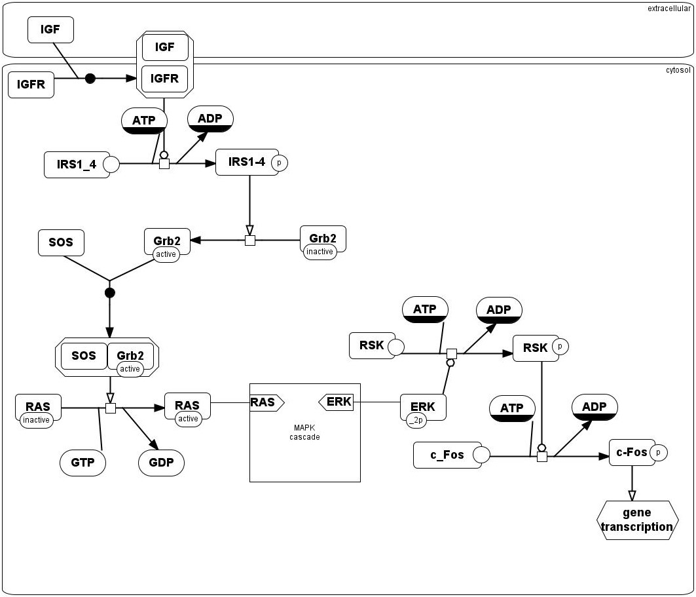
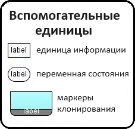
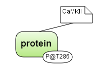
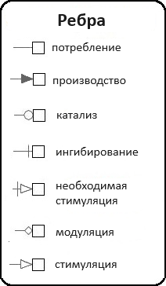
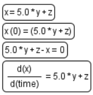
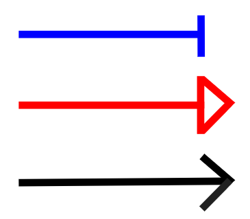
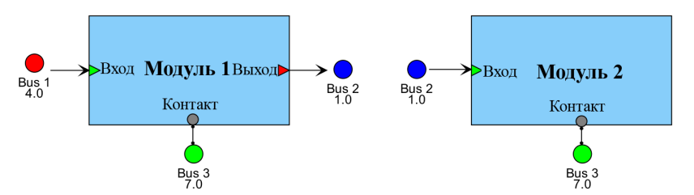

Основы визуального моделирования
================================

Задача моделирования сложных систем может быть существенно упрощена с точки зрения исследователя путем представления моделей систем в виде диаграмм и
использования компьютерных программ, поддерживающих визуальное моделирование. 

**Визуальное моделирование** – это формальное представление, создание моделей и работа с ними в виде графических диаграмм. Численные расчеты проводятся на основе данного представления.

**Диаграммы** - это двумерные геометрические представления информации в соответствии с соглашениями о графических обозначенияx.
Диаграмма состоит из узлов, ребер и компартентов, которые называются **элементами диаграммы**:

- **узел** обычно представляет собой некоторую геометрическую фигуру, например прямоугольник или эллипс;
- **ребро** – это линия, соединяющая два узла;
- **компартмент** — это особый тип узла, внутри которого могут находиться другие узлы.

BioUML упрощает создание сложных биологических моделей путем визуального моделирования: 

-   пользователь создаёт и редактирует модель биологической системы в виде диаграммы;
-   на основе созданной диаграммы ПК BioUML генерирует Java код;
-   сгенерированный Java код компилируется и используется соответствующими решателями для численного моделирования динамики исходной системы.
 
Графическая нотация
-------------------

Необходимой составной частью визуального моделирования является **графическая нотация** (визуальный синтаксис, графический язык) которая позволяет формально и полно описать модель. 
Графическая нотация может быть представлена несколькими типами диаграмм, позволяющими описать разные аспекты структуры и функционирования сложных систем с разным уровнем формальности и детализации. 
Далее на основе такого формального графического представления системы (диаграммы) компьютерная программа автоматически генерирует код для численного моделирования динамики этой системы.

Основными компонентами формального определения графической нотации являются:

-   **типы вершин и ребер** – какие типы биологических (и математических) объектов и их взаимодействий могут быть показаны на диаграмме;
-   **правила отрисовки объектов** – как биологические объекты должны быть представлены на диаграмме, учитывая их свойства. Например, РНК может быть представлена в виде волнистой линии, белок может быть представлен в виде круга, а маленькие круги на нем могут представлять различные модификации аминокислотных остатков (фосфорилирование, убиквитинирование и т.п.);
-   **семантические правила и ограничения** – используются для обеспечения семантической целостности диаграммы в процессе ее создания и редактирования. Например, если пользователь удаляет вещество с диаграммы, то все реакции, в которых оно участвует должны быть тоже удалены.

Поддержка SBML и SBGN в BioUML
------------------------------

BioUML полностью поддерживает и активно использует **SBML** (Systems Biology Markup Language) - язык разметки системной биологии в качестве стандарта для
описания математических моделей с обыкновенными дифференциальными уравнениями (ОДУ) и дискретными событиями (https://sbml.org/). Модели, создаваемые в BioUML 
в основном подчиняются математическому формализму, описываемому SBML. 

Наиболее известной графической нотацией в системной биологии является **SBGN** (Systems Biology Graphic Notation), которая поддерживается в BioUML :ref:`(Рисунок 1) <Pic.1>`.
Подробное описание графической нотации SBGN можно найти по ссылке (https://sbgn.github.io/).

.. _SBGN notation:

.. _Pic.1:

.. figure:: images/sbgn/nodes_rus.png
   :width: 100%
   :alt: SBGN нотация в BioUML
   :align: center
   
   Рисунок 1. Адаптированная SBGN нотация в BioUML

Расширенная нотация SBGN в BioUML
~~~~~~~~~~~~~~~~~~~~~~~~~~~~~~~~~

.. |equations| image:: /images/sbgn/equations.png
.. |relations| image:: /images/sbgn/relations.png
.. |constraint| image:: /images/sbgn/constraint.png
.. |event| image:: /images/sbgn/event.png
.. |function| image:: /images/sbgn/function.png
.. |tabular| image:: /images/sbgn/tabular.png

SBGN нотация, используемая в BioUML, была расширена *дополнительными эдементами* для полного представления моделей SBML. Графическая нотация SBGN совместима с SBML, хотя она больше полагается на пути, 
состоящих из сущностей и процессов между ними. Таким образом, она не охватывает каждый отдельный объект в моделях SBML. В частности, нет визуального представления «математических» объектов: уравнений, функций, событий и т.п.

Дополнительной мотивацией для добавления новых элементов является тот факт, что существует множество математических объектов моделей биологических систем (в частности - физиологических моделей), 
которые не представлены сетью биохимических реакций, а содержат набор уравнений ОДУ.

.. raw:: html

    

   <table style="table-layout: fixed; width: 100%; word-wrap: break-word;">
   <caption>Таблица 1. Дополнительные элементы введенные BioUML к SBGN нотации</caption>
    <tr>
       <th style="width: 20%;">Название</th>
       <th style="width: 20%;">Обозначение</th>
       <th style="width: 60%;">Описание</th>
    </tr>
    <tr>
       <td><a href="#equations">Уравнения</a></td>
       <td></td>
       <td>Математические уравнения в модели: 
           - присваивание 
           - алгебраические уравнения 
           - дифференциальные уравнения</td>
    </tr>
    <tr>
       <td><a href="#equations">Зависимости</a></td>
       <td></td>
       <td>Зависимость между уравнениями генерируются автоматически и описывают, как переменная, рассчитанная в одном уравнении, влияет на переменную, рассчитанную в других уравнениях. Было выделено три типа: 
           - черная стрелка - эффект не определен 
           - синяя стрелка – значение уменьшается (торможение) 
           - красная стрелка - значение увеличивается (активация)</td>
    <tr>
       <td><a href="#event">Событие</a></td>
       <td></td>
       <td>Дискретное событие, которое описывает мгновенные изменения переменных модели при выполнении определенного условия.  
	       Например, изменение приема лекарств после определенного момента времени</td>
    </tr>
    <tr>
       <td><a href="#function">Функция</a></td>
       <td></td>
       <td>Функция принимает значения аргументов и вычисляет выходные данные</td>
    </tr>
    <tr>
       <td><a href="#constraint">Ограничение</a></td>
       <td></td>
       <td>Ограничение - это условие, которое проверяется во время моделирования.  
	       Если условие нарушается, то либо выдается сообщение об ошибке, либо моделирование останавливается в зависимости от опций симулятора</td>
    </tr>
    <tr>
       <td><a href="#table">Табличный элемент</a></td>
       <td></td>
       <td>Табличный элемент используется для расчета переменных модели на основе данных в указанной таблице.  
	       Например, в этом случае столбец таблицы t соответствует времени, а столбец x_values содержит числовые данные для переменной модели x.  
	       Существует два способа обработки табличных данных: сплайн-аппроксимация и кусочно-заданная функция</td>
    </tr>
   </table>
   
   

   
.. _diagram_types:

Типы диаграмм
=============

В настоящее время в BioUML используются следующие графические нотации и соответствующим им типы моделей:

-   **Математическая модель (Mathematical model)** - модель, состоящая из обыкновенных дифференциальных уравнений (ОДУ), алгебраических уравнений и событий. Никакие сущности или реакции между ними не используются;
-   **Иерархическая модель (Composite model)** - модель, которая может содержит модули (подмодели), каждая из которых содержит ОДУ с событиями. Численные расчеты проводятся путем трансформации модели в "плоскую", не иерархическую модель, содержащую ОДУ с событиями;
-   **Модель SBML в нотации SBGN (SBML in SBGN notation)** - модель, имеющая математический формализм, описанный стандартом SBML, использующая графическую нотацию SBGN;
-   **Иерархическая модель SBML в нотации SBGN (SBML comp in SBGN notation)** - иерархическая модель, имеющая математический формализм, описанный стандартом SBML, использующая графическую нотацию SBGN;
-   **Популяционная модель (Population-based model)** - содержит основную структурную модель, которая представляет собой математическую модель процесса изучения (например, динамики лекарств в организме) и предполагает распределение параметров модели по популяции;
-   **Агентная модель (Agent-based model)** - иерархическая модель, которая может содержать модули различного формализма и типа (модели ОДУ, модели УЧП (уравнения в частных производных), скрипты, специальные модули);
-   **Артериальное дерево (Arterial tree)** - модель кровотока в артериальном дереве. Описывает строение и свойства (площадь и эластичность) сосудистого русла. Численное моделирование предоставляет информацию о кровотоке (давлении, скорости потока) в каждом конкретном сосуде дерева;
-   **Модель мозга (Brain model)** - модель мозга на региональном или клеточном уровне;
-   **Модель BioNetGen (BioNetGen model)** - Модель BioNetGen Language (BNGL) со специальным графическим обозначением;
-   **Модель EndoNet (EndoNet diagram)** - XML диаграмма (диаграмма EndoNet);
-   **Метаболический путь (lipicomic.xml)** - XML-диаграмма (Метаболический путь (KEGG-модифицированный)).

В зависимости от типа модели на *панели инструментов*, расположенной в верхней части рабочего пространства, будут представлены разные опции. 

Первые шаги при работе с диаграммой
===================================

.. |diagram| image:: /images/icons/Type-Diagram-icon.png
.. |zoom in| image:: /images/icons/WebAction-toolbar-zoom_in-icon.png
.. |zoom out| image:: /images/icons/WebAction-toolbar-zoom_out-icon.png
.. |fit to screen| image:: /images/icons/fit_to_screen.png
.. |save| image:: /images/icons/save.gif
.. |saveas| image:: /images/icons/saveas.gif
.. |revert| image:: /images/icons/revert_save.gif

Чтобы *открыть ранее созданную диаграмму*, двойным щелчком мыши нажмите на файл диаграммы, который будет отображаться как |diagram| во вкладке :guilabel:`Data` области :doc:`репозитория </user_interface>`.
В :doc:`рабочем пространстве </user_interface>` отображается полноразмерная *часть диаграммы*, в то время как   
*общий вид диаграммы* — в :doc:`поле операций </user_interface>`. Область диаграммы, отображенная в рабочем пространстве выделяется пунктиром на общем виде диаграммы, расположенной
в области поля операций. Для облегчения ориентации на больших диаграммах отдельные ребры и узлы диаграммы подсвечиваются голубым цветом :ref:`(Рисунок 2) <Pic.2>`.

.. _Pic.2:

   Рисунок 2. Открытая диаграмма в веб-версии BioUML
   
Текущую отображаемую область диаграммы можно сместить:

-     в рабочем пространстве, щелкнув и перетащив «холст» диаграммы, либо используя полосы прокрутки; 
-     сдвинув (щелкнув и перетащив) пунктирный прямоугольник (представляющий область, которая сейчас просматривается в рабочем пространстве) на вкладке :guilabel:`Overview` в области поля операций .

Чтобы отобразить *полноразмерный общий вид диаграммы* в рабочем пространстве, нажмите кнопку |fit to screen|, расположенную на :doc:`общей панели управления </user_interface>`. 
Диаграммы можно *увеличивать* и *уменьшать*, нажимая на кнопки |zoom in| или |zoom out|, соответственно, также расположенные в общей панели управления. 

Для *создания новой диаграммы*, во вкладке :guilabel:`Data` области :doc:`репозитория </user_interface>` выберите проект и нажмите правой кнопкой мыши на нужную папку, в которой планируется
создание диаграммы. В выпадающем списке нажмите на поле |diagram| New diagram. Далее в открывшемся окне выберите нужный *тип диаграммы*. 

Для *сохранения текущей версии диаграммы* нажмите на иконку |save|, расположенную на :doc:`общей панели управления </user_interface>`.
*Возвращению диаграммы к исходной версии* соответствует иконка |revert|.

*Копия диаграммы* создается путем нажатия на иконку |saveas| и дальнейшего задания названия диаграммы и выбора пути для сохранения в репозитории. 

Экспорт и импорт диаграммы
~~~~~~~~~~~~~~~~~~~~~~~~~~

.. |export| image:: /images/icons/WebAction-toolbar-export-icon.png
.. |import| image:: /images/icons/import.gif

Диаграммы можно *экспортировать* в различных форматах, нажав инонку |export|, расположенной на общей панели управления, либо нажав
правой кнопкой мыши на диаграмму в репозитории и в выпадающем списке выбрать |export|.
*Импорт диаграммы* осуществляется нажатием на иконку |import|.

Выравнивание диаграммы
~~~~~~~~~~~~~~~~~~~~~~

.. |align_down| image:: /images/icons/align_down.png
.. |align_up| image:: /images/icons/align_up.png
.. |align_middle| image:: /images/icons/align_middle.png
.. |align_left| image:: /images/icons/align_left.png
.. |align_right| image:: /images/icons/align_right.png
.. |align_center| image:: /images/icons/align_center.png

Пять *методов выравнивания диаграммы* доступны на общей панели управления после открытия диаграммы в рабочем пространстве.
Для выравнивания зажмите кнопку Control с правой кнопку мыши и выделите нужные элементы диаграммы. 

.. raw:: html

    <table>
       <caption>Таблица 2. Методы выравнивания диаграммы</caption> 
    <tr>
       <th style="width: 25%;">Описание</th>
       <th style="width: 10%;">Обозначение</th>
    </tr>
    <tr>
       <td>Выравнивание по верхнему краю</td>
       <td></td>
    </tr>
    <tr>
       <td>Выравнивание по середине</td>
       <td></td>
    </tr>
    <tr>
       <td>Выравнивание по нижнему краю</td>
       <td></td>
    </tr>
    <tr>
       <td>Выравнивание по левому краю</td>
       <td></td>
    </tr>
    <tr>
       <td>Выравнивание по центру</td>
       <td></td>
    </tr>
    <tr>
       <td>Выравнивание по правому краю</td>
       <td></td>
    </tr>
   </table>
	
   

	
	 
.. _visual modelling:

Общие принципы работы с элементами диаграммы
--------------------------------------------

Для того, чтобы *создать новый элемент* на диаграмме, необходимо нажать на его иконку, расположенную на панели инструментов в верхней части рабочего пространства :ref:`(Рисунок 3) <Pic.3>`. 
После этого выберите место на рабочем пространстве, где планируете разместить новый элемент. При создании нового элемента в открывшемся окне можно редактировать свойства элемента. 
Также необходимо дать идентификатор и присвоить заголовок элементу в полях :guilabel:`name` и :guilabel:`title`, соответственно. Заголовок будет отображаться на диаграмме и может не соответсвовать идентификатору элемента.
После того, как сущность создана, заголовок подлежит изменению, а идентификатор нет. 

.. _Pic.3:

.. _panel:

.. figure:: /images/interface/modelling_icons.png
   :width: 70%
   :alt: Панель инструментов
   :align: center

   Рисунок 3. Панель инструментов
   
Нажатие на отдельный узел диаграммы позволяет отобразить *информацию об этом компоненте*, отображаемой на вкладке :guilabel:`Info` (инспектор свойств) в области :doc:`информационного окна </user_interface>`. 
Двойной щелчок по узлу активирует ссылку на справочную информацию на внешнем веб-сайте, если таковая имеется. 

.. _additional_options:
   
Нажав правой кнопкой мыши на созданный элемент на диаграмме, в открывшемся меню поле :guilabel:`Edit` позволяет изменять *дополнительные свойства элемента*. С помощью :guilabel:`Fix node` и :guilabel:`Unfix node` можно *зафиксировать элемент 
на диаграмме* и сделать свободным в перемещении, соответственно. Чтобы удалить элемент, нужно нажать на кнопку :guilabel:`Remove`. Для того, чтобы скопировать элемент, нажмите кнопку :guilabel:`Copy` :ref:`(Рисунок 4) <Pic.4>`. Скопированный элемент диаграммы будет иметь тот же заголовок
и название с добавлением суффикса "_1".

.. note:
   На диаграмме не может сущестсвовать двух элементов с одинаковыми названиями, однако могут быть одинаковые титлы для различных элементов. 
   Также можно создать элемент без титла, оставив поле пустым, либо сняв галочку в поле :guilabel:`Show tittle` в *дополнительных свойствах элемента*

.. _Pic.4:

.. figure:: /images/interface/settings.png
   :width: 30%
   :alt: Опции элемента диаграммы
   :align: center

   Рисунок 4. Опции элемента диаграммы
   
*Месторасположение элементов* на диаграмме можно изменять посредством зажатия элемента левой кнопкой мыши и перемещением в другое место на полотне. 
У созданного элемента на диаграмме, представленного в виде геометрической фигуры, можно *изменить размер* засчет его выделения и растяжения/сужения, нажав на его углы или стороны. Размер фигуры также можно изменить в 
дополнительных свойствах элемента, задав его размеры в полях :guilabel:`Width` и :guilabel:`Height`.

Модель SBML в нотации SBGN
==========================

**Модель SBML в нотации SBGN** имеет математический формализм, описанный стандартом SBML, и использующая графическую нотацию SBGN. 

Эти диаграммы описывают количественные связи между биологическими объектами – биохимические реакции или процессы другого типа
с заданными численно законами. Такие процессы могут быть проинтерпретированы как системы обыкновенных дифференциальных уравнений.
Также диаграммы могут содержать математические объекты, такие как алгебраические, дифференциальные уравнения, операции присваивания,
мгновенные события и т.д. 

При *создании диаграммы* в выпадающем списке выбирается тип "SBML model in SBGN notation".

Элементы диаграммы
------------------

.. _entities:

Сущности
~~~~~~~~

.. |complex| image:: /images/icons/complex.png
.. |entity| image:: /images/icons/entity.png
    
**Сущности** - это элементы графической нотации SBGN, описывающие компоненты биологической системы, участвующие в процессах :ref:`(Рисунок 5) <Pic.5>`. В BioUML доступны все типы сущностей нотации SBGN, которые разделяются на два класса:

-     **материальные**: макромолекула, простое химическое вещество, нуклеиновая кислота, неопределенная сущность, мультимер и комплекс;
-     **концептуальные**: пустое множество и возмущающий агент.

.. _Pic.5:

.. figure:: images/sbgn/entities_rus.png
   :width: 60%
   :alt: Сущности
   :align: center
   
   Рисунок 5. Сущности SBGN
   
.. raw:: html

   <table>
       <caption>Таблица 3. Элемены диаграммы</caption> 
    <tr>
       <th style="width: 25%;">Название</th>
       <th style="width: 50%;">Описание нотации SBGN</th>
    </tr>
    <tr>
       <td>Неопределенная сущность</td>
       <td>Сущность, тип которой неизвестен либо не имеет прямого биологического значения.</td>
    </tr>
    <tr>
       <td>Простое химическое вещество</td>
       <td>Определяется как противоположность макромолекулы: химическое соединение, которое не образуется путем ковалентного связывания псевдоидентичных остатков. Примерами этого типа могут служить атом, ион, радикал и др.биохимические вещества.</td>
    </tr>
    <tr>
       <td>Макромолекулы</td>
       <td>Биохимические вещества, образующиеся от ковалентного связывания псевдоидентичных единиц - белки, нуклеиновые кислоты, полисахариды.</td>
    </tr>
    <tr>
       <td>Нуклеиновая кислота</td>
       <td>Представляет собой фрагмент макромолекулы, несущий генетическую информацию. Обычно этот тип сущности используют для представления гена или транскрипта.</td>
    </tr>
    <tr>
       <td>Мультимер</td>
       <td>Мультимер представляет собой совокупность множества одинаковых или псевдоидентичных соединений, удерживаемых вместе нековалентными связями. Примером мультимера может служить димерный рецептор. Существуют четыре типа мультимера: мультимер простого химического вещества, мультимер макромолекулы, мультимер с признаками нуклеиновой кислоты и мультимер комплекса.</td>
    </tr>
    <tr>
       <td>Комплекс</td>
       <td>Комплекс представляет собой пул биохимических объектов, каждый из которых состоит из других биохимических объектов, будь то макромолекулы, простые химические вещества, мультимеры или другие комплексы.</td>
    </tr>
    <tr>
       <td>Пустое множество</td>
       <td>Представляет собой отсутствие компонента в модели. Допустим, при создании реакции деградации, у которой отсутствует фактический продукт, на диаграмме будет отображаться пустое множество.</td>
    </tr>
    <tr>
       <td>Возмущающий агент</td>
       <td>Отображает внешнее воздействие на компоненты модели. Например, это может быть изменение температуры, излучение, мутация и др.</td>
    </tr>
   </table>
   
   

.. note::
   Некоторые типы сущностей могут опционально содержать :ref:`вспомогательные единицы <units>`. При этом одной сущности может соответсвовать несколько вспомогательных единиц. 
 
**Макромолекула (macromolecule)**, **простое химическое вещество (simple chemical)**, **нуклеиновая кислота (nucleic acid feature)**, 
**неопределенная сущность (unspecified)**, **возмущающий агент (perturbing agent)** и **комплекс (complex)** добавляется на диаграмму засчет выбора иконки |entity| на панели инструментов и выборе 
нужного типа сущности в открывшемся окне в поле :guilabel:`sbgb:enityType` :ref:`(Рисунок 6) <Pic.6>`. 

.. _Pic.6:

.. figure:: images/interface/creating_entity.png
   :width: 80%
   :alt: Создание сущности в веб-версии BioUML
   :align: center

   Рисунок 6. Создание сущности в веб-версии BioUML

**Комплекс** может быть создан также путем выбора иконки |complex| на панели инструментров. Для того, чтобы поместить в комплекс другие объекты, необходимо зажать их левой кнопкой мыши и поместить внутрь него. 
   
**Мультимер** создается засчет указания в поле :guilabel:`sbgn:multimer` количества субъединиц, входяших в его состав. Мультимер можеть быть создан для всех типов упомянутых выше сущностей, за исключением возмущающего агента и 
неопределенной сущности. Cозданные мультимер будет содержать :ref:`единицу информации <units>` вида N:n, где n - количество субъединиц в составе мультимера.

Компартмент
~~~~~~~~~~~

.. |compartment| image:: /images/icons/compartment.png

**Компартмент** является отдельным элементом диаграммы, в составе которого могут находиться сущности :ref:`(Рисунок 7) <Pic.7>`. Компартмент создается с помощью нажаться на иконку |compartment|, расположенную на панели инструментов. 

.. _Pic.7: 

.. figure:: images/sbgn/compartment_rus.png
   :width: 40%
   :alt: Компартмент
   :align: center
   
   Рисунок 7. Компартмент

.. note::
   Отдельная сущность может принадлежать только одному компартменту. Таким образом, «одни и те же» биохимические компоненты, находящиеся в двух разных компартментах, на самом деле представляют собой две разных сущности. 
   После того, как сущность будет перемещена в компартмент, название этой переменной будет изменено путем добавления названия компартмента перед названием сущности. Например, $compartment.entity.
   

   Рисунок 8. SBGN диаграмма сигналинга IGF-1, содержащая два компартмента - внеклеточное пространство (extracellular) и цитозоль (cytosol)   
   
.. _units:

Вспомогательные единицы
~~~~~~~~~~~~~~~~~~~~~~~

.. |unit_of_information| image:: /images/icons/unit_of_information.png
.. |variable| image:: /images/icons/variable.png
.. |clone_node| image:: /images/icons/clone_node.png
.. |merge_node| image:: /images/icons/merge_node.png

В BioUML доступны все типы *вспомогательных единиц*, описанной в нотации SBGN: единицы информации, переменные состояния и маркеры клонирования :ref:`(Рисунок 9) <Pic.9>`.
Каждой сущности может соответсвовать несколько вспомогательных единиц как одного типа, так и нескольких. 

.. _Pic.9:

   
   Рисунок 9. Вспомогательные единицы

**Единица информации** используется для добавления дополнительной информации к сущности. Для определенных типов информации, нотация SBGN определяет конкретные префиксы. 
С более подробной информацией о префиксах можно ознакомиться по ссылке (https://sbgn.github.io/).

-   pt - физические характеристики, такие как температура (pc:T), pH (pc:pH) и др. Предполагается, что они будут использоваться для описания характера возмущающего воздействия агента 
    или фенотипа.
-   mt - биологический тип сущности, такие как ДНК (mt:dna), РНК (mt:rna), ион (mt:ion) и др.
-   ct - концептуальные типы сущности, такие как ген (ct:gene), сайт транскрипции (ct:tss) и др. 

.. figure:: images/diagrams/gene_regulation.jpg
   :width: 70%
   :alt: Регуляция экспрессии гена
   :align: center
   
   Рисунок 10. Пример использования единиц информации при создании диаграммы, описывающей процесс регуляции экспрессии гена  
   
Для того, чтобы добавить вспомогательную единицу к сущности, нажмите на иконку |unit_of_information|, расположенную на :ref:`панели инструментов <panel>` и затем на выбранную сущность. 
   
**Переменные состояния** используются для описания изменения физического состояния биологического объекта. Обычно, переменная состояния строится из двух подстрок, разделенных символом "@", 
первая из которых идентифицирует значение переменной состояния, а вторая — ее имя. Например, при описании процесса фосфорилирования белка, для нефосфорилированной формы может использоваться 
переменная состояния "@S122" либо пустое состояние, обозначающая позицию фосфорилирования, и для фосфорилированной формы - "P@S122", где P - остаток фосфорной кислоты. Символ "@" опускается, если
переменная состояния не имеет имени, как например, при обозначении активной и неактивной формы белка. 

Для некоторых переменных состояния отображающих ковалетнтные модификации макромолекул существуют определенные идентификаторы. Например, фосфорилирование (P), ацетилирование (Ac), метиилирование (Me) и др.

Для того, чтобы добавить переменную состоянию к сущности, нажмите на иконку |variable|, расположенную на :ref:`панели инструментов <panel>` и затем на выбранную сущность. 

.. figure:: images/diagrams/phosphorylation.jpg
   :width: 60%
   :alt: Регуляция экспрессии гена
   :align: center
   
   Рисунок 11. Пример использования переменных состояния при создании диаграммы, описывающей процесс фосфорилирования белка 

**Маркеры клонирования** используются при дублировании сущности на диаграмме.

Для создания клона нажмите на сущность, которую хотите клонировать и затем на иконку |clone_node|, расположенную на общей панели управления. Чтобы объединить клоны, нажмите на клон и затем на иконку 
|merge_node|. 

.. figure:: images/diagrams/glycolysis.jpg
   :width: 100%
   :alt: Гликолиз
   :align: center
   
   Рисунок 12. Пример использования маркеров клонирования при создании диаграммы, описывающей процесс гликолиза. АТФ и АДФ встречаются в этом пути 4 раза, поэтому оба идентифицируются с помощью клон-маркера.
   
Заметка
~~~~~~~

.. |note| image:: /images/icons/note.png
.. |note_link| image:: /images/icons/note_link.png

**Заметка** используется для добавления дополнительной информации, например, детального описания молекулярных механизмов, отображенных на диаграмме :ref:`(Рисунок 12) <Pic.12>`. Аннотация может быть представлена как отдельный элемент на диаграмме,
так и быть связанной с сущностью при помоши **ребра заметки**.

.. _Pic.12:

.. figure:: images/sbgn/annotation_rus.png
   :width: 40%
   :alt: Заметка
   :align: center
   
   Рисунок 12. Заметка

Для того, чтобы создать заметку, нажмите на иконку |note|, расположенную на :ref:`панели инструментов <panel>`. Затем, вы можете связать ее с сущностью, создав ребро заметки, нажав на иконку |note_link|, 
и соединив этим ребром сущность и аннотацию.

   
   Рисунок 13. Пример использования заметки, связанной с сущностью. 

.. _process:

Процессы 
~~~~~~~~

**Процессы** преобразуют один или несколько пулов сущностей в один или несколько пулов сущностей, идентичных или разных. На диаграмме процессы отображаются в виде круга или квадрата, 
которые соединены с связанные с небольшими дугами (ребрами), прикрепленными к центрам противоположных сторон фигуры процесса :ref:`(Рисунок 14) <Pic.14>`.

.. note:: 
   Создание реакций с использованием описанных элементов диаграммы будет обсуждаться в разделе :ref:`"Создание реакций" <reactions>`. 

Согласно нотации SBGN существует один общий тип - *базовый процесс (process)*, а также пять типов специфических процессов: *пропущенный процесс (omitted process)*, 
*неопределенный процесс (uncertain process)*, *ассоциация (association)*, *диссоциация (dissociation)* и
*фенотип (phenotype)*. 

.. _Pic.14: 

.. figure:: images/sbgn/processes_rus.png
   :width: 40%
   :alt: Процессы
   :align: center
  
   Рисунок 14. Процессы 

.. raw:: html

   <table>
       <caption>Таблица 4. Описание процессов</caption> 
    <tr>
       <th style="width: 25%;">Тип процесса</th>
       <th style="width: 50%;">Описание</th>
    </tr>
    <tr>
       <td>Базовый процесс</td>
       <td>Общий процесс, описывающий преобразование набора биохимических объектов в другой набор сущностей. Примеры: ковалентные модификации белков, транслокация.</td>
    </tr>
    <tr>
       <td>Пропущенный процесс</td>
       <td>Процесс, который опускается при создании диаграммы, может соответствовать нескольким фактическим процессам.</td>
    </tr>
    <tr>
       <td>Ассоциация</td>
       <td>Нековалентное связывание биологических объектов и образование комплекса. Примеры: образование мультимера, комплекса.</td>
    </tr>
    <tr>
       <td>Диссоциация</td>
       <td>Разрыв нековалентного связывания между биологическими объектами. Примеры: распад комплекса, мультимера.</td>
    </tr>
    <tr>
       <td>Фенотип</td>
       <td>Процесс, приводящий к проявлению фенотипа. Пример: связь белка c-Fos с фенотипом через процесс транскрипции генов.</td>
    </tr>
   </table>
   
   

.. _edges:

Ребра
~~~~~

По нотации SBGN выделяется четыре типа ребер - *ребра потоков*, *ребра модуляции*, :ref:`логическое ребро <logical arc>` и *ребро аннотации*.

*Ребра потоков* позволяют представить, какие пулы сущностей потребляются и производятся процессом. 
Ребра **потребления** связывают процессы с реагентами, а ребра **производства** связывают процессы с продуктами :ref:`(Рисунок 15) <Pic.15>`. При создании реакции в BioUML эти ребра создаются автоматически. 

.. _Pic.15:

.. figure:: images/diagrams/translocation.png
   :width: 50%
   :alt: Транслокация
   :align: center
   
   Рисунок 15. Диаграмма, описывающая транспорт иона Ca2+. В реакции траслокации тип использованного процесса - базовый процесс, с ребрами потребления и продукции.

.. _Pic.16:

.. _modulation:   
   
*Ребра модуляции* представляют собой влияние пулов сущностей на процессы. Выделяется пять видов ребер: *модуляция*, *стимуляция*, *катализ*, *ингибирование* и *необходимая стимуляция* :ref:`(Рисунок 16) <Pic.16>`. 

   
   Рисунок 16. Ребра 
   
**Модуляция** используется, когда неизвестно точное направление процесса - положительное или отрицательное воздействие, которое может зависеть, например,
от концентрации реактантов. Примером модуляции может служить влияние никотина на конформацию никотинового рецептора ацетилхолина :ref:`(Рисунок 17) <Pic.17>`. Высокие концентрации никотина 
открывают рецептор, тогда как низкие концентрации могут снизить его чувствительность, не открывая его.

.. _Pic.17:

.. figure:: images/diagrams/modulation.png
   :width: 50%
   :alt: Модуляция
   :align: center

   Рисунок 17. Модуляция открытия никотиновых рецепторов никотином
   
**Стимуляция** положительно влияет на поток процесса, представленного целевым процессом. Эта стимуляция может представлять собой, например, катализ или положительную аллостерическую регуляцию. Однако, катализ существует независимо в SBGN нотации.

.. _Pic.18:

.. figure:: images/diagrams/stimulation.png
   :width: 60%
   :alt: Стимуляция
   :align: center
   
   Рисунок 18. Противоположное влияние агонистов и обратных агонистов на рецептор GPCR. При создании реакций были использованы ребра стимуляции.
   
**Катализ** — это частный случай стимуляции, при котором эффектор положительно влияет на поток процесса, представленного целевым процессом. Положительное влияние на процесс обусловлено снижением энергии активации реакции.

.. figure:: images/diagrams/catalysis.png
   :width: 60%
   :alt: Катализ
   :align: center
   
   Рисунок 19. Киназа МАPKK катализирует фосфорилирование МАРК

**Ингибирование** отрицательно влияет на поток процесса, представленного целевым процессом. Ингибирование может быть, например, конкурентным ингибированием или аллостерическим ингибированием.

.. figure:: images/diagrams/inhibition.png
   :width: 60%
   :alt: Ингибирование
   :align: center
   
   Рисунок 20. Белок Gαi, ингибирует превращение АТФ в цАМФ
   
**Необходимая стимуляция** – это стимуляция, необходимая для того, чтобы процесс состоялся. 

.. figure:: images/diagrams/translation.png
   :width: 70%
   :alt: Трансляция
   :align: center
   
   Рисунок 21. Tранскрипция гена и последующая трансляция

Логические операторы
~~~~~~~~~~~~~~~~~~~~

*Логические операторы* обозначают механизм совместного действия пула или нескольких пулов сущностей. 
Выделяются три типа логических операторов: "И", "ИЛИ", "НЕ" :ref:`(Рисунок 22) <Pic.22>`.

.. _Pic.22:

.. figure:: images/sbgn/logical_operators_rus.png
   :width: 40%
   :alt: Логические операторы 
   :align: center
   
   Рисунок 22. Логические операторы 
   
.. note::
   Добавление логических операторов в реакцию обсуждается в разделе :ref:`Визуальное моделирование реакций <logical_operator>` 

.. _logical arc:

**Логическое ребро** создается автоматические при использовании логического оператора и соединяет пул сущностей и логический оператор.

**Логический оператор "И"** используется для обозначения того, что все узлы, связанные как входные, необходимы для получения выходных данных. 
Примером использования этого логическоского оператора заключается в синтезе мРНК IRF1, для которого необходимы как ген IRF1, так и комплекс, образованный белком STAT1 и регуляторной областью гена IRF1-GAS. 
Таким образом, логический оператор "И" связывает оба компонента, стимулируя процесс, который приводит к синтезу мРНК IRF1 :ref:`(Рисунок 23) <Pic.23>`.

.. _Pic.23:

.. figure:: images/diagrams/and.png
   :width: 50%
   :alt: И
   :align: center
   
   Рисунок 23. Пример использования логического оператора "И"

**Логический оператор "ИЛИ"** используется для обозначения того, что любой узел, связанный как входной, достаточен для получения выходных данных.
В следующем примере показана транскрипция мРНК SDH2-3, активируемая пулом комплексов транскрипционных факторов, каждый из которых способен в одиночку активировать 
транскрипцию :ref:`(Рисунок 24) <Pic.24>`.  

.. _Pic.24:

.. figure:: images/diagrams/or.png
   :width: 70%
   :alt: ИЛИ
   :align: center
   
   Рисунок 24. Пример использования логического оператора "ИЛИ"

**Логический оператор "НЕ"** используется для обозначения того, что выходные данные получаются только при отсутствии определенных входных данных. Следующий пример показывает, что продукция комплекса циклин-CDK не 
стимулируется белком p21 :ref:`(Рисунок 25) <Pic.25>`.

.. _Pic.25:

.. figure:: images/diagrams/not.png
   :width: 70%
   :alt: НЕ
   :align: center
   
   Рисунок 25. Пример использования логического оператора "НЕ"

.. _reactions:

Визуальное моделирование процесса
---------------------------------

.. |folder| image:: /images/icons/folder.png
.. |reaction| image:: /images/icons/reaction.png
.. |logical_operator| image:: /images/icons/logical_operator.png

Для *создания процесса* нажмите на иконку |reaction|, расположенную на :ref:`панели инструментов <panel>`.
В открывшемся окне в поле :guilabel:`Reaction name` введите *идентификатор реакции*, либо оставьте
автоматически сгенерированный идентификатор типа "Reaction_n", где n - порядковый номер реакции. 

.. note::
   Математическое описание реакций будет обсуждаться в главе :ref:`Математическое моделирование <math_model>`.

*Компоненты реакции* добавляются путем нажатия на ранее 
созданную сущность на диаграмме, название которой будет отображено в поле :guilabel:`Component`, и
выбора ее роли в поле :guilabel:`Role`. Существует три *роли сущности реакции* - modifier (модификатор),
реактант (reactant) и продукт (product). Далее нажмите кнопку :guilabel:`Add`.   

.. note::
   Одна и та же сущность может играть несколько ролей в одной реакции 

При добавлении компонентов в реакцию, *заголовок реакции* будет автоматически сгенерирован в поле :guilabel:`Reaction title`, который так же можно изменить по желанию.

.. figure:: images/interface/reaction.png
   :width: 100%
   :alt: Реакция
   :align: center
   
   Создание новой реакции в BioUML  
   
После того, как реакция будет создана, можно редактировать *дополнительные свойства реакции*, путем нажатия правой кнопки мыши на узел диаграммы, соответствующий :ref:`процессу <process>`, и последующего выбора поля :guilabel:`Edit`. В открывшемся окне в опциях |folder| Species references перечислены компоненты реакции, 
для которых можно добавить *стехиометрию* в поле :guilabel:`Stoichiometry` и для модификатора указать его *тип влияния на процесс*, т.е обозначить вид :ref:`ребра модуляции <modulation>`. 
В опциях |folder| Attributes в поле :guilabel:`sbgn:reactionType` указывается тип :ref:`процесса <process>`.  

Нажатие правой кнопкой мыши на :ref:`ребра реакции <edges>` открывает опции, позволяющие изменять *дополнительные свойства ребер*, также доступные в дополнительных свойствах реакции, и 
редактировать *геометрическую форму ребер* - добавлять новую вершину (Add vertex), выпрямлять ребро (Straighten edge) и др.

.. _logical_operator:

   
   Добавление логического оператора в реакцию в BioUML 

Для того, чтобы добавить *логический оператор* в реакцию, создайте реакцию без добавления модификатора в компоненты реакции. Далее нажмите на иконку
|logical_operator|, расположенную на :ref:`панели инструментов <panel>`. В открывшемся окне в поле :guilabel:`sbgn:logicalOperator` выберите нужный тип оператора, в поле :guilabel:`Reaction` 
- ранее созданную реакцию, и затем укажите также ранее созданную сущность, которая будет в реакции выполнять роль модификатора в поле :guilabel:`Modifiers` и укажите его тип влияния на процесс в 
поле :guilabel:`Modifier type`. 

.. note::
   Если в реакции предполагается несколько модификаторов, зажимая Shift, укажите несколько сущностей. 
   
Математическая модель
=====================

Переменная
----------

При создании :ref:`материальной сущности <entities>` создается **переменная**. Переменная описывает концентрацию или количество вещества
соответствующей сущности и облаюдает следующими атрибутами:

-   имя;
-   численное значение;
-   тип единицы измерения и единица измерения;
-   флаг, обозначающий, является ли численное значение переменной фиксированным или может меняться.

.. note::
   У сущности **имя переменной** образуется путем добавления "$" перед заданным ранее именем сущности. 
   Если сущность принадлежит компартменту, то имя переменной будет содержать и название компартмента, 
   например, $compartment.entity.
   Присвоенное имя переменной будет указано во вкладке :guilabel:`Info` (инспектор свойств) в области :doc:`информационного окна </user_interface>`
   в поле :guilabel:`Role` - VariableRole.  

*Атрибуты переменной* могут устанавливаться следующими способами:

-    В :ref:`дополнительных свойствах элемента <additional_options>` в опциях |folder| Role;
-    В области :doc:`поля операций </user_interface>` выберите вкладку :guilabel:`Model` на горизонтальной панели и в открывшемся окне на вертикальной панели вкладку :guilabel:`Entities`. Строки соответствуют каждой созданной 
     переменной.

.. figure:: images/interface/entities.png
   :width: 100%
   :alt: Изменение атрибутов переменной 
   :align: center	 
   
   Изменение атрибутов переменной в поле операций 
	 
**Численное значение** переменной задается в поле :guilabel:`Initial Value`. Обратите внимание, что в BioUML десятичным разделителем является точка. 

.. note::
   дополнить про ед.измерения 

**Единица измерения** переменной добавляется в полях :guilabel:`Initial units type`.

Флаг **константы** изменяется в поле :guilabel:`Constant` и определяет является ли численное значение переменной постоянной и може ли быть изменено.

Флаг **граничного условия** может быть добавлен в поле :guilabel:`Boundary condition`. В случае, если оно установлено – значение переменной не может меняться в ходе реакций (но
может подчиняться закону, заданному дифференциальным или алгебраическим уравнением).

**Параметр** - математическая переменная модели, для которой нет выделенного элемента на диаграмме. Может быть добавлена в модель путем явного упоминания в каком-либо математическом выражении (уравнении, законе
реакции и т.д.).

Математическое описание реакции
-------------------------------

.. |plus| image:: /images/icons/icon_plus.gif
.. |minus| image:: /images/icons/icon_minus.gif

**Реакция** транслируется в дифференциальные уравнения, описывающие динамику переменных, соответствующих веществам-участникам реакции. 

После того, как будет создана :ref:`реакция <reactions>`, **формула** вводится в поле :guilabel:`Formula` 
в открывшемся окне либо в :ref:`дополнительных свойствах реакции <reactions>` в опциях |folder| Kinetic law 
в поле :guilabel:`Formula`. Корректность формулы можно проверить вo вкладке :guilabel:`Info` в области :doc:`информационного окна </user_interface>` путем нажатия на геометрическую фигуру, отображающую процесс.
Добавленные реакции с формулой отображаются во вкладке :guilabel:`Model` на горизонтальной панели и в открывшемся окне 
на вертикальной панели во вкладке :guilabel:`Reactions`

.. note::
   При добавлении формулы **имя переменной** лучше скопировать из поля :guilabel:`Role` - VariableRole во вкладке :guilabel:`Info`.
   Учитывайте, что имя переменной включает знак "$", а перед параметром он не ставится. 
   Для возведения в степень используется оператор "^", деления - "/", умножения - "*", "+" и "-"
   для сложения и вычитания, соответственно.

.. figure:: images/diagrams/reaction_rate.png
   :width: 100%
   :alt: Реакции
   :align: center	 
   
   Простейшие реакции с SBGN диаграммой и формулой для BioUML
   
.. _add_parameter:
   
После введения формулы внесенные **параметры** добавляются в области :doc:`поля операций </user_interface>` во вкладке :guilabel:`Model` на горизонтальной панели и в открывшемся окне 
на вертикальной панели во вкладке :guilabel:`Variables`. *Значение параметра* выставляется в поле :guilabel:`Initial value`. 
Если требуется *удалить неиспользуемый параметр* или *добавить* новый, нажмите на иконку |minus| и |plus|, cоответственно. 

.. _equations:

Уравнения и зависимости
~~~~~~~~~~~~~~~~~~~~~~~

.. |alg_equation| image:: /images/sbgn/alg_equation.png
   :height:  30px
.. |ode_equation| image:: /images/sbgn/ode.png
   :height:  50px
.. |assignment_equation| image:: /images/sbgn/assignment_equation.png
   :height:  30px
.. |math_equation| image:: /images/icons/math_equation.png

В BioUML была введена графическая нотация для **уравнений**, которые включают следуюшие типы:

   
   Элемент уравнений в BioUML

-   **Обыкновенное дифференциальное уравнение** задает динамику некоторой переменной x зависимостью вида: |ode_equation|. Вместе с начальными условиями эти уравнения формирует задачу Коши, которая может быть численно решена одним из методов, встроенных в BioUML.
-   **Алгебраическое уравнение** задает зависимости между переменными модели, которые должны быть выполнены все время функционирования модели. В частности, это могут быть различные законы сохранения. Общий вид зависимости: |alg_equation|. Формируют систему (в общем случае нелинейных) алгебраических уравнений.
-   **Правило присваивания** напрямую выражают значения одних переменных через другие уравнениями вида: |assignment_equation| Присваивания делятся на два типа: присваивания, которые выполняются один раз в начальный момент времени (начальное присваивание) и присваивания, выражающие зависимости, которые должны быть выполнены в течение всего времени функционирования модели. Поскольку присваивания первого типа просто задают начальные значения переменных системы, в дальнейшем будем говорить только о присваиваниях второго типа. 

Для того, чтобы *создать уравнение*, нажмите на иконку |math_equation|, расположенную на :ref:`панели инструментов <panel>` и затем на диаграмму, где планируется разместить уравнение. После создания уравнения на диаграмме,
нажмите на него правой кнопкой мыши и выберите поле :guilabel:`Edit`. В поле :guilabel:`Type` выберите *тип уравнения*: обыкновенное дифференциальное уравнение (rate), алгебраическое уравнение (algebraic), 
правило присваивания (initial assignment) и скалярное (scalar). Для всех типов уравнений, кроме алгебраического, в поле :guilabel:`Variable` введите *имя переменной* (кроме алгебраических уравнений), для которой будет определена зависимость. В поле
:guilabel:`Equation` вводится *формула*. 

Добавленные уравнения отображаются в области :doc:`поля операций </user_interface>` во вкладке :guilabel:`Model` на горизонтальной панели и в открывшемся окне 
на вертикальной панели во вкладке :guilabel:`Equations`, где так же возможно измененить переменную, формулу и тип уравнения.

**Зависимости** между уравнениями генерируются автоматически и описывают, как переменная, рассчитанная в одном уравнении, влияет на переменную, рассчитанную в других уравнениях. Существует три типа зависимостей: 

   
   Графическое отображение зависимостей между уравнениями

-   эффект не определен - черная стрелка; 
-   значение уменьшается (торможение) - синяя стрелка; 
-   значение увеличивается (активация) - красная стрелка. 

.. figure:: images/diagrams/arterial_model.png
   :width: 100%
   :alt: Уравнения
   :align: center	 
   
   Модель артериальной системы, состоящей на основе уравнений и зависимостей между ними
   
.. _event:
   
Событие
~~~~~~~

.. |event_icon| image:: /images/icons/math_event.png

**Событие** заключается в скачкообразном изменении значений переменных модели при выполнении
определенного условия (например, в определенный момент времени или при заданном соотношении между
переменными).

.. figure:: /images/sbgn/event.png
   :width: 20%
   :alt: Событие
   :align: center	 
   
   Элемент события в BioUML

Чтобы *добавить событие* нажмите на иконку |event_icon|, расположенную на :ref:`панели инструментов <panel>` и затем на диаграмму, где планируется разместить уравнение. После создания события,
нажмите на него правой кнопкой мыши и выберите поле :guilabel:`Edit`. В опциях |folder| Role в поле 
:guilabel:`Trigger` устанавливается *триггер* - условие для запуска события. В поле :guilabel:`Delay` задается *время*, 
через которое происходит выполнение события. *Приоритет* указывает на порядок, в котором должны быть выполнены
события в том случае, если их времена выполнения совпадают, и указывается в поле :guilabel:`Priority`. В полях
:guilabel:`Variable` и :guilabel:`Expression` указывается переменная,
к которой будет применено событие и формула, соответственно. 

.. note::
   дополнить про индикаторы (Use trigger time values и др). примеры использования событий
   
.. _function:

Функция
~~~~~~~

.. |function_icon| image:: /images/icons/math_function.png

**Функция** может использоваться в уравнениях или реакциях модели.

.. figure:: /images/sbgn/function.png
   :width: 20%
   :alt: Функция
   :align: center	 
   
   Элемент функции в BioUML
 
Для *добавления функции* нажмите иконку |function_icon|, расположенную на :ref:`панели инструментов <panel>` и затем на диаграмму, где планируется разместить функцию. После создания функции,
нажмите на нее правой кнопкой мыши и выберите поле :guilabel:`Edit`. В опциях |folder| Role в поле 
:guilabel:`Right Hand Side` введите *правую часть уравнения* (формулу). В поле :guilabel:`Formula` вводится функция, соответствующая следующему образцу: 
``function function_name(a1, ..., an) = Right Hand Side``, где function_name - заданное *название функции* в поле :guilabel:`Name`; a1, ... , an - *аргументы функции*. 

.. note::
   При использовании функции в уравнении или реакции пишется только левая часть функции, включающая ее название и аргументы. 
   
.. _constraint:
   
Ограничение
~~~~~~~~~~~

.. |math_сonstraint| image:: /images/icons/math_constraint.png

Для *добавления ограничения* нажмите иконку |math_сonstraint|, расположенную на :ref:`панели инструментов <panel>` и затем на диаграмму, где планируется разместить ограничение.

.. note::
   добавить описание для ограничений, их использование и опции. 

.. _table:

Табличный элемент
~~~~~~~~~~~~~~~~~

.. |table| image:: /images/icons/table.png

Чтобы *добавить табличный элемент* нажмите иконку |table|, расположенную на :ref:`панели инструментов <panel>` и затем на диаграмму, где планируется разместить таблицу.

.. note::
   добавить описание для табличного элемента, их использование и опции.

Модульное моделирование 
=======================

.. |bus| image:: /images/module/bus.png
.. |constant| image:: /images/module/constant.png
.. |directed_link| image:: /images/module/directed_link.png
.. |undirected_link| image:: /images/module/undirected_link.png
.. |input| image:: /images/module/input.png
.. |output| image:: /images/module/output.png
.. |contact| image:: /images/module/contact.png
.. |submodel| image:: /images/module/submodel.png
.. |switcher| image:: /images/module/switcher.png

*Модульный подход* к моделированию биологических систем в последние годы активно развивается. 
Он подразумевает декомпозицию системы на подсистемы, 
каждая из которых может быть смоделирована и проверена независимо. 
Модель всей системы задается как совокупность моделей подсистем (модулей). 
Этот подход делает структуру сложных иерархических моделей более явной за счет выделения 
функциональных единиц и их взаимосвязей. Он также позволяет включать в сложные модели модели, 
разработанные разными авторами, фокусируясь на разных частях системы и используя разные масштабы и 
даже формализмы.

В платформе BioUML диаграмма, описывающая модульную модель, содержит
соединенные между собой элементы – **модули**, каждый из которых ссылается на
другую диаграмму (возможно, тоже модульную) в платформе. Модули взаимодействуют между собой за счет
передачи сигналов между ними, которая осуществляется засчет **портов**.

В зависимости от *направления передачи сигнала* выделяется три типа портов: вход, выход и контакт.

-     **Вход** - значение переменной подается на вход модуля и не может быть изменено модулем;
-     **Выход** - значение переменной полностью определяется (вычисляется) внутри модуля и подается на вход другим модулям;
-     **Контакт** - переменная, значение которой могут изменять оба модуля.

.. _module_concept:

.. figure:: images/module/module_concept.png
   :width: 50%
   :alt: Концепция модуля
   :align: center
   
   Концепция модуля
   
Существует три типа *доступности портов*, они могут быть приватными, публичными и вынесенными:

-     **Приватный порт** (private) используется для изменения поведения модулей. 
-     **Публичный порт** (public) используется для представления модульной модели в виде модцля и включения ее в другую модельную модель.
-     **Вынесенный порт** (propagated)...

.. note::
   добавить что такое вынесенный порт и возможно дать объяснение попроще для приватного и публичного 
   
Между выходом и входом устанавливается **направленная связь**, означающая передачу сигнала из одного модуля в другой. 
Между контактами – **ненаправленная связь**, обозначающая обмен сигналами.

.. table:: Графическая нотация элементов, используемых при модульном моделировании

   +----------------------+-------------------+-------------------------------------------------------------------------------------------------+
   | Название             | Обозначение       | Описание                                                                                        |
   +======================+===================+=================================================================================================+
   | **Типы модулей**                                                                                                                           |
   +----------------------+-------------------+-------------------------------------------------------------------------------------------------+
   | Подмодель            | |submodel|        | Модуль, содержащий математическую модель: модульная модель; SBML (SBML-SBGN) модель.            |
   +----------------------+-------------------+-------------------------------------------------------------------------------------------------+
   | Переключатель        | |switcher|        | Модуль, в зависимости от условия, подающий на выход один из двух сигналов, поступающих на вход. |
   +----------------------+-------------------+-------------------------------------------------------------------------------------------------+
   | Константа            | |constant|        | Модуль, подающий на выход константное значение.                                                 |
   +----------------------+-------------------+-------------------------------------------------------------------------------------------------+
   | **Порты**                                                                                                                                  |
   +----------------------+-------------------+-------------------------------------------------------------------------------------------------+
   | Входной порт         | |input|           | Порт, определяющий входную переменную подмодели.                                                |
   +----------------------+-------------------+-------------------------------------------------------------------------------------------------+
   | Выходной порт        | |output|          | Порт, определяющий выходную переменную подмодели.                                               |
   +----------------------+-------------------+-------------------------------------------------------------------------------------------------+
   | Контактный порт      | |contact|         | Порт, определяющий разделяемую переменную подмодели.                                            |
   +----------------------+-------------------+-------------------------------------------------------------------------------------------------+
   | Шина                 | |bus|             | Переменная модульной модели. Несколько шин могут соответствовать одной переменной.              |
   +----------------------+-------------------+-------------------------------------------------------------------------------------------------+
   | **Связи**                                                                                                                                  |
   +----------------------+-------------------+-------------------------------------------------------------------------------------------------+
   | Направленная связь   | |directed_link|   | Связь, означающая передачу сигнала из одного модуля в другой.                                   |
   +----------------------+-------------------+-------------------------------------------------------------------------------------------------+
   | Ненаправленная связь | |undirected_link| | Связь, означающая обмен сигналами между модулями.                                               |
   +----------------------+-------------------+-------------------------------------------------------------------------------------------------+

Создание модульной модели
-------------------------

.. |subdiagram| image:: /images/icons/Type-Diagram-icon.png
.. |switcher_icon| image:: /images/icons/switcher.png
.. |contact_port| image:: /images/icons/contact_port.png
.. |input_port| image:: /images/icons/input_port.png
.. |output_port| image:: /images/icons/output_port.png
.. |constant_icon| image:: /images/icons/constant.png
.. |port| image:: /images/icons/port.png
.. |update submodel| image:: /images/icons/update_submodel.png
.. |directed link| image:: /images/icons/directed_link.png
.. |undirected link| image:: /images/icons/undirected_link.png
.. |bus_icon| image:: /images/icons/bus.png

Для *создания модульной модели* создайте диаграмму следующего :ref:`типа <diagram_types>`: композиционную или композиционную модель SBML в нотации SBGN.
Однако, в модели второго типа будут отсутствовать дополнительные элементы, добавленные в BioUML.

Добавление модулей
~~~~~~~~~~~~~~~~~~

В открывшейся диаграмме **подмодель** добавляется путем нажатия на иконку |subdiagram|, расположенной на :ref:`панели инструментов <panel>`.
Документ диаграммы подмодели выбирается нажатием на поле :guilabel:`Diagram` и последующего выбора файла в открывшемся окне, 
либо нажатием модели в области :doc:`репозитория </user_interface>` и переносом его в поле :guilabel:`Diagram`.

.. note::
   При работе с модульной моделью, включающей подмодели, при нажатии на подмодель, в отдельном окне нижней части рабочего пространства, будет отображаться ее диаграмма. 

.. figure:: images/interface/add_subdiagram.png
   :width: 90%
   :alt: Добавление подмодели
   :align: center
   
   Добавление подмодели 

Модулю **переключателя** соответствует иконка |switcher_icon|, а **константе** - |constant_icon|, для которой в поле :guilabel:`Value` задается значение. Переключатель и константа 
добавляются на диаграмму таким же образом на диаграмму, как и подмодель. 

.. note::
   нужно добавить что-то еще и про переключатель, потому что совсем непонятно как он используется, и какой сигнал он подает на вход из двух.
   как и должно быть более детальное объяснение про использование констант. 
   
Созданные подмодели отображаются в области :doc:`поля операций </user_interface>` во вкладке :guilabel:`Model` на горизонтальной панели и в открывшемся окне 
на вертикальной панели во вкладке :guilabel:`Submodels`. В стобце :guilabel:`Title` указывается титл, отображающийся на графическом отображении в подмодели. Для подмодели в :guilabel:`Diagram path` 
указывается путь к ее диаграмме. 

.. _ports:
   
Создание портов
~~~~~~~~~~~~~~~   

*Чтобы создать порт* перейдите в документ подмодели и нажмите на иконку |port|. В открывшемся окне в поле :guilabel:`Access type` выберите 
*тип доступности порта*, в поле :guilabel:`Port type` - *тип порта* и в поле :guilabel:`Tittle` - титл порта, который будет отображаться на диаграмме. 
Из выпадаюшего списка в поле :guilabel:`Variable name` укажите для какого ранее созданного элемента диаграммы будет создан порт. 

В подмодели порт, созданный для сущности :ref:`(переменной) <math_model>`, будет автоматически соединен с ней ребром, а в случае создания
порта для :ref:`параметра <math_model>`, порт не будет связан с какими-либо элементами диаграммы.
Созданный порт в диаграмме, соответствующей подмодели, будет отображен на модульной диаграмме - внутри подмодели
будут добавлены обозначения портов, что изображено на :ref:`рисунке, описывающем концепцию модуля <module_concept>`. Графическое отображение портов можно перемещать в подмодели, нажимая на узел диаграммы и перемещая в другое место.

.. note::
   Для того чтобы изменения, сделанные в подмодели отобразились на модульной диаграмме, сохраните диаграмму и затем в документе модульной модели нажмите на иконку |update submodel|, расположенную на :doc:`общей панели управления </user_interface>`. 

Чтобы добавить порт на *верхнем уровне* - в модульной диаграмме, для начала необходимо :ref:`создать новый параметр <add_parameter>`. Далее, выберите соответсвуюший тип порта на :ref:`панели инструментов <panel>`. Входному порту соответствует иконка |input_port|,
выходному порту - |output_port| и контактному порту - |contact_port|. В открывщемся окне в поле :guilabel:`Access Type` выберите *приватный тип доступности порта (private)*. Затем в полях :guilabel:`Module` и 
:guilabel:`Base port name` выберите подмодель и соответствующий в ней порт, а в поле :guilabel:`Variable name` в выпадающем списке выберите *параметр*, для которого будет создан порт. 
Связь будет создана автоматически. 

Для *установления связи между входным и выходным портом* в модульной модели, при ранее созданных портах в диаграммах подмодулей, нажмите на иконку |directed link|, означающей *направленную 
связь*. После этого последовательно нажмите на входной и затем на выходной порт, расположенные внутри подмодулей. *Связь между контактными портами* создается путем нажатия на иконку 
|undirected link|, обозначающей *ненаправленную связь*, и соединения контактных портов.

.. figure:: images/interface/port_composite.png
   :width: 90%
   :alt: Добавление порта
   :align: center
   
   Добавление приватного порта на верхнем уровне модульной модели

Созданные порты и связи отображаются в области :doc:`поля операций </user_interface>` во вкладке :guilabel:`Model` на горизонтальной панели и в открывшемся окне 
на вертикальной панели во вкладках :guilabel:`Ports` и :guilabel:`Connections`, соответственно. Для портов можно поменять титл в поле :guilabel:`Title`, посмотреть тип порта 
в :guilabel:`Type`, тип доступности в :guilabel:`Access Type`. В поле :guilabel:`Variable` указано 
к какому параметру либо переменной относится порт. 

Создание шин
~~~~~~~~~~~~

**Шина** является вспомогательным элементом на модульных диаграммах являются, позволяющих
устанавливать связи сразу между несколькими модулями дистанционно. С одной шиной могут быть установлены связи
только одного типа (направленные или ненаправленные), также не может быть установлено несколько входящих направленных связей. Таким
образом, с помощью шин можно связать переменные различных модулей не
устанавливая между ними связи напрямую и уменьшая количество пересечений
ребер на диаграмме.

Для *добавления шины* на диаграмму, нажмите на иконку |bus_icon|, расположенную на :ref:`панели инструментов <panel>`. 
Опционально можно выбрать цвет для графического отображения шины в :guilabel:`сolor` для того, чтобы порты, соответствуюшие одной и той же переменной отличались от других. Установление связи  
между шиной и портом осуществуляется тем же образом, как было описано в секции :ref:`"Cоздание портов" <ports>`.

   
   Пример использования шин. Несколько шин могут быть ассоциированы с одной и той же переменной, при этом графически они отмечены одним цветом.
   
Созданные шины отображаются в области :doc:`поля операций </user_interface>` во вкладке :guilabel:`Model` на горизонтальной панели и в открывшемся окне 
на вертикальной панели во вкладке :guilabel:`Buses`. 

.. _math_model:

   
Численный расчет модели
=======================
.. |simulate| image:: /images/icons/simulate.gif

Проведением численных расчетов в BioUML управляет **инструмент
численного решения** (SimulationEngine). На основе содержания диаграммы,
инструмент численного решения автоматически генерирует численную модель
соответствующего типа, пригодную для расчетов. Кроме того, он
определяет список **численных решателей** (Simulator), пригодных для
сгенерированной модели, запускает численные расчеты, обеспечивает вывод
результатов на график и сохранение результатов в файл или базу данных.

ПК BioUML поддерживает 6 основных типов **инструментов численного решения** динамики биологических систем:

-     алгебро-дифференциальные уравнения (ОДУ) с дискретными событиями и задержкой по времени;
-     стохастические дифференциальные уравнения; 
-     стохастические модели;
-     анализ стационарных потоков (Flux Balance Analysis, или FBA);
-     моделирования кровотока в основных артериях и артериолах (гемодинамика);
-     агентное моделирование.

Для *выбора опций симуляции модели* перейдите в область :doc:`поля операций </user_interface>` и на горизонтальной
панели выберите вкладку :guilabel:`Simulation`. Далее в вертикальной панели перейдите в раздел :guilabel:`Engine`.
В поле :guilabel:`Selected engine` выберите один из подходящих *инструментов для
численных расчетов модели* и *численный решатель*, предоставляемых данным инструментом в поле
:guilabel:`Simulator name`. Затем настройте *параметры выбранного решателя* в :guilabel:`Simulator options`.

В настройках инструмента выберите *начальное время расчетов* в поле :guilabel:`Selected engine`,
*шаг*, с которым будут сохраняться или выводиться на
график результаты в поле :guilabel:`Time increment`, а также *конечное время* в поле 
:guilabel:`Completion time`. 

Для того, чтобы *запустить симуляцию модели*, сначала *сохраните* выбранные опции для симуляции, путем нажатия на иконку |save|, расположенную в верхней части поля операций,
и затем нажмите на иконку |simulate|. После окончания численного расчета модели в открывшемся окне будет отображен график результатов. 

Создание графика
================

.. |plot| image:: /images/icons/plot.gif

Результаты численного расчета модели отображаются на **графике**. Опциям *изменения графика* соответствуют
вертикальная вкладка :guilabel:`Plot`, которая отображается при открытии вкладки :guilabel:`Simulation`
в в :doc:`поле операций </user_interface>`. Для *создания нового графика* нажмите кнопку :guilabel:`Add` в 
|folder| Plots. Для каждого графика будет создана папка, где задаются *опции графика*:

.. figure:: images/interface/plots.png
   :width: 60%
   :alt: Графики
   :align: center	 
   
   Опции для создания графика в BioUML

-     **Tittle** - титл графика;
-     **Флаг Active** - при добавлении флага график будет выводиться при симуляции модели;
-     **X axis info** - настройка свойств оси X;
-     **Y axis info** - настройка свойств оси Y;
-     **X variable** - задача значений для оси X;
-     **Сurves** - задача значений для оси Y;
-     **Experiments** - ...

**Настройка свойств оси X и Y** содержит одинаковые опции: 

-     *Формат оси* (Axis type) - логарифмический (Logarithmic, Log 10) или числовой (Number) формат;
-     *Титл оси* (Axis title);
-     *Флаг автоматического задание диапазона оси* (Axis auto rangе);

Существуют еще один способ для того, чтобы *добавить результаты расчета* на график,
перейдите во вкладку :guilabel:`Model` в :doc:`поле операций </user_interface>`.  и далее на вертикальной панели
выберите нужную вкладку: :guilabel:`Entities`, :guilabel:`Variables`, :guilabel:`Buses`. 
Затем нажмите на строку, соответствующую выбранной переменной, и затем на иконку |plot|.

.. note:
   Добавление результатов численных расчетов нескольких переменных на график добавляется путем зажатия Shift
   и выбора нескольких строк. 
   

 

   
   