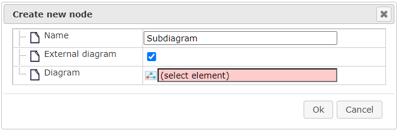
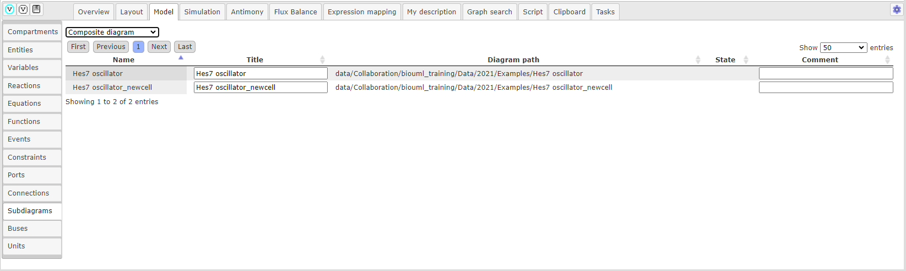
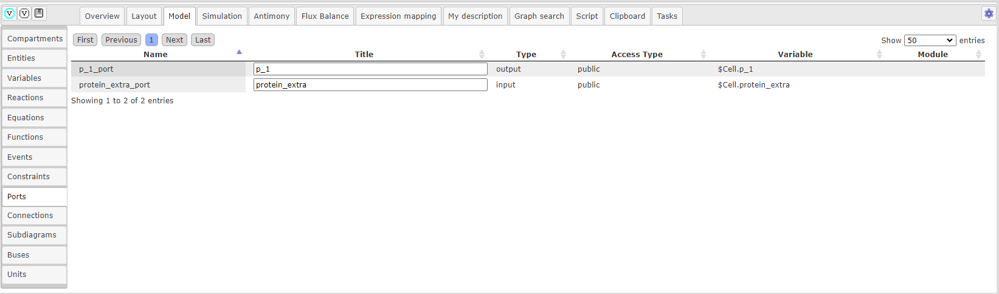

Основы модульного моделирования
===============================

.. |bus| image:: /images/module/bus.png
.. |constant| image:: /images/module/constant.png
.. |directed_link| image:: /images/module/directed_link.png
.. |undirected_link| image:: /images/module/undirected_link.png
.. |input| image:: /images/module/input.png
.. |output| image:: /images/module/output.png
.. |contact| image:: /images/module/contact.png
.. |submodel| image:: /images/module/submodel.png
.. |switcher| image:: /images/module/switcher.png
.. |option| image:: /images/icons/option.png

*Модульный подход* к моделированию биологических систем в последние годы активно развивается. 
Он подразумевает декомпозицию системы на подсистемы, 
каждая из которых может быть смоделирована и проверена независимо. 
Модель всей системы задается как совокупность моделей подсистем (модулей). 
Этот подход делает структуру сложных иерархических моделей более явной за счет выделения 
функциональных единиц и их взаимосвязей. Он также позволяет включать в сложные модели модели, 
разработанные разными авторами, фокусируясь на разных частях системы и используя разные масштабы и 
даже формализмы.

В платформе BioUML диаграмма, описывающая модульную модель, содержит
соединенные между собой элементы – **модули**, каждый из которых ссылается на
другую диаграмму (возможно, тоже модульную) в платформе. Модули взаимодействуют между собой за счет
передачи сигналов между ними, которая осуществляется засчет **портов**.

.. _port_types:

В зависимости от *направления передачи сигнала* выделяется три типа портов: вход, выход и контакт :ref:`(Рисунок 1) <Pic.1_8>`.

-     **Вход (input)** - значение переменной подается на вход модуля и не может быть изменено модулем;
-     **Выход (output)** - значение переменной полностью определяется (вычисляется) внутри модуля и подается на вход другим модулям;
-     **Контакт (contact)** - переменная, значение которой могут изменять оба модуля.

.. _Pic.1_8:

.. _module_concept:

.. figure:: images/module/module_concept.png
   :width: 50%
   :alt: Концепция модуля
   :align: center
   
   Рисунок 1. Концепция модуля
   
.. _port_access_types:
   
Существует три типа *доступности портов*, они могут быть приватными, публичными и вынесенными:

-     **Приватный порт** (private) используется для изменения поведения модулей. 
-     **Публичный порт** (public) используется для представления модульной модели в виде модцля и включения ее в другую модельную модель.
-     **Вынесенный порт** (propagated)...

.. note::
   добавить что такое вынесенный порт и возможно дать объяснение попроще для приватного и публичного 
 
.. _connections_types:

Между выходом и входом устанавливается **направленная связь (directed)**, означающая передачу сигнала из одного модуля в другой. 
Между контактами – **ненаправленная связь (undirected)**, обозначающая обмен сигналами.

.. raw:: html

    
   
   <table style="table-layout: fixed; width: 100%; word-wrap: break-word;">
   <caption>Таблица 1. Графическая нотация элементов, используемых при модульном моделировании</caption>
   <tr>
        <th>Название</th>
        <th>Обозначение</th>
        <th>Описание</th>
    </tr>
    <tr>
        <td>Подмодель</td>
        <td></td>
        <td>Модуль, содержащий математическую модель: модульная модель; SBML (SBML-SBGN) модель.</td>
    </tr>
    <tr>
        <td>Переключатель</td>
        <td></td>
        <td>Модуль, в зависимости от условия, подающий на выход один из двух сигналов, поступающих на вход.</td>
    </tr>
    <tr>
        <td>Константа</td>
        <td></td>
        <td>Модуль, подающий на выход константное значение.</td>
    </tr>
    <tr>
        <th colspan="3">Порты</th>
    </tr>
    <tr>
        <td>Входной порт</td>
        <td></td>
        <td>Порт, определяющий входную переменную подмодели.</td>
    </tr>
    <tr>
        <td>Выходной порт</td>
        <td></td>
        <td>Порт, определяющий выходную переменную подмодели.</td>
    </tr>
    <tr>
        <td>Контактный порт</td>
        <td></td>
        <td>Порт, определяющий разделяемую переменную подмодели.</td>
    </tr>
    <tr>
        <td>Шина</td>
        <td></td>
        <td>Переменная модульной модели. Несколько шин могут соответствовать одной переменной.</td>
    </tr>
    <tr>
        <th colspan="3">Связи</th>
    </tr>
    <tr>
        <td>Направленная связь</td>
        <td></td>
        <td>Связь, означающая передачу сигнала из одного модуля в другой.</td>
    </tr>
    <tr>
        <td>Ненаправленная связь</td>
        <td></td>
        <td>Связь, означающая обмен сигналами между модулями.</td>
    </tr>
   </table>

   

   
Создание модульной модели
=========================

.. |subdiagram| image:: /images/icons/Type-Diagram-icon.png
.. |switcher_icon| image:: /images/icons/switcher.png
.. |contact_port| image:: /images/icons/contact_port.png
.. |input_port| image:: /images/icons/input_port.png
.. |output_port| image:: /images/icons/output_port.png
.. |constant_icon| image:: /images/icons/constant.png
.. |port| image:: /images/icons/port.png
.. |update submodel| image:: /images/icons/update_submodel.png
.. |directed link| image:: /images/icons/directed_link.png
.. |undirected link| image:: /images/icons/undirected_link.png
.. |bus_icon| image:: /images/icons/bus.png

Для *создания модульной модели* создайте диаграмму следующего :ref:`типа <diagram_types>`: композиционную или композиционную модель SBML в нотации SBGN.
Однако, в модели второго типа будут отсутствовать дополнительные элементы, добавленные в BioUML.

.. _modules:

Добавление модулей
------------------

В открывшейся диаграмме **подмодель** добавляется путем нажатия на иконку |subdiagram|, расположенной на :ref:`панели инструментов <panel>`.
Документ диаграммы подмодели выбирается нажатием на поле |option| Diagram и последующего выбора файла в открывшемся окне, 
либо нажатием модели в области :doc:`репозитория </user_interface>` и переносом его в поле |option| Diagram :ref:`(Рисунок 2) <Pic.2_8>`.

.. note::
   При работе с модульной моделью, включающей подмодели, при нажатии на подмодель, в отдельном окне нижней части рабочего пространства, будет отображаться ее диаграмма. 

.. _Pic.2_8:

   
   Рисунок 2. Добавление подмодели 

Модулю **переключателя** соответствует иконка |switcher_icon|, а **константе** - |constant_icon|, для которой в поле |option| Value задается значение. Переключатель и константа 
добавляются на диаграмму таким же образом на диаграмму, как и подмодель. 

.. note::
   нужно добавить что-то еще и про переключатель, потому что совсем непонятно как он используется, и какой сигнал он подает на вход из двух.
   как и должно быть более детальное объяснение про использование констант. 
   
Созданные подмодели отображаются в области :doc:`поля операций </user_interface>` во вкладке :guilabel:`Model` на горизонтальной панели и в открывшемся окне 
на вертикальной панели во вкладке :guilabel:`Subdiagrams` :ref:`(Рисунок 3) <Pic.3_8>`. В стобце Title указывается заголовок, отображающийся на графическом отображении подмодели. Столбец Diagram path
содержит путь к диаграмме подмодели. 

.. _Pic.3_8:

   
   Рисунок 3. Вкладка Subdiagrams в поле операций 

.. _ports:
   
Создание портов
---------------  

*Чтобы создать порт* перейдите в документ подмодели и нажмите на иконку |port|. В открывшемся окне в поле |option| Access type выберите 
*тип доступности порта*, в поле |option| Port type - *тип порта* и в поле |option| Tittle - заголовок порта, который будет отображаться на диаграмме. 
Из выпадаюшего списка в поле |option| Variable name укажите для какого ранее созданного элемента диаграммы будет создан порт
:ref:`(Рисунок 4) <Pic.4_8>`. 

.. _Pic.4_8:

   
   Рисунок 4. Добавление порта в подмодели
   
В подмодели порт, созданный для сущности :ref:`(переменной) <math_model>`, будет автоматически соединен с ней ребром, а в случае создания
порта для :ref:`параметра <math_model>`, порт не будет связан с какими-либо элементами диаграммы.
Созданный порт в диаграмме, соответствующей подмодели, будет отображен на модульной диаграмме - внутри подмодели
будут добавлены обозначения портов, что изображено на :ref:`рисунке, описывающем концепцию модуля <module_concept>`.

.. note::
   Для того чтобы изменения, сделанные в подмодели отобразились на модульной диаграмме, сохраните диаграмму и затем в документе модульной модели нажмите на иконку |update submodel|, расположенную на :doc:`общей панели управления </user_interface>`. 

Чтобы добавить порт на *верхнем уровне* - в модульной диаграмме, для начала необходимо :ref:`создать новый параметр <add_parameter>`. Далее, выберите соответсвуюший тип порта на :ref:`панели инструментов <panel>`. Входному порту соответствует иконка |input_port|,
выходному порту - |output_port| и контактному порту - |contact_port|. В открывщемся окне в поле |option| Access Type выберите *приватный тип доступности порта (private)*. Затем в полях |option| Module и 
|option| Base port name выберите подмодель и соответствующий в ней порт, а в поле |option| Variable name в выпадающем списке выберите *параметр*, для которого будет создан порт
:ref:`(Рисунок 5) <Pic.5_8>`. Связь будет создана автоматически. 

.. _Pic.5_8:

   
   Рисунок 5. Добавление приватного порта на верхнем уровне модульной модели

Для *установления связи между входным и выходным портом* в модульной модели, при ранее созданных портах в диаграммах подмодулей, нажмите на иконку |directed link|, означающей *направленную 
связь*. После этого последовательно нажмите на входной и затем на выходной порт, расположенные внутри подмодулей. *Связь между контактными портами* создается путем нажатия на иконку 
|undirected link|, обозначающей *ненаправленную связь*, и соединения контактных портов.

Созданные порты и связи отображаются в области :doc:`поля операций </user_interface>` во вкладке :guilabel:`Model` на горизонтальной панели и в открывшемся окне 
на вертикальной панели во вкладках :guilabel:`Ports` :ref:`(Рисунок 6) <Pic.6_8>` и :guilabel:`Connections` :ref:`(Рисунок 7) <Pic.7_8>`, соответственно. 

.. _Pic.6_8:

   
   Рисунок 6. Вкладка Ports в поле операций
   
.. _Pic.7_8:

.. figure:: images/interface/connections.png
   :width: 100%
   :alt: Вкладка Connections в поле операций
   :align: center
   
   Рисунок 7. Вкладка Connections в поле операций

Создание шин
------------

**Шина** является вспомогательным элементом на модульных диаграммах являются, позволяющих
устанавливать связи сразу между несколькими модулями дистанционно. С одной шиной могут быть установлены связи
только одного типа (направленные или ненаправленные), также не может быть установлено несколько входящих направленных связей. 

.. figure:: images/module/buses_example.png
   :width: 100%
   :alt: Пример использование шин
   :align: center
   
   Рисунок 8. Пример использования шин
   
Для *добавления шины* на диаграмму, нажмите на иконку |bus_icon|, расположенную на :ref:`панели инструментов <panel>`. 
Опционально можно выбрать цвет для графического отображения шины в |option| сolor :ref:`(Рисунок 9) <Pic.9_8>`. Установление связи  
между шиной и портом осуществуляется тем же образом, как было описано в секции :ref:`"Cоздание портов" <ports>`.

.. _Pic.9_8:

   
   Рисунок 9. Добавление шины

Созданные шины отображаются в области :doc:`поля операций </user_interface>` во вкладке :guilabel:`Model` на горизонтальной панели и в открывшемся окне 
на вертикальной панели во вкладке :guilabel:`Buses` :ref:`(Рисунок 10) <Pic.10_8>`.

.. _Pic.10_8:

   
   Рисунок 10. Вкладка Buses в поле операций

   
   