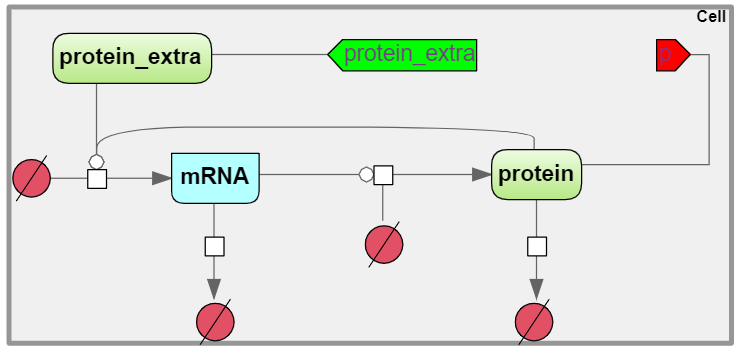

Создание иерархической SBGN модели
==================================

.. |diagram| image:: /images/icons/Type-Diagram-icon.png
.. |compartment| image:: /images/icons/compartment.png 
.. |entity| image:: /images/icons/entity.png
.. |reaction| image:: /images/icons/reaction.png
.. |folder| image:: /images/icons/folder.png
.. |option| image:: /images/icons/option.png
.. |simulate| image:: /images/icons/simulate.gif
.. |save| image:: /images/icons/save.gif
.. |submodel| image:: /images/module/submodel.png
.. |directed_link| image:: /images/icons/directed_link.png
.. |port| image:: /images/icons/port.png
   
На примере модели, включающей две подмодели разберем `создание иерархической SBGN модели <https://ict.biouml.org/bioumlweb/#de=data/Collaboration/BioUML-docs/Data/Hes7_Composite>`_ (Рисунок 1). 

   
   Рисунок 1. Иерархическая модель, включающая в себя две подмодели Hes7 oscillator и Hes7 oscillator_newcell
   
Подмодели  Hes7 oscillator и Hes7 oscillator_newcell описывают транскрипцию, регулируемую транскрипционным фактором,
последующую трансляцию, деградацию мРНК и белка. В подмодели  Hes7 oscillator транскрипционный фактор (protein_exta), приходящий из подмодели клетки Hes7 oscillator_newcell, активирует транскрипцию мРНК (mRNA).
Белок (protein), кодируемый мРНК (mRNA), переходит в клетку Hes7 oscillator_newcell, и в ней как транскрипционный фактор 
(protein_exta) негативно регулирует транскрипцию мРНК (mRNA_newcell). 

   
   Рисунок 2. Подмодель `Hes7 oscillator <https://ict.biouml.org/bioumlweb/#de=data/Collaboration/BioUML-docs/Data/Hes7%20oscillator>`_

В подмодели Hes7 oscillator_newcell 
белок (protein_newcell), кодируемый (mRNA_newcell), переходит в клетку Hes7 oscillator, и в ней соответствует транскрипционному фактору (protein_exta), который,
как было описано ранее, позитивным образом регулирует транскрию мРНК (mRNA)

   
   Рисунок 3. Подмодель `Hes7 oscillator_newcell <https://ict.biouml.org/bioumlweb/#de=data/Collaboration/BioUML-docs/Data/Hes7%20oscillator_newcell>`_

1. Для **создания новой диаграммы подмодели**, во вкладке :guilabel:`Data` области :doc:`репозитория </user_interface>` 
выберите проект и нажмите правой кнопкой мыши на нужную папку, в которой планируется
создание диаграммы. В выпадающем списке нажмите на поле |diagram| New diagram. 
Далее в открывшемся окне выберите тип диаграммы "Модель SBML в нотации SBGN (SBML in SBGN notation)". 

2. Добавьте на диаграммы :ref:`компартмент <compartment>`, :ref:`сущности <entities>` и :ref:`реакции <process>`. Подробное описание этих этапов описано
в главе :doc:`Создание SBGN модели </sbgn model>`.
 
3. Добавьте :ref:`формулы <formula>`. Формулы отображаются вo вкладке :guilabel:`Info` в области :doc:`информационного окна </user_interface>` путем нажатия на узел, соответствующий процессу.
 
4. Добавьте :ref:`начальные значения для переменных и параметров <formula>`. Численные значения можно взять из диаграмм
в области :doc:`поля операций </user_interface>` в горизонтальной вкладке :guilabel:`Model` и в 
вертикальных вкладках :guilabel:`Entities` и :guilabel:`Variables`, соответственно

5. Добавьте :ref:`порты <ports>` в диаграммах подмоделей. *Чтобы создать порт* перейдите в документ подмодели и нажмите на иконку |port|. В открывшемся окне в поле |option| Access type выберите 
*тип доступности порта*, в поле |option| Port type - *тип порта* и в поле |option| Tittle - заголовок порта, который будет отображаться на диаграмме. 
Из выпадаюшего списка в поле |option| Variable name укажите для какого ранее созданного элемента диаграммы будет создан порт.

В зависимости от **направления передачи сигнала** выделяется три типа портов: вход, выход и контакт :ref:`(Рисунок 1) <Pic.1_8>`.

-     *Вход (input)* - значение переменной подается на вход модуля и не может быть изменено модулем;
-     *Выход (output)* - значение переменной полностью определяется (вычисляется) внутри модуля и подается на вход другим модулям;
-     *Контакт (contact)* - переменная, значение которой могут изменять оба модуля.

Существует три типа **доступности портов**, они могут быть приватными, публичными и вынесенными:

-     *Приватный порт* (private) используется для изменения поведения модулей. 
-     *Публичный порт* (public) используется для представления модульной модели в виде модцля и включения ее в другую модельную модель.
-     *Вынесенный порт* (propagated)...

В подмодели Hes7 oscillator для переменной protein_extra создайте публичный входной порт c заголовком "protein_extra"
и для переменной protein - выходной публичный порт с заголовком "p".
 
В подмодели Hes7 oscillator_newcell для переменной protein_extra создайте публичный входной порт c заголовком "protein_extra",
и для переменной protein_newcell - выходной публичный порт с заголовком "p_1".

6. Для **создания иерархической диаграммы**, во вкладке :guilabel:`Data` области :doc:`репозитория </user_interface>` 
выберите проект и нажмите правой кнопкой мыши на нужную папку, в которой планируется
создание диаграммы. В выпадающем списке нажмите на поле |diagram| New diagram. 
Далее в открывшемся окне выберите тип диаграммы "Иерархическая модель SBML в нотации SBGN (SBML comp in SBGN notation)".

7. Чтобы **добавить подмодели** на иерархическую диаграмму, нажмите на иконку |diagram|, расположенную на панели инструментов.
В открывшемся окне перетащите диаграмму из области репозитория в поле |option| Diagram (Рисунок 4). 

   
   Рисунок 4. Добавление подмодели 

Таким образом добавьте подмодели 
Hes7 oscillator и Hes7 oscillator_newcell (Рисунок 5). 

   
   Рисунок 5. Добавленные подмодели Hes7 oscillator и Hes7 oscillator_newcell
   
Внутри подмоделей будут отображаться порты, созданные в подмоделях. Их можно перемещать, нажимая левой кнопкой мыши, и перетаскивая в
другое место внутри подмодели. 
   
8. Для *установления* :ref:`связи <ports>` *между входным и выходным портом* в иерархической модели, нажмите на иконку |directed_link|, означающей *направленную 
связь*. После этого последовательно нажмите на входной и затем на выходной порт, расположенные внутри подмодулей.

Выходной порт "p" в подмодели Hes7 oscillator соединяется с входным портом "protein extra" в подмодели Hes7 oscillator_newcell.
Выходной порт "p_1" в подмодели Hes7 oscillator_newcell соединяется с входным портом "protein extra" в подмодели Hes7 oscillator.

9. Создайте :ref:`график <plot>`, отражающий результаты численного расчета модели. Для того, чтобы добавить переменную (переменные),
перейдите во вкладку :guilabel:`Simulation` и затем в :guilabel:`Plot` (Рисунок 6).

.. figure:: images/interface/simple_model_plot.png
   :width: 100%
   :alt: Создание графика
   :align: center

   Рисунок 6. Создание графика 

В *опциях графика* перейдите в |folder| [1] Plot и затем в |folder| Curves добавляются переменные. 
В |option| Path укажите подмодель, а в Value выберите нужную переменную из выпадающего списка (Рисунок 7). 

.. figure:: images/interface/simple_model_curves.png
   :width: 100%
   :alt: Добавление переменной на график
   :align: center

   Рисунок 7. Добавление переменной на график

5. Запустите :ref:`численный расчет модели <simulation>`. Для этого в области поля операций на горизонтальной панели выберите вкладку 
:guilabel:`Simulation` и на вертикальной панели - :guilabel:`Engine`. 

В поле |option| Selected engine выберите *инструмент
для численных расчетов модели* -  ODE Simulation enпgine. В |folder| Java simulation engine обозначьте
*начальное время расчетов* в поле |option| Initial time; *шаг*, с которым будут сохраняться или 
выводиться на график результаты в поле |option| Time increment, 
а также *конечное время* в поле |option| Completion time (Рисунок 8). 

   Рисунок 8. Задание опций для численного расчета 

Для того, чтобы *запустить симуляцию модели*, сначала сохраните выбранные опции для симуляции, путем нажатия на иконку |save|, расположенную в верхней части поля операций,
и затем нажмите на иконку |simulate|. После окончания численного расчета модели в открывшемся окне будет отображен график 
результатов (Рисунок 9). 

   
   Рисунок 9. График, отображающий изменение концентрации мРНК (mRNA), белка (protein) и транскрипционного фактора (protein_extra) в подмодели Hes7 oscillator

