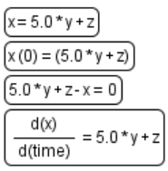
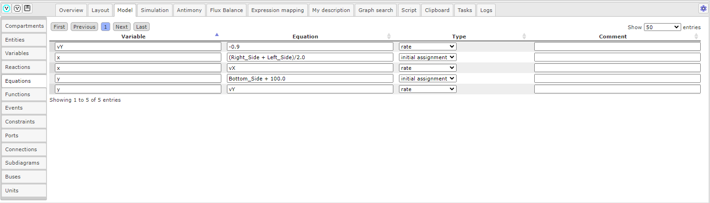
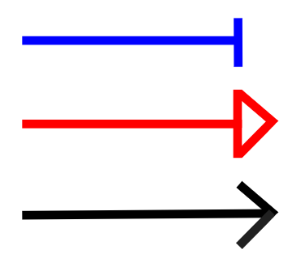
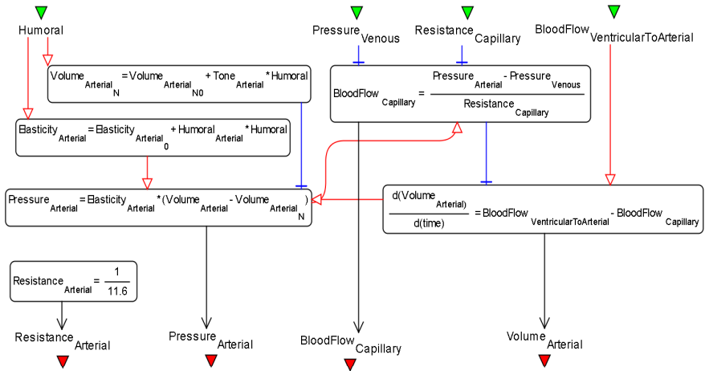

Расширенная нотация SBGN в BioUML
=================================

.. |equations| image:: /images/sbgn/equations.png
.. |relations| image:: /images/sbgn/relations.png
.. |constraint| image:: /images/sbgn/constraint.png
.. |event| image:: /images/sbgn/event.png
.. |function| image:: /images/sbgn/function.png
.. |tabular| image:: /images/sbgn/tabular.png
.. |folder| image:: /images/icons/folder.png
.. |option| image:: /images/icons/option.png
.. |edit| image:: /images/icons/edit.png

SBGN нотация, используемая в BioUML, была расширена *дополнительными эдементами* для полного представления моделей SBML. Графическая нотация SBGN совместима с SBML, хотя она больше полагается на пути, 
состоящих из сущностей и процессов между ними. Таким образом, она не охватывает каждый отдельный объект в моделях SBML. В частности, нет визуального представления «математических» объектов: уравнений, функций, событий и т.п.

Дополнительной мотивацией для добавления новых элементов является тот факт, что существует множество математических объектов моделей биологических систем (в частности - физиологических моделей), 
которые не представлены сетью биохимических реакций, а содержат набор уравнений ОДУ.

.. raw:: html

    

   <table style="table-layout: fixed; width: 100%; word-wrap: break-word;">
   <caption>Таблица 1. Дополнительные элементы введенные BioUML к SBGN нотации</caption>
    <tr>
       <th style="width: 20%;">Название</th>
       <th style="width: 20%;">Обозначение</th>
       <th style="width: 60%;">Описание</th>
    </tr>
    <tr>
       <td><a href="#equations">Уравнения</a></td>
       <td></td>
       <td>Математические уравнения в модели: 
           - присваивание 
           - алгебраические уравнения 
           - дифференциальные уравнения</td>
    </tr>
    <tr>
       <td><a href="#equations">Зависимости</a></td>
       <td></td>
       <td>Зависимость между уравнениями генерируются автоматически и описывают, как переменная, рассчитанная в одном уравнении, влияет на переменную, рассчитанную в других уравнениях. Было выделено три типа: 
           - черная стрелка - эффект не определен 
           - синяя стрелка – значение уменьшается (торможение) 
           - красная стрелка - значение увеличивается (активация)</td>
    <tr>
       <td><a href="#event">Событие</a></td>
       <td></td>
       <td>Дискретное событие, которое описывает мгновенные изменения переменных модели при выполнении определенного условия.  
	       Например, изменение приема лекарств после определенного момента времени</td>
    </tr>
    <tr>
       <td><a href="#function">Функция</a></td>
       <td></td>
       <td>Функция принимает значения аргументов и вычисляет выходные данные</td>
    </tr>
    <tr>
       <td><a href="#constraint">Ограничение</a></td>
       <td></td>
       <td>Ограничение - это условие, которое проверяется во время моделирования.  
	       Если условие нарушается, то либо выдается сообщение об ошибке, либо моделирование останавливается в зависимости от опций симулятора</td>
    </tr>
    <tr>
       <td><a href="#table">Табличный элемент</a></td>
       <td></td>
       <td>Табличный элемент используется для расчета переменных модели на основе данных в указанной таблице.  
	       Например, в этом случае столбец таблицы t соответствует времени, а столбец x_values содержит числовые данные для переменной модели x.  
	       Существует два способа обработки табличных данных: сплайн-аппроксимация и кусочно-заданная функция</td>
    </tr>
   </table>
   
   

   
.. _equations:
   
Уравнения и зависимости
-----------------------

.. |alg_equation| image:: /images/sbgn/alg_equation.png
   :height:  30px
.. |ode_equation| image:: /images/sbgn/ode.png
   :height:  50px
.. |assignment_equation| image:: /images/sbgn/assignment_equation.png
   :height:  30px
.. |math_equation| image:: /images/icons/math_equation.png

В BioUML была введена графическая нотация для **уравнений**, которые включают следуюшие типы :ref:`(Рисунок 1) <Pic.1_6>`:

.. _Pic.1_6:

   
   Рисунок 1. Элемент уравнений в BioUML

-   **Обыкновенное дифференциальное уравнение** задает динамику некоторой переменной x зависимостью вида: |ode_equation|. Вместе с начальными условиями эти уравнения формирует задачу Коши, которая может быть численно решена одним из методов, встроенных в BioUML.
-   **Алгебраическое уравнение** задает зависимости между переменными модели, которые должны быть выполнены все время функционирования модели. В частности, это могут быть различные законы сохранения. Общий вид зависимости: |alg_equation|. Формируют систему (в общем случае нелинейных) алгебраических уравнений.
-   **Правило присваивания** напрямую выражают значения одних переменных через другие уравнениями вида: |assignment_equation| Присваивания делятся на два типа: присваивания, которые выполняются один раз в начальный момент времени (начальное присваивание) и присваивания, выражающие зависимости, которые должны быть выполнены в течение всего времени функционирования модели. Поскольку присваивания первого типа просто задают начальные значения переменных системы, в дальнейшем будем говорить только о присваиваниях второго типа. 

Для того, чтобы *создать уравнение*, нажмите на иконку |math_equation|, расположенную на :ref:`панели инструментов <panel>` и затем на диаграмму, где планируется разместить уравнение. 

После создания уравнения на диаграмме,
нажмите на него правой кнопкой мыши и выберите |edit| Edit. В поле |option| Type выберите *тип уравнения*: 
обыкновенное дифференциальное уравнение (rate), алгебраическое уравнение (algebraic), 
правило присваивания (initial assignment) и скалярное (scalar). 
Для всех типов уравнений, кроме алгебраического, в поле :guilabel:`Variable` введите *имя переменной* 
(кроме алгебраических уравнений), для которой будет определена зависимость. В поле
|option| Equation вводится *формула*.

Добавленные уравнения отображаются в области :doc:`поля операций </user_interface>` во вкладке :guilabel:`Model` на горизонтальной панели и в открывшемся окне 
на вертикальной панели во вкладке :guilabel:`Equations` :ref:`(Рисунок 2) <Pic.2_6>`. В строке, соответствующей уравнению, возможно измененить переменную в 
столбце Variable, формулу в Equation и тип уравнения в Type, и так же можно добавить описание для уравнения в столбце Comment.

.. _Pic.2_6:

   
   Рисунок 2. Вкладка Equations в поле операций
   
**Зависимости** между уравнениями генерируются автоматически и описывают, как переменная, рассчитанная в одном уравнении, влияет на переменную, рассчитанную в других уравнениях. Существует три типа зависимостей: 

   
   Графическое отображение зависимостей между уравнениями

-   эффект не определен - черная стрелка; 
-   значение уменьшается (торможение) - синяя стрелка; 
-   значение увеличивается (активация) - красная стрелка. 

   
   Рисунок 3. Модель артериальной системы, состоящей на основе уравнений и зависимостей между ними
   
.. _event:
   
Событие
-------

.. |event_icon| image:: /images/icons/math_event.png

**Событие** заключается в скачкообразном изменении значений переменных модели при выполнении
определенного условия (например, в определенный момент времени или при заданном соотношении между
переменными) :ref:`(Рисунок 4) <Pic.4_6>`.

.. _Pic.4_6:

.. figure:: /images/sbgn/event.png
   :width: 20%
   :alt: Событие
   :align: center	 
   
   Рисунок 4. Элемент события в BioUML

Чтобы *добавить событие* нажмите на иконку |event_icon|, расположенную на :ref:`панели инструментов <panel>` и затем на диаграмму, где планируется разместить событие. 
После создания события, нажмите на него правой кнопкой мыши и выберите поле |edit| Edit. В опциях |folder| Role в поле 
|option| Trigger устанавливается *триггер* - условие для запуска события. В поле |option| Delay задается *время*, 
через которое происходит выполнение события. *Приоритет* указывает на порядок, в котором должны быть выполнены
события в том случае, если их времена выполнения совпадают, и указывается в поле |option| Priority. В опциях |folder| 
Assignments в полях 
|option| Variable и |option| Expression указывается переменная,
к которой будет применено событие и формула, соответственно. 

.. note::
   дополнить про индикаторы (Use trigger time values и др). примеры использования событий
   
Добавленные события отображаются в области :doc:`поля операций </user_interface>` во вкладке :guilabel:`Model` на горизонтальной панели и в открывшемся окне 
на вертикальной панели во вкладке :guilabel:`Events` :ref:`(Рисунок 5) <Pic.5_6>`. 

.. _Pic.5_6:

.. figure:: /images/interface/events.png
   :width: 100%
   :alt: Событие
   :align: center	 
   
   Рисунок 5. Вкладка Events в поле операций
   
.. _function:

Функция
-------

.. |function_icon| image:: /images/icons/math_function.png

**Функция** может использоваться в уравнениях или реакциях модели :ref:`(Рисунок 6) <Pic.6_6>`. 

.. _Pic.6_6:

.. figure:: /images/sbgn/function.png
   :width: 20%
   :alt: Функция
   :align: center	 
   
   Рисунок 6. Элемент функции в BioUML
 
Для *добавления функции* нажмите иконку |function_icon|, расположенную на :ref:`панели инструментов <panel>` и затем на диаграмму, где планируется разместить функцию. После создания функции,
нажмите на нее правой кнопкой мыши и выберите поле |edit| Edit. В опциях |folder| Role в поле 
|option| Right Hand Side введите *правую часть уравнения*. В поле |option| Formula вводится функция, 
соответствующая следующему образцу: 
``function function_name(a1, ..., an) = Right Hand Side``, где function_name - заданный *идентификатор функции* в поле |option| Name; a1, ... , an - *аргументы функции*. 

.. note::
   При использовании функции в уравнении или реакции пишется только левая часть функции, включающая ее название и аргументы. 
   
Добавленные функции отображаются в области :doc:`поля операций </user_interface>` во вкладке :guilabel:`Model` на горизонтальной панели и в открывшемся окне 
на вертикальной панели во вкладке :guilabel:`Functions` :ref:`(Рисунок 7) <Pic.7_6>`. 

.. _Pic.7_6:

.. figure:: /images/interface/function.png
   :width: 100%
   :alt: Функция
   :align: center	 
   
   Рисунок 7. Вкладка Functions в поле операций
   
.. _constraint:
   
Ограничение
-----------

.. |math_сonstraint| image:: /images/icons/math_constraint.png

**Ограничение** - это условие, которое проверяется во время моделирования.
Если условие нарушается, то либо выдается сообщение об ошибке, либо моделирование останавливается в зависимости 
от опций симулятора :ref:`(Рисунок 8) <Pic.8_6>`. 

.. _Pic.8_6:

.. figure:: /images/sbgn/constraint.png
   :width: 20%
   :alt: Элемент ограничения в BioUML
   :align: center	 
   
   Рисунок 8. Элемент ограничения в BioUML

Для *добавления ограничения* нажмите иконку |math_сonstraint|, расположенную на :ref:`панели инструментов <panel>` 
и затем на диаграмму, где планируется разместить ограничение.

.. note::
   добавить описание для ограничений, их использование и опции. 
   
Добавленные ограничения отображаются в области :doc:`поля операций </user_interface>` во вкладке :guilabel:`Model` 
на горизонтальной панели и в открывшемся окне 
на вертикальной панели во вкладке :guilabel:`Сonstraints` :ref:`(Рисунок 9) <Pic.9_6>`.

.. _Pic.9_6:

.. figure:: /images/interface/constraints.png
   :width: 100%
   :alt: Вкладка Сonstraints в поле операций
   :align: center	 
   
   Рисунок 9. Вкладка Сonstraints в поле операций

.. _table:

Табличный элемент
-----------------

.. |table| image:: /images/icons/table.png

Чтобы *добавить табличный элемент* нажмите иконку |table|, расположенную на :ref:`панели инструментов <panel>` и затем на диаграмму, где планируется разместить таблицу.

.. note::
   добавить описание для табличного элемента, их использование и опции.

   
   