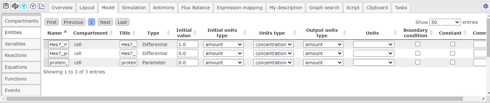
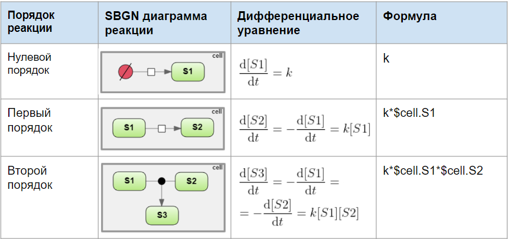

Создание процесса
=================

Визуальное моделирование процесса
---------------------------------

.. |folder| image:: /images/icons/folder.png
.. |reaction| image:: /images/icons/reaction.png
.. |logical_operator| image:: /images/icons/logical_operator.png

Для *создания процесса* нажмите на иконку |reaction|, расположенную на :ref:`панели инструментов <panel>`.
В открывшемся окне в поле :guilabel:`Reaction name` введите *идентификатор реакции*, либо оставьте
автоматически сгенерированный идентификатор типа "Reaction_n", где n - порядковый номер реакции. 

*Компоненты реакции* добавляются путем нажатия на ранее 
созданную сущность на диаграмме, название которой будет отображено в поле :guilabel:`Component`, и
выбора ее роли в поле :guilabel:`Role`. Существует три *роли сущности реакции* - modifier (модификатор),
реактант (reactant) и продукт (product). Далее нажмите кнопку :guilabel:`Add`.   

.. note::
   Одна и та же сущность может играть несколько ролей в одной реакции 

При добавлении компонентов в реакцию, *заголовок реакции* будет автоматически сгенерирован в поле :guilabel:`Reaction title`, который так же можно изменить по желанию.

.. figure:: images/interface/reaction.png
   :width: 100%
   :alt: Реакция
   :align: center
   
   Создание новой реакции в BioUML  
   
После того, как реакция будет создана, можно редактировать *дополнительные свойства реакции*, путем нажатия правой кнопки мыши на узел диаграммы, соответствующий :ref:`процессу <process>`, и последующего выбора поля :guilabel:`Edit`. В открывшемся окне в опциях |folder| Species references перечислены компоненты реакции, 
для которых можно добавить *стехиометрию* в поле :guilabel:`Stoichiometry` и для модификатора указать его *тип влияния на процесс*, т.е обозначить вид :ref:`ребра модуляции <modulation>`. 
В опциях |folder| Attributes в поле :guilabel:`sbgn:reactionType` указывается тип :ref:`процесса <process>`.  

Нажатие правой кнопкой мыши на :ref:`ребра реакции <edges>` открывает опции, позволяющие изменять *дополнительные свойства ребер*, также доступные в дополнительных свойствах реакции, и 
редактировать *геометрическую форму ребер* - добавлять новую вершину (Add vertex), выпрямлять ребро (Straighten edge) и др.

.. _logical_operator:

.. figure:: images/interface/logical_operator.png
   :width: 80%
   :alt: Логический оператор
   :align: center
   
   Добавление логического оператора в реакцию в BioUML 

Для того, чтобы добавить *логический оператор* в реакцию, создайте реакцию без добавления модификатора в компоненты реакции. Далее нажмите на иконку
|logical_operator|, расположенную на :ref:`панели инструментов <panel>`. В открывшемся окне в поле :guilabel:`sbgn:logicalOperator` выберите нужный тип оператора, в поле :guilabel:`Reaction` 
- ранее созданную реакцию, и затем укажите также ранее созданную сущность, которая будет в реакции выполнять роль модификатора в поле :guilabel:`Modifiers` и укажите его тип влияния на процесс в 
поле :guilabel:`Modifier type`. 

.. note::
   Если в реакции предполагается несколько модификаторов, зажимая Shift, укажите несколько сущностей. 
   
Переменная и параметр
---------------------

При создании :ref:`материальной сущности <entities>` создается **переменная**. Переменная описывает концентрацию или количество вещества
соответствующей сущности и облаюдает следующими атрибутами:

-   имя;
-   численное значение;
-   тип единицы измерения и единица измерения;
-   флаг, обозначающий, является ли численное значение переменной фиксированным или может меняться.

.. note::
   У сущности **имя переменной** образуется путем добавления "$" перед заданным ранее именем сущности. 
   Если сущность принадлежит компартменту, то имя переменной будет содержать и название компартмента, 
   например, $compartment.entity.
   Присвоенное имя переменной будет указано во вкладке :guilabel:`Info` (инспектор свойств) в области :doc:`информационного окна </user_interface>`
   в поле :guilabel:`Role` - VariableRole.  

*Атрибуты переменной* могут устанавливаться следующими способами:

-    В :ref:`дополнительных свойствах элемента <additional_options>` в опциях |folder| Role;
-    В области :doc:`поля операций </user_interface>` выберите вкладку :guilabel:`Model` на горизонтальной панели и в открывшемся окне на вертикальной панели вкладку :guilabel:`Entities`. Строки соответствуют каждой созданной 
     переменной.

   
   Изменение атрибутов переменной в поле операций 
	 
**Численное значение** переменной задается в поле :guilabel:`Initial Value`. Обратите внимание, что в BioUML десятичным разделителем является точка. 

.. note::
   дополнить про ед.измерения 

**Единица измерения** переменной добавляется в полях :guilabel:`Initial units type`.

Флаг **константы** изменяется в поле :guilabel:`Constant` и определяет является ли численное значение переменной постоянной и може ли быть изменено.

Флаг **граничного условия** может быть добавлен в поле :guilabel:`Boundary condition`. В случае, если оно установлено – значение переменной не может меняться в ходе реакций (но
может подчиняться закону, заданному дифференциальным или алгебраическим уравнением).

**Параметр** - математическая переменная модели, для которой нет выделенного элемента на диаграмме. Может быть добавлена в модель путем явного упоминания в каком-либо математическом выражении (уравнении, законе
реакции и т.д.).

Математическое описание процесса
--------------------------------

.. |plus| image:: /images/icons/icon_plus.gif
.. |minus| image:: /images/icons/icon_minus.gif

**Реакция** транслируется в дифференциальные уравнения, описывающие динамику переменных, соответствующих веществам-участникам реакции. 

После того, как будет создана :ref:`реакция <reactions>`, **формула** вводится в поле :guilabel:`Formula` 
в открывшемся окне либо в :ref:`дополнительных свойствах реакции <reactions>` в опциях |folder| Kinetic law 
в поле :guilabel:`Formula`. Корректность формулы можно проверить вo вкладке :guilabel:`Info` в области :doc:`информационного окна </user_interface>` путем нажатия на геометрическую фигуру, отображающую процесс.
Добавленные реакции с формулой отображаются во вкладке :guilabel:`Model` на горизонтальной панели и в открывшемся окне 
на вертикальной панели во вкладке :guilabel:`Reactions`

.. note::
   При добавлении формулы **имя переменной** лучше скопировать из поля :guilabel:`Role` - VariableRole во вкладке :guilabel:`Info`.
   Учитывайте, что имя переменной включает знак "$", а перед параметром он не ставится. 
   Для возведения в степень используется оператор "^", деления - "/", умножения - "*", "+" и "-"
   для сложения и вычитания, соответственно.

   
   Простейшие реакции с SBGN диаграммой и формулой для BioUML
   
.. _add_parameter:
   
После введения формулы внесенные **параметры** добавляются в области :doc:`поля операций </user_interface>` во вкладке :guilabel:`Model` на горизонтальной панели и в открывшемся окне 
на вертикальной панели во вкладке :guilabel:`Variables`. *Значение параметра* выставляется в поле :guilabel:`Initial value`. 
Если требуется *удалить неиспользуемый параметр* или *добавить* новый, нажмите на иконку |minus| и |plus|, cоответственно. 