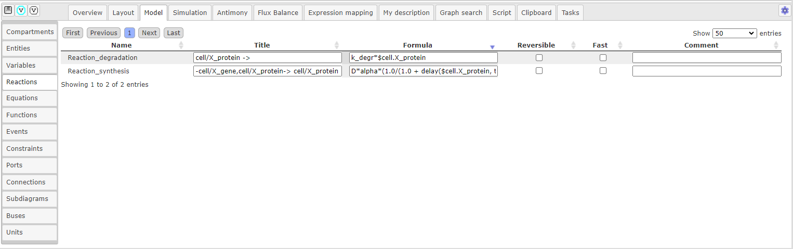

Создание процесса
=================

.. |edit| image:: /images/icons/edit.png
.. |option| image:: /images/icons/option.png

.. _process_creation:

Визуальное моделирование процесса
---------------------------------

.. |folder| image:: /images/icons/folder.png
.. |reaction| image:: /images/icons/reaction.png
.. |logical_operator| image:: /images/icons/logical_operator.png

Для *создания процесса* нажмите на иконку |reaction|, расположенную на :ref:`панели инструментов <panel>`.
В открывшемся окне в поле Reaction name введите *идентификатор реакции*, либо оставьте
автоматически сгенерированный идентификатор типа "Reaction_n", где n - порядковый номер реакции. 

*Компоненты реакции* добавляются путем нажатия на ранее 
созданную сущность на диаграмме, название которой будет отображено в поле Component, и
выбора ее роли в поле Role. Существует три *роли сущности реакции* - modifier (модификатор),
реактант (reactant) и продукт (product). После заполнения полей нажмите кнопку :guilabel:`Add`.   

.. note::
   Одна и та же сущность может играть несколько ролей в одной реакции 

При добавлении компонентов в реакцию, *заголовок реакции* будет автоматически сгенерирован в поле Reaction title, который так же можно изменить по желанию.

.. figure:: images/interface/reaction.png
   :width: 100%
   :alt: Создание новой реакции в BioUML
   :align: center
   
   Рисунок 1. Создание новой реакции в BioUML  
   
.. _additional_reaction_options:
   
После того, как реакция будет создана, можно редактировать *дополнительные свойства реакции*, путем нажатия правой кнопки мыши на узел диаграммы, соответствующий :ref:`процессу <process>`, и последующего выбора поля |edit| Edit. 
В открывшемся окне в опциях |folder| Species references перечислены компоненты реакции, 
для которых можно добавить *стехиометрию* в поле |option| Stoichiometry и для модификатора указать его *тип влияния на процесс* в поле |option| Modifier action, т.е обозначить вид :ref:`ребра модуляции <modulation>`. 
В опциях |folder| Attributes в поле |option| sbgn:reactionType указывается тип :ref:`процесса <process>`.  

Нажатие правой кнопкой мыши на :ref:`ребра реакции <edges>` открывает опции, позволяющие изменять *дополнительные свойства ребер*, также доступные в дополнительных свойствах реакции, и 
редактировать *геометрическую форму ребер* - добавлять новую вершину (Add vertex), выпрямлять ребро (Straighten edge) и др.

.. _logical_operator:

.. figure:: images/interface/logical_operator.png
   :width: 80%
   :alt: Добавление логического оператора в реакцию в BioUML 
   :align: center
   
   Добавление логического оператора в реакцию в BioUML 

Для того, чтобы добавить *логический оператор* в реакцию, создайте реакцию без добавления модификатора в компоненты реакции. Далее нажмите на иконку
|logical_operator|, расположенную на :ref:`панели инструментов <panel>`. В открывшемся окне в поле |option| sbgn:logicalOperator выберите нужный тип оператора, в поле |option| Reaction 
- ранее созданную реакцию, и затем укажите также ранее созданные сущности, которые будут в реакции выполнять роль модификаторов в поле |option| Modifiers, и укажите тип влияния на процесс в 
поле |option| Modifier type. 

.. note::
   Добавление нескольких модификаторов в реакцию осуществляет с помощью нажатия Shift и выбор нескольких строк. 
   
.. _math_model:
   
Переменная и параметр
---------------------

При создании :ref:`материальной сущности <entities>` создается **переменная**. Переменная описывает концентрацию или количество вещества
соответствующей сущности и обладает следующими атрибутами:

-   идентификатор;
-   численное значение;
-   тип единицы измерения и единица измерения;
-   флаг, обозначающий, является ли численное значение переменной фиксированным или может меняться.

.. note::
   У сущности **идентификатор переменной** образуется путем добавления "$" перед заданным ранее идентификатором сущности. 
   Если сущность принадлежит компартменту, то идентификатор переменной будет содержать и идентификатор компартмента, 
   например, $compartment.entity.
   Присвоенный идентификатор переменной будет указан во вкладке :guilabel:`Info` (инспектор свойств) в области :doc:`информационного окна </user_interface>`
   в поле Role - VariableRole.  

*Атрибуты переменной* могут устанавливаться следующими способами:

-    В :ref:`дополнительных свойствах элемента <additional_options>` в опциях |folder| Role;
-    В области :doc:`поля операций </user_interface>` выберите вкладку :guilabel:`Model` на горизонтальной панели и в открывшемся окне на вертикальной панели вкладку :guilabel:`Entities`. Строки соответствуют каждой созданной 
     переменной :ref:`(Рисунок 2) <Pic.2_7>`.
	 
.. _Pic.2_7:

   
   Рисунок 2. Изменение атрибутов переменной в поле операций 
	 
**Численное значение** переменной задается в столбце Initial Value. 

.. warning::
   Обратите внимание, что в BioUML десятичным разделителем является точка. 

*Численное значение* переменной задается в столбце Initial Value. 
В столбце Initial units type указывается единица измерения начального численного значения переменной:
amount - количество вещества; concentration - концентрация. Units type указывает
единицу измерения для идентификатора переменной в реакции, уравнении и т.д. Output units type соответствует единице измерения при 
выводе численных результатов на график. 

Флаг **константы** ставится в столбце Constant и определяет является ли численное значение переменной постоянной и може ли быть изменено.

Флаг **граничного условия** может быть поставлен в столбце Boundary condition. 
В случае, если оно установлено – значение переменной не может меняться в ходе реакций (но
может подчиняться закону, заданному дифференциальным или алгебраическим уравнением).

**Параметр** - математическая переменная модели, для которой нет выделенного элемента на диаграмме. 
Может быть добавлена в модель путем явного упоминания в каком-либо математическом выражении (уравнении, законе
реакции и т.д.), либо в области :doc:`поля операций </user_interface>` во вкладкe :guilabel:`Model` на 
горизонтальной панели и в открывшемся окне на вертикальной панели во вкладке :guilabel:`Variables`.

.. figure:: images/interface/variables.png
   :width: 100%
   :alt: Изменение атрибутов переменной 
   :align: center	 
   
   Рисунок 3. Вкладка Variables в поле операций 

.. _formula:

Математическое описание процесса
--------------------------------

.. |plus| image:: /images/icons/icon_plus.gif
.. |minus| image:: /images/icons/icon_minus.gif

**Реакция** транслируется в дифференциальные уравнения, описывающие динамику переменных, соответствующих веществам-участникам реакции. 

После того, как будет создан :ref:`процесс <process_creation>`, **формула** вводится в поле |option| Formula 
в открывшемся окне либо в :ref:`дополнительных свойствах реакции <additional_reaction_options>` в опциях |folder| Kinetic law 
в поле |option| Formula. Корректность формулы можно проверить вo вкладке :guilabel:`Info` в области :doc:`информационного окна </user_interface>` путем нажатия на узел, соответствующий процессу.

Добавленные реакции с формулой отображаются во вкладке :guilabel:`Model` на горизонтальной панели и в открывшемся окне 
на вертикальной панели во вкладке :guilabel:`Reactions` :ref:`(Рисунок 3) <Pic.3_7>`.

.. _Pic.3_7:

   
   Рисунок 3. Вкладка  Reactions в поле операций 

.. warning::
   При создании формулы учитывайте, что *идентификатор переменной* включает знак "$", а перед параметром он не ставится. 
   Для возведения в степень используется оператор "^", деления - "/", умножения - "*", "+" и "-"
   для сложения и вычитания, соответственно.

   
   Рисунок 4. Простейшие реакции с SBGN диаграммой и формулой для BioUML
   
.. _add_parameter:
   
После введения формулы внесенные **параметры** добавляются в области :doc:`поля операций </user_interface>` во вкладке :guilabel:`Model` на горизонтальной панели и в открывшемся окне 
на вертикальной панели во вкладке :guilabel:`Variables` :ref:`(Рисунок 5) <Pic.5_7>`. *Значение параметра* выставляется в столбце Initial value. 
Если требуется *удалить неиспользуемый параметр* или *добавить* новый, нажмите на иконку |minus| и |plus|, cоответственно.

.. _Pic.5_7:

.. figure:: images/interface/variables.png
   :width: 100%
   :alt: Вкладка Variables в поле операций
   :align: center	 
   
   Рисунок 5. Вкладка Variables в поле операций 