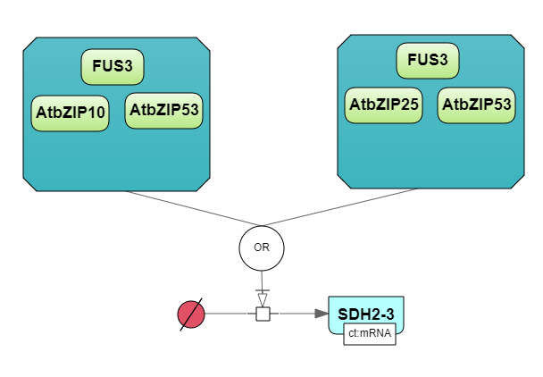

Элементы SBGN нотации в BioUML
==============================

.. |folder| image:: /images/icons/folder.png
.. |option| image:: /images/icons/option.png

.. _entities:

Сущности
--------

.. |complex| image:: /images/icons/complex.png
.. |entity| image:: /images/icons/entity.png
    
**Сущности** - это элементы графической нотации SBGN, описывающие компоненты биологической системы, участвующие 
в процессах :ref:`(Рисунок 1) <Pic.1_5>`. В BioUML доступны все типы сущностей нотации SBGN, которые разделяются на два класса:

-     **материальные**: макромолекула, простое химическое вещество, нуклеиновая кислота, неопределенная сущность, мультимер и комплекс;
-     **концептуальные**: пустое множество и возмущающий агент.

.. _Pic.1_5:

.. figure:: images/sbgn/entities_rus.png
   :width: 60%
   :alt: Сущности
   :align: center
   
   Рисунок 1. Сущности SBGN нотации
   
.. raw:: html

    

   <table>
       <caption>Таблица 1. Описание сущностей SBGN нотации </caption> 
    <tr>
       <th style="width: 25%;">Название</th>
       <th style="width: 50%;">Описание нотации SBGN</th>
    </tr>
    <tr>
       <td>Неопределенная сущность</td>
       <td>Сущность, тип которой неизвестен либо не имеет прямого биологического значения.</td>
    </tr>
    <tr>
       <td>Простое химическое вещество</td>
       <td>Определяется как противоположность макромолекулы: химическое соединение, которое не образуется путем ковалентного связывания псевдоидентичных остатков. Примерами этого типа могут служить атом, ион, радикал и другие биохимические вещества.</td>
    </tr>
    <tr>
       <td>Макромолекулы</td>
       <td>Биохимические вещества, образующиеся от ковалентного связывания псевдоидентичных единиц - белки, нуклеиновые кислоты, полисахариды.</td>
    </tr>
    <tr>
       <td>Нуклеиновая кислота</td>
       <td>Представляет собой фрагмент макромолекулы, несущий генетическую информацию. Обычно этот тип сущности используют для представления гена или транскрипта.</td>
    </tr>
    <tr>
       <td>Мультимер</td>
       <td>Мультимер представляет собой совокупность множества одинаковых или псевдоидентичных соединений, удерживаемых вместе нековалентными связями. Примером мультимера может служить димерный рецептор. Существуют четыре типа мультимера: мультимер простого химического вещества, мультимер макромолекулы, мультимер с признаками нуклеиновой кислоты и мультимер комплекса.</td>
    </tr>
    <tr>
       <td>Комплекс</td>
       <td>Комплекс представляет собой пул биохимических объектов, каждый из которых состоит из других биохимических объектов, будь то макромолекулы, простые химические вещества, мультимеры или другие комплексы.</td>
    </tr>
    <tr>
       <td>Пустое множество</td>
       <td>Представляет собой отсутствие компонента в модели. Допустим, при создании реакции деградации, у которой отсутствует фактический продукт, на диаграмме будет отображаться пустое множество.</td>
    </tr>
    <tr>
       <td>Возмущающий агент</td>
       <td>Отображает внешнее воздействие на компоненты модели. Например, это может быть изменение температуры, излучение, мутация и др.</td>
    </tr>
   </table>
   
   

.. note::
   Некоторые типы сущностей могут опционально содержать :ref:`вспомогательные единицы <units>`. При этом одной сущности может соответствовать несколько вспомогательных единиц. 
 
**Макромолекула (macromolecule)**, **простое химическое вещество (simple chemical)**, **нуклеиновая кислота (nucleic acid feature)**, 
**неопределенная сущность (unspecified)**, **возмущающий агент (perturbing agent)** и **комплекс (complex)** добавляется на диаграмму засчет выбора иконки |entity| на панели инструментов и нажатия
на место на диаграмме, где планируется разместить сущность. Выбор нужного типа сущности осуществляется в
открывшемся окне в поле |option| sbgb:enityType :ref:`(Рисунок 2) <Pic.2_5>`. 

.. _Pic.2_5:

.. figure:: images/interface/creating_entity.png
   :width: 80%
   :alt: Создание сущности в веб-версии BioUML
   :align: center

   Рисунок 2. Создание сущности в веб-версии BioUML

**Комплекс** может быть создан также путем выбора иконки |complex| на панели инструментров. Для того, чтобы поместить в комплекс другие объекты, необходимо зажать их левой кнопкой мыши и поместить внутрь него. 
   
**Мультимер** создается засчет указания в поле |option| sbgn:multimer количества субъединиц, входяших в его состав. Мультимер можеть быть создан для всех типов упомянутых выше сущностей, за исключением возмущающего агента и 
неопределенной сущности. Cозданный мультимер будет содержать :ref:`единицу информации <units>` вида N:n, где n - количество субъединиц в составе мультимера.

.. _compartment:

Компартмент
-----------

.. |compartment| image:: /images/icons/compartment.png

**Компартмент** является отдельным элементом диаграммы, в составе которого могут находиться сущности :ref:`(Рисунок 3) <Pic.3_5>`. Компартмент создается с помощью нажаться на иконку |compartment|, расположенную на панели инструментов. 

.. _Pic.3_5: 

.. figure:: images/sbgn/compartment_rus.png
   :width: 40%
   :alt: Компартмент
   :align: center
   
   Рисунок 3. Компартмент

.. note::
   Отдельная сущность может принадлежать только одному компартменту. Таким образом, «одни и те же» биохимические компоненты, находящиеся в двух разных компартментах, на самом деле представляют собой две разных сущности. 
   После того, как сущность будет перемещена в компартмент, название этой переменной будет изменено путем добавления названия компартмента перед названием сущности. Например, $compartment.entity.
   
.. figure:: images/diagrams/IGF_signaling.jpg
   :width: 100%
   :alt: SBGN диаграмма сигналинга IGF-1
   :align: center

   Рисунок 4. `SBGN диаграмма сигналинга IGF-1 <https://ict.biouml.org/bioumlweb/#de=data/Collaboration/BioUML-docs/Data/IGF%20signaling>`_ , содержащая два компартмента - внеклеточное пространство (extracellular) и цитозоль (cytosol)   

Добавленные компартменты отображаются в :doc:`поля операций </user_interface>` во вкладке :guilabel:`Model` на горизонтальной панели и в открывшемся окне 
на вертикальной панели во вкладке :guilabel:`Compartments` :ref:`(Рисунок 5) <Pic.5_5>`. Для добавленного компартмента можно изменить его *заголовок* в поле Title, указать *численное значение* 
в столбце *Initial value*. Флаг *константы* ставится в столбце Constant и определяет является ли 
численное значение переменной константы постоянной и может ли быть изменено. В столбце *Units* из выпадающего списка
выбирается единица измерения. 

.. _Pic.5_5:

.. figure:: images/sbgn/compartment_rus.png
   :width: 40%
   :alt: Вкладка Compartments в поле операций 
   :align: center
   
   Рисунок 5. Вкладка Compartments в поле операций 

.. _units:

Вспомогательные единицы
-----------------------

.. |unit_of_information| image:: /images/icons/unit_of_information.png
.. |variable| image:: /images/icons/variable.png
.. |clone_node| image:: /images/icons/clone_node.png
.. |merge_node| image:: /images/icons/merge_node.png

В BioUML доступны все типы **вспомогательных единиц**, описанной в нотации SBGN: единицы информации, переменные состояния и маркеры клонирования :ref:`(Рисунок 6) <Pic.6_5>`.
Каждой сущности может соответсвовать несколько вспомогательных единиц как одного типа, так и нескольких. 

.. _Pic.6_5:

.. figure:: images/sbgn/auxilary_units_rus.png
   :width: 40%
   :alt: Вспомогательные единицы
   :align: center
   
   Рисунок 6. Вспомогательные единицы

**Единица информации** используется для добавления дополнительной информации к сущности. Для определенных типов информации, нотация SBGN определяет конкретные префиксы. 
С более подробной информацией о префиксах можно ознакомиться по ссылке (https://sbgn.github.io/).

-   pt - физические характеристики, такие как температура (pc:T), pH (pc:pH) и др. Предполагается, что они будут использоваться для описания характера возмущающего воздействия агента 
    или фенотипа.
-   mt - биологический тип сущности, такие как ДНК (mt:dna), РНК (mt:rna), ион (mt:ion) и др.
-   ct - концептуальные типы сущности, такие как ген (ct:gene), сайт транскрипции (ct:tss) и др. 

.. figure:: images/diagrams/gene_regulation.jpg
   :width: 70%
   :alt: Регуляция экспрессии гена
   :align: center
   
   Рисунок 7. Пример использования единиц информации при создании `диаграммы, описывающей процесс регуляции экспрессии гена <https://ict.biouml.org/bioumlweb/#de=data/Collaboration/BioUML-docs/Data/Gene%20expression%20regulation>`_  
   
Для того, чтобы добавить вспомогательную единицу к сущности, нажмите на иконку |unit_of_information|, расположенную на :ref:`панели инструментов <panel>` и затем на выбранную сущность. 
   
**Переменные состояния** используются для описания изменения физического состояния биологического объекта. Обычно, переменная состояния строится из двух подстрок, разделенных символом "@", 
первая из которых идентифицирует значение переменной состояния, а вторая — ее имя. Например, при описании процесса фосфорилирования белка, для нефосфорилированной формы может использоваться 
переменная состояния "@S122" либо пустое состояние, обозначающая позицию фосфорилирования, и для фосфорилированной формы - "P@S122", где P - остаток фосфорной кислоты. Символ "@" опускается, если
переменная состояния не имеет имени, как например, при обозначении активной и неактивной формы белка. 

Для некоторых переменных состояния, отображающих ковалентные модификации макромолекул, существуют определенные идентификаторы. Например, фосфорилирование (P), ацетилирование (Ac), метиилирование (Me) и др.

Для того, чтобы добавить переменную состоянию к сущности, нажмите на иконку |variable|, расположенную на :ref:`панели инструментов <panel>` и затем на выбранную сущность. 

   
   Рисунок 8. Пример использования переменных состояния при создании `диаграммы, описывающей процесс фосфорилирования белка  <https://ict.biouml.org/bioumlweb/#de=data/Collaboration/BioUML-docs/Data/Protein%20phosphorylation>`_

**Маркеры клонирования** используются при дублировании сущности на диаграмме.

Для создания клона нажмите на сущность, которую хотите клонировать и затем на иконку |clone_node|, расположенную
на :doc:`общей панели управления </user_interface>`. Чтобы объединить клоны, нажмите на клон и затем на иконку 
|merge_node|. 

.. figure:: images/diagrams/glycolysis.jpg
   :width: 100%
   :alt: Гликолиз
   :align: center
   
   Рисунок 9. Пример использования маркеров клонирования при создании `диаграммы, описывающей процесс гликолиза <https://ict.biouml.org/bioumlweb/#de=data/Collaboration/BioUML-docs/Data/Glycolysis>`_. АТФ и АДФ встречаются в этом пути 4 раза, поэтому оба идентифицируются с помощью клон-маркера.
   
Заметка
-------

.. |note| image:: /images/icons/note.png
.. |note_link| image:: /images/icons/note_link.png

**Заметка** используется для добавления дополнительной информации, например, детального описания молекулярных механизмов, отображенных на диаграмме :ref:`(Рисунок 10) <Pic.10_5>`.
Аннотация может быть представлена как отдельный элемент на диаграмме,
так и быть связанной с сущностью при помоши **ребра заметки**.

.. _Pic.10_5:

.. figure:: images/sbgn/annotation_rus.png
   :width: 40%
   :alt: Заметка
   :align: center
   
   Рисунок 10. Заметка

Для того, чтобы создать заметку, нажмите на иконку |note|, расположенную на :ref:`панели инструментов <panel>`. Затем, вы можете связать ее с сущностью, создав ребро заметки, нажав на иконку |note_link|, 
и соединив этим ребром сущность и аннотацию.

.. figure:: images/diagrams/annotation.png
   :width: 30%
   :alt: Заметка
   :align: center
   
   Рисунок 11. Пример использования заметки, связанной с сущностью. 

.. _process:

Процессы 
--------

**Процессы** преобразуют один или несколько пулов сущностей в один или несколько пулов сущностей, идентичных или разных. На диаграмме процессы отображаются в виде круга или квадрата, 
которые соединены с небольшими дугами (ребрами), прикрепленными к центрам противоположных сторон фигуры процесса :ref:`(Рисунок 12) <Pic.12_5>`.

.. note:: 
   Создание реакций с использованием описанных элементов диаграммы будет обсуждаться в разделе :ref:`"Визуальное моделирование процесса" <process_creation>`. 

Согласно нотации SBGN существует один общий тип - *базовый процесс (process)*, а также пять типов специфических процессов: *пропущенный процесс (omitted process)*, 
*неопределенный процесс (uncertain process)*, *ассоциация (association)*, *диссоциация (dissociation)* и
*фенотип (phenotype)*. 

.. _Pic.12_5: 

.. figure:: images/sbgn/processes_rus.png
   :width: 40%
   :alt: Процессы
   :align: center
  
   Рисунок 12. Процессы 

.. raw:: html

   <table>
       <caption>Таблица 2. Описание процессов</caption> 
    <tr>
       <th style="width: 25%;">Тип процесса</th>
       <th style="width: 50%;">Описание</th>
    </tr>
    <tr>
       <td>Базовый процесс</td>
       <td>Общий процесс, описывающий преобразование набора биохимических объектов в другой набор сущностей. Примеры: ковалентные модификации белков, транслокация.</td>
    </tr>
    <tr>
       <td>Пропущенный процесс</td>
       <td>Процесс, который опускается при создании диаграммы, может соответствовать нескольким фактическим процессам.</td>
    </tr>
    <tr>
       <td>Ассоциация</td>
       <td>Нековалентное связывание биологических объектов и образование комплекса. Примеры: образование мультимера, комплекса.</td>
    </tr>
    <tr>
       <td>Диссоциация</td>
       <td>Разрыв нековалентного связывания между биологическими объектами. Примеры: распад комплекса, мультимера.</td>
    </tr>
    <tr>
       <td>Фенотип</td>
       <td>Процесс, приводящий к проявлению фенотипа. Пример: связь белка c-Fos с фенотипом через процесс транскрипции генов.</td>
    </tr>
   </table>
   
   

.. _edges:

Ребра
-----

По нотации SBGN выделяется четыре типа ребер - *ребра потоков*, *ребра модуляции*, :ref:`логическое ребро <logical arc>` и *ребро аннотации*.

*Ребра потоков* позволяют представить, какие пулы сущностей потребляются и производятся процессом. 
Ребра **потребления** связывают процессы с реагентами, а ребра **производства** связывают процессы с продуктами :ref:`(Рисунок 13) <Pic.13_5>`. При создании реакции в BioUML эти ребра создаются автоматически. 

.. _Pic.13_5:

.. figure:: images/diagrams/translocation.png
   :width: 50%
   :alt: Транслокация
   :align: center
   
   Рисунок 13 `Диаграмма, описывающая транспорт иона Ca2+ <https://ict.biouml.org/bioumlweb/#de=data/Collaboration/BioUML-docs/Data/Ca2%2B%20transport>`_. В реакции траслокации тип использованного процесса - базовый процесс, с ребрами потребления и продукции.

.. _Pic.14_5:

.. _modulation:   
   
*Ребра модуляции* представляют собой влияние пулов сущностей на процессы. Выделяется пять видов ребер: *модуляция*, *стимуляция*, *катализ*, *ингибирование* и *необходимая стимуляция* :ref:`(Рисунок 14) <Pic.14_5>`. 

.. figure:: images/sbgn/edges_rus.png
   :width: 40%
   :alt: Ребра
   :align: center
   
   Рисунок 14. Ребра 
   
**Модуляция** используется, когда неизвестно точное направление процесса - положительное или отрицательное воздействие, которое может зависеть, например,
от концентрации реактантов. Примером модуляции может служить влияние никотина на конформацию никотинового рецептора ацетилхолина :ref:`(Рисунок 15) <Pic.15_5>`. Высокие концентрации никотина 
открывают рецептор, тогда как низкие концентрации могут снизить его чувствительность, не открывая его.

.. _Pic.15_5:

   Рисунок 15. `Диаграмма модуляции открытия никотиновых рецепторов никотином <https://ict.biouml.org/bioumlweb/#de=data/Collaboration/BioUML-docs/Data/Modulation%20of%20nicotinic%20receptor%20opening>`_ 
   
**Стимуляция** положительно влияет на поток процесса, представленного целевым процессом. Эта стимуляция может представлять собой, например, катализ или положительную аллостерическую регуляцию. Однако, катализ существует независимо в SBGN нотации.

.. figure:: images/diagrams/stimulation.png
   :width: 60%
   :alt: Стимуляция
   :align: center
   
   Рисунок 16. `Диаграмма противоположного влияния агонистов и обратных агонистов на рецептор GPCR <https://ict.biouml.org/bioumlweb/#de=data/Collaboration/BioUML-docs/Data/Opposing%20effects%20of%20agonists%20and%20inverse%20agonists>`_. При создании реакций были использованы ребра стимуляции
   
**Катализ** — это частный случай стимуляции, при котором эффектор положительно влияет на поток процесса, представленного целевым процессом. Положительное влияние на процесс обусловлено снижением энергии активации реакции.

.. figure:: images/diagrams/catalysis.png
   :width: 60%
   :alt: Катализ
   :align: center
   
   Рисунок 17. `Диаграмма, отображающая процесс катализации фосфорилирования МАРК киназой MAPKK <https://ict.biouml.org/bioumlweb/#de=data/Collaboration/BioUML-docs/Data/MAPKK%20kinase%20catalyzes%20MAPK%20phosphorylation>`_

**Ингибирование** отрицательно влияет на поток процесса, представленного целевым процессом. Ингибирование может быть, например, конкурентным ингибированием или аллостерическим ингибированием.

.. figure:: images/diagrams/inhibition.png
   :width: 60%
   :alt: Ингибирование
   :align: center
   
   Рисунок 18. `Диаграмма, отображающая процесс ингибирования превращения АТФ в цАМФ с помощью белка Gαi <https://ict.biouml.org/bioumlweb/#de=data/Collaboration/BioUML-docs/Data/Protein%20inhibits%20the%20conversion%20of%20ATP%20to%20cAMP>`_
   
**Необходимая стимуляция** – это стимуляция, необходимая для того, чтобы процесс состоялся. 

   
   Рисунок 19. `Диаграмма, отображающая транскрипцию гена и последующую трансляцию <https://ict.biouml.org/bioumlweb/#de=data/Collaboration/BioUML-docs/Data/Gene%20transcription%20and%20subsequent%20translation>`_ 

Логические операторы
--------------------

*Логические операторы* обозначают механизм совместного действия пула или нескольких пулов сущностей. 
Выделяются три типа логических операторов: "И", "ИЛИ", "НЕ" :ref:`(Рисунок 20) <Pic.20_5>`.

.. _Pic.20_5:

.. figure:: images/sbgn/logical_operators_rus.png
   :width: 40%
   :alt: Логические операторы 
   :align: center
   
   Рисунок 20. Логические операторы 
   
.. note::
   Добавление логических операторов в реакцию обсуждается в разделе :ref:`Визуальное моделирование реакций <logical_operator>` 

.. _logical arc:

**Логическое ребро** создается автоматические при использовании логического оператора и соединяет пул сущностей и логический оператор.

**Логический оператор "И"** используется для обозначения того, что все узлы, связанные как входные, необходимы для получения выходных данных. 
Примером использования этого логического оператора заключается в синтезе мРНК IRF1, для которого необходимы как ген IRF1, так и комплекс, образованный белком STAT1 и регуляторной областью гена IRF1-GAS. 
Таким образом, логический оператор "И" связывает оба компонента, стимулируя процесс, который приводит к синтезу мРНК IRF1 :ref:`(Рисунок 21) <Pic.21_5>`.

.. _Pic.21_5:

.. figure:: images/diagrams/and.png
   :width: 50%
   :alt: И
   :align: center
   
   Рисунок 21. `Пример использования логического оператора "И" <https://ict.biouml.org/bioumlweb/#de=data/Collaboration/BioUML-docs/Data/Logical%20operator%20AND>`_ 

**Логический оператор "ИЛИ"** используется для обозначения того, что любой узел, связанный как входной, достаточен для получения выходных данных.
В следующем примере показана транскрипция мРНК SDH2-3, активируемая пулом комплексов транскрипционных факторов, каждый из которых способен в одиночку активировать 
транскрипцию :ref:`(Рисунок 22) <Pic.22_5>`.  

.. _Pic.22_5:

   
   Рисунок 22. `Пример использования логического оператора "ИЛИ" <https://ict.biouml.org/bioumlweb/#de=data/Collaboration/BioUML-docs/Data/Logical%20operator%20OR>`_ 

**Логический оператор "НЕ"** используется для обозначения того, что выходные данные получаются только при отсутствии определенных входных данных. Следующий пример показывает, что продукция комплекса циклин-CDK не 
стимулируется белком p21 :ref:`(Рисунок 23) <Pic.23_5>`.

.. _Pic.23_5:

.. figure:: images/diagrams/not.png
   :width: 70%
   :alt: НЕ
   :align: center
   
   Рисунок 23. `Пример использования логического оператора "НЕ" <https://ict.biouml.org/bioumlweb/#de=data/Collaboration/BioUML-docs/Data/Logical%20operator%20NOT>`_ 
   

   
   