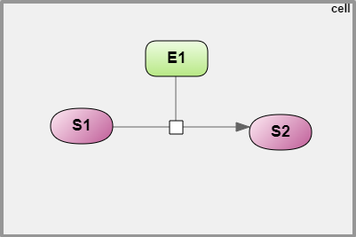

Создание SBGN модели
====================

.. |diagram| image:: /images/icons/Type-Diagram-icon.png
.. |compartment| image:: /images/icons/compartment.png 
.. |entity| image:: /images/icons/entity.png
.. |reaction| image:: /images/icons/reaction.png

К моделям, испольщующим SBGN нотацию относятся следующие *типы диаграмм*:

-    Модель SBML в нотации SBGN (SBML in SBGN notation);
-    Иерархическая модель SBML в нотации SBGN (SBML comp in SBGN notation).

.. note::
   Создание иерархической модели будет подробно обсуждаться в разделе :doc:`иерархические модели </modular models>`
   
На примере простейшей ферментативной реакции реакции разберем создание SBGN диаграммы :ref:`(Рисунок 1) <Pic.1>`. 

   
   Рисунок 1. SBGN диаграмма простейшей ферментативной реакции.
   Фермент (E1) катализирует метаболический процесс, в ходе которого потребляется субстрат (S1) и образуется продукт (P1).

1. Для *создания новой диаграммы*, во вкладке :guilabel:`Data` области :doc:`репозитория </user_interface>` 
выберите проект и нажмите правой кнопкой мыши на нужную папку, в которой планируется
создание диаграммы. В выпадающем списке нажмите на поле |diagram| New diagram. 
Далее в открывшемся окне выберите соответствующий *тип диаграммы*. 

2. Добавьте на диаграмму *компартмент* путем нажатия на иконку |compartment|, присвойте ему идентификатор (cell) 
и заголовок (cell) в полях :guilabel:`name` и :guilabel:`title`, соответственно. 

.. note::
   Заголовок будет отображаться на диаграмме и может не соответсвовать идентификатору элемента.
   После того, как компартмент/сущность создана, заголовок подлежит изменению, а идентификатор нет. 
   Местоположение элементов диаграммы на диаграмме можно изменять 
   посредством зажатия элемента левой кнопкой мыши и перемещением в другое место на полотне
   
3. Добавьте *сущности* в компартмент. Для этого нажмите |entity| на панели инструментов и затем на компартмент на диаграмме.
В открывщемся окне присвойте сущности идентификатор и заголовок таким же образом, как и для компартмента. 
Далее выьерите нужный тип сущности в поле :guilabel:`sbgb:enityType`:ref:`(Рисунок 2) <Pic.2>`.
Ферменту (Е1) соответствует тип сущности макромолекула (macromolecule), а субстрату (S1) и продукту (P1) - 
простое химическое вещество (simple chemical).

.. _Pic.2:

.. figure:: images/interface/E1_creation.png
   :width: 80%
   :alt: Создание сущности в веб-версии BioUML
   :align: center

   Рисунок 2. Пример создания сущности в веб-версии BioUML - создание макромолекулы - фермента Е1 
  
.. note:: При создании сущности создается **переменная**, описывающая концентрацию или количество вещества
   соответствующей сущности. *Идентификатор переменной* образуется путем добавления 
   “$” перед заданным ранее идентификатором сущности. 
   Если сущность принадлежит компартменту, то имя переменной будет содержать и название компартмента, 
   например, $compartment.entity. 
   Присвоенное имя переменной будет указано во вкладке :guilabel:`Info` (инспектор свойств) в области :doc:`информационного окна </user_interface>`
   в поле :guilabel:`Role` - VariableRole.
   
4. Добавьте *процесс* - ферментативную реакцию. Для создания реакции нажмите на иконку |reaction|, расположенную 
на панели инструментов. В открывшемся окне в поле :guilabel:`Reaction name` введите идентификатор реакции.
Компоненты реакции добавляются путем нажатия на ранее созданную сущность на диаграмме, название которой будет 
отображено в поле :guilabel:`Component`, и выбора ее роли в поле :guilabel:`Role`. Далее нажмите кнопку :guilabel:`Add`, чтобы
добавить сущность в компоненты реакции. 
В этой реакции фермент (E1) будет модификатором (modifier), субстрат (S1) - реактантом (reactant) и 
продукт (S1) - продуктом реакции (product). 

.. note::
   При добавлении компонентов реакции в столбце :guilabel:`Variable` указывается идентификатор переменной. 

.. _Pic.3:

.. figure:: images/interface/simple_model_reaction.png
   :width: 100%
   :alt: Создание реакции
   :align: center

   Рисунок 3. Создание ферментативной реакции 
   
5. Добавьте *формулу*. Формулу можно добавить в открывшемся окне при создании реакции в поле :guilabel:`Formula` либо
в :ref:`дополнительных свойствах реакции <reactions>` в опциях |folder| Kinetic law в поле :guilabel:`Formula`. Для открытия дополнительныъ
свойств реакции нажмите правой кнопкой мыши на узел, соответствующий процессу и перейдите в опции :guilabel:`Edit`.

При создании формулы учитывайте, что имя переменной включает знак "$", а перед параметром он не ставится. 
Для возведения в степень используется оператор "^", деления - "/", умножения - "*", "+" и "-"
для сложения и вычитания, соответственно.

Для данной реакции формула записывается следующим образом : ``k_cat*$cell.E1*$cell.S1``, где k_cat - параметр, соответствующий
каталитической константе - величине, показывающей эффективность превращения субстрата в активном центре фермента; $cell.E1 и 
$cell.S1 - переменные, описывающие концентрацию фермента и субстрата, соответственно. 

6. Добавьте *начальные значения для переменных и параметров*. После введения формулы внесенные *параметры* добавляются в области :doc:`поля операций </user_interface>` во вкладке :guilabel:`Model` на горизонтальной панели и в открывшемся окне 
на вертикальной панели во вкладке :guilabel:`Variables`. *Значение параметра* выставляется в столбце :guilabel:`Initial value`. 

.. _Pic.4:

.. figure:: images/interface/simple_model_variables.png
   :width: 100%
   :alt: Добавление параметров
   :align: center

   Рисунок 4. Добавление значений параметров 
   
*Начальное значение для переменных* добавляется во вкладке :guilabel:`Entities` на вертикальной панели :guilabel:`Model` в столбце :guilabel:`Initial value`.

.. figure:: images/interface/simple_model_entities.png
   :width: 100%
   :alt: Добавление начальных значений для переменных
   :align: center

   Рисунок 4. Добавление начальных значений для переменных
   
.. note::
   Так как фермент не расходуется и не изменяется в ходе реакции (в отличие от субстрата), в столбце :guilabel:`Constant` ставится флаг. 

7. Запустите *численный расчет модели*. Для этого в области поля операций на горизонтальной панели выберите вкладку 
:guilabel:`Simulation` и на вертикальной панели - :guilabel:`Engine`. 

