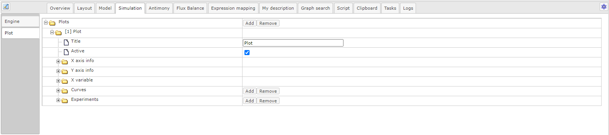
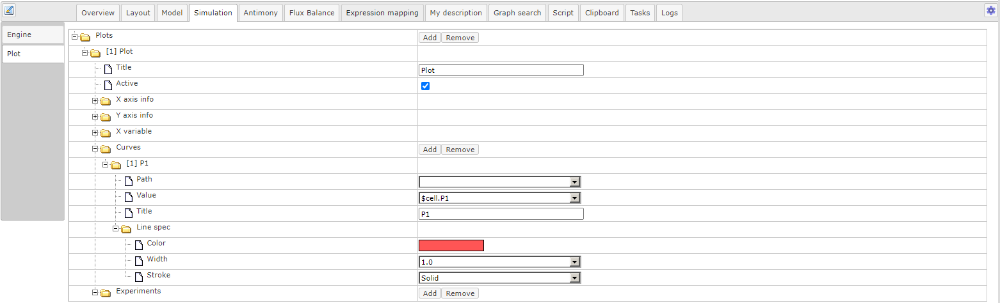

Создание SBGN модели
====================

.. |diagram| image:: /images/icons/Type-Diagram-icon.png
.. |compartment| image:: /images/icons/compartment.png 
.. |entity| image:: /images/icons/entity.png
.. |reaction| image:: /images/icons/reaction.png
.. |folder| image:: /images/icons/folder.png
.. |option| image:: /images/icons/option.png
.. |simulate| image:: /images/icons/simulate.gif
.. |save| image:: /images/icons/save.gif

К моделям, испольщующим SBGN нотацию относятся следующие *типы диаграмм*:

-    Модель SBML в нотации SBGN (SBML in SBGN notation);
-    Иерархическая модель SBML в нотации SBGN (SBML comp in SBGN notation).

.. note::
   Создание иерархической модели будет подробно обсуждаться в разделе :doc:`иерархические модели </modular models>`
   
На примере простейшей ферментативной реакции реакции разберем `создание SBGN модели <https://ict.biouml.org/bioumlweb/#de=data/Collaboration/BioUML-docs/Data/SBGN%20model%20manual>`_ :ref:`(Рисунок 1) <Pic.1_2>`. 

.. _Pic.1_2:

   
   Рисунок 1. SBGN диаграмма простейшей ферментативной реакции.
   Фермент (E1) катализирует метаболический процесс, в ходе которого потребляется субстрат (S1) и образуется продукт (S2).

1. Для **создания новой диаграммы**, во вкладке :guilabel:`Data` области :doc:`репозитория </user_interface>` 
выберите проект и нажмите правой кнопкой мыши на нужную папку, в которой планируется
создание диаграммы. В выпадающем списке нажмите на поле |diagram| New diagram. 
Далее в открывшемся окне выберите соответствующий *тип диаграммы*. 

2. Добавьте на диаграмму :ref:`компартмент <compartment>` путем нажатия на иконку |compartment|. 
Присвойте компартменту *идентификатор* (cell) и *заголовок* (cell) в полях |option| name и |option| title, соответственно. 

.. warning::
   *Заголовок* будет отображаться на диаграмме и может не соответсвовать идентификатору элемента.
   После того, как компартмент/сущность создана, заголовок подлежит изменению, а *идентификатор* нет. 
   
3. Добавьте :ref:`сущности <entities>` в компартмент. Для этого нажмите на иконку |entity| на панели инструментов 
и затем на компартмент на диаграмме.
В открывщемся окне присвойте сущности *идентификатор* и *заголовок* таким же образом, как и для компартмента. 
Далее выберите нужный тип сущности в поле |option| sbgb:enityType :ref:`(Рисунок 2) <Pic.2_2>`.

Ферменту (Е1) соответствует тип сущности - макромолекула (macromolecule), а субстрату (S1) и продукту (S2) - 
простое химическое вещество (simple chemical).

.. note::
   *Местоположение элементов* на диаграмме можно изменять 
   посредством зажатия узла левой кнопкой мыши и перемещением в другое место на полотне

.. _Pic.2_2:

.. figure:: images/interface/E1_creation.png
   :width: 80%
   :alt: Создание сущности в веб-версии BioUML
   :align: center

   Рисунок 2. Пример создания сущности в веб-версии BioUML - создание макромолекулы - фермента Е1 
  
.. note:: При создании сущности создается *переменная*, описывающая концентрацию или количество вещества
   соответствующей сущности. *Идентификатор переменной* образуется путем добавления 
   “$” перед заданным ранее идентификатором сущности. 
   Если сущность принадлежит компартменту, то имя переменной будет содержать и название компартмента, 
   например, $compartment.entity. 
   Присвоенное имя переменной будет указано во вкладке :guilabel:`Info` (инспектор свойств) в области :doc:`информационного окна </user_interface>`
   в поле Role - VariableRole.
   
4. Добавьте :ref:`процесс <process>` - ферментативную реакцию. Для создания реакции нажмите на иконку |reaction|, расположенную 
на панели инструментов. В открывшемся окне в поле Reaction name введите *идентификатор реакции*.

*Компоненты реакции* добавляются путем нажатия на ранее созданную сущность на диаграмме, выбора ее роли в поле Role и 
нажатия на кнопку :guilabel:`Add`. При добавлении компонентов реакции в столбце Variable
указывается идентификатор переменной :ref:`(Рисунок 3) <Pic.3_2>`.

В этой реакции фермент (E1) будет модификатором (modifier), субстрат (S1) - реактантом (reactant) и 
продукт (S2) - продуктом реакции (product). 

.. _Pic.3_2:

.. figure:: images/interface/simple_model_reaction.png
   :width: 100%
   :alt: Создание реакции
   :align: center

   Рисунок 3. Создание ферментативной реакции 
   
5. Добавьте :ref:`формулу <formula>`. Формулу можно добавить в открывшемся окне при создании реакции в поле Formula либо
в дополнительных свойствах реакции в опциях |folder| Kinetic law в поле |option| Formula. 
Для открытия дополнительных свойств реакции нажмите правой кнопкой мыши на узел, 
соответствующий процессу и перейдите в опции :guilabel:`Edit`.

.. warning::
   При создании формулы учитывайте, что *идентификатор переменной* включает знак "$", а перед параметром он не ставится. 
   Для возведения в степень используется оператор "^", деления - "/", умножения - "*", "+" и "-"
   для сложения и вычитания, соответственно.

Для данной реакции формула записывается следующим образом : ``k_cat*$cell.E1*$cell.S1``, где k_cat - параметр, соответствующий
каталитической константе - величине, показывающей эффективность превращения субстрата в активном центре фермента; $cell.E1 и 
$cell.S1 - переменные, описывающие концентрацию фермента и субстрата, соответственно. 

6. Добавьте :ref:`начальные значения для переменных и параметров <formula>`. После введения формулы внесенные *параметры* добавляются в области :doc:`поля операций </user_interface>` во вкладке :guilabel:`Model` на горизонтальной панели и в открывшемся окне 
на вертикальной панели во вкладке :guilabel:`Variables`. *Значение параметра* выставляется в столбце Initial value :ref:`(Рисунок 4) <Pic.4_2>`. 

.. _Pic.4_2:

.. figure:: images/interface/simple_model_variables.png
   :width: 100%
   :alt: Добавление параметров
   :align: center

   Рисунок 4. Добавление значений параметров 
   
*Начальное значение для переменных* добавляется во вкладке :guilabel:`Entities` на вертикальной панели :guilabel:`Model` в столбце Initial value
:ref:`(Рисунок 5) <Pic.5_2>`.

.. _Pic.5_2:

.. figure:: images/interface/simple_model_entities.png
   :width: 100%
   :alt: Добавление начальных значений для переменных
   :align: center

   Рисунок 5. Добавление начальных значений для переменных
   
.. warning::
   Так как фермент не расходуется и не изменяется в ходе реакции (в отличие от субстрата), для переменной, соответствующей ферменту в столбце Constant ставится флаг. 

7. Создайте :ref:`график <plot>`, отражающий результаты численного расчета модели. Для того, чтобы добавить переменную (переменные),
перейдите во вкладку :guilabel:`Simulation` и затем в :guilabel:`Plot` :ref:`(Рисунок 6) <Pic.6_2>`.

.. _Pic.6_2:

   Рисунок 6. Создание графика 

В *опциях графика* перейдите в |folder| [1] Plot и затем в |folder| Curves добавляются переменные. 
В |option| Title выберите нужную переменную из выпадающего списка :ref:`(Рисунок 7) <Pic.7_2>`. 

.. _Pic.7_2:

   Рисунок 7. Добавление переменной на график

5. Запустите :ref:`численный расчет модели <simulation>`. Для этого в области поля операций на горизонтальной панели выберите вкладку 
:guilabel:`Simulation` и на вертикальной панели - :guilabel:`Engine`. 

В поле |option| Selected engine выберите *инструмент
для численных расчетов модели* -  ODE Simulation enпgine. В |folder| Java simulation engine обозначьте
*начальное время расчетов* в поле |option| Initial time; *шаг*, с которым будут сохраняться или 
выводиться на график результаты в поле |option| Time increment, 
а также *конечное время* в поле |option| Completion time :ref:`(Рисунок 8) <Pic.8_2>`. 

.. _Pic.8_2:

.. figure:: images/interface/simulation.png
   :width: 100%
   :alt: Задание опций для численного расчета
   :align: center

   Рисунок 8. Задание опций для численного расчета 

Для того, чтобы *запустить симуляцию модели*, сначала сохраните выбранные опции для симуляции, путем нажатия на иконку |save|, расположенную в верхней части поля операций,
и затем нажмите на иконку |simulate|. После окончания численного расчета модели в открывшемся окне будет отображен график 
результатов :ref:`(Рисунок 9) <Pic.9_2>`. 

.. _Pic.9_2:

   Рисунок 9. График, отображающий изменение концентрации продукта реакции (S2) 

