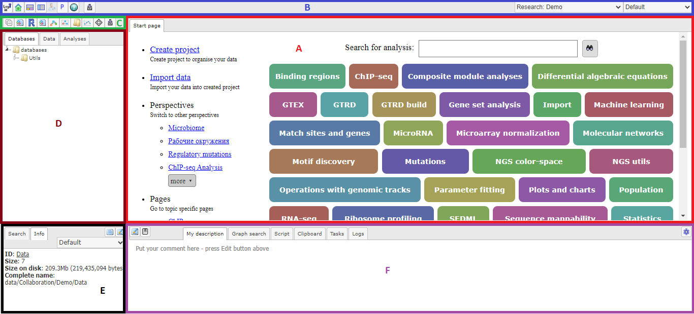

BioUML user interface
=====================

Both in the BioUML workbench and BioUML web edition the following areas can be found:

   BioUML web edition interface

**A** - The **Work Space**, which is the main part of the window, contents of projects and databases are viewed and handled. There can be as many tabs in the pane as there are diagrams, workflows, tables etc. opened in the workbench at the moment.

**B** - The **General Control Panel** (on top of the Work Space), showing a context-dependent set of icons for the available operations.

**C** - The **Repository Pane Toolbar** (to the left of the Work Space), containing a set of icons for the available operations depending on the item selected in the tree structure of the navigation pane.

**D** - The **Repository Tree** (below the Repository Pane Toolbar), where you find a collection of Databases, the uploaded Data files and the available Analyses methods (under the corresponding tabs), organized in a hierarchical tree structure.

**E** - The **Information Box** (in the left lower part), where you can select the data
resource to Search in, or where you will get Information about the data file or
analysis method that you select with a single click in the Tree Area.

**F** - The **Operations Field** (right lower part), providing a number of
options under the different tabs in a context-dependent manner.
